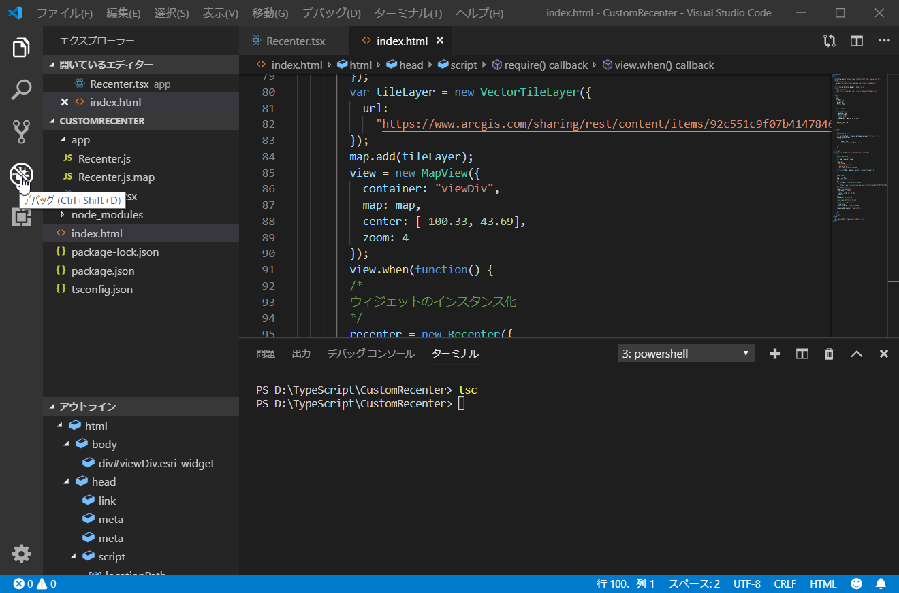

# ハンズオン - ウィジェット開発

## ハンズオンの概要
1. マップの中心点の緯度経度と縮尺を表示するウィジェットの作成
2. 作成したウィジェットをクリックするとマップの中心点（ソース内で中心点を設定）に移動する処理の実装

__※完成イメージ__

</br>

## Debugger for Chrome のインストール
「Debugger for Chrome」をインストールすることで、Visual Studio Code から Google Chrome でデバッグを行うことができます。

__※既にインストール済みの方は対応不要です。__

Visual Studio Code を起動してください。

</br>

拡張機能ボタンを押下してください。

</br>

検索バーに Debugger for Chrome と入力し、Debugger for Chrome のインストールをしてください。

</br>

## 手順
1. ウィジェットの作成
    - ファイルを開く
    - モジュールのインポート
    - Type Alias とインターフェースの作成
    - 定数 CSS の作成
    - Widget 基底クラスを継承した Recenter クラスの作成
    - プロパティの作成
    - postInitialize メソッドの追加
    - render メソッドの追加
    - エクスポート
2. コンパイル
    - TypeScript コンパイラをインストール
    - 「Recenter.tsx」ファイルをコンパイル
3. 作成したウィジェットを適用
    - CSS に設定を追加
    - dojoConfig の設定
    - ウィジェットの読込
    - デバッグ

## 1.ウィジェットの作成

### ファイルを開く
ファイル＞フォルダーを開く を選択し、CustomRecenter フォルダーを開いてください。

</br>

</br>

./app/Recenter.tsx を開いてください。

</br>

### モジュールのインポート
必要なモジュールをインポートします。以下のコードを記述してください。

```Typescript
import {subclass, declared, property} from "esri/core/accessorSupport/decorators";
import Widget = require("esri/widgets/Widget");
import * as watchUtils from "esri/core/watchUtils";
import { renderable, tsx } from "esri/widgets/support/widget";
import Point = require("esri/geometry/Point");
import MapView = require("esri/views/MapView");
```

### Type Alias とインターフェースの作成
「LatLon」Type Alias を作成します。```LatLon``` には ```Point```、もしくは、```number[]``` 型の値が入るようにします。

```Typescript
type LatLon = Point | number[];
```

次に、以下のインターフェースを作成します。
```Typescript
interface Center {
  lat: number;
  lon: number;
}

interface State extends Center {
  interacting: boolean;
  scale: number;
}

interface Style {
  textShadow: string;
}
```
1. 最初の ```Center``` インターフェースは ```lat```, ```lon``` の二つのプロパティを持ちます。
2. 次の ```State``` インターフェースは ```Center``` インターフェースを継承しています。</br>
そのため、 ```State``` インターフェースは ```interacting```, ```scale``` のプロパティの他に ```Center``` インターフェースの ```lat```, ```lon``` プロパティを使うことができます。
3. 最後の ```Style``` インターフェースは ```textShadow``` プロパティを持ちます。

### 定数 CSS の作成
Type Alias とインターフェースの作成後、```base``` プロパティを持つ定数 ```CSS``` を作成します。これは後述の ```render()``` メソッドで使用されます。

```Typescript
const CSS = {
  base: "recenter-tool"
};
```

### Widget 基底クラスを継承した Recenter クラスの作成
ダウンロードされたソースでは以下のように ```Recenter``` クラスを用意しています。

```Typescript
class Recenter {

}
```

```Recenter``` クラスを以下のように拡張し、コンストラクタを記述してください。
```Typescript
@subclass("esri.widgets.Recenter")
class Recenter extends declared(Widget) {

  // コンストラクタ
  constructor() {
    super();
    this._onViewChange = this._onViewChange.bind(this);
  }
  // プロパティの作成

  // postInitialize メソッドの追加

  // render メソッドの追加

}
```

 ```@subclass``` デコレーターと ```declared``` を使用し、Widget 基底クラスを継承します。  
 また、コンストラクターで ```_onViewChange()``` メソッドとウィジェットのインスタンス(```this```)を紐づけています。

 ※ __```_onViewChange()``` メソッドの定義は後述で追加します。__

### プロパティの作成
以下のコードを記述してください。

```Typescript
//----------------------------------
//  view
//----------------------------------

@property()
@renderable()
view: MapView;

//----------------------------------
//  initialCenter
//----------------------------------

@property()
@renderable()
initialCenter: LatLon;

//----------------------------------
//  state
//----------------------------------

@property()
@renderable()
state: State;
```

すべてのプロパティに対して ```@property```, ```@renderable``` デコレーターが使われます。
- @property
  - Accessor プロパティを定義するために使われます。このデコレーターで定義されたプロパティは、get、set、watch を使用できます。
- @renderable
  - このデコレーターで定義されたプロパティは、プロパティが変更されるたびに描画が更新されます。

また、それぞれのプロパティには以下の型が割り当てられています。
- view
  - MapView
- initialCenter
  - 「LatLon」Type Alias
- state
  - State インターフェース

 ### postInitialize メソッドの追加
 ```postInitialize``` メソッドは ウィジェットが作成されて、UI が描画される前に実行されます。</br>
 今回は当該メソッド内で ```watchUtils``` クラスを使用して ```view.center```, ```view.interacting```, ```view.scale``` プロパティが更新されるのを監視します。
 プロパティが更新されると、```_onViewChange()``` メソッドが呼び出されます。

```Typescript
postInitialize() {
  watchUtils.init(this, "view.center, view.interacting, view.scale", () => this._onViewChange());
}
```

 ### render メソッドの追加
```render()``` メソッドはウィジェット開発で唯一、実装が必須のメソッドです。
メソッド内で UI を定義（div 要素）しています。そして、ここで JSX が UI を定義するために使われています。

```Typescript
render() {
  const {lat, lon, scale} = this.state;
  const styles: Style = {
    textShadow: this.state.interacting ? '-1px 0 red, 0 1px red, 1px 0 red, 0 -1px red' : ''
  };
  return (
    <div
     bind={this}
     class={CSS.base}
     styles={styles}
     onclick={this._defaultCenter}>
     <p>緯度: {Number(lat).toFixed(3)}</p>
     <p>経度: {Number(lon).toFixed(3)}</p>
     <p>縮尺: {Number(scale).toFixed(5)}</p>
    </div>
  );
}
```

div 要素内で以下のように UI のレンダリングが実行されます。

1. bind 属性で ```this``` を設定します。
2. class 属性に ```CSS.base``` を設定します。
3. styles 属性に定数 ```styles``` を設定します。この定数に ```textShadow``` プロパティの値が反映されます。
4. onclick イベントで ```_defaultCenter``` メソッドが呼び出されます（ウィジェットがクリックされた際にメソッドが呼び出されます）。
5. ウィジェットに ```緯度: <value>```, ```経度: <value>```, ```縮尺: <value>``` が表示されるようになります。

また、```_onViewChange()``` ```_defaultCenter()``` メソッドを ```render()``` メソッドの下に追加してください。

```Typescript
private _onViewChange() {
  let { interacting, center, scale } = this.view;
  this.state = {
    lat: center.latitude,
    lon: center.longitude,
    interacting,
    scale
  };
}

private _defaultCenter() {
  this.view.goTo(this.initialCenter);
}
```
### エクスポート
最後の行に以下コードを記述してください。エクスポートをすることにより、```Recenter``` クラスを外部から参照することができます。

```Typescript
export = Recenter;
```

## 2.コンパイル

### TypeScript コンパイラをインストール

__※既にインストール済みの方は対応不要です。__

TypeScript コンパイラをインストールします。ターミナル タブ＞新しいターミナル でターミナルを開いてください。

</br>

ターミナル上で以下コマンドを実行してください。

```dosbatch
npm install -g typescript
```

</br>

正常にインストールできている場合は以下コマンドで TypeScript コンパイラ のバージョンを確認できます。

```dosbatch
tsc --version
```

</br>

### 「Recenter.tsx」ファイルをコンパイル
「Recenter.tsx」ファイルをコンパイルします。ターミナル タブ＞新しいターミナル でターミナルを開いてください。

</br>

ターミナルにフォーカスを当てて、```tsc``` と入力し、Enter キーを押下してください。

</br>

そうすると、「Recenter.js」「Recenter.js.map」が作成されます。

</br>

これでコンパイルは完了です。

## 3.作成したウィジェットを適用
「index.html」を開いてください。

### CSS に設定を追加
「Recenter.tsx」に定義した CSS の設定（```.recenter-tool```）を「index.html」に記述します。

```css
.recenter-tool {
    padding: 2em;
    width: 230px;
    height: 130px;
    color: #fff;
    background: rgba(0, 0, 0, 0.5);
  }

.recenter-tool > p {
  margin: 0;
}
```

### dojoConfig の設定
以下のように dojoConfig の設定を行ってください。

```javascript
var locationPath = location.pathname.replace(/\/[^\/]+$/, "");
window.dojoConfig = {
  packages: [
    {
      name: "app",
      location: locationPath + "/app"
    }
  ]
};
```

### ウィジェットの読込
dojoConfig の設定することで、ウィジェットの読込が可能になります。```require``` コマンドで他のモジュールと同じように ```"app/Recenter"``` と記述し、ウィジェットの読込をします。

```javascript
var map, recenter, view;

require([
  "esri/Map",
  "esri/views/MapView",
  "app/Recenter",
  "esri/layers/VectorTileLayer"

], function(Map, MapView, Recenter, VectorTileLayer) {
```

以下のようにウィジェットをインスタンス化します。```initialCenter``` にデフォルトの中心点の設定をします。
```javascript
recenter = new Recenter({
  view: view,
  initialCenter: [139.740286, 35.678601]
});
view.ui.add(recenter, "top-right");
```

### デバッグ
「デバッグ」ボタンを押下してください。

</br>

「歯車」ボタンを押下してください。

</br>

Chrome を選択してください。

</br>

「launch.json」ファイルが開きますので、以下のように設定してください。

```javascript
{
    // IntelliSense を使用して利用可能な属性を学べます。
    // 既存の属性の説明をホバーして表示します。
    // 詳細情報は次を確認してください: https://go.microsoft.com/fwlink/?linkid=830387
    "version": "0.2.0",
    "configurations": [
        {
            "type": "chrome",
            "request": "launch",
            "name": "Launch Chrome against localhost",
            "file": "${workspaceFolder}/index.html"
        }
    ]
}
```

デバッグを開始してください。

</br>

## 参考 : プロジェクトの作り方

### ハンズオンで使用したプロジェクトのディレクトリ


__※「CustomRecenter」「app」フォルダを最初に作成__

### 各フォルダ/ファイルの作成方法

#### 1.「Recenter.tsx」「index.html」ファイルの作成
- Recenter.tsx / index.html
  - Visual Studio Code で作成

#### 2.各種設定の作成
- tsconfig.json
  - ターミナルで ```tsc --init``` を実行して作成（デフォルト設定の tsconfig.json が作成される）
  - ファイルの中身は今回使用した tsconfig.json をコピーして作成
- package.json
  - ターミナルで ```npm init --yes``` を実行して作成
- node_modules / package-lock.json
  - ターミナルで ```npm install --save @types/arcgis-js-api``` を実行して作成

#### 3.JavaScript ファイルの作成
- Recenter.js / Recenter.js.map
  - Recenter.tsx 内に処理を実装後、ターミナルで ```tsc``` を実行して作成

#### 4.デバッグ設定の作成
- .vscode
  - Visual Studio Code でデバッグ設定をする際に自動的に作成される
  - .vscode フォルダに格納されている launch.json の中身は今回使用した launch.json をコピーして作成

