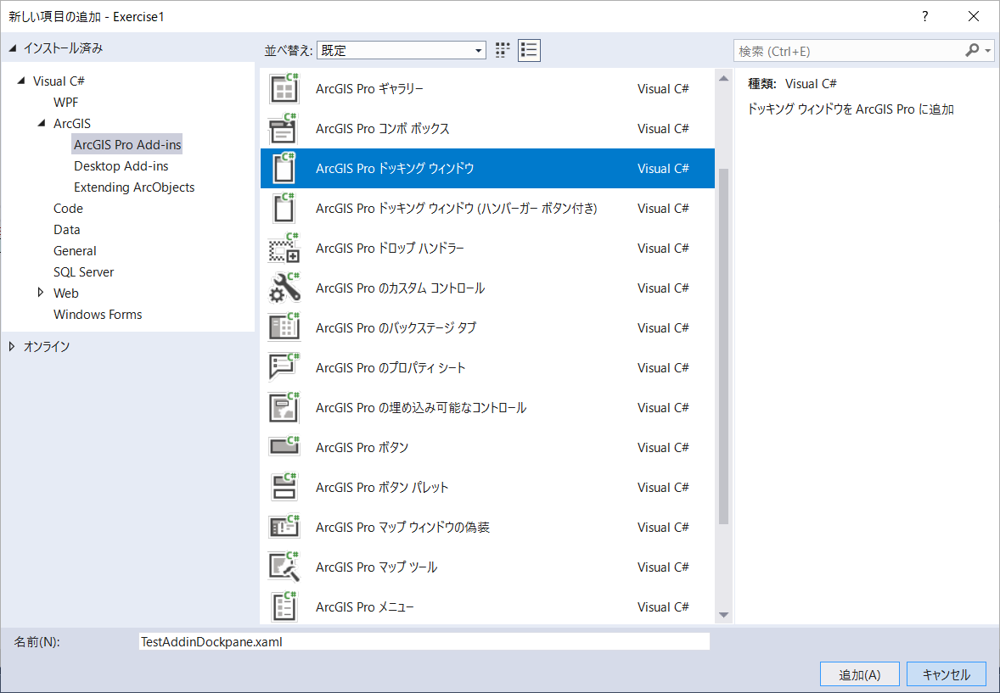

# 演習1

## 演習の概要
### 1-a. アドイン ボタンの作成

**処理概要**
 - 属性検索（ジオプロセシングツール）を実行
 - 属性検索で選択されたフィーチャにズーム

**演習の目的**  
以下トピックについての理解を深めるため
* アドイン作成
* DAML
* 非同期処理

__※完成イメージ__

 

### 1-b. ドッキング ウインドウの作成

**処理概要**
 - Japan レイヤーのフィーチャを全て選択
 - 選択されたフィーチャにズーム

**演習の目的**  
以下トピックについての理解を深めるため
* 非同期処理
* MVVM

 __※完成イメージ__

 

## 演習解答
[演習の解答はこちらでダウンロードできます](https://github.com/EsriJapan/arcgis-pro-sdk-hands-on/raw/master/hands-on/%E6%BC%94%E7%BF%921/source/Exercise1.zip)

## 1-a. アドイン ボタンの作成

### 手順
1. プロジェクト作成
2. ボタン作成
3. 非同期処理の実装
4. デバッグ

#### 1.プロジェクト作成
1-1.Visual Studio を起動します。


1-2.ファイル > 新規作成 > プロジェクトをクリックしてください。


1-3.ArcGIS Pro Add-ins の中の ArcGIS Pro モジュールアドインを選択してプロジェクト名を「Exercise1」にして、OKボタンをクリックしてください。


#### 2.ボタン作成
2-1.Config.damlを開いて中身を確認してください。


2-2.プロジェクトを右クリック > 追加 > 新しい項目をクリックしてください。


2-3.ArcGIS Pro Add-ins の中の ArcGIS Pro ボタンを選択してください。  
また、ファイル名を「TestAddinButton.cs」に変更し、追加ボタンをクリックしてください。


2-4.TestAddinButton.cs がプロジェクトに追加され、Config.daml の中身が更新されていることを確認してください。

</br>


2-5.Config.damlの \<button> 要素の caption を 以下のように「アドインボタン」に変更してください。

<font color="Red">__※caption を設定することでArcGIS Pro 上でのラベルの設定を行うことができます。__</font>

```xml
<controls>
    <!-- add your controls here -->
    <button id="Exercise1_TestAddinButton" caption="アドインボタン" className="TestAddinButton" loadOnClick="true" smallImage="pack://application:,,,/ArcGIS.Desktop.Resources;component/Images/GenericButtonBlue16.png" largeImage="pack://application:,,,/ArcGIS.Desktop.Resources;component/Images/GenericButtonBlue32.png">
      <tooltip heading="Tooltip Heading">Tooltip text<disabledText /></tooltip>
    </button>
</controls>
```
#### 3.非同期処理の実装
3-1.TestAddinButton.cs を開いてください。

3-2.以下を using に追加
```csharp
using ArcGIS.Desktop.Core.Geoprocessing;
```

3-3.OnClick メソッドを以下のように書き換えてください（属性検索とズーム処理を行います）。
```csharp
protected async override void OnClick()
{
    // 属性検索を実行
    await Geoprocessing.ExecuteToolAsync("SelectLayerByAttribute_management", 
                                            new string[] {"Japan", "NEW_SELECTION", "KEN = '神奈川県'"});

    // 選択されたフィーチャに3秒かけてズーム
    MapView.Active.ZoomToSelectedAsync(new TimeSpan(0, 0, 3), true);
}
```

**ポイント**
- 属性検索時に await を使用（検索が完了するまで待機しないと、次のズーム処理が想定通り動作しないため）
- await を使用する必要があるため、OnClick メソッド に async をつける

#### 4.デバッグ
4-1.プロジェクトをビルドしてください。


4-2.開始ボタンをクリックし、デバッグを実行します。


4-3.ArcGIS Pro が起動します。起動後、「別のプロジェクトを開く」をクリックし、事前にダウンロードしていただいたハンズオンデータに格納されている「Sample.aprx」を開いてください。

</br>

 __※ダウンロードされていない方は[Sample.zip](https://github.com/EsriJapan/arcgis-pro-sdk-hands-on/raw/master/hands-on/%E6%BC%94%E7%BF%92%E3%83%87%E3%83%BC%E3%82%BF/Sample.zip)をダウンロードしてください__

4-4.ArcGIS Pro が起動したら「アドイン」タブ > 「アドインボタン」ボタンをクリックしてください。

4-5.神奈川県のフィーチャが選択され、そこにズームします。


4-6.Visual Studio上でデバッグの停止ボタンをクリックしてください。


## 1-b. ドッキング ウインドウの作成

 __※「1-a. アドイン ボタンの作成」で作ったプロジェクトを使用します。__

### 手順
1. ドッキング ウインドウ作成
2. ドッキング ウインドウにボタンを配置（View(XAML)の編集）
3. View(XAML) と ViewModel のバインディング
4. デバッグ

#### 1.ドッキング ウインドウ作成
1-1.プロジェクトを右クリック > 追加 > 新しい項目をクリックしてください。


1-2.ArcGIS Pro Add-ins の中の ArcGIS Pro ドッキング ウインドウを選択してください。  
ファイル名を「TestAddinDockpane.xaml」に変更し、追加ボタンをクリックしてください。



1-3.Config.damlの \<button> 要素(id="Exercise1_TestAddinDockpane_ShowButton")の caption を 以下のように「ドッキング ウインドウ」に変更してください。

```xml
<button id="Exercise1_TestAddinDockpane_ShowButton" caption="ドッキング ウインドウ" className="TestAddinDockpane_ShowButton" loadOnClick="true" smallImage="pack://application:,,,/ArcGIS.Desktop.Resources;component/Images/GenericButtonPurple16.png" largeImage="pack://application:,,,/ArcGIS.Desktop.Resources;component/Images/GenericButtonPurple32.png">
    <tooltip heading="Show Dockpane">Show Dockpane<disabledText /></tooltip>
</button>
```

#### 2.ドッキング ウインドウにボタンを配置（View(XAML)の編集）

2-1.TestAddinDockpane.xaml を開いてください。</br>


2-2.ツールボックスでボタンを選択し、以下のように配置してください。</br>
</br>


<br/>

#### 3.View(XAML) と ViewModel のバインディング
3-1.TestAddinDockpane.xaml の \<Button> 要素内に 以下のようにCommand="{Binding Path=HookTest}" を追記してください。
```xml
<Button Content="Button" HorizontalAlignment="Left" Margin="107,89.6,0,0" Grid.Row="1" VerticalAlignment="Top" Width="75" Command="{Binding Path=HookTest}"/>
```

3-2.TestAddinDockpaneViewModel.cs を開いてください。

3-3.以下を using に追加してください。
```csharp
using System.Windows.Input;
```

3-4.コンストラクタ（protected TestAddinDockpaneViewModel() { }）の上に以下処理を追加してください。
```csharp
public ICommand HookTest { get; set; }
```

3-5.コンストラクタ（protected TestAddinDockpaneViewModel() { }）の中に以下処理を追加してください。
```csharp
HookTest = new RelayCommand(() => HookButtonClick(), () => true);
```

3-6.コンストラクタ（protected TestAddinDockpaneViewModel() { }）の下に以下のメソッドを追加してください。

```csharp
private void HookButtonClick()
{
    QueuedTask.Run(() =>
    {
        // Japanレイヤーを選択
        var layers = MapView.Active.Map.FindLayers("Japan").OfType<FeatureLayer>().ToList();
        layers[0].Select();

        // 選択されたフィーチャに3秒かけてズーム
        MapView.Active.ZoomToSelected(new TimeSpan(0, 0, 3), true);
    });
}
```

**ポイント**
- ズーム処理において、「1-a. アドイン ボタンの作成」の「3-3」で使用したZoomToSelectedAsync メソッドは Coarse-Grained Methods、今回使用している ZoomToSelected メソッドは Fine-Grained Methods。そのため、QueuedTask を使用する必要がある。
- コンストラクタ（protected TestAddinDockpaneViewModel() { }）でイベントハンドラ（HookButtonClick()） を登録

#### 4.デバッグ
4-1.「1-a. アドイン ボタンの作成」の「4-1」~「4-3」の手順を行ってください。

4-2.ArcGIS Pro が起動したら「アドイン」タブ >「ドッキング ウインドウ」ボタンをクリックしてください。</br>

4-3.ドッキング ウインドウが起動したら、「Button」ボタンを押してください。</br>


4-4.Japanレイヤーの全フィーチャが選択され、そこにズームします。


4-5.Visual Studio上でデバッグの停止ボタンをクリックしてください。


4-6.エクスプローラーを起動し、C:\Users\ユーザー名\Documents\ArcGIS\AddIns\ArcGISPro に移動してください。  
アドイン用のフォルダが作成されていますので、そのフォルダを削除してください。

※フォルダ内には拡張子が「.esriAddinX」のアドインファイルが作成されています。</br>
　これを削除することで、作成したアドインをArcGIS Pro 上から削除することができます（ArcGIS Pro 上から削除することも可能）。

  

