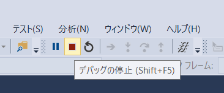

# 演習2

## 演習の概要
### 2-a. マップ ツールの作成

**処理概要**
- スケッチしたポリゴンと交差するフィーチャを取得しズーム
- プロジェクト、マップ、レイヤーの名称と取得したフィーチャの件数のメッセージを出力
- 取得したフィーチャをフラッシュさせる

**演習の目的**  
以下トピックについての理解を深めるため
* プロジェクトの操作
* マップ ビューの操作
* マップとの対話的な操作

__※完成イメージ__


### 2-b. レイヤーに等級色レンダラーを割り当てる

**処理概要**
- マップ上のレイヤーを取得
- 等級色レンダラーの設定
- レンダラーの更新

**演習の目的**  
以下トピックについての理解を深めるため
* レイヤーの操作
* レンダリングの設定

__※完成イメージ__


## 演習解答
[演習の解答はこちらでダウンロードできます](https://github.com/EsriJapan/workshops/blob/master/20190913_arcgis-pro-sdk-hands-on/hands-on/%E6%BC%94%E7%BF%922/source/Exercise2.zip)

## 2-a. マップ ツールの作成

### 手順
1. プロジェクト作成
2. マップツール作成
3. マップとの対話的な操作の実装
4. デバッグ

#### 1.プロジェクト作成
1-1.Visual Studio を起動します。


1-2.ファイル > 新規作成 > プロジェクトをクリックしてください。


1-3.ArcGIS Pro Add-ins の中の ArcGIS Pro モジュールアドインを選択してプロジェクト名を「Exercise2」にして、OKボタンをクリックしてください。


#### 2.マップツール作成
2-1.プロジェクトを右クリック > 追加 > 新しい項目をクリックしてください。


2-2.ArcGIS Pro Add-insの中のArcGIS Pro マップ ツールを選択してください。  
また、ファイル名を「NewMaptool.cs」に変更し、追加ボタンをクリックしてください。


2-3.Config.daml の \<button> 要素の caption を 以下のように「マップツール」に変更してください。

```xml
<controls>
    <!-- add your controls here -->
    <tool id="Exercise2_NewMapTool" caption="マップツール" className="NewMapTool" loadOnClick="true" smallImage="pack://application:,,,/ArcGIS.Desktop.Resources;component/Images/GenericButtonRed16.png" largeImage="pack://application:,,,/ArcGIS.Desktop.Resources;component/Images/GenericButtonRed32.png" condition="esri_mapping_mapPane">
        <tooltip heading="Tooltip Heading">Tooltip text<disabledText /></tooltip>
    </tool>
</controls>
```

#### 3.マップとの対話的な操作の実装
3-1.NewMapTool.cs を開いてください。

3-2.コンストラクタ（NewMapTool()）を以下のように書き換えてください。

```csharp
public NewMapTool()
{
    IsSketchTool = true;
    // ポリゴンをスケッチする
    SketchType = SketchGeometryType.Polygon;
    SketchOutputMode = SketchOutputMode.Map;
}
```

3-3.OnSketchCompleteAsync メソッドを以下のように書き換えてください。

```csharp
protected override Task<bool> OnSketchCompleteAsync(Geometry geometry)
{
    return QueuedTask.Run(() =>
    {
        // 現在のプロジェクトを取得
        var project = Project.Current;

        // アクティブなマップビューを取得
        var mapView = MapView.Active;

        // スケッチしたポリゴンと交差するフィーチャを取得
        var results = mapView.GetFeatures(geometry);

        // フィーチャを選択
        mapView.SelectFeatures(geometry);

        // 選択されたフィーチャに3秒かけてズーム
        MapView.Active.ZoomToSelected(new TimeSpan(0, 0, 3), true);

        // プロジェクト、マップ、レイヤーの名称と取得したフィーチャの件数のメッセージを作成
        var sb = new StringBuilder();
        sb.AppendLine(String.Format("プロジェクト名:{0}", project.Name));
        sb.AppendLine(String.Format("マップ名:{0}", mapView.Map.Name));
        sb.AppendLine(String.Format("レイヤー名:{0}", String.Format(String.Join("\n", results.Select(kvp => String.Format("{0}", kvp.Key.Name))))));
        sb.AppendLine(String.Format("フィーチャ数:{0}", String.Format(String.Join("\n", results.Select(kvp => String.Format("{0}", kvp.Value.Count()))))));

        // メッセージを出力
        MessageBox.Show(sb.ToString(), "結果");

        // 取得したフィーチャをフラッシュ
        mapView.FlashFeature(results);

        return true;
    });
}
```

#### 4.デバッグ
4-1.プロジェクトをビルドしてください。


4-2.開始ボタンをクリックし、デバッグを実行します。


4-3.ArcGIS Pro が起動します。起動後、「最近使ったプロジェクト」内の「Sample」を開いてください。  


__※ダウンロードされていない方は[Sample.zip](https://github.com/EsriJapan/workshops/blob/master/20190913_arcgis-pro-sdk-hands-on/hands-on/%E6%BC%94%E7%BF%92%E3%83%87%E3%83%BC%E3%82%BF/Sample.zip)をダウンロードしてください__

4-4.ArcGIS Proが起動したら「アドイン」タブ > 「マップツール」ボタンをクリックしてください。

4-5.任意の範囲でポリゴンをスケッチしてください。

4-6.範囲内にあるフィーチャにズームし、メッセージ出力、フィーチャのフラッシュがされることを確認してください。


4-7.Visual Studio 上でデバッグの停止ボタンをクリックしてください。



## 2-b. レイヤーに等級色レンダラーを割り当てる

 __※「2-a. マップ ツールの作成」で作ったプロジェクトを使用します。__

### 手順
1. ボタン作成
2. 等級色レンダラーの割り当て
3. デバッグ

#### 1.ボタン作成
1-1.プロジェクトを右クリック > 追加 > 新しい項目をクリックしてください。


1-2.ArcGIS Pro Add-ins の中の ArcGIS Pro ボタンを選択してください。  
また、ファイル名を「NewAddinButton.cs」に変更し、追加ボタンをクリックしてください。


1-3.Config.daml の \<button> 要素(id="Exercise2_NewAddinButton")の caption を 以下のように「レンダリング」に変更してください。

```xml
<button id="Exercise2_NewAddinButton" caption="レンダリング" className="NewAddinButton" loadOnClick="true" smallImage="pack://application:,,,/ArcGIS.Desktop.Resources;component/Images/GenericButtonBlue16.png" largeImage="pack://application:,,,/ArcGIS.Desktop.Resources;component/Images/GenericButtonBlue32.png">
    <tooltip heading="Tooltip Heading">Tooltip text<disabledText /></tooltip>
</button>
```

#### 2.等級色レンダラーの割り当て
2-1.NewAddinButton.cs を開いてください。

2-2.OnClick メソッドを以下のように書き換えてください

```csharp
protected override void OnClick()
{
    // 等級色設定
    List<CIMClassBreak> listClassBreaks = new List<CIMClassBreak>
    {
        new CIMClassBreak
        {
　　　       //0～1万人の場合はグレー
            Symbol = SymbolFactory.Instance.ConstructPolygonSymbol(ColorFactory.Instance.GreyRGB).MakeSymbolReference(),
            UpperBound = 10000,　//上限値
            Label = "0～1万人"　//ラベル
        },
        new CIMClassBreak
        {
　　　       //1～10万人の場合は青
            Symbol = SymbolFactory.Instance.ConstructPolygonSymbol(ColorFactory.Instance.BlueRGB).MakeSymbolReference(),
            UpperBound = 100000,　//上限値
            Label = "1～10万人"　//ラベル
        },
        new CIMClassBreak
        {
　　　       //10～50万人の場合は緑
            Symbol = SymbolFactory.Instance.ConstructPolygonSymbol(ColorFactory.Instance.GreenRGB).MakeSymbolReference(),
            UpperBound = 500000,　//上限値
            Label = "10～50万人"　//ラベル
        },
        new CIMClassBreak
        {
　　　       //50万～100万人の場合は赤
            Symbol = SymbolFactory.Instance.ConstructPolygonSymbol(ColorFactory.Instance.RedRGB).MakeSymbolReference(),
            UpperBound = 1000000,　//上限値
            Label = "50万～100万人"　//ラベル
        }
    };

    //等級色でレンダリング
    QueuedTask.Run(() =>
    {
        // プロジェクトにある"地図"というマップを取得
        var mpj = Project.Current.GetItems<MapProjectItem>().First(item => item.Name.Equals("地図"));
        var map = mpj.GetMap();

        // マップにあるポリゴンレイヤーを取得
        var lyr = map.GetLayersAsFlattenedList().OfType<FeatureLayer>().FirstOrDefault(f => f.ShapeType == esriGeometryType.esriGeometryPolygon);

        //等級色の新規作成
        CIMClassBreaksRenderer cimClassBreakRenderer = new CIMClassBreaksRenderer
        {
            Field = "P_NUM",                                     //フィールド
            ClassificationMethod = ClassificationMethod.Manual,  //手法
            Breaks = listClassBreaks.ToArray()                   //クラス
        };
        lyr.SetRenderer(cimClassBreakRenderer);
    });
}
```

#### 3.デバッグ
3-1.「2-a. マップ ツールの作成」の「4-1」~「4-3」の手順を行ってください。

3-2.ArcGIS Pro が起動したら「アドイン」タブ > 「レンダリング」ボタンをクリックしてください。

3-3.Japan レイヤーが等級色でレンダリングされることを確認してください。


3-4.Visual Studio 上でデバッグの停止ボタンをクリックしてください。


3-5.アドイン用のフォルダを削除してください。

※C:\Users\ユーザー名\Documents\ArcGIS\AddIns\ArcGISPro 内のフォルダを削除