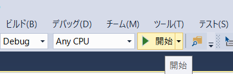

# 演習3

## 演習の概要
### 3-a. 属性検索の実行

**処理概要**
- マップ上のフィーチャレイヤーを取得し、そのフィーチャレイヤーが格納されている GDB に接続
- 属性検索を実行し、取得した値をメッセージボックスに出力する

**演習の目的**  
以下トピックについての理解を深めるため
* GDB への接続
* GDB 内の特定のデータを抽出

__※完成イメージ__


### 3-b. 作図ツールの作成

**処理概要**
- バッファーをつけてポリゴンを作図
- 作図時にポリゴンに属性を付与

**演習の目的**  
以下トピックについての理解を深めるため
* ジオメトリの作成
* ジオメトリの操作
* 作成したジオメトリに対する属性の付与

__※完成イメージ__


## 演習解答
[演習の解答はこちらでダウンロードできます](https://github.com/EsriJapan/workshops/blob/master/20190913_arcgis-pro-sdk-hands-on/hands-on/%E6%BC%94%E7%BF%923/source/Exercise3.zip)

## 3-a. 属性検索の実行

### 手順
1. プロジェクト作成
2. ボタン作成
3. 属性処理の実装
4. デバッグ

#### 1.プロジェクト作成
1-1.Visual Studio を起動します。


1-2.ファイル > 新規作成 > プロジェクトをクリックしてください。


1-3.ArcGIS Pro Add-ins の中の ArcGIS Pro モジュールアドインを選択してプロジェクト名を「Exercise3」にして、OKボタンをクリックしてください。


#### 2.ボタン作成
2-1.プロジェクトを右クリック > 追加 > 新しい項目をクリックしてください。


2-2.ArcGIS Pro Add-ins の中の ArcGIS Pro ボタンを選択してください。  
ファイル名を「SelectLayerByAttribute.cs」に変更し、追加ボタンをクリックしてください。


2-3.Config.damlの \<button> 要素の caption を 以下のように「属性検索」に変更してください。

```xml
<controls>
    <!-- add your controls here -->
    <button id="Exercise3_SelectLayerByAttribute" caption="属性検索" className="SelectLayerByAttribute" loadOnClick="true" 
            smallImage="pack://application:,,,/ArcGIS.Desktop.Resources;component/Images/GenericButtonBlue16.png" 
            largeImage="pack://application:,,,/ArcGIS.Desktop.Resources;component/Images/GenericButtonBlue32.png">
        <tooltip heading="Tooltip Heading">Tooltip text<disabledText /></tooltip>
    </button>
</controls>
```

#### 3.属性検索処理の実装
3-1.SelectLayerByAttribute.cs を開いてください。

3-2.OnClick メソッドを以下のように書き換えてください

```csharp
protected override void OnClick()
{
    //アクティブなマップを取得
    Map map = MapView.Active.Map;

    //Japan レイヤを取得
    FeatureLayer featureLayer = map.GetLayersAsFlattenedList().OfType<FeatureLayer>().FirstOrDefault(l => l.Name == "Japan");
    
    QueuedTask.Run(() =>
    {
        // データストアを取得
        using (Datastore datastore = featureLayer.GetFeatureClass().GetDatastore())
        {
            Geodatabase geodatabase = datastore as Geodatabase;

            using (Table table = geodatabase.OpenDataset<Table>("Japan"))
            {
                // 検索条件
                QueryFilter queryFilter = new QueryFilter
                {
                    // SQL Where 句によって条件を指定
                    WhereClause = "SIKUCHOSON = '横須賀市'",

                    // 取得するカラム
                    SubFields = "KEN, SIKUCHOSON, P_NUM"
                };

                // 検索条件と合致したフィーチャを取得
                using (RowCursor rowCursor = table.Search(queryFilter, true))
                {
                    while (rowCursor.MoveNext())
                    {
                        // レコードを取得
                        using (Row row = rowCursor.Current)
                        {
                            // 検索結果をメッセージボックスに表示
                            ArcGIS.Desktop.Framework.Dialogs.MessageBox.Show(string.Format("県: {0} " + Environment.NewLine +
                                                                                            "市町村: {1} " + Environment.NewLine +
                                                                                            "人口: {2}",
                                                                                            Convert.ToString(row["KEN"]),
                                                                                            Convert.ToString(row["SIKUCHOSON"]),
                                                                                            Convert.ToString(row["P_NUM"])), "検索結果");
                        }
                    }
                }
            }

        } 
    }); 
}
```

#### 4.デバッグ
4-1.プロジェクトをビルドしてください。


4-2.開始ボタンをクリックし、デバッグを実行します。



4-3.ArcGIS Pro が起動します。起動後、「最近使ったプロジェクト」内の「Sample」を開いてください。  


__※ダウンロードされていない方は[Sample.zip](https://github.com/EsriJapan/workshops/blob/master/20190913_arcgis-pro-sdk-hands-on/hands-on/%E6%BC%94%E7%BF%92%E3%83%87%E3%83%BC%E3%82%BF/Sample.zip)をダウンロードしてください__

4-4.ArcGIS Pro が起動したら「アドイン」タブ > 「属性検索」ボタンをクリックしてください。

4-5.以下のようなメッセージボックスが出力されることを確認してください。


## 3-b. 作図ツールの作成

 __※「3-a. 属性検索の実行」で作ったプロジェクトを使用します。__

### 手順
1. 作図ツール作成
2. 作図ツールを使用したジオメトリの作成と操作
3. デバッグ

#### 1.作図ツール作成
1-1.プロジェクトを右クリック > 追加 > 新しい項目をクリックしてください。


1-2.ArcGIS Pro Add-ins の中の ArcGIS Pro 作図ツールを選択してください。  
また、ファイル名を「EditTool.cs」に変更し、追加ボタンをクリックしてください。


1-3.Config.daml を以下のように変更してください。

- \<tooltip heading></tooltip>を以下のように修正
- categoryRefIDを「esri_editing_construction_polygon」に変更

```xml
<tool id="Exercise3_EditTool" categoryRefID="esri_editing_construction_polygon" caption="EditTool" className="EditTool"  loadOnClick="true" 
      smallImage="pack://application:,,,/ArcGIS.Desktop.Resources;component/Images/GenericButtonRed16.png" 
      largeImage="pack://application:,,,/ArcGIS.Desktop.Resources;component/Images/GenericButtonRed32.png" >
    <tooltip heading="ポリゴン作図">バッファーをつけてポリゴンを作図します<disabledText /></tooltip>
</tool>
```

#### 2.作図ツールを使用したジオメトリの作成と操作
2-1.EditTool.cs を開いてください。

2-2.コンストラクタ（EditTool()）を以下のように書き換えてください。

```csharp
public EditTool()
{
    IsSketchTool = true;
    UseSnapping = true;
    SketchType = SketchGeometryType.Polygon;
}
```

2-3.OnSketchCompleteAsync メソッドを以下のように書き換えてください。

```csharp
protected override Task<bool> OnSketchCompleteAsync(Geometry geometry)
{
    if (CurrentTemplate == null || geometry == null)
        return Task.FromResult(false);

    // バッファーする値
    var BufferDistance = 0.03;

    return QueuedTask.Run(() =>
    {
        // 作図したジオメトリにバッファーをつける
        Geometry bufferedGeometry = GeometryEngine.Instance.Buffer(geometry, BufferDistance);

        // アクティブなマップを取得
        Map map = MapView.Active.Map;

        // Japanレイヤーを取得
        FeatureLayer lyr = map.GetLayersAsFlattenedList().OfType<FeatureLayer>().FirstOrDefault(l => l.Name == "Japan");

        // フィーチャクラスの Shape フィールドを取得
        string shapeField = lyr.GetFeatureClass().GetDefinition().GetShapeField();

        // ジオメトリの属性値設定
        var attributes = new Dictionary<string, object>();
        attributes.Add(shapeField, bufferedGeometry);  // shape フィールドにジオメトリ設定
        attributes.Add("KEN", "TEST");                 // KEN フィールドに値を設定

        // エディットオペレーションを作成
        var createOperation = new EditOperation();

        // ジオメトリの作成
        createOperation.Create(lyr, attributes);

        // 作図完了
        return createOperation.ExecuteAsync();
    });
}
```

#### 3.デバッグ
3-1.「3-a. 属性検索の実行」の「4-1」~「4-3」の手順を行ってください。

3-2.ArcGIS Pro が起動したら「編集」タブ > 「作成」ボタンをクリックし、「フィーチャ作成」ペインが表示されることを確認してください。

</br>


3-4.「Japan」フィーチャクラスをクリックし、作成した作図ツールが表示されていることを確認し、ポリゴンを作図してください。


3-5.ダブルクリックで作図を完了すると、バッファーがついてポリゴン（属性付き）が作図されることを確認してください。

</br>


3-6.Visual Studio上でデバッグの停止ボタンをクリックしてください。


3-7.アドイン用のフォルダを削除してください。

※C:\Users\ユーザー名\Documents\ArcGIS\AddIns\ArcGISPro 内のフォルダを削除