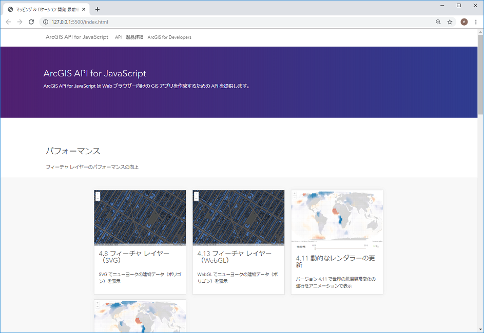

# Web アプリケーション

ArcGIS による様々な拡張パターンの紹介（第 1 部）の Web アプリケーションのセッションでご紹介したデモのサンプルコードです。
[02_01_Web_Application.zip](https://github.com/EsriJapan/workshops/raw/master/20191211_maplocation-dev-technical-session/Sample_Code/02_01_Web_Application/02_01_Web_Application.zip) ファイルをダウンロードし、ご自身の Web サーバーに配置してご利用ください。

## デモ一覧

* パフォーマンス

 フィーチャ レイヤーのパフォーマンスの向上

 * フィーチャ レイヤー（SVG）
 * フィーチャ レイヤー（WebGL）
 * 動的なレンダラーの更新（v4.11）
 * 動的なレンダラーの更新（v4.13）

* ビジュアライゼーション

 様々な表現方法で地図上にデータを可視化するためのスマートマッピング機能

 * スマートマッピング（色）
 * スマートマッピング（サイズ）
 * スマートマッピング（立ち上げ）
 * スマートマッピング（点密度）

* 編集

 編集機能を実装するための様々なウィジェット

 * Editor ウィジェット
 * FeatureForm ウィジェット

* ウィジェット開発

 Web AppBuilder for ArcGIS (Developer Edition) を使用したウィジェット開発

 * クラスタリング ウィジェット
