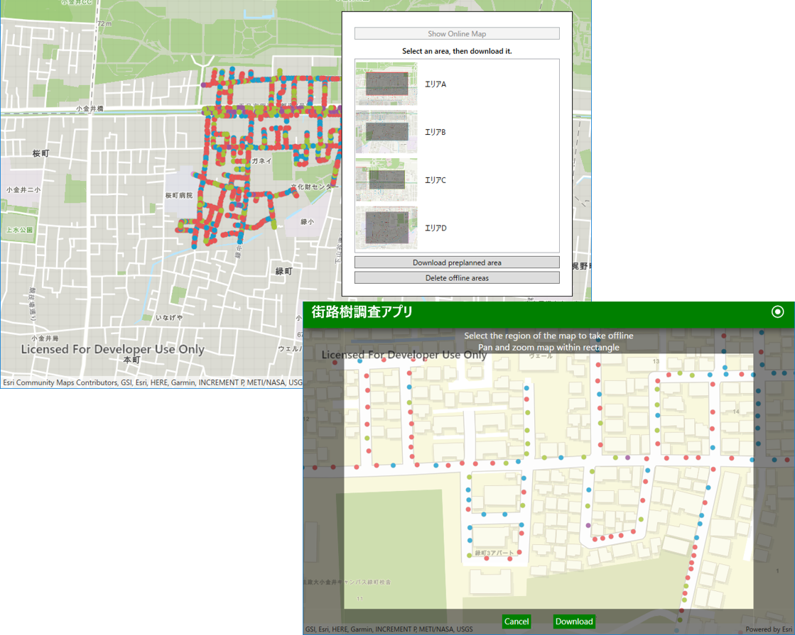
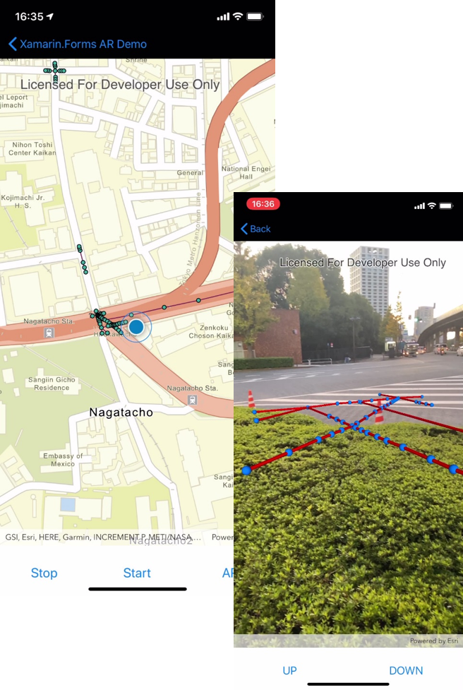

# ネイティブ アプリケーション

ArcGIS による様々な拡張パターンの紹介（第 1 部）の ネイティブ アプリケーションのセッションでご紹介したデモのサンプルコードです。
[02_02_Native_Application.zip](https://github.com/EsriJapan/workshops/raw/master/20191211_maplocation-dev-technical-session/Sample_Code/02_02_Native_Application/02_02_Native_Application.zip) ファイルをダウンロードし、ご利用ください。

## デモ一覧

### オフライン ワークフロー

 

* プレプランで作成したオフラインエリアを読込むサンプル

  PreplannedMap\PreplannedMap.sln
 
* オンデマンドでオフラインエリアを作成するサンプル

  ※ オンデマンド のサンプルは Esri から Open source apps として提供されている「Data Collection for .NET」使用しております。ツールのダウンロードやご利用方法の確認は [Open source apps](https://developers.arcgis.com/example-apps/) よりお願いいたします。

### AR

 

* AR ツールキットをカスタマイズしたサンプル

  arcgis-toolkit-dotnet\src\Esri.ArcGISRuntime.ARToolkit.sln

  ※ AR ツールキットはオープンソースとして [GitHub](https://github.com/Esri/arcgis-toolkit-dotnet) で提供されています。
   
### データについて
  各サンプルで使用する Web マップは各自で作成したものをコード内で設定し、ご利用ください。
  デモで利用した街路樹のサンプルデータは、2019/08/23 に実施した [ArcGIS 開発者のための最新アプリ開発塾 2019](https://github.com/EsriJapan/workshops/blob/master/20190823_app-development-hands-on/HandsOn_Data.zip)に公開されていますので「tree_inspection.gdb.zip」を使用して Web マップの作成を行いご利用ください。

