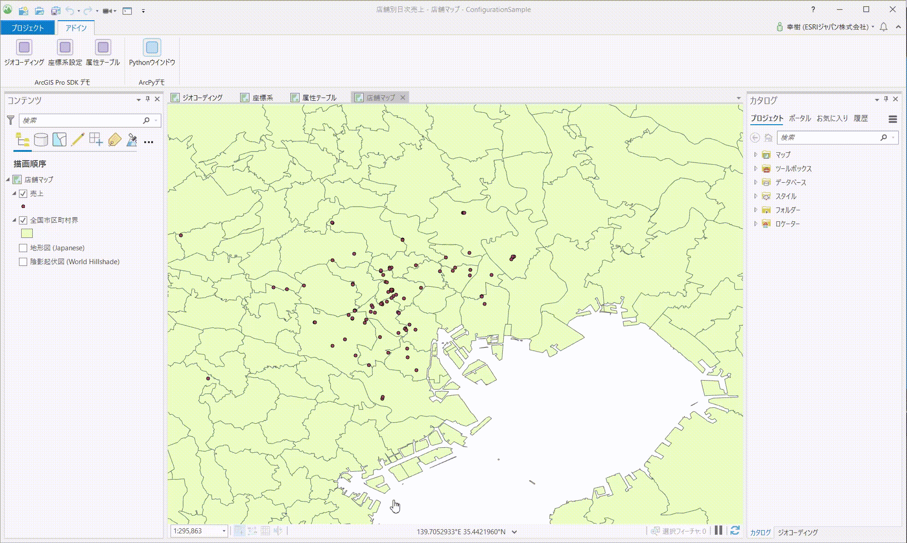

# デスクトップ拡張、スクリプト

ArcGIS による様々な拡張パターンの紹介（第 2 部）の デスクトップ拡張、スクリプトのセッションでご紹介したデモのサンプルコードです。
[03_02_Desktop_Extensions_Scripting.zip](https://github.com/EsriJapan/workshops/raw/master/20191211_maplocation-dev-technical-session/Sample_Code/03_02_Desktop_Extensions_Scripting/03_02_Desktop_Extensions_Scripting.zip) ファイルをダウンロードし、ご利用ください。

## デモ一覧

### デスクトップ拡張

 

※サンプルを使用する場合は03_02_Desktop_Extensions_Scripting\Pro SDK\ConfigurationSample\ConfigurationSample.sln を起動してデバッグしてください。

* 構成管理

  UI のカスタマイズをするサンプル

* ジオコーディング

  ジオコーディング用の標準コントロールを使用したサンプル

* 座標系設定

  座標系用の標準コントロールを使用したサンプル

* 属性テーブル

  属性テーブル用の標準コントロールを使用したサンプル(強調処理は「全国市区町村界」レイヤーに対してのみ有効)

* Python ウインドウ

  Python ウインドウを起動させるサンプル

### スクリプト

* CIM を使ったレンダリング

  売上に応じてポイントの大きさや色を変更するサンプル

  

  03_02_Desktop_Extensions_Scripting\Python\apply_cim.py を参照してください。

* データ処理自動化

  CSV のデータを FGDB に取込み、そのデータを WebGIS にアップロードするサンプル

  03_02_Desktop_Extensions_Scripting\Python\import_sales_data.py を参照してください。

