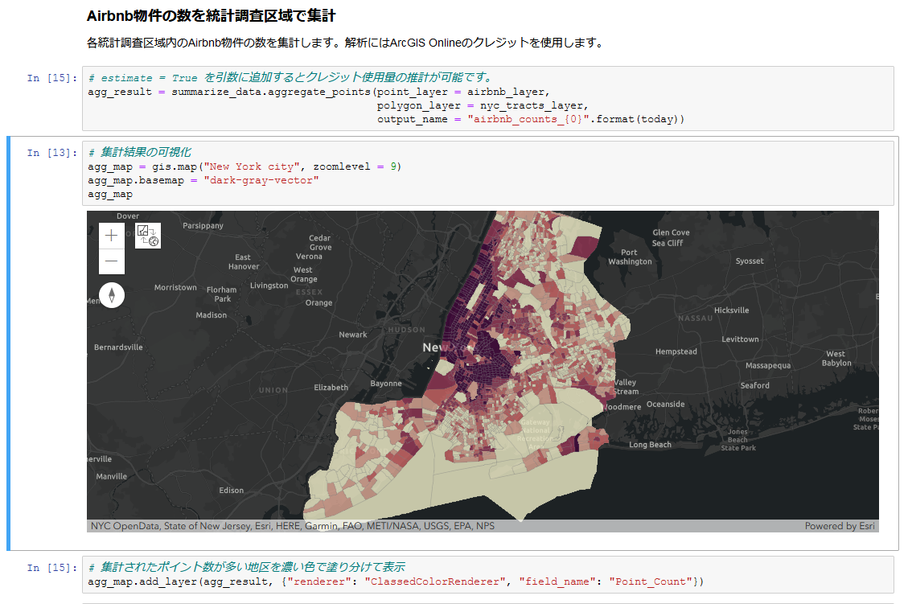

# 最新テクノロジー

ArcGIS による様々な拡張パターンの紹介（第 2 部）の 最新テクノロジーのセッションでご紹介したデモのサンプルコードです。
[03_02_Desktop_Extensions_Scripting.zip](https://github.com/EsriJapan/workshops/raw/master/20191211_maplocation-dev-technical-session/Sample_Code/03_03_New_Technology/03_03_New_Technology.zip) ファイルをダウンロードし、ご利用ください。

## デモ一覧

### NYのAirbnb物件の分布の要因分析

* Scikit-learn の勾配ブースティングを使って解析: NY_airbnb_analysis_modified.ipynb
    * [米国Esri社のサンプル](https://developers.arcgis.com/python/sample-notebooks/analyzing-growth-factors-of-airbnb-properties-in-new-york-city/)を一部改変したものです

### ディープ ラーニングによる道路のひび割れの検出

* Single Shot Detectorで道路のひび割れを検出
    * Single Shot Detector による学習: detect_road_cracking.ipynb
    * 学習モデルを動画に適用: video_predict.ipynb