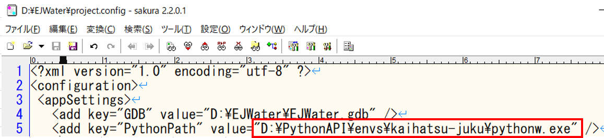
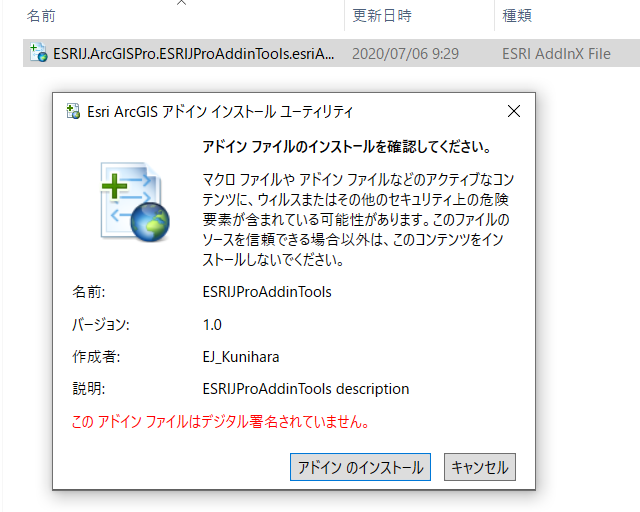
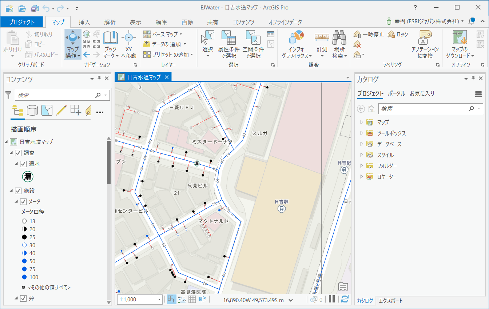
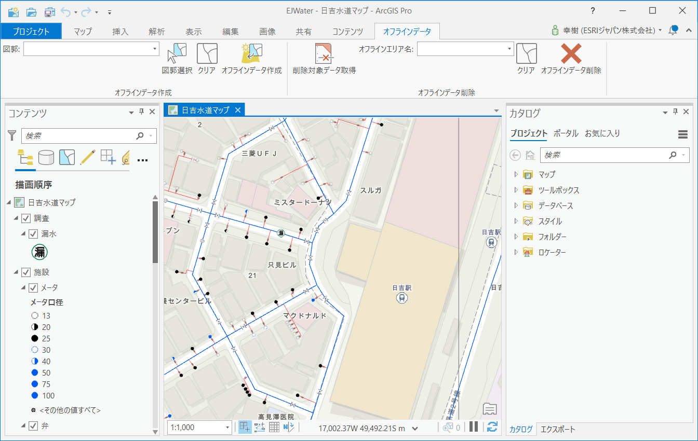

# 環境構築

## データの配置
1. [ハンズオン用データ](https://github.com/EsriJapan/workshops/blob/master/20200825_app-development-hands-on/HandsOn_Data.zip)をダウンロードし、解凍してください。

2. 解凍したデータをDドライブ直下に配置してください（D:\EJWater となるように配置してください）。

3. EJWater フォルダにある「project.config」ファイルを開いてください。

4. 5行目の value をご自身の環境に合わせて変更してください（例：C:\Program Files\ArcGIS\Pro\bin\Python\envs\arcgispro-py3\pythonw.exe）

## ArcGIS Pro
[ArcGIS Pro SDK](https://pro.arcgis.com/en/pro-app/sdk/) で作成されたアドインをインストールします。

1. [アドインファイル](https://github.com/EsriJapan/workshops/blob/master/20200825_app-development-hands-on/Environment/Addin.zip)をダウンロードし、解凍してください。

2. アドインファイルをダブルクリックし、インストールします。

3. D:\EJWater\EJWater.aprx をダブルクリックし、起動確認をしてください。

4. 「オフラインデータ」タブが存在し、リボン上のアイテムが活性状態であることを確認してください。

## ArcGIS API for Python