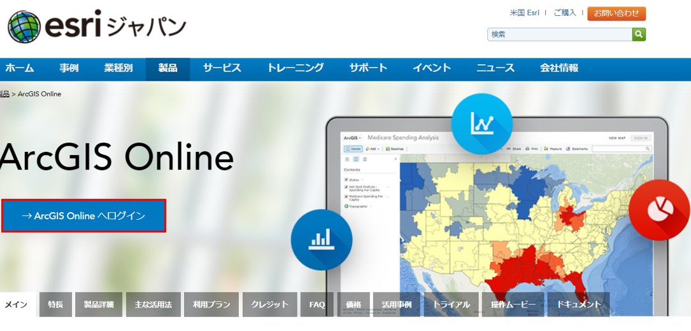
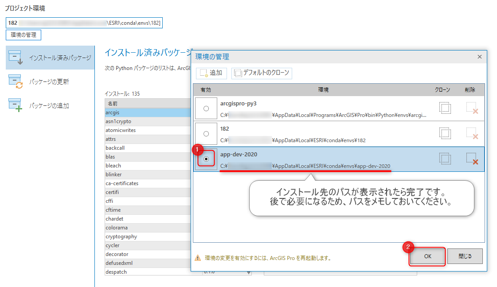

# 環境構築
ArcGIS 開発者のための最新アプリ開発塾 2020 にご参加する方は以下手順に沿って環境構築をお願いします。

## ArcGIS プラットフォームを活用したデータ構築
### データの配置
1. [ハンズオン用データ](https://github.com/EsriJapan/workshops/raw/master/20200825_app-development-hands-on/HandsOn_Data.zip)をダウンロードし、解凍してください。

2. 解凍したデータをDドライブ直下に配置してください（D:\EJWater となるように配置してください）。

   ※Cドライブや任意のディレクトリに配置していただいても構いませんが、配置先にあわせて EJWater フォルダにある「project.config」の4,6行目を書き換えて頂く必要があります（以下画像参照）。

   

3. 「project.config」ファイルの 5行目の value をご自身の Python 環境に合わせて変更してください（例：C:\Program Files\ArcGIS\Pro\bin\Python\envs\arcgispro-py3\pythonw.exe）

   

### ArcGIS Pro の環境設定
1. ArcGIS Pro をインストールしてください。

   ArcGIS Pro をお持ちでない方は[トライアルライセンス](https://www.esrij.com/form/arcgis/trials/)を配布していますので、そちらを使ってインストールしてください。ArcGIS Pro をすでにお持ちの方はそちらをご使用いただいて構いません（ただし、バージョンは2.5にしていただく必要があります）。

2. [ArcGIS Pro SDK](https://pro.arcgis.com/en/pro-app/sdk/) で作成された[アドイン](https://github.com/EsriJapan/workshops/raw/master/20200825_app-development-hands-on/Environment/Addin.zip)をダウンロードし、解凍してください。

3. アドインファイルをダブルクリックし、インストールしてください。

   

4. D:\EJWater\EJWater.aprx をダブルクリックし、起動確認をしてください。

   

5. 「オフラインデータ」タブが存在し、リボン上のアイテムが活性状態であることを確認してください。

   

6. また、「図郭」コンボボックスに以下のように値が格納されていることを確認してください。

   

### ArcGIS Online へのアクセス確認
1. [ArcGIS Online](https://www.esrij.com/products/arcgis-online/) にアクセスしてください。

   

2. ログイン情報を入力し、ログインができることを確認してください。

   ※ログイン情報の作成に関しては[ArcGIS for Developers 開発者アカウント](https://esrijapan.github.io/arcgis-dev-resources/guide/create-map/get-dev-account/)参照してください。

   

### ArcGIS API for Python の環境設定
1. ArcGIS Pro をインストールし起動したら [設定] をクリックします

   

2. [Python] をクリックし、Python パッケージ マネージャーを開きます

   

3. [環境の管理] をクリックし、デフォルト環境である [arcgispro-py3] をクローンします。任意の環境名を指定 (ここでは [app-dev-2020]) して、クローンを開始しましょう。

   

4. クローンが完了したら、作成された環境のラジオボタンを押して環境を切り替え、ArcGIS Pro を閉じましょう。

   

5. 次にPython コマンド プロンプトを開きます。スタートメニュー>すべてのプログラム> ArcGIS> Python コマンドプロンプトから開くことができます。

   

6. Python コマンド プロンプトが開いたら、環境が先ほど作成した app-dev-2020 であることを確認したら以下のコマンドを実行します。

   `conda install -c esri arcgis=1.8.1 --no-pin`

   

   各種パッケージのインストールについて確認されるので、y + Enter でインストールを進めます。
   
8. インストールが完了したらディレクトリを任意の場所に移動し、次のコマンドで Jupyter Notebook を起動します。

   `jupyter notebook`

   Chrome、Firefox、Chromium 版の Edge 等のモダン ブラウザーを使用してください。
   IE 等で開いてしまった場合は以下画像部分の URL を Chrome 等の アドレスバーにコピーして開いてください。

   

9. Jupyter Notebook が開いたら以下画像の順にクリックし、新しいノートブックを開きます。

   

   ノートブックが開いたら、セルに次のコードを入力後、Shift + Enter で実行して、マップが表示されることを確認してください。
   ```
      from arcgis.gis import GIS
      gis = GIS("https://www.arcgis.com/", "ユーザー名", "パスワード")
      m = gis.map()
      m
   ```
   マップが表示されたら正常に環境がこうちくされています。
   

## ArcGIS プラットフォームを活用した現地調査アプリ開発ハンズオン

### ArcGIS Runtime SDK for .NET の環境設定
ハンズオンでは ArcGIS Runtime SDK for .NET バージョン 100.8 を使用いたします。  
ArcGIS Runtime SDK for .NET バージョン 100.8 のシステム要件につきましては以下のサイトに記載されておりますのでご確認ください。  
・[ArcGIS Runtime SDK システム要件](https://www.esrij.com/products/arcgis-runtime-sdk-for-dotnet/environments/100_8_0/)  

ArcGIS Runtime SDK for .NET バージョン 100.8 につきましては、開発環境として Visual Studio 2019 16.0 以上（ [.NETデスクトップ開発] ワークロード のインストール）が必要となります。  
以下サイトよりダウンロード、およびインストールをお願いいたします。  
・[Visual Studio ダウンロードページ](https://visualstudio.microsoft.com/ja/downloads/)  
・[Visual Studio インストール手順](https://docs.microsoft.com/ja-jp/visualstudio/install/install-visual-studio?view=vs-2019)  

## ArcGIS プラットフォームを活用したWebアプリ開発ハンズオン

### ArcGIS API for JavaScript の環境設定
1. [Visual Studio Code](https://code.visualstudio.com/) をインストールしてください。

2. [Google Chrome](https://www.google.com/chrome/?brand=CHBD&gclid=EAIaIQobChMIqszkqJLO6gIVCFdgCh1CbgnjEAAYASAAEgIfY_D_BwE&gclsrc=aw.ds)(最新バージョン)をインストールしてください。
