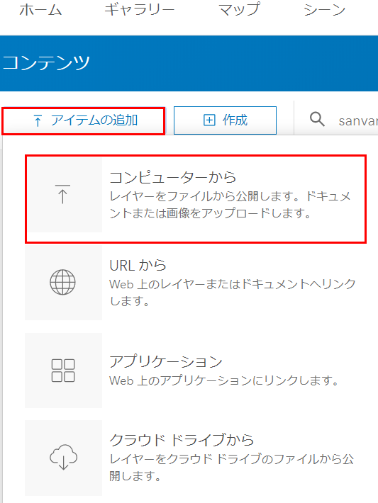

# Web GIS 基礎 ~ArcGIS Online を使ってみよう~

### ①CSV ファイルをアップロードしてみよう
## ArcGIS Online へアクセス
1. [ArcGIS Online](https://www.esrij.com/products/arcgis-online/) にアクセスしてください。

   

2. ログイン情報を入力し、ArcGIS Onlineにログインしてください。

   

## フィーチャ レイヤーの作成
マップにレイヤーが格納されているように、Web マップにも同じようにレイヤーを格納する必要があります。Web マップを作成する前にまずはレイヤーを作ってみましょう。

1. [zip](https://github.com/EsriJapan/workshops/raw/master/20200825_app-development-hands-on/Session/1_BuildData/ArcGISOnline/data/%E5%90%84%E5%BA%97%E8%88%97%E5%A3%B2%E4%B8%8A.zip) をダウンロードして、解凍してください。

2. 「アイテムの追加」 > 「コンピューターから」を押下します。

   

3. 以下を入力し、「アイテムの追加」ボタンを押下します。

   「ファイル」・・・「1」で解凍したデータ（csv）  
   「タイトル」・・・各店舗売上  
   「タグ」・・・各店舗売上  
   「フィーチャの検索」・・・座標  
   「場所フィールド（フィールド名：経度）」・・・経度  
   「場所フィールド（フィールド名：緯度）」・・・緯度  

     

   

4. フィーチャ レイヤー 作成後、サムネイルを押下します。

   

5. 追加したアイテムを確認することができます。

   

### ②Living Atlas を使ってみよう
## Living Atlas へアクセス
1. 画面上部にある赤枠のボタンを押下してください。
 
   

2. 「Living Atlas」ボタンを押下します。

   

3. Living Atlas 表示後、検索バーに「全国市区町村界」と入力し、検索を実行します。

   

## Web マップ参照
1. 検索結果の表示後、「全国市区町村界マップ2020」を押下します。

   

2. 画面遷移後、サムネイルを押下します。

   

3. 「全国市区町村界マップ2020」 Web マップが起動します。

   

## まとめ
このように、ArcGIS Online を使用すればパブリックにアップロードされている Web マップを自由に使用することができます。そして、それを ArcGIS API for Python, ArcGIS Runtime SDK, ArcGIS API for JavaScript などを使用して参照することができます。また、Web マップをご自身で作成することもできますので、次のセッションでは Web マップの作成を実際に行ってみようと思います。