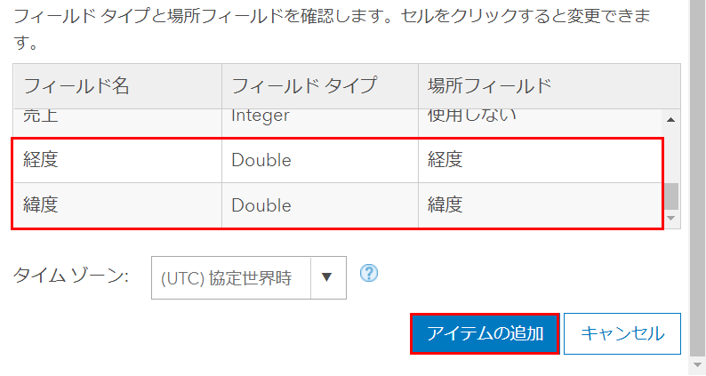
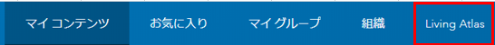

# Web GIS 基礎 ~ ArcGIS Online を使ってみよう ~

## 演習の目的
1. ArcGIS Online にデータをアップロードする
2. ArcGIS Online のサービスの一つである、Living Atlas を使ってみる

## ①CSV ファイルをアップロードしてみよう
### ArcGIS Online へアクセス
1. [ArcGIS Online](https://www.arcgis.com/home/index.html) にアクセスして「サインイン」を押下してください。

   

2. ログイン情報を入力し、ArcGIS Onlineにログインしてください。

   

### フィーチャ レイヤーの作成
マップにレイヤーが格納されているように、Web マップにも同じようにレイヤーを格納する必要があります。Web マップを作成する前にまずはレイヤーを作ってみましょう。

1. [アップロードするデータ](https://github.com/EsriJapan/workshops/raw/master/20200825_app-development-hands-on/Session/1_BuildData/ArcGISOnline/data/%E5%90%84%E5%BA%97%E8%88%97%E5%A3%B2%E4%B8%8A.zip) をダウンロードして、解凍してください。

2. 「アイテムの追加」 > 「コンピューターから」を押下します。

   

3. 以下を入力し、「アイテムの追加」ボタンを押下します。

   「ファイル」・・・「1」で解凍したデータ（csv）  
   「タイトル」・・・各店舗売上  
   「タグ」・・・各店舗売上  
   「フィーチャの検索」・・・座標  
   「場所フィールド（フィールド名：経度）」・・・経度  
   「場所フィールド（フィールド名：緯度）」・・・緯度  

    
  
     

### フィーチャ レイヤーの参照
1. フィーチャ レイヤー 作成後、サムネイルを押下します。

   

2. フィーチャ レイヤーを参照することができます。

   

### フィーチャ レイヤーのフィルタリング
1. 「詳細」を押下します。

   

2. 「フィルター」を押下します。

   

3. 「売上＝3000000」となるようにフィルターの設定をし、「フィルターの適用ボタン」を押下します。

   

4. 「テーブルの表示」を押下します。

   

5. フィルターが正しく設定されていることがわかります。

   

## ②Living Atlas を使ってみよう
### Living Atlas へアクセス
1. 画面右上の「Living Atlas」ボタンを押下します。

   

2. Living Atlas 表示後、検索バーに「全国市区町村界マップ2020」と入力し、Enterキーを押下します。

   

### Web マップ参照
1. 検索結果の表示後、「全国市区町村界マップ2020」を押下します。

   

2. 「全国市区町村界マップ2020」 Web マップが起動します。

   

### Web マップのレンダリング
1. 「コンテンツ」を押下します。

   

2. 「スタイルの変更」を押下します。

   

3. 「表示する属性を選択」で「P_NUM」(人口数)を選択します。

   

4. 数値分類でフィーチャがレンダリングされていることがわかります。

   

5. 「オプション」を押下します。

   

6. 「シンボル」を押下します。

    

7.  任意の色を選択して「OK」を押下してください。

    

8. シンボルの色が変更されたことがわかります。
   
   

9. 下にある「全国都道府県界データ2020」のレイヤーを非表示にします。

   

10. 「表示する縮尺範囲」を以下のように設定します。

   

### Web マップの保存
1. 「名前を付けて保存」を押下します。

   

2. 以下を入力し、「マップの保存」ボタンを押下します。

   「タイトル」・・・全国市区町村界マップ2020_開発塾   
   「サマリー」・・・ 全国市区町村界マップ2020にレンダリングを設定  

3. 「コンテンツ」を押下します。

   

4. 「全国市区町村界マップ2020_開発塾 」がWebマップとして作成されます。これを押下します。

   

### データ共有設定の変更
1. 「編集」を押下します。

   

2. 「すべての人に公開(パブリック)」を選択し、「保存」を押下します。

   

3. 共有が「すべての人に公開(パブリック)」になっていることを確認します。

   

## まとめ
ArcGIS Online を使用すれば、簡単に Web GIS 上にデータをアップロードしたり、パブリックに公開されているデータを自由に使用することができます。また、ArcGIS Online にアップロードしたデータを ArcGIS API for Python, ArcGIS Runtime SDK, ArcGIS API for JavaScript などを API で操作することもできます。  

次のセッションでは Web マップの作成を実際に行ってみようと思います。