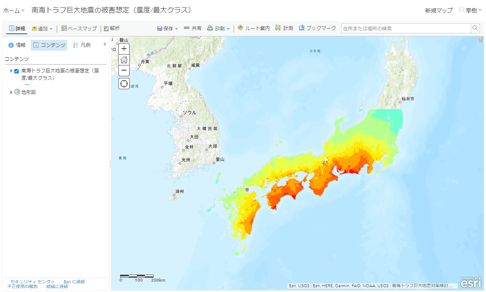

# Web GIS 基礎

## ArcGIS Online へアクセス
1. [ArcGIS Online](https://www.esrij.com/products/arcgis-online/) にアクセスしてください。

   

2. ログイン情報を入力し、ArcGIS Onlineにログインしてください。

   

## Living Atlas へアクセス
1. 画面上部にある赤枠のボタンを押下してください。
 
   

2. 「Living Atlas」ボタンを押下します。

   

3. Living Atlas 表示後、「地震」と入力し、検索を実行します。

   

## Web マップ参照
1. 検索結果の表示後、「南海トラフ巨大地震の被害想定（震度/最大クラス）」を押下します。

   

2. 画面遷移後、サムネイルを押下します。

   

3. 「南海トラフ巨大地震の被害想定（震度/最大クラス）」 Web マップが起動します。

   
