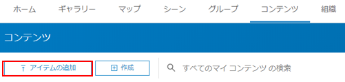
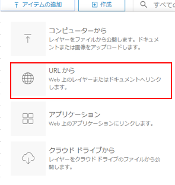
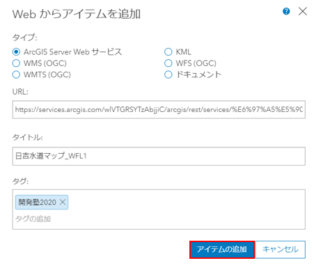
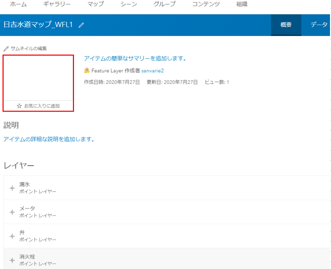
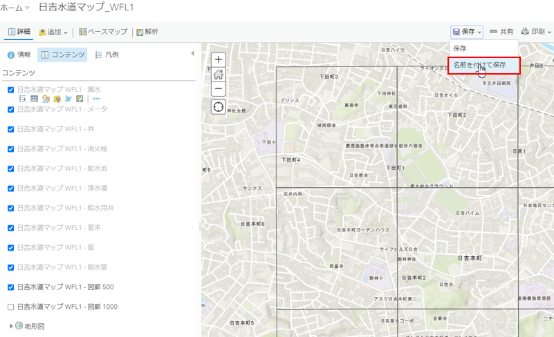

# ArcGIS Online を使用した Web マップの作成

※ArcGIS Pro をお持ちの方は[こちら](https://github.com/EsriJapan/workshops/tree/master/20200825_app-development-hands-on/Session/1_BuildData/ArcGISPro)をご参照ください。

## ArcGIS Online にアクセス

1. [ArcGIS Online](https://www.esrij.com/products/arcgis-online/) にアクセスします。

   

2. 画面上部の「コンテンツ」を押下します。

   

## Web マップの作成
1. 「アイテムの追加」ボタンを押下します。

   

2. 「URL」からを押下します。

   
   
3. 以下を入力し、「アイテムの追加」ボタンを押下します。

   「URL」・・・ https://services.arcgis.com/wlVTGRSYTzAbjjiC/arcgis/rest/services/%E6%97%A5%E5%90%89%E6%B0%B4%E9%81%93%E3%83%9E%E3%83%83%E3%83%97_WFL1/FeatureServer  
   「タイトル」・・・日吉水道マップ_WFL1  
   「タグ」・・・開発塾2020  

   ※入力する URL はあらかじめパブリックに公開しておいたデータです。

   

    

4. アイテムが追加されたことを確認し、サムネイルを押下します。

   

5. 「名前を付けて保存」を押下します。

   

6. 以下を入力し、「マップの保存」を押下します。

   「タイトル」・・・日吉水道マップ  
   「タグ」・・・開発塾2020  
   「サマリー」・・・日吉水道マップ  

   

7. 「コンテンツ」を押下します。

   

8. Web マップが作成されていることを確認します。

   

## Web マップを参照
1. アップロードした Web マップを押下します。

     

2. Web マップの概要画面に遷移後、サムネイルを押下します。

     

3. Web マップ が参照可能になります。

   

## まとめ

### １日目(2020/8/25)
作成した Web マップ と ArcGIS API for Python を使用して現地調査用データを作成

### 2日目(2020/8/26)
ArcGIS API for Python を使用して作成した Web マップ を更新