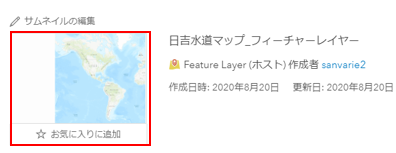

# ArcGIS Online を使用した Web マップの作成

※ArcGIS Pro をお持ちの方は[ArcGIS Pro を使用した Web マップの作成](https://github.com/EsriJapan/workshops/tree/master/20200825_app-development-hands-on/Session/1_BuildData/ArcGISPro)をご参照ください。

## 演習の目的
1. FGDB をもとにした ArcGIS 上での Web マップの作成方法の習得
2. 作成した Web マップを ArcGIS Online で参照する方法の習得

## ArcGIS Online にアクセス

1. [ArcGIS Online](https://www.arcgis.com/home/index.html) にアクセスして「サインイン」を押下してください。

   

2. 画面上部の「コンテンツ」を押下します。

   

## フィーチャ レイヤーの作成
Web マップに格納するためのレイヤーを作成します。

1. 「作成」ボタンを押下します。

   

2. 「フィーチャ レイヤー」を押下します。

   
   
3. 「URLから」を選択し、「URL」に以下を入力し、「次へ」ボタンを押下します。

   「URL」・・・`https://services.arcgis.com/wlVTGRSYTzAbjjiC/arcgis/rest/services/%E6%97%A5%E5%90%89%E6%B0%B4%E9%81%93%E3%83%9E%E3%83%83%E3%83%97_WFL1/FeatureServer`  

   ※入力する URL はあらかじめパブリックに公開しておいたデータです。これをテンプレートにして空のフィーチャ レイヤーを作成します。  
   ※この作業をすることで、複数のレイヤーをレンダリング設定を含めて一括でコピーすることができます。

   

4. 「次へ」ボタンを押下します。

   

5. 以下を入力し「次へ」ボタンを押下します。

   「左」・・・139.636  
   「右」・・・139.652  
   「上」・・・35.556  
   「下」・・・35.552  

   

6. 以下を入力し「完了」ボタンを押下します。

   「タイトル」・・・日吉水道マップ_WFL1  
   「タグ」・・・日吉水道マップ  

   

7. フィーチャレイヤーが作成されます。

   

## フィーチャレイヤーにデータを追加
1. [GDB](https://github.com/EsriJapan/workshops/raw/master/20200825_app-development-hands-on/Session/1_BuildData/ArcGISPro/ArcGISOnlineVersion/data/EJWater.gdb.zip)をダウンロードします。

2. 「データ更新」＞「データをレイヤーに追加」を押下します。

   

3. 以下を入力し、「アップロードと継続」ボタンを押下します。

   「ファイル名」・・・「1」でダウンロードした zip  
   「コンテンツ」・・・ファイルジオデータベース

   

   ※以下エラーが出てきたら「OK」を押してください（特に問題はありません）。

   

4. 「データの追加先のレイヤーを選択」「更新済みデータを含むEJWWater.gdb.zipからレイヤーを選択」に同じ値を設定し、「更新の適用」ボタンを押下します。

   

   ※以下エラーが出てきたら「OK」を押してください（特に問題はありません）。

   

5. 「2」~「4」の手順を以下レイヤーに対して繰り返します。

   「漏水」  
   「メータ」  
   「弁」  
   「管」  
   「給水管」  
   「図郭_500」  

   ※本手順ではハンズオンの時間の関係上、レイヤーを抜粋していますが、時間に余裕がありましたら全レイヤーに対して処理していただいても構いません。

## Web マップを作成
1. サムネイルを押下します。

   

2. 「名前を付けて保存」を押下します。

   

3. 以下を入力し、「マップの保存」を押下します。

   「タイトル」・・・日吉水道マップ    
   「タグ」・・・開発塾2020    
   「サマリー」・・・日吉水道マップ  

   

4. 「コンテンツ」を押下します。

   

5. Web マップが作成されていることを確認します。

   

## Web マップを参照
1. アップロードした Web マップを押下します。

     

2. 後のセッションで使用するので、赤枠の部分をコピーして控えておいてください（=より後の部分をコピーしてください）。

     

3. Web マップの概要画面に遷移後、サムネイルを押下します。

     

4. Web マップ が参照可能になります。

   

## まとめ
ArcGIS Online 上で FGDB などから簡単に Web マップを作成することができます。そして、ArcGIS API for Python, ArcGIS Runtime SDK, ArcGIS API for JavaScript などの API を使用すれば作成した Web マップを参照することができます。

次のセッションでは ArcGIS API for Python を使用して Web マップ を扱ってみようと思います。

※Web マップが作成できなかった場合、「ArcGIS Runtime SDK for .NET を使用して現地調査アプリを開発してみよう！」（1日目）、「ArcGIS API for JavaScript を使用して Web アプリを開発してみよう！」(2日目) のセッションでは、こちらで用意している Web マップを使用していただきますが、以下のセッションにつきましては聴講のみとさせていただきますので、ご了承ください。

### １日目(2020/8/25)
作成した Web マップ と ArcGIS API for Python を使用して現地調査用データを作成

### 2日目(2020/8/26)
ArcGIS API for Python を使用して作成した Web マップ を更新