# ArcGIS API for Python を使用した Web マップの作成

<span style="color: red; ">※ArcGIS Pro をお持ちの方は[こちら](https://github.com/EsriJapan/workshops/tree/master/20200825_app-development-hands-on/Session/1_BuildData/ArcGISPro)をご参照ください。</span>

<span style="color: red; ">※こちらの手順で Web マップが作成できなかった場合は[こちら](https://github.com/EsriJapan/workshops/tree/master/20200825_app-development-hands-on/Session/1_BuildData/ArcGISPro/ArcGISOnlineVersion)をご参照ください。</span>

## ArcGIS Notebook Server にアクセス
[ArcGIS Notebook Server](https://enterprise.arcgis.com/ja/notebook/latest/install/windows/introduction-to-arcgis-notebook-server.htm) を使うことによって [Jupyter Notebook](https://jupyter.org/) を ArcGIS Online(ライセンス制限あり) もしくは ArcGIS Enterprise 上で動かすことができます 。今回は米国Esri が公開している ArcGIS Notebook Server の環境を使用します。  

ArcGIS Notebook Server についての詳細は[こちら](https://community.esri.com/docs/DOC-13626)をご参照ください。

1. [ArcGIS Notebook Server](https://notebooks.esri.com/user/rlQ1EHOw9BsZb7twKKnLdxdFR/tree)にアクセスします。

2. 「New」>「Python3」を押下します。

   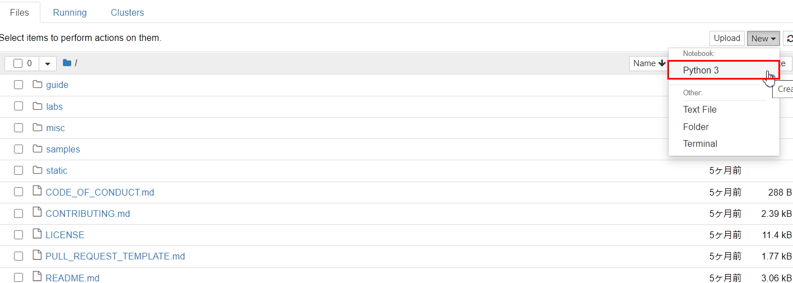

## フィーチャ レイヤーの作成
Web マップに格納するためのレイヤーを作成します。

1. 「ユーザー名」にご自身のArcGIS Online アカウントのユーザー名を入力した上で以下のコードを実行します。

   ```python
   from arcgis.gis import GIS
   gis = GIS("https://www.arcgis.com", "ユーザー名")
   item = gis.content.get("71b4b769df7c4a18bc7efc292af093e6")
   result = gis.content.clone_items([item])
   result[0]
   ```

   ※ESRIジャパンがパブリックに公開しているフィーチャ レイヤーをコピーし、ご自身の ArcGIS Online の領域に同じデータをプライベートな状態で作成します。

2. パスワードを入力し Enter キーを押下します。

   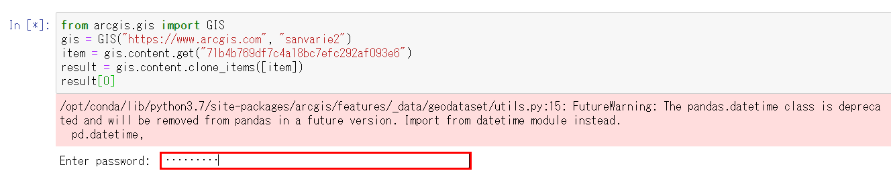

   ※数分お待ちいただく必要があります。

3. 作成したフィーチャレイヤーをクリックします。

   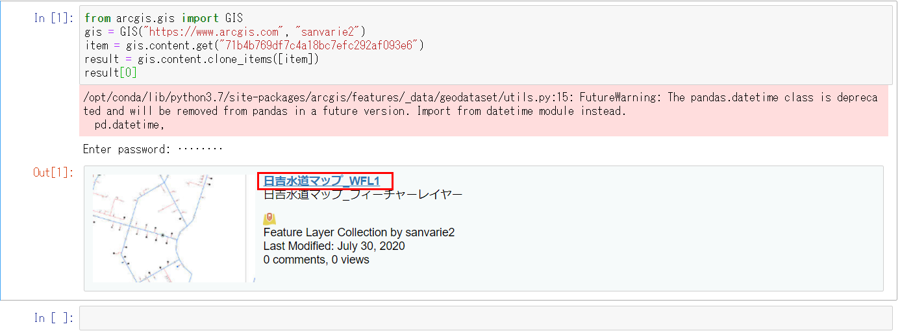

## Web マップを作成
1. サムネイルを押下します。

   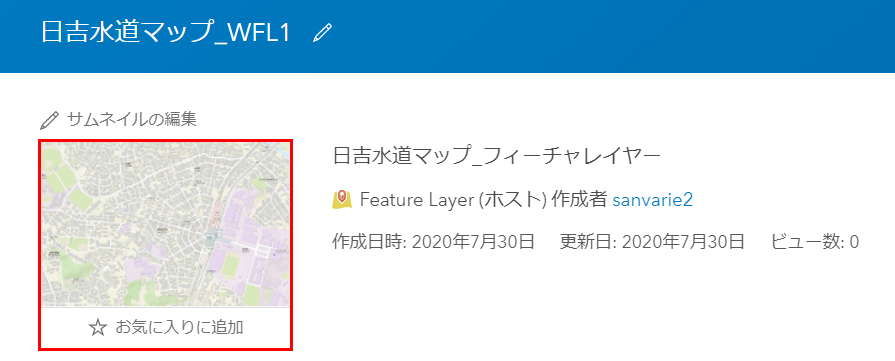

2. 「名前を付けて保存」を押下します。

   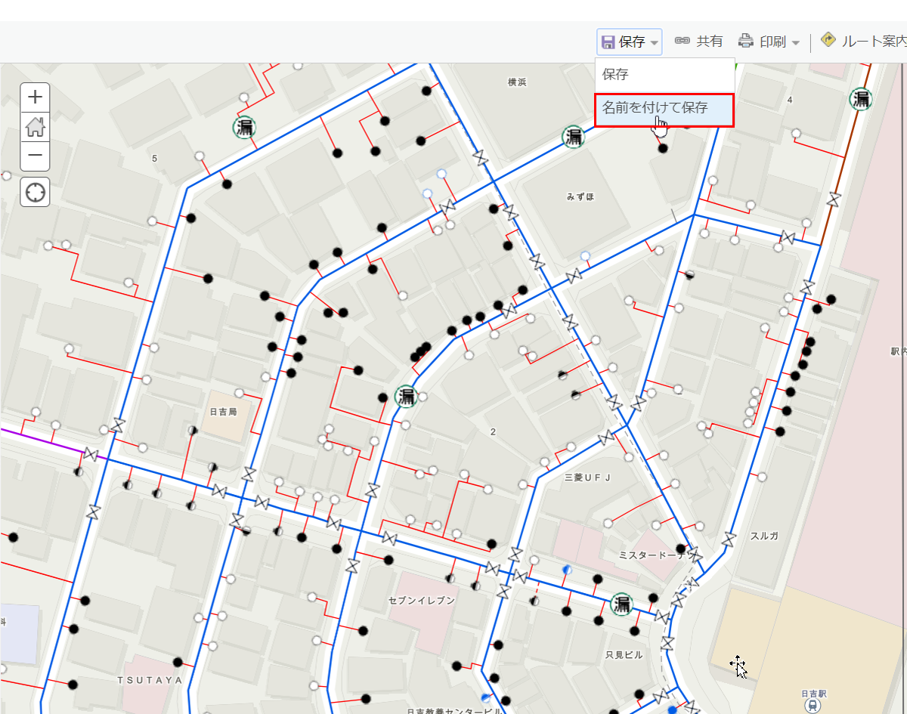

3. 以下を入力し、「マップの保存」を押下します。

   「タイトル」・・・日吉水道マップ  
   「タグ」・・・開発塾2020  
   「サマリー」・・・日吉水道マップ  

   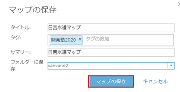

4. 「コンテンツ」を押下します。

   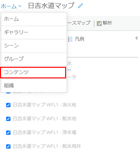

5. Web マップが作成されていることを確認します。

   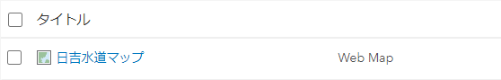

## Web マップを参照
1. アップロードした Web マップを押下します。

   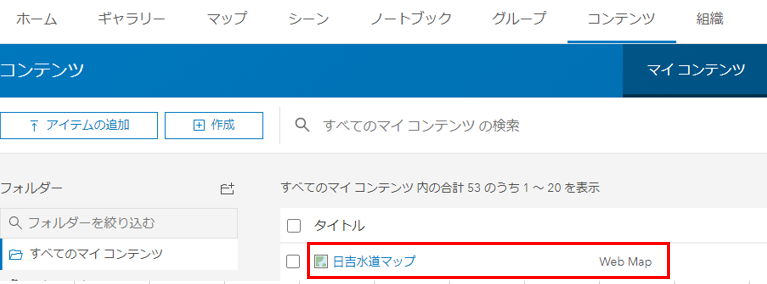  

2. Web マップの概要画面に遷移後、サムネイルを押下します。

   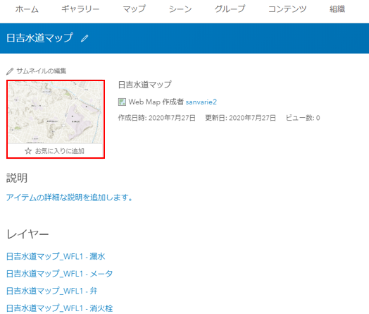  

3. Web マップ が参照可能になります。

   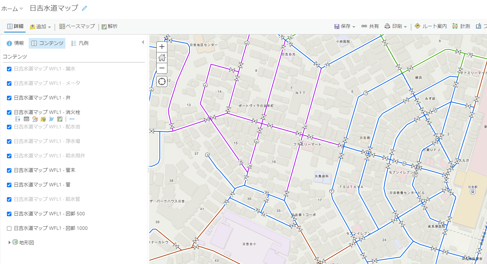


## まとめ
マップにレイヤーが格納されているように、Web マップにも同じようにレイヤーを格納する必要があります（今回はフィーチャ レイヤーを格納しました）。今回は レイヤーを ArcGIS API for Python を使って作成してみましたが、ArcGIS Online からでも作成可能なので、興味のある方はぜひ [ArcGIS Online を使用した Web マップの作成](https://github.com/EsriJapan/workshops/tree/master/20200825_app-development-hands-on/Session/1_BuildData/ArcGISPro/ArcGISOnlineVersion)にもチャレンジしてみてください。また、今回、Web GIS のレイヤーについてお話する時間があまりありませんでしたが、Web GIS のレイヤーについての詳細は[こちら](https://esrijapan.github.io/arcgis-dev-resources/core-concepts/layers/)をご参照ください。  

次のセッションでは ArcGIS API for Python を使用して Web マップ を扱ってみようと思います。

### １日目(2020/8/25)
作成した Web マップ と ArcGIS API for Python を使用して現地調査用データを作成

### 2日目(2020/8/26)
ArcGIS API for Python を使用して作成した Web マップ を更新