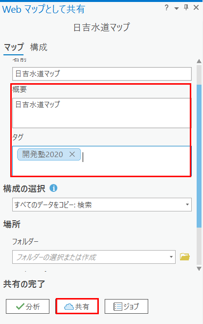
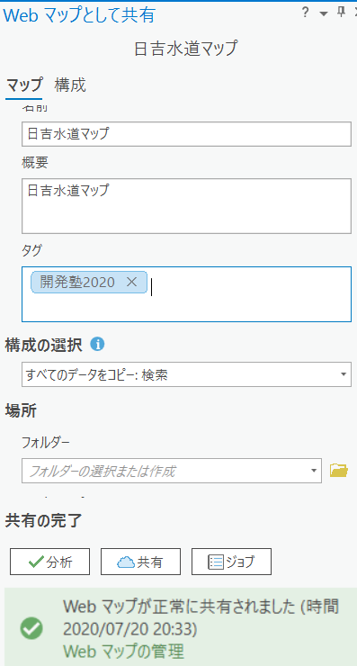
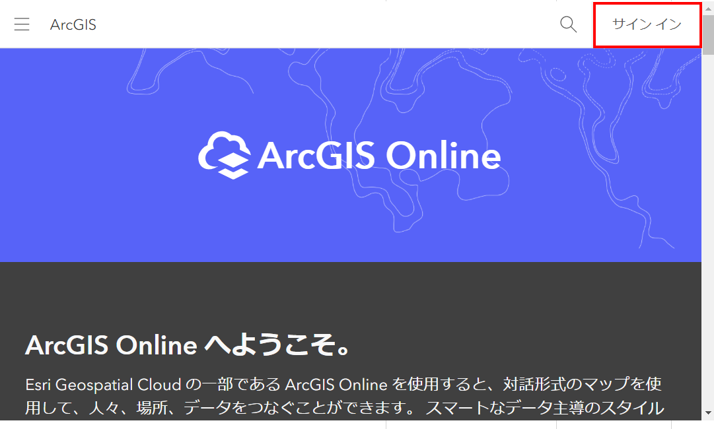

# ArcGIS Pro を使用した Web マップの作成

## ArcGIS Pro 起動

1. EJWater フォルダにある EJWater.aprx をダブルクリックします。

     

2. ArcGIS Pro が起動します。

   

## Web マップの作成

3. 「共有」タブ内の「Webマップ」ボタンを押下します。

   

4. 「Web マップとして共有」パネルの「概要」「タグ」項目を入力し（内容は任意）、「共有」ボタンを押下します。

   ※「名前」項目を変更しても構いません。

    

5. Web マップの作成が完了します。

   

## ArcGIS Online で Web マップを参照

1. [ArcGIS Online](https://www.esrij.com/products/arcgis-online/) にアクセスします。

   

2. 画面上部の「コンテンツ」を押下します。

   

3. アップロードした Web マップを押下します。

     

4. Web マップの概要画面に遷移後、サムネイルを押下します。

     

5. Web マップ が参照可能になります。

   

   