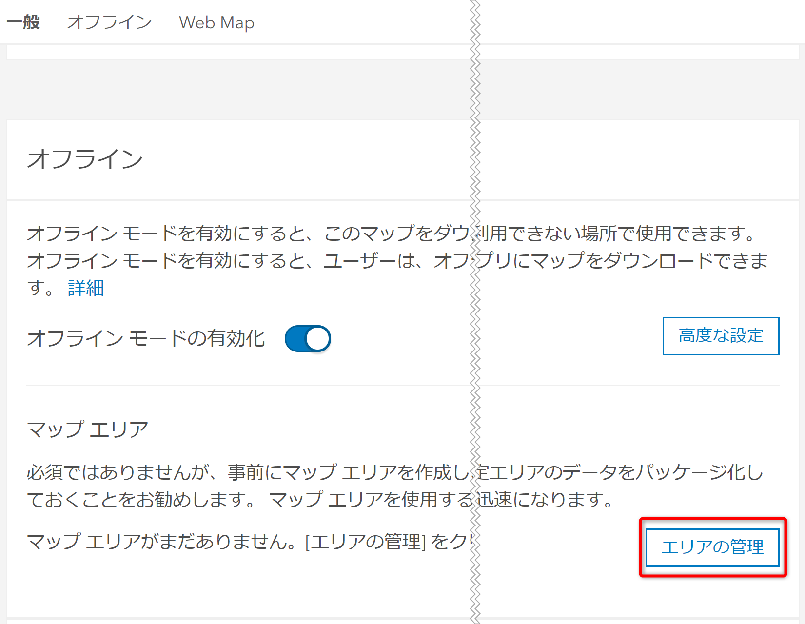
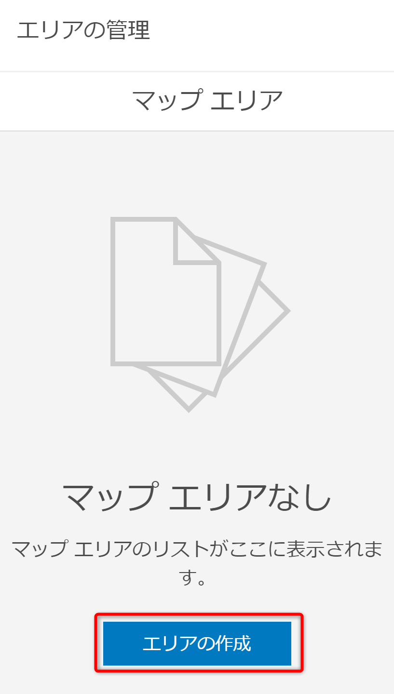
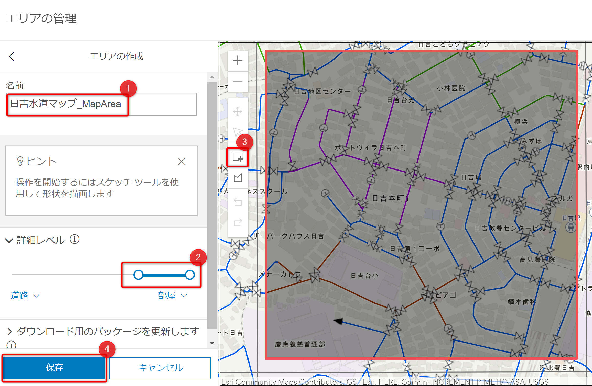
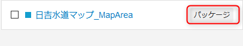
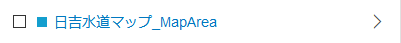
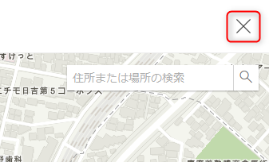

# ArcGIS Online の UI 操作によるオフライン エリアの作成

## 演習の目的
- ここでは、ArcGIS Online の UI 操作によるオフライン エリア作成の方法を習得します

## ArcGIS Online の UI でオフライン エリアを作成
1. ArcGIS Online にサインインし、[コンテンツ] をクリックして [マイ コンテンツ] の中から公開した Web マップをクリックします。

    

1. アイテム ページ右上の [設定] をクリックします。

   

1. 画面をスクロールし、[オフライン] の中の [エリアの管理] をクリックします。

   

1. エリアの作成ボタンをクリックします。

   
  
1. 作成するオフライン エリアの [名前] (①)、オフライン エリアとして切り出す [詳細レベル] (②) を設定します。 
  任意ですが、目安として次のように設定すれば良いでしょう。
    * 名前: 日吉水道マップ_MapArea
    * 詳細レベル: 建物 (複数) ～ 部屋 (複数)
  
    マップ上の描画アイコンをクリック (③) し、マップ上でマウスをドラッグして切り出す範囲を描画してください。 
    描画できたら [保存] をクリック (④) します。

    **※ 背景地図が表示されない場合は、[トラブル シュート](#背景地図が表示されない場合) を参照してください**

   

    オフライン エリアの作成が開始されますが、完全に作成が完了するまで数分かかります。
    作成中でも作成画面を閉じることが可能です。

1. オフライン エリアの作成が開始されますが、完全に作成が完了するまで数分かかります。 
  オフライン エリア名の横の [パッケージ] の文字が消えれば作成完了です。
  
    
    
    
  
  完了を待たずに画面右上の ☓ ボタンを押して作成画面を閉じて構いません。
  
    

* ここではArcGIS Online の UI からオフライン エリアを作成する方法を学びました。
* ArcGIS Pro をお持ちの方は、時間があれば [xxx]() へ進んで下さい

## 背景地図が表示されない場合
1. オフライン エリア作成画面右上の ☓ ボタンをクリックし、作成画面を閉じます。

    

1. 作成画面を終了後、Web

