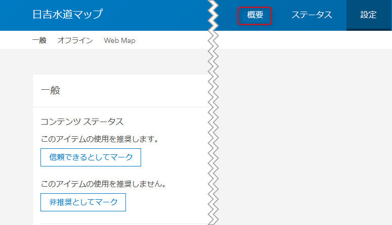
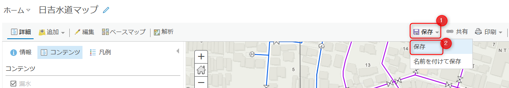

# ArcGIS Online の UI 操作によるオフライン エリアの作成

## 演習の目的
- ここでは、ArcGIS Online の UI 操作によるオフライン エリア作成の方法を習得します

## ArcGIS Online の UI でオフライン エリアを作成
1. ArcGIS Online にサインインし、[コンテンツ] をクリックして [マイ コンテンツ] の中から公開した Web マップをクリックします。

    

1. アイテム ページ右上の [設定] をクリックします。

   

1. 画面をスクロールし、[オフライン] の中の [エリアの管理] をクリックします。

   

1. エリアの作成ボタンをクリックします。

   
  
1. 作成するオフライン エリアの [名前] (①)、オフライン エリアとして切り出す [詳細レベル] (②) を設定します。 
  任意ですが、目安として次のように設定すれば良いでしょう。
    * 名前: 日吉水道マップ_MapArea
    * 詳細レベル: 建物 (複数) ～ 部屋 (複数)
  
    マップ上の描画アイコンをクリック (③) し、マップ上でマウスをドラッグして切り出す範囲を描画してください。 
    描画できたら [保存] をクリック (④) します。

    **※ マップに背景地図が表示されない場合、[保存] を押しても作成に失敗します。[背景地図が表示されない場合の対応方法](#背景地図が表示されない場合の対応方法) を参照してください**

    

    オフライン エリアの作成が開始されますが、完全に作成が完了するまで数分かかります。

1. オフライン エリアの作成が開始されますが、完全に作成が完了するまで数分かかります。 
  オフライン エリア名の横の [パッケージ] の文字が表示されている間は作成中です。
  
    
  
    表示が消えれば作成完了です。
  
    
  
    完了を待たずに画面右上の ☓ ボタンを押して作成画面を閉じても作成は継続されます。
  
    

## まとめ
このステップでは ArcGIS Online の UI からオフライン エリアを作成する方法を学びました。

ArcGIS Pro をお持ちの方は、時間があれば [ArcGIS API for Python と ArcGIS Pro SDK for .NET を使用したオフライン エリアの作成](offline_area_python_prosdk.md) へ進んで下さい。

**※ 何らかの原因でオフライン エリアの作成ができなかった場合も、以降のハンズオンで全体に共有している Web マップを使ってご参加いただけます。**

## 背景地図が表示されない場合の対応方法
1. オフライン エリア作成画面右上の ☓ ボタンをクリックし、作成画面を閉じます。

    

1. 画面を上にスクロールし、[概要]ボタンをクリックします。

    

1. サムネイル画像をクリックし、Web マップを開きます。

    

1. [保存] をクリックして Web マップを保存します。

    

1. [再度オフライン エリアの作成画面に戻り](#ArcGIS-Online-の-UI-でオフライン-エリアを作成)、オフライン エリアの作成をお試しください。
