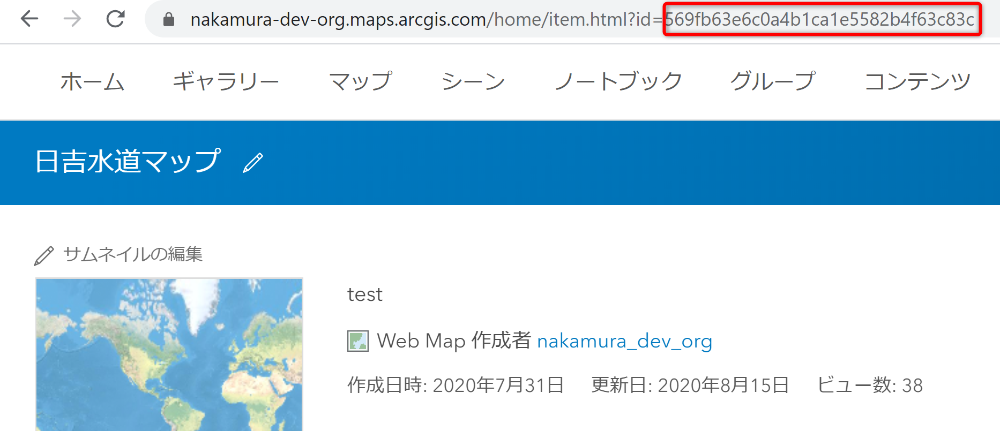
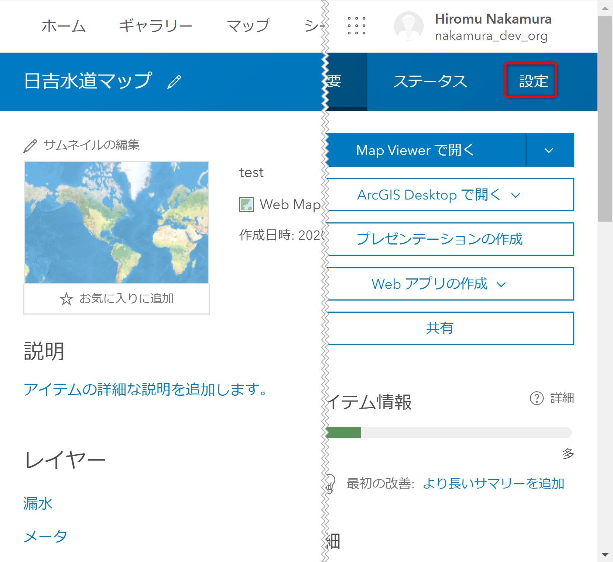

#  ArcGIS API for Python と ArcGIS Pro SDK for .NET を使用したオフライン エリアの作成

## 演習の目的
- ここでは、ArcGIS API for Python のスクリプトを ArcGIS Pro SDK for .NET でカスタマイズしたアドインから実行し、次の二点について理解を深めていただきます。
  - ArcGIS API for Python による Web GIS の操作
  - ArcGIS Pro SDK for .NET による業務ワークフローに合わせた ArcGIS Pro のカスタマイズ

※ このハンズオンは ArcGIS Pro をご利用いただいている方のみ実施いただきます。ArcGIS Online で参加されている方は、参考資料として御覧ください。

## 設定ファイルの編集

1. 環境構築時にダウンロードした[ハンズオンデータ](https://github.com/EsriJapan/workshops/blob/master/20200825_app-development-hands-on/Environment/README.md#%E3%83%87%E3%83%BC%E3%82%BF%E3%81%AE%E9%85%8D%E7%BD%AE)の EJWater\script\config フォルダにある「config.ini」をメモ帳で開きます。
    
    

1. 次の画像のように設定を編集します。

   

    ①: ハンズオン データを配置したパス 
    ②: ArcGIS Online のユーザー名とパスワード 
    ③: Web マップのアイテム ID 
    ④: ホスト フィーチャ レイヤーのサービス定義ファイルのアイテム ID 
    ⑤: 図郭_500 レイヤーのサービス URL 
    ⑥: 図郭_1000 レイヤーのサービス URL 

    ※: 青枠内は変更不要です
  
    * アイテム ID は Web GIS 上のアイテムを一意に識別する ID です。次の方法で確認できます。
      1. ArcGIS Online にサインインし、[コンテンツ] をクリックし、一覧から対象のアイテムをクリックし、アイテム ページを開きます。
      
         
      
      1. アイテム ページの URL の`id=`以降の英数字がアイテム IDです。コピーして設定ファイルに貼り付けてください。
      
        
      
      1. Web マップ、ホスト フィーチャ レイヤー、ホスト フィーチャ レイヤーのサービス定義ファイルをID を混同しないよう注意してください。
      
        
        
    * 2つの図郭レイヤーのサービス URL は、次の方法でそれぞれコピー、ペーストしてください
      1. ホスト フィーチャ レイヤーのアイテム ページを開き、画面をスクロールすると図郭_500と図郭_100レイヤーが表示されるので、クリックします。
      
        
    
      1. クリックしたレイヤーの詳細画面に切り替わるので、右側のサービス URL のコピーボタンをクリックし、設定ファイルに URL を貼り付けます。
        
        
  

## Web マップの設定

1. [コンテンツ] から作成した Web マップをクリックします。

   

1. アイテム ページ右上の [設定] をクリックします。

   

1. 画面をスクロールし、[オフライン モードの有効化] をクリックした後、[保存]をクリックします。

   

以上で Web マップにオフライン エリアを作成する準備が整いました。
次のステップでは設定を終えた Web マップからオフライン エリアを作成します。

時間がある方は [ArcGIS Online の UI 操作によるオフライン エリアの作成](offline_area_agol.md) へ進んでください。
