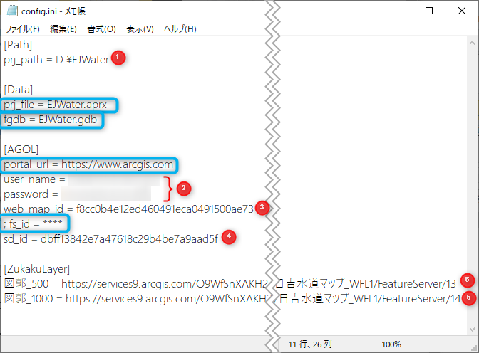

#  ArcGIS API for Python と ArcGIS Pro SDK for .NET を使用したオフライン エリアの作成

## 演習の目的
- ここでは、ArcGIS API for Python のスクリプトを ArcGIS Pro SDK for .NET でカスタマイズしたアドインから実行してオフライン エリアを作成することで、以下の 2 点について理解を深めていただきます。
  - ArcGIS API for Python による Web GIS の操作
  - ArcGIS Pro SDK for .NET による業務ワークフローに合わせた ArcGIS Pro のカスタマイズ

  ※ このハンズオンは ArcGIS Pro をご利用いただいている方のみ実施いただきます。ArcGIS Online で参加されている方は、参考資料として御覧ください。

## 設定ファイルの編集

1. 環境構築時にダウンロードした[ハンズオンデータ](https://github.com/EsriJapan/workshops/blob/master/20200825_app-development-hands-on/Environment/README.md#%E3%83%87%E3%83%BC%E3%82%BF%E3%81%AE%E9%85%8D%E7%BD%AE)の EJWater\script\config フォルダにある「config.ini」をメモ帳で開きます (他のテキスト エディターで開く場合は文字コードが自動で変換されないように注意してください)。
    
    

1. 次の画像のように設定を編集して保存します。

   

    ①: ハンズオン データを配置したパス</br>
    ②: ArcGIS Online のユーザー名とパスワード</br>
    ③: Web マップのアイテム ID</br>
    ④: ホスト フィーチャ レイヤーのサービス定義ファイルのアイテム ID</br>
    ⑤: 図郭_500 レイヤーのサービス URL</br>
    ⑥: 図郭_1000 レイヤーのサービス URL</br>

    ※: 青枠内は変更不要です
    
    アイテム ID については[アイテム ID の確認方法](#アイテム-ID-の確認方法)、レイヤーのサービス URL については[レイヤーのサービス URL の確認方法](#レイヤーのサービス-URL-の確認方法)をそれぞれ参照してください。

### アイテム ID の確認方法
アイテム ID は Web GIS 上のアイテムを一意に識別する ID です。次の方法で確認できます。
1. ArcGIS Online にサインインし、[コンテンツ] をクリックし、一覧から対象のアイテムをクリックし、アイテム ページを開きます。</br>
    
  
1. アイテム ページの URL の`id=`以降の英数字がアイテム IDです。コピーして設定ファイルに貼り付けてください。</br>
    

    ※ Web マップ(①)、ホスト フィーチャ レイヤー(②)、ホスト フィーチャ レイヤーのサービス定義ファイル(③)を混同して貼り付けるアイテム ID を間違えないように注意してください。</br>
    

### レイヤーのサービス URL の確認方法
2つの図郭レイヤーのサービス URL は、次の方法でそれぞれコピー、ペーストしてください
1. ArcGIS Online にサインインし、[コンテンツ] をクリックして、ホスト フィーチャ レイヤーをクリックします。</br>
    </br>
1. ホスト フィーチャ レイヤーのアイテム ページを開き、画面をスクロールすると図郭_500と図郭_100レイヤーが表示されるので、クリックします。</br>
    </br>
1. クリックしたレイヤーの詳細画面に切り替わるので、右側のサービス URL のコピーボタンをクリックし、設定ファイルに URL を貼り付けます。</br>
    

## ArcGIS Pro SDK for .NET で拡張したアドインを使用したオフライン エリアの作成
1. 設定ファイルを編集・保存したら EJWater フォルダにある EJWater.aprx をダブルクリックして ArcGIS Pro のプロジェクトを開きます。
    

1. ArcGIS Pro が開いたら画面上部の [オフラインデータ タブ] をクリックし、図郭_500 をコンボボックスから選択しましょう。

    

1. [図郭選択] をクリック後、マップ上で日吉駅付近の図郭をクリックして選択し、[オフラインデータ作成] をクリックします。

    

1. オフライン エリアの名前を入力し、作成をクリックします。確認のプロンプトが出るので、[はい] をクリックして作成を開始します。

    オフライン エリアの名前は ArcGIS Online の UI 操作で作成したものとは別の名前にしてください。

    

    作成には数分かかるので、[オフライン エリア作成の仕組み](#オフラインエリア作成の仕組み)を読んでどのような仕組みになっているか概要を把握しましょう。

## オフラインエリア作成の仕組み
ArcGIS Pro を ArcGIS Pro SDK for .NET を使って拡張し、[オフライン エリア] タブ内にあるカスタムのアドインを追加しています。

カスタムのアドインでは、選択した図郭の属性情報 (図郭固有の番号等) を取得し、Python スクリプトへパラメーターとして渡して実行します。

Python スクリプト内では ArcGIS API for Python を使用して、渡されたパラメーターに基づいて ArcGIS Online へオフライン エリア作成のリクエストを送っています。

  

使用している主な ArcGIS API for Python のモジュール、クラスは次のとおりです。

* 使用しているモジュール：[arcgis.mapping](https://developers.arcgis.com/python/api-reference/arcgis.mapping.toc.html#arcgis-mapping-module) モジュール
* 使用クラス:
  * [WebMap](https://developers.arcgis.com/python/api-reference/arcgis.mapping.toc.html#webmap) クラス
    * Web GIS 上の Web マップ アイテムを扱うためのクラス
  * [OfflineMapAreaManager](https://developers.arcgis.com/python/api-reference/arcgis.mapping.toc.html#offlinemapareamanager) クラス
    * Web マップのオフライン エリア管理用のヘルパー クラス
    * WebMap オブジェクトの offline_areas プロパティからアクセス

実装しているソース コードは少しもう少し複雑ですが、基本的には以下のようなコードでオフライン エリアを作成することが可能です。
```python
from arcgis.mapping import WebMap
from arcgis.gis import GIS

# Web GIS に接続して Web マップを取得
gis = GIS(url, username, password)
wm_item = gis.content.get('Web マップのアイテム ID')

# WebMap オブジェクトを作成
wm = WebMap(wm_item)

# 作成するオフライン エリアのアイテム プロパティ
item_prop = {'title': 'タイトル',
             'snippet': 'アイテム説明のサマリー',
             'tags': ['検索用のタグ1', '検索用のタグ2', '検索用のタグ3']}
             
# 作成するオフライン エリアのエクステント
# ※ Web マップのブックマークがあればブックマーク名で指定可能
target_area = wm.definition.bookmarks[-1]['name']

# OfflineMapAreaManager の create メソッドで作成
wm.offline_areas.create(area=target_area,
                        item_properties=item_prop)
```

ArcGIS Pro をカスタマイズすることで、ArcGIS Pro を業務ワークフローに合わせて拡張することができるほか、ArcGIS API for Python と組み合わせることで、ArcGIS Pro の UI 操作を介して ArcGIS Online の操作を実行することができます。

## まとめ
以上で ArcGIS API for Python と ArcGIS Pro SDK for .NET を使用したオフライン エリアの作成は終了です。

このステップでは ArcGIS Pro SDK for .NET を使ったアドインを利用して、ArcGIS API for Python を使った

時間がある方は、EJWater\script\src ディレクトリ内にある preplan.py を開き、ソース コードを確認してみましょう。
