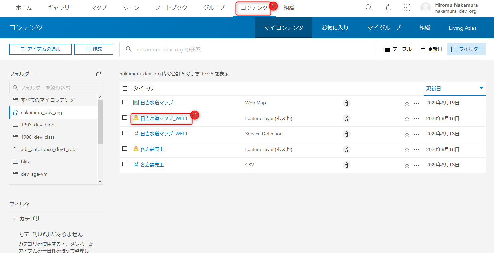
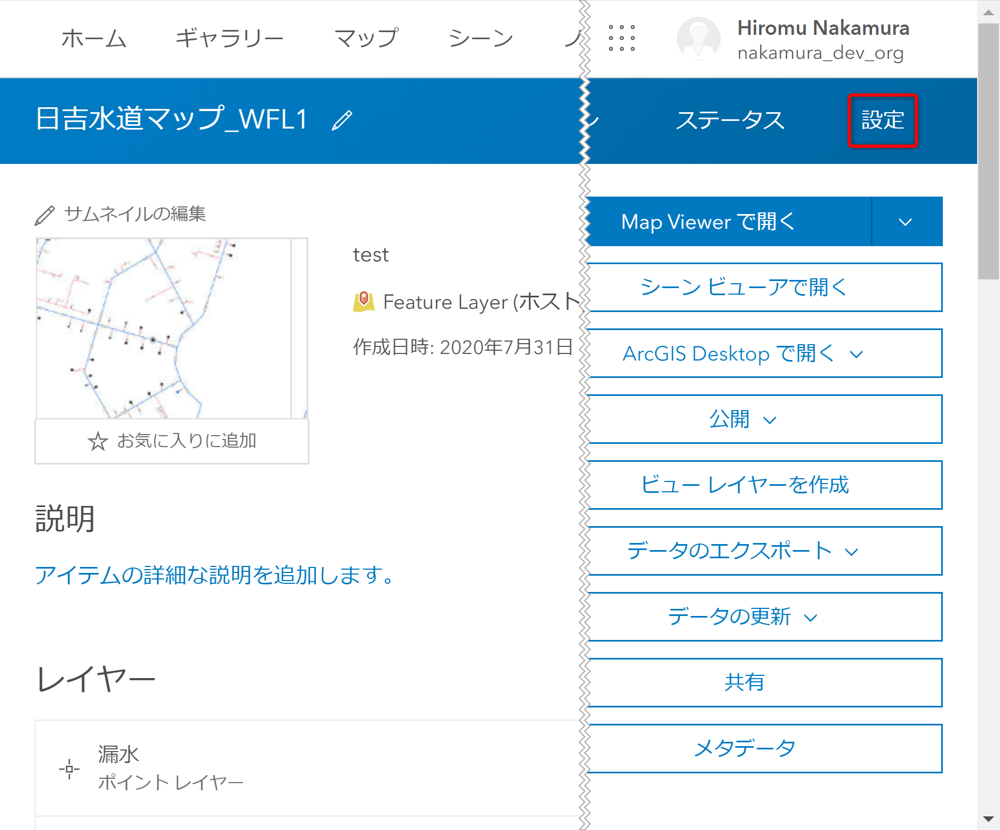
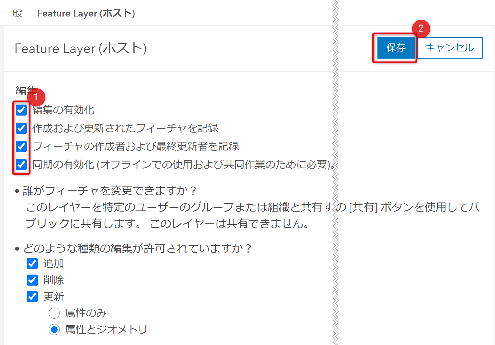
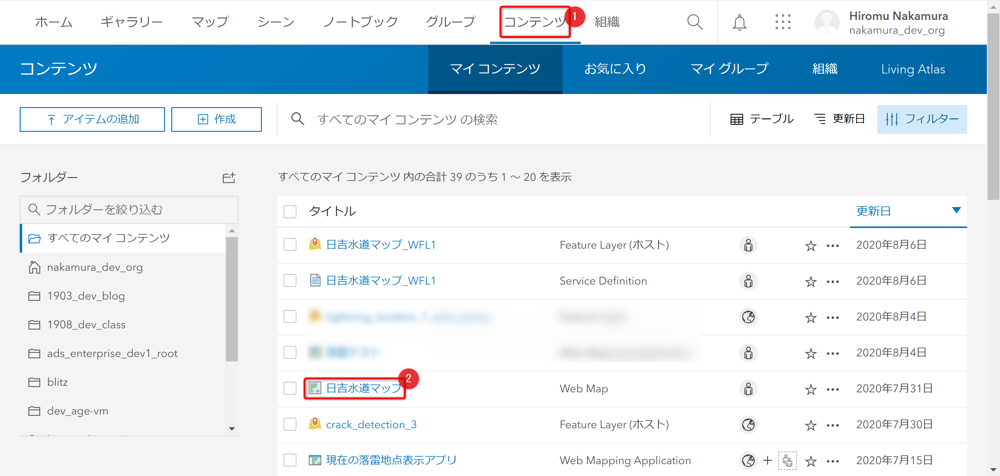
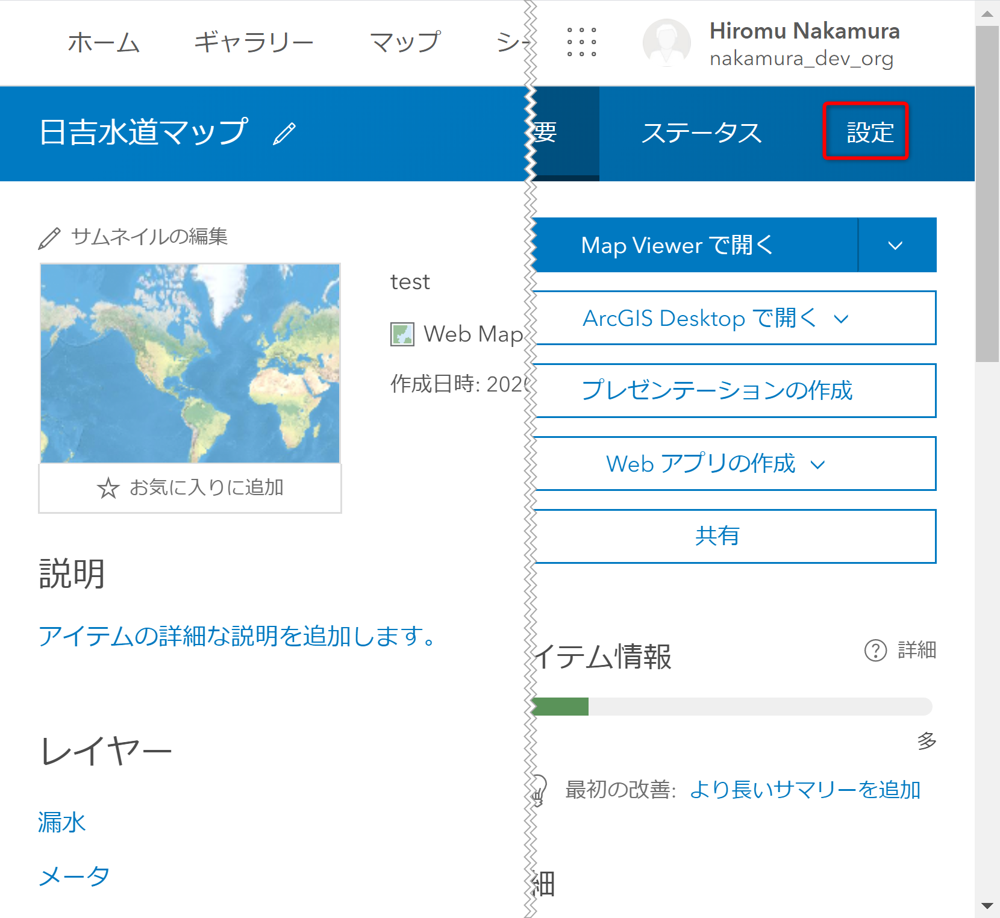
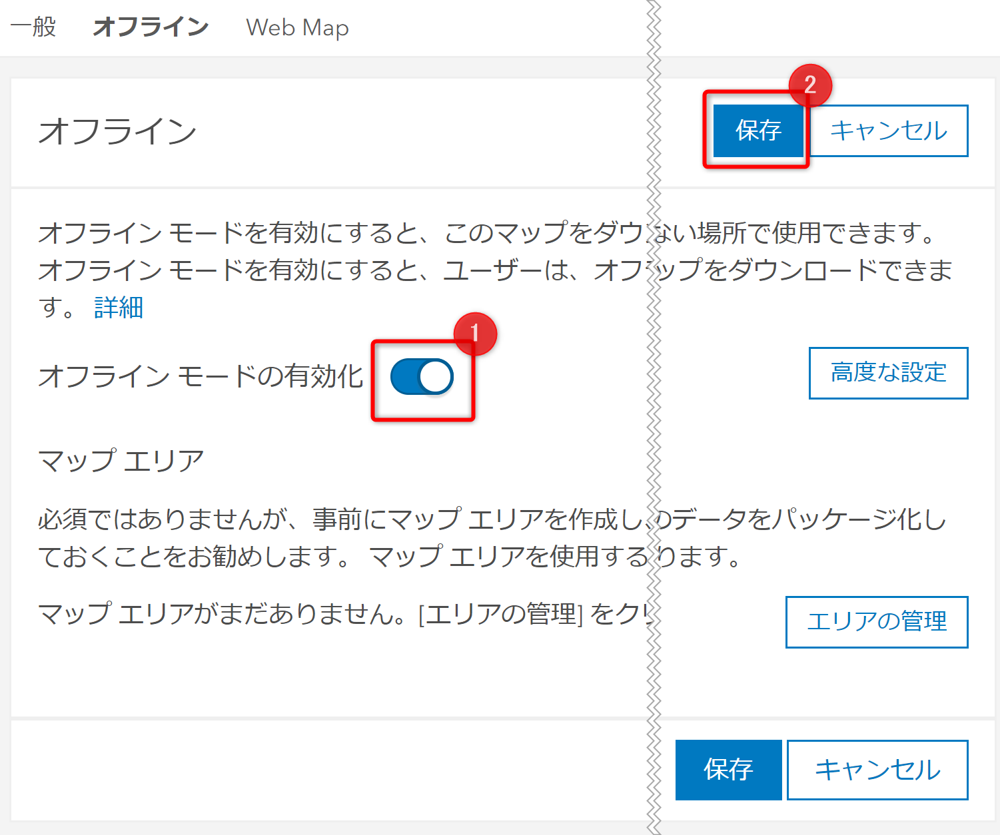

# ホスト フィーチャ レイヤーと Web マップの設定

## 演習の目的
- ここでは、Web マップにオフライン エリアを作成するための設定の方法を習得します

## ホスト フィーチャ レイヤーの設定

1. ArcGIS Online にサインインし、[コンテンツ] をクリックし、アイテムの一覧の中から今回作成したホスト フィーチャ レイヤーをクリックします。

     

1. ホスト フィーチャ レイヤーのアイテム ページが開いたら、右上の [設定] をクリックします。

   

1.  画面をスクロールし、[編集の有効化] 等のチェックボックスをクリックして有効化し、[保存] します。

    

    これで、ホスト フィーチャ レイヤーの編集や同期が有効化され、Web マップの設定でオフライン エリアを有効化することができるようになりました。

## Web マップの設定

1. [コンテンツ] から作成した Web マップをクリックします。

   

1. アイテム ページ右上の [設定] をクリックします。

   

1. 画面をスクロールし、[オフライン モードの有効化] をクリックした後、[保存]をクリックします。

   

以上で Web マップにオフライン エリアを作成する準備が整いました。

次のステップでは設定を終えた Web マップからオフライン エリアを作成します。

ArcGIS Online で Web マップを作成した方 (ArcGIS Pro をお持ちでない方) は [ArcGIS Online の UI 操作によるオフライン エリアの作成](offline_area_agol.md) へ進んでください。

ArcGIS Pro を使って Web マップを作成した方は [ArcGIS API for Python と ArcGIS Pro SDK for .NET を使用したオフライン エリアの作成](offline_area_python_prosdk.md) へ進んでください。
