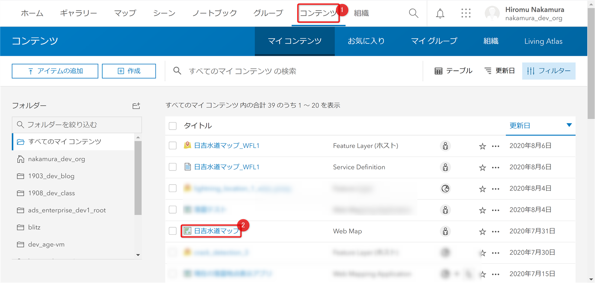

# ArcGIS API for Python を使用した現地調査用オフラインデータの作成

※ArcGIS Pro をお持ちでない方は[ArcGIS Online の UI によるオフラインデータの作成](https://url)をご参照ください。

## 演習の目的
1. ArcGIS API for Python を使うことで、スクリプトからオフライン エリア作成ができることを理解する
1. ArcGIS Pro SDK for .NET を使ったアドインでオフライン エリアを作成する

## ホスト フィーチャ レイヤーの設定

1. ArcGIS Online にサインインし、[コンテンツ] をクリック

     

1. アイテム ページ右上の [設定] をクリック

   

1.  画面をスクロールし、[編集の有効化] 等のチェックボックスをクリックして有効化し、[保存] する

    

    ホスト フィーチャ レイヤーの編集や同期が有効化され、Web マップでオフライン エリアを有効化することができるようになります。

## Web マップの設定

1. [コンテンツ] から公開した Web マップをクリック

   

1. アイテム ページ右上の [設定] をクリック

   

1. 画面をスクロールし、[オフライン モードの有効化] をクリック後、[保存]をクリック

   

以上で Web マップでオフライン エリアを作成する準備が整いました。

ArcGIS Online で Web マップを作成した方は [ArcGIS Online の UI 操作によるオフライン エリアの作成](offline_area_agol.md) へ進んでください。

ArcGIS Pro を使って Web マップを作成した方は [ArcGIS API for Python と ArcGIS Pro SDK for .NET を使用したオフライン エリアの作成](offline_area_python_prosdk.md) へ進んでください。
