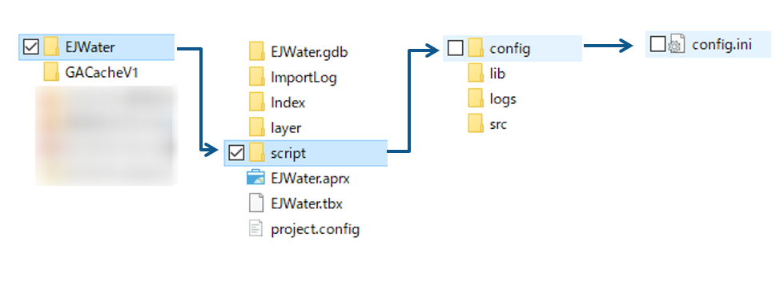
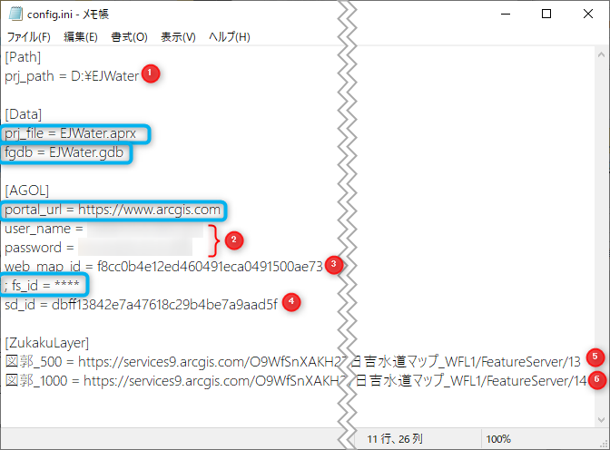
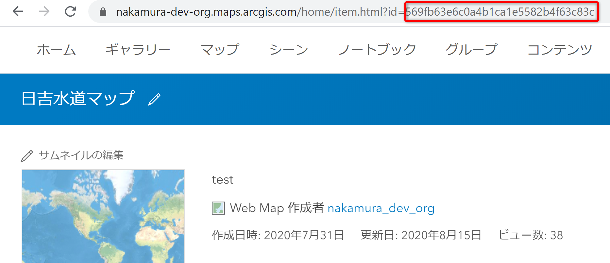
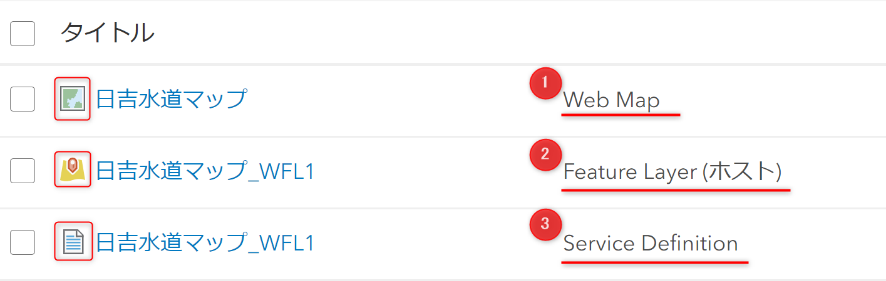
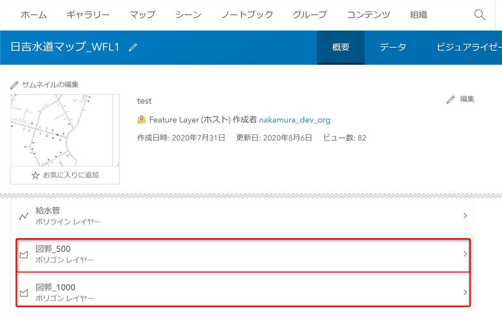
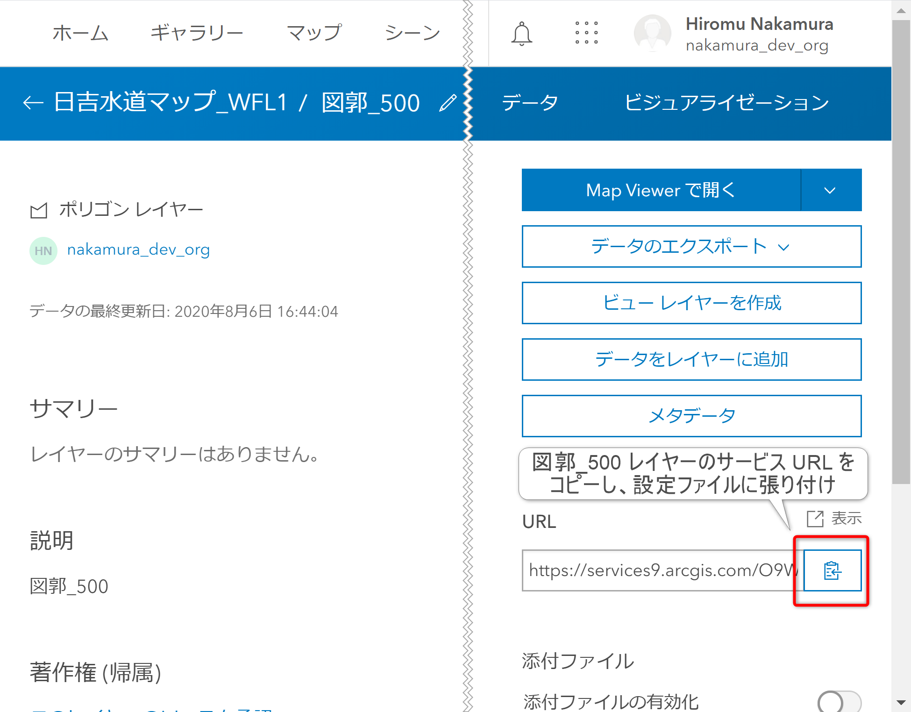

## 設定ファイルの編集

1. 環境構築時にダウンロードした[ハンズオンデータ](https://github.com/EsriJapan/workshops/blob/master/20200825_app-development-hands-on/Environment/README.md#%E3%83%87%E3%83%BC%E3%82%BF%E3%81%AE%E9%85%8D%E7%BD%AE)の EJWater\script\config フォルダにある「config.ini」をメモ帳で開きます。
    
    

1. 次の画像のように設定を編集して保存します。

   

    ①: ハンズオン データを配置したパス 
    ②: ArcGIS Online のユーザー名とパスワード 
    ③: Web マップのアイテム ID 
    ④: ホスト フィーチャ レイヤーのサービス定義ファイルのアイテム ID 
    ⑤: 図郭_500 レイヤーのサービス URL 
    ⑥: 図郭_1000 レイヤーのサービス URL 

    ※: 青枠内は変更不要です
    
    アイテム ID については[アイテム ID の確認方法](#アイテムIDの確認方法)、レイヤーのサービス URL については[レイヤーのサービス URL の確認方法](#レイヤーのサービスURLの確認方法)をそれぞれ参照してください。

### アイテムIDの確認方法
アイテム ID は Web GIS 上のアイテムを一意に識別する ID です。次の方法で確認できます。
1. ArcGIS Online にサインインし、[コンテンツ] をクリックし、一覧から対象のアイテムをクリックし、アイテム ページを開きます。 
    
  
1. アイテム ページの URL の`id=`以降の英数字がアイテム IDです。コピーして設定ファイルに貼り付けてください。 
    

    ※ Web マップ(①)、ホスト フィーチャ レイヤー(②)、ホスト フィーチャ レイヤーのサービス定義ファイル(③)を混同して貼り付けるアイテム ID を間違えないように注意してください。 
    

### レイヤーのサービスURLの確認方法
2つの図郭レイヤーのサービス URL は、次の方法でそれぞれコピー、ペーストしてください
1. ArcGIS Online にサインインし、[コンテンツ] をクリックして、ホスト フィーチャ レイヤーをクリックします。 
     
1. ホスト フィーチャ レイヤーのアイテム ページを開き、画面をスクロールすると図郭_500と図郭_100レイヤーが表示されるので、クリックします。 
     
1. クリックしたレイヤーの詳細画面に切り替わるので、右側のサービス URL のコピーボタンをクリックし、設定ファイルに URL を貼り付けます。 
    
