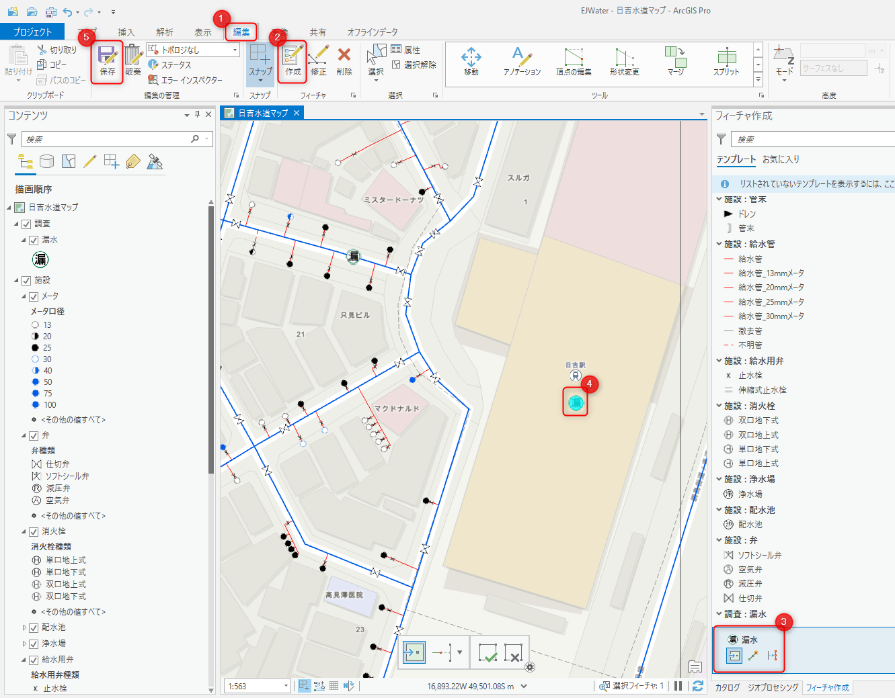

# ArcGIS Pro によるデータ編集

## 演習の目的
- ArcGIS Pro の編集機能を使ってローカルのファイル ジオデータベースにポイントを追加し、編集機能の基本的な利用方法を体験していただきます。

  ※ このハンズオンは ArcGIS Pro をご利用いただいている方のみ実施いただきます。ArcGIS Online で参加されている方は、参考資料として御覧ください。

## ArcGIS Pro によるデータ編集
1. 設定ファイルを編集・保存したら EJWater フォルダにある EJWater.aprx をダブルクリックして ArcGIS Pro のプロジェクトを開きます。

    

1. ArcGIS Pro が起動し、マップが表示されたら次の手順でポイント データを追加します。
    1. [編集] タブをクリック
    1. [作成] をクリック
    1. [フィーチャ作成] のペインが表示されるので、一番下までスクロールして [漏水] フィーチャをクリック
    1. 漏水ポイント フィーチャを追加できるようになるので、マップ上の任意の地点をクリックしポイントを作成
    1. [保存] をクリックして編集を保存
  
    

以上でポイント データを追加することができました。

## まとめ
このステップでは ArcGIS Pro の編集機能の基本的な使い方を体験いただきました。次のステップでは Python スクリプトを実行し、更新したデータを元に ArcGIS Online 上の既存のホスト フィーチャ レイヤーを更新します。

時間がある方は [Python スクリプトによるホスト フィーチャ レイヤーのアップデート](update_fl.md) へと進んでください。
