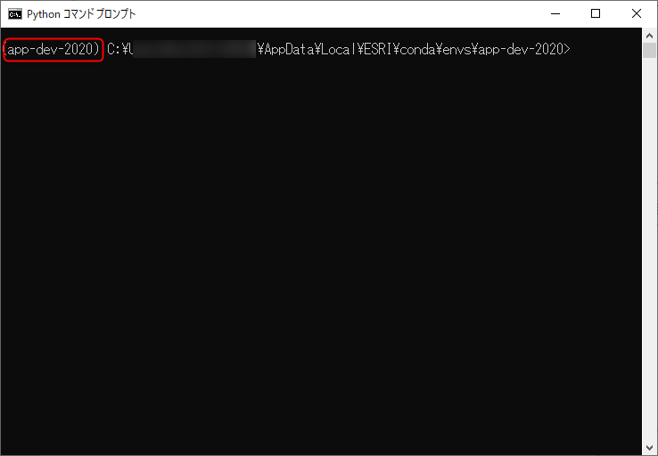

# Python スクリプトによるホスト フィーチャ レイヤーのアップデート 

## 演習の目的
- ここでは、事前に用意してある Python スクリプトを実行し、前のステップで編集したローカルのデータを元に、既存の ArcGIS Online 上のホスト フィーチャ レイヤーをアップデートします。演習を通じて次の事項について習得していただきます。
  - Python コマンド プロンプトの使用方法 (Python 環境の一覧取得・切り替え、カレント ディレクトリの移動、スクリプトの実行)
  - Python スクリプトによるホスト フィーチャ レイヤーの更新

## Python コマンド プロンプトの操作
Python コマンド プロンプトを起動すると、自動的に ArcGIS Pro が現在アクティブ化している Python 環境でコマンド プロンプトを開いてくれるため、ArcGIS Pro の Python 環境でスクリプトを実行したい場合は通常のコマンド プロンプトではなく、Python コマンド プロンプトを利用することをお勧めします。

1. Windows の [スタート] をクリックし、[ArcGIS]、[Python コマンド プロンプト] の順にクリックして Python コマンド プロンプトを起動します。

    

1. Python コマンド プロンプトが起動すると左端の () 内に現在アクティブになっている Python 環境名が表示されます。

    

1. 以下のコマンドを実行すると作成されている Python 環境の一覧が表示されます。

      `conda info -e`

1. 以下のコマンドを実行するとアクティブな Python 環境を切り替えることが可能です。

      `proswap 任意の環境名` (例: proswap arcgispro-py3)
      
      事前の環境構築の際に今回のハンズオン用に作成した環境に切り替えておきましょう。[環境構築手順](https://github.com/EsriJapan/workshops/tree/master/20200825_app-development-hands-on/Environment#arcgis-api-for-python-%E3%81%AE%E7%92%B0%E5%A2%83%E8%A8%AD%E5%AE%9A)に記載のとおり作成された場合、環境名は app-dev-2020 です。

## Python スクリプトの実行
事前に用意された Python スクリプトを実行します。
1. `cd` コマンドで EJWater\script\src にディレクトリを移動します。以下のコマンドは D ドライブにハンズオン データを配置した場合の例です。ご自身の任意のディレクトリにデータを配置した場合はそのディレクトリに移動してください。

    `d:`
    
    `cd EJWater\script\src`

1. ディレクトリを移動したら src ディレクトリ内にある web_map_sync_main.py ファイルを実行しましょう。

    `python web_map_sync_main.py`
    
    

    実行完了までしばらく時間がかかるので、余裕があればテキストエディタ等で src ディレクトリ内の web_map_sync.py ファイルを開き、ソースコードを確認してみましょう。
