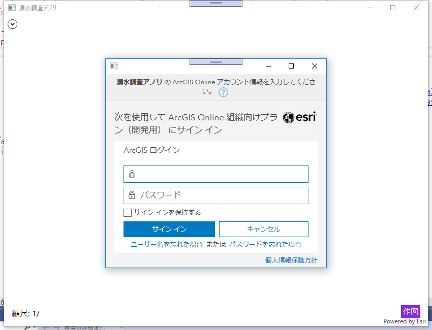
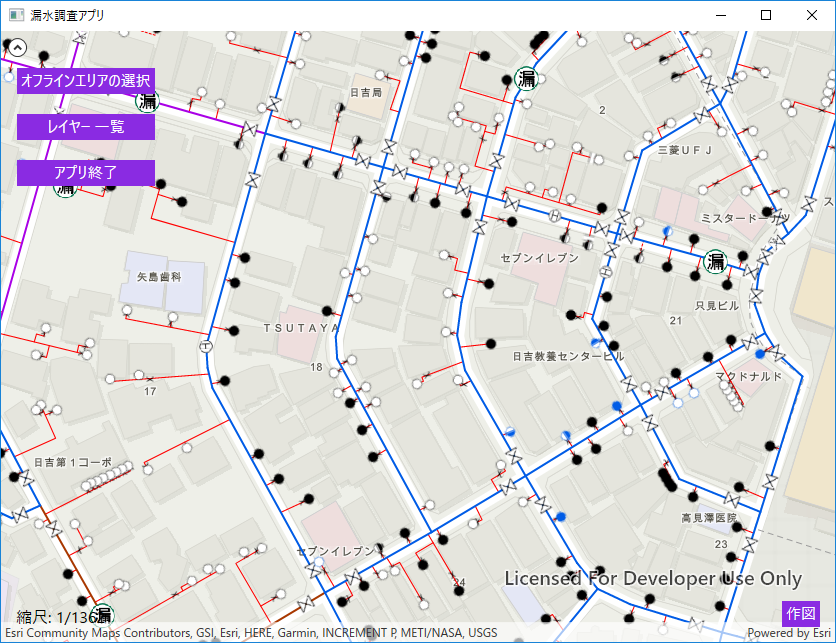
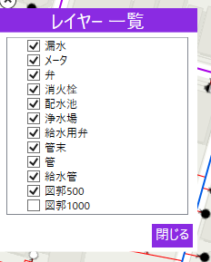
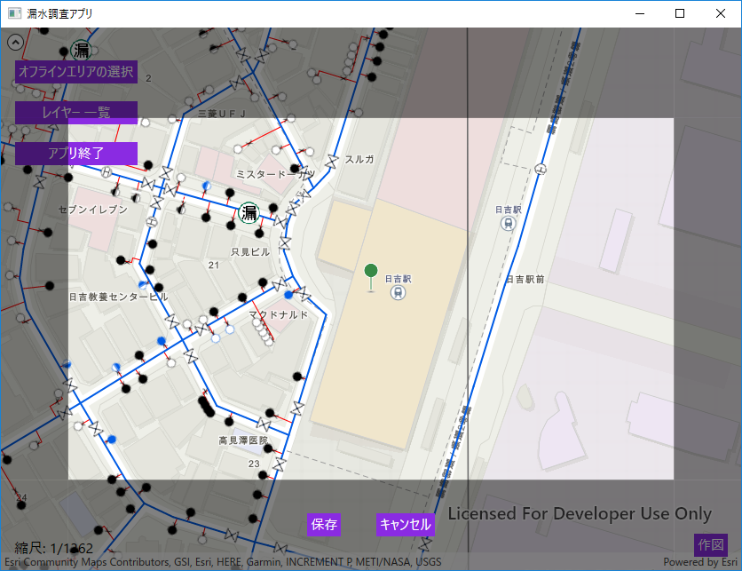
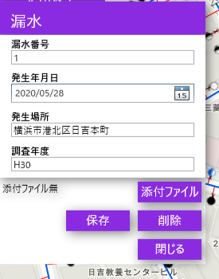
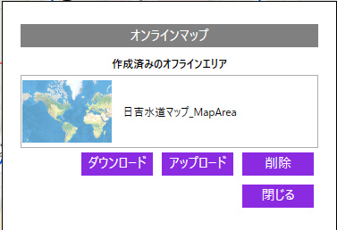

# 漏水調査アプリの機能説明

## はじめに
ハンズオンで使用するアプリケーションの機能について説明します。

## 機能
- ログイン機能
- 地図表示
- レイヤー一覧表示
- 漏水ポイントの作成・編集・削除
- オフラインの切替、同期、削除

### ログイン機能
アプリケーションを起動すると、以下のようなログイン画面が表示されます。  
ユーザー ID、パスワードを入力して、サインインボタンを押下するとアプリの利用が可能となります。  
※利用している Web マップやレイヤーがパブリックに公開されているデータの場合はログイン画面は表示されません。  

### 地図表示
最初に表示される画面です。  
オンライン、オフラインのモードがあり、前回アプリケーション終了時の状態により起動時の画面が異なります。  
この画面では次の機能を利用することができます。  

【画面左上に配置】
- オフラインエリアの選択ボタン：オフラインデータをダウンロード、同期、削除するパネルを表示する
- レイヤー一覧ボタン：レイヤーの一覧を表示するパネルを表示する
- アプリ終了ボタン：アプリケーションを終了する

【画面右下に配置】
- 作図ボタン：漏水ポイントを作図するための画面に切り替える

### レイヤー一覧表示
レイヤー一覧ボタンを押下されると表示される画面です。  
チェックボックスのオン、オフを変更することによって該当のレイヤーの表示/非表示を切り替えることができます。  

### 漏水ポイントの作成・編集・削除
作図ボタンを押下すると表示される画面です。  
保存ボタンを押下すると画面の中心に漏水ポイントを作成します。  
  

漏水ポイントの作成、または、マップに表示されているレイヤーをクリックすると表示されます。  
属性情報の入力、添付ファイルを保存したり、更新、削除することができます。  
※漏水ポイント以外はレイヤーをクリックした場合、読み取り専用となります。  

### オフラインの切替、同期、削除
オフラインエリアの選択ボタンを押下すると表示されます。  
オンラインモードとオフラインモードで挙動が異なります。  

【オンラインモード】  
- ダウンロード：選択したエリアをローカルにダウンロードする
- アップロード：選択したエリアをオンラインへ同期する
- 削除：選択したエリアをローカルから削除する

【オフラインモード】
- オンラインマップ：オフラインモードからオンラインモードへ切り替える

