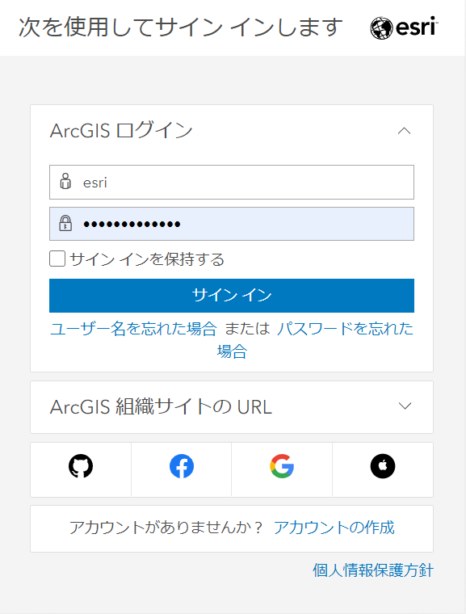
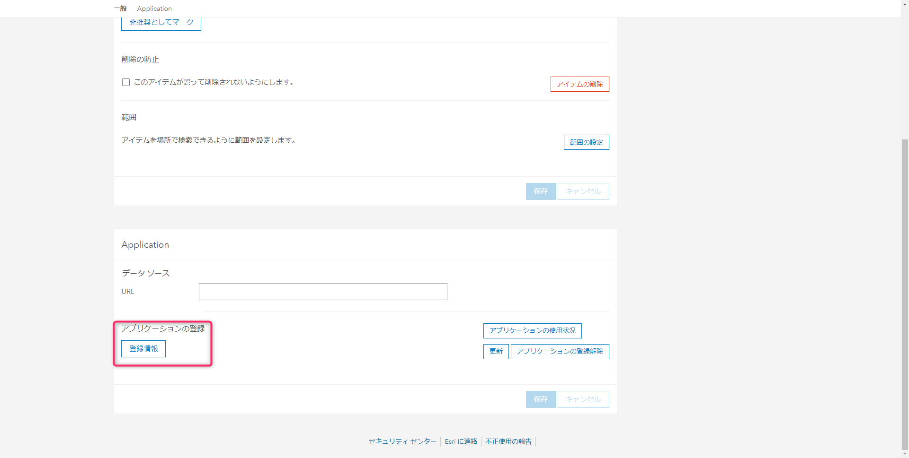
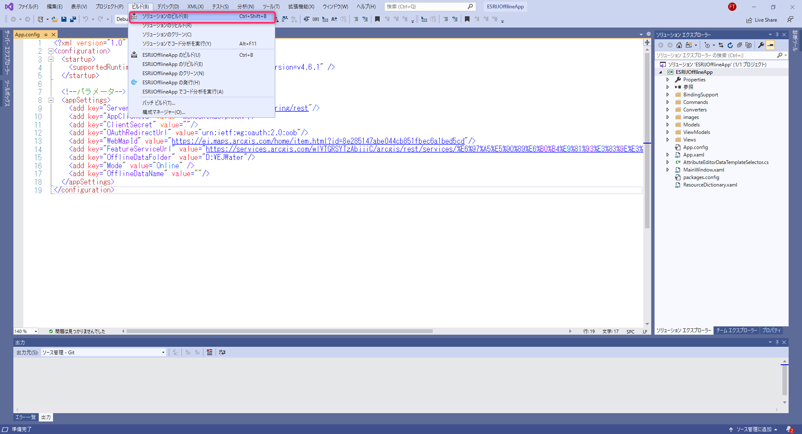

# ステップ 1 ：コンフィグの設定と起動確認

## 演習の目的
ステップ 1 では、ハンズオンで使用するアプリケーションが動作するために必要な AppConfig ファイルの設定とアプリケーションの起動の確認を行います。

## 手順
- ① アプリケーションのダウンロード
- ② コンフィグの設定
- ③ アプリケーションの起動確認

### ① アプリケーションのダウンロード
1. ハンズオンで使用するアプリケーションを以下よりダウンロードしてください。  
[Handson.zip](https://github.com/EsriJapan/workshops/raw/master/20200825_app-development-hands-on/Session/2_DevelopNativeApp/Handson.zip)

2. 任意の場所に配置して解凍する  
例：D：\ESRIJOfflineApp

### ② コンフィグの設定
アプリケーションの起動に必要な情報を「App.Config ファイル」に設定する必要があります。 App.Config ファイルの内容の確認と、設定に必要な情報を作成し、設定しましょう。

1. ① でダウンロードしたフォルダ内にある「ESRIJOfflineApp.sln」を起動します。    
<br>

2. ソリューションエクスプローラーから「App.Config ファイル」を開きます。  
<br>
「App.config ファイル」には、以下のパラメータが定義してあります。<br>
    - ServerUrl：ポータルのURL
    - AppClientId：アプリケーションID
    - ClientSecret：アプリケーションの秘密キー
    - OAuthRedirectUrl：リダイレクトURL
    - WebMapId：WebマップのURL
    - FeatureServiceUrl：FeatureServiceのURL
    - OfflineDataFolder：オフラインデータの保存フォルダパス
    - Mode：起動時のアプリケーションのモード（Online/Offline）
    - OfflineDataName：アプリケーション終了時に表示していたオフラインデータの名前  
以下より、パラメーターに必要な情報の作成と設定を行います。<br>

3. 「ServerUrl」を設定  
ServerUrl の Value にポータルのURLを設定する。  
例：<br>
    ```xml
    <add key="ServerUrl" value="https://www.arcgis.com/sharing/rest"/>
    ```  

4. 「AppClientID」、「OAuthRedirectUrl」を設定  
まずは、アプリケーションID と リダイレクトURLを発行します。<br>
    - [ArcGIS Online](https://www.esrij.com/products/arcgis-online/) にアクセスしてください。  
    <br>

    - ログイン情報を入力し、ArcGIS Online にログインしてください。  
    <br>

    - 画面上部の「コンテンツ」を押下します。  
    <br>

    - 「アイテムの追加」 > 「アプリケーション」を押下します。  
    <br>

    - 以下を入力し、「アイテムの追加」ボタンを押下します。  
      ・タイプ：アプリケーションにチェック  
      ・タイトル：漏水調査アプリ  
      ・タグ：開発塾  
    <br>

    - 登録したアプリ (漏水調査アプリ) の概要画面が開かれるので、設定タブを押下して設定画面に遷移する。  
    ※自動で移動しなかった場合はコンテンツ画面から漏水調査アプリのリンクをクリックする。  
    <br>

    - 設定画面の「Application」枠の「登録情報」ボタンを押下する。  
    <br>

    - 画面に「アプリケーションID」と「リダイレクトURL」が表示されます。  
    <br>

    上記で発行した「アプリケーションID」と「リダイレクトURL」を App.Config ファイルの「AppClientID」、「OAuthRedirectUrl」に設定します。  
    例：<br>
    ```xml
    <add key="AppClientId" value="pzXBDz3TutCDdA0C"/>
    <add key="OAuthRedirectUrl" value="esrijofflineapp://auth"/>
    ```

5. 「WebMapId」を設定  
作成済みのWebマップのURLを設定する。  
コンテンツ画面より今回使用する Web マップをクリックする。  
<br>
例：<br>
    ```xml
    <add key="WebMapId" value="https://ej.maps.arcgis.com/home/item.html?id=8e285147abe044cb851fbec6a1bed5cd"/>
    ```

6. 「FeatureServiceUrl」を設定  
    - Web マップの概要画面に表示されているレイヤーから任意のモノをクリックする。  
    <br>

    - FeatureLayer の概要ページが表示されるので、画面の右下にあるURLをコピーする。  
    <br>
    FeatureLayer の URL を App.config ファイルの「FeatureServiceUrl」に設定する。<br>
    例：<br>
        ```xml
        <add key="FeatureServiceUrl" value="https://services.arcgis.com/wlVTGRSYTzAbjjiC/arcgis/rest/services/%E6%97%A5%E5%90%89%E6%B0%B4%E9%81%93%E3%83%9E%E3%83%83%E3%83%97_WFL1/FeatureServer"/>
        ```   

7. 「OfflineDataFolder」と「Mode」に以下を設定する  
    - OfflineDataFolder：任意のフォルダ (今回は事前に作成している D:/EJWater) を設定  
    - Mode：Online を設定
    <br><br>
    すべて設定すると次のようなコンフィグになります。   
    

    ※「ClientSecret」、「OfflineDataName」は設定は不要です。


### ③ アプリケーションの起動確認
1. Visual Studio 2019画面の「ビルド」タブから「ソリューションのリビルド」を選択します。  
<br>

2. 「実行」を選択して、アプリケーションを起動します。  
<br>

3. 以下画面が起動すれば完了です。  
<br>

※時間がある方は、実際にログインして動作を確認してみてください。

## 次のステップ：
[Step2：ダウンロード機能の実装](./Step2.md)
