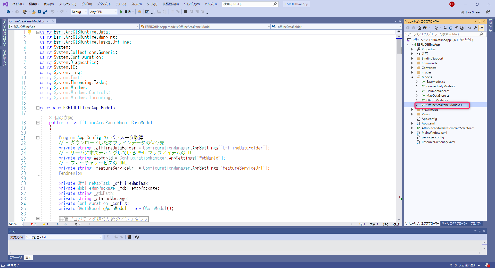

# ステップ 2 ：ダウンロード機能を実装

## 演習の目的
ステップ 2 では、オンラインで作成したプレプランのデータをダウンロードする機能を実装します。  


## 手順
- ① 概要の説明
- ② DownloadMapAreaAsync の実装

### ① 概要の説明
このステップではダウンロードボタン押下時に呼び出されるメソッド実装します。  
ステップ 1 で保存した「ESRIJOfflineApp」フォルダを開き、ソリューションファイル「ESRIJOfflineApp.sln」を起動します。  
  

ソリューションエクスプローラーから「ESRIJOfflineApp」→「Modelsフォルダ」→「OfflineAreaPanelModel.cs」を開きます。  
  

「OfflineAreaPanelModel.cs」ファイルにある以下のメソッドを実装します。  
```cs
private async Task DownloadMapAreaAsync(PreplannedMapArea mapArea, OfflineMapTask offlineMapTask)  
```

上記 DownloadMapAreaAsync メソッドにオフラインデータを扱うために必要な次のクラスを使用して処理を記述します。  
- OfflineMapTask クラス：マップをオフラインにするために使用されるタスク  
- DownloadPreplannedOfflineMapParameters クラス：ダウンロードJobで使用されるパラメータ  
- DownloadPreplannedOfflineMapJob クラス：オンラインマップからマップエリアをダウンロードするジョブ  

※DownloadMapAreaAsync メソッドの引数について 
- offlineMapTask：読込んだ Web マップから作成したオフラインタスクオブジェクト
- mapArea ：画面で選択したオフラインのエリア

補足：  
offlineMapTask クラスのインスタンスは Web マップを引数に作成することができます。
```cs
offlineMapTask = await OfflineMapTask.CreateAsync(Map);
```
プレプランのエリアは OfflineMapTask クラスの GetPreplannedMapAreasAsync メソッドを使用してプレプランエリアのリストを取得することができます。
```cs
IReadOnlyList<PreplannedMapArea> preplannedAreas = await offlineMapTask.GetPreplannedMapAreasAsync();
```

それでは、次の手順より実際にコードを記述してメソッドを完成させます。


### ② DownloadMapAreaAsync の実装
1. はじめにダウンロードするエリアが選択されているかチェックする処理を記述します。  
    ```cs
    if (mapArea == null)
    {
        MessageBox.Show("ダウンロードするエリアを選択してください。");
        return;
    }
    ```

2. UI を処理中画面に変更します。  
    ```cs
    // ダウンロード用のUIを設定します。
    BusyIndicatorVisibility = true;
    OnPropertyChanged(nameof(BusyIndicatorVisibility));
    ```

3. 既にダウンロード済みのモバイル マップ パッケージがあればそれを開きます。  
※コードに出てくる アンダースコア ( _ ) が先頭についている変数はクラス変数です。 
    ```cs
    // マップ パッケージをダウンロードするフォルダ パスを作成します。
    string path = System.IO.Path.Combine(_offlineDataFolder, mapArea.PortalItem.Title);

    // 既にダウンロードされている場合は、そのエリアを開きます。
    if (Directory.Exists(path))
    {
        try
        {
            // ダウンロード済みのモバイルマップパッケージを開きます。
            _mobileMapPackage = await MobileMapPackage.OpenAsync(path);

            // マップを表示.
            _mapDataStore.OfflineMap = _mobileMapPackage.Maps.First();
            Map = _mapDataStore.OfflineMap;

            // UIを更新します。
            BusyIndicatorVisibility = false;
            OnPropertyChanged(nameof(BusyIndicatorVisibility));

            // 現在のモードをコンフィグに記載
            ConfigSet(ConnectivityMode.Offline, mapArea.PortalItem.Title);
            return;
        }
        catch (Exception e)
        {
            Debug.WriteLine(e);
            MessageBox.Show(e.Message, "Couldn't open offline area. Proceeding to take area offline.");
        }
    }
    ```

4. パラメータを作成  
オフラインのマップのダウンロードに必要なパラメータを作成します。  
DownloadPreplannedOfflineMapParameters クラスに OfflineMapTask クラスの CreateDefaultDownloadPreplannedOfflineMapParametersAsync メソッドを渡すことで作成できます。CreateDefaultDownloadPreplannedOfflineMapParametersAsync メソッドの引数はダウンロードするプレプランのエリアです。
    ```cs
    // ダウンロードパラメータを作成します。
    DownloadPreplannedOfflineMapParameters parameters = await offlineMapTask.CreateDefaultDownloadPreplannedOfflineMapParametersAsync(mapArea);

    // アップデートモードを設定
    parameters.UpdateMode = PreplannedUpdateMode.SyncWithFeatureServices;
    ```

5. ジョブを作成する
OfflineMapTask クラスのDownloadPreplannedOfflineMap メソッドを実行してプレプランで作成したオフラインエリアのデータをダウンロードします。
    ```cs
    // ジョブの作成
    DownloadPreplannedOfflineMapJob job = offlineMapTask.DownloadPreplannedOfflineMap(parameters, path);
    ```

6. ジョブを実行する
DownloadPreplannedOfflineMapJobクラス の GetResultAsync メソッドを実行します。  
完了すると、DownloadPreplannedOfflineMapResult クラスのインスタンスを返します。  
DownloadPreplannedOfflineMapResult クラスの HasErrors プロパティを使用して判定を行いオフラインマップの表示までの処理を実行します。  
※HasErrors プロパティは成功した場合、true になります。
    ```cs
    try
    {
        // エリアのダウンロード
        DownloadPreplannedOfflineMapResult results = await job.GetResultAsync();

        // モバイルマップパッケージをセットします
        _mobileMapPackage = results.MobileMapPackage;
        _mapDataStore.OfflineMap = _mobileMapPackage.Maps.First();

        // エラーがあれば処理してマップを表示します
        if (results.HasErrors)
        {
            // Accumulate all layer and table errors into a single message.
            string errors = "";

            foreach (KeyValuePair<Layer, Exception> layerError in results.LayerErrors)
            {
                errors = $"{errors}\n{layerError.Key.Name} {layerError.Value.Message}";
            }

            foreach (KeyValuePair<FeatureTable, Exception> tableError in results.TableErrors)
            {
                errors = $"{errors}\n{tableError.Key.TableName} {tableError.Value.Message}";
            }

            // Show the message.
            MessageBox.Show(errors, "Warning!");
        }

        // ダウンロードした地図を表示
        Map = _mapDataStore.OfflineMap;

        // 現在のモードをコンフィグに記載
        ConfigSet(ConnectivityMode.Offline, mapArea.PortalItem.Title);
    }
    catch (Exception ex)
    {
        // Report any errors.
        Debug.WriteLine(ex);
        MessageBox.Show(ex.Message, "Downloading map area failed.");
    }
    finally
    {
        BusyIndicatorVisibility = false;
        OnPropertyChanged(nameof(BusyIndicatorVisibility));                
    }
    ```
以上がダウンロード機能の実装となります。  

漏水調査アプリを実行して動作を確認してみてください。  
アプリケーションの機能については、[Step0：漏水調査アプリの機能説明](./Step0.md) に記載しています。


オフラインデータのダウンロードについては以下のサイトに詳細な情報が記載されています。  

ArcGIS Developers サイト：[プレプランエリアのダウンロードについて](https://developers.arcgis.com/net/latest/wpf/guide/take-map-offline-preplanned.htm#ESRI_SECTION1_3DDECBD085704E5391FF072F32AB1CDB)


## 次のステップ：
[Step3：アップロード機能の実装](./Step3.md)
