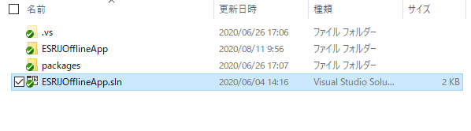

# ステップ 3 ：アップロード機能を実装

## 演習の目的
ステップ 3 では、オフラインで編集したデータをオンラインに同期する機能を実装します。  


## 手順
- ① 概要の説明
- ② OfflineMapUp の実装

### ① 概要の説明
このステップではアップロードボタン押下時に呼び出されるメソッドを実装します。
ステップ 3 同様に「ESRIJOfflineApp」フォルダを開き、ソリューションファイル「ESRIJOfflineApp.sln」を起動します。  
  

ソリューションエクスプローラーから「ESRIJOfflineApp」→「Modelsフォルダ」→「OfflineAreaPanelModel.cs」を開きます。  
  

「OfflineAreaPanelModel.cs」ファイルにある以下の OfflineMapUp メソッドを実装します。  
```cs
public async Task OfflineMapUp(PreplannedMapArea mapArea)  
```

上記 OfflineMapUp メソッドにオフラインデータを同期するために必要な次のクラスを使用して処理を記述します。  
- OfflineMapSyncTask クラス：オフラインマップのジオデータベースと元のサービスとの同期に関連するメソッドを持つタスク  
- OfflineMapSyncParameters クラス：OfflineMapSyncJobの作成に使用されるパラメーター  
- OfflineMapSyncJob クラス：オフラインマップのジオデータベースを元のサービスと同期するジョブ

※OfflineMapUp メソッドの引数について 
- mapArea ：画面で選択したオフラインのエリア

それでは、次の手順より実際にコードを記述してメソッドを完成させます。

### ② OfflineMapUp の実装
1. はじめにアップロードするエリアが選択されているかチェックする処理を記述します。
    ```cs
    if (mapArea == null)
    {
        MessageBox.Show("アップロードするエリアを選択してください。");
        return;
    }
    ```

2. マップの同期処理を次のような手順で実行します。
    - OfflineMapSyncTask を作成します。  
    - OfflineMapSyncParametersオブジェクトを作成します。  
    - タスク上で SyncOfflineMap を呼び出し、定義したパラメータオブジェクトを渡して OfflineMapSyncJob を作成します。  
    - OfflineMapSyncJob.JobChanged イベントを処理して、ジョブのステータスを監視します。  
    - OfflineMapSyncJob.Startを呼び出して、同期ジョブを開始します。

    ```cs
    // マップ パッケージをダウンロードするフォルダ パスを作成します。
    string path = System.IO.Path.Combine(_offlineDataFolder, mapArea.PortalItem.Title);

    if (Directory.Exists(path))
    {
        // MainWindow  Busy パネル のステータスを変更
        BusyIndicatorVisibility = true;
        OnPropertyChanged(nameof(BusyIndicatorVisibility));

        // ダウンロード済みのモバイルマップパッケージを開きます。
        _mobileMapPackage = await MobileMapPackage.OpenAsync(path);

        // マップオブジェクト作成
        Map upMap = _mobileMapPackage.Maps.First();

        // 新しいオフライン マップ同期タスクの作成
        OfflineMapSyncTask offlineMapSyncTask = await OfflineMapSyncTask.CreateAsync(upMap);

        // オフライン マップ同期パラメータの作成
        OfflineMapSyncParameters parameters = new OfflineMapSyncParameters
        {
            RollbackOnFailure = true,
            SyncDirection = SyncDirection.Bidirectional
        };

        // 同期パラメータを使用して同期ジョブのインスタンスを作成します。
        OfflineMapSyncJob offlineMapSyncJob = offlineMapSyncTask.SyncOfflineMap(parameters);

        // ジョブステータスを通知するためのリスナーを作成
        offlineMapSyncJob.JobChanged += (s, e) =>
        {
            // ジョブステータスの変更を報告する
            if (offlineMapSyncJob.Status == Esri.ArcGISRuntime.Tasks.JobStatus.Succeeded)
            {
                // 同期成功
                _statusMessage = "同期が完了しました。";
                BusyIndicatorVisibility = false;
                OnPropertyChanged(nameof(BusyIndicatorVisibility));
                MessageBox.Show(_statusMessage);
                // 現在開いているモバイルパッケージを閉じます。
                _mobileMapPackage?.Close();
            }
            else if (offlineMapSyncJob.Status == Esri.ArcGISRuntime.Tasks.JobStatus.Failed)
            {
                // 同期失敗
                _statusMessage = offlineMapSyncJob.Error.Message;
                BusyIndicatorVisibility = false;
                OnPropertyChanged(nameof(BusyIndicatorVisibility));
                MessageBox.Show(_statusMessage);
                // 現在開いているモバイルパッケージを閉じます。
                _mobileMapPackage?.Close();
            }
            else
            {
                _statusMessage = "Sync in progress ...";
            }
        };

        // 同期開始
        offlineMapSyncJob.Start();                
    }
    else
    {
        MessageBox.Show("アップロードするデータがありません。");
    }
    ```

以上がアップロード機能の実装となります。  

漏水調査アプリを実行して動作を確認してみてください。  
アプリケーションの機能については、[Step0：漏水調査アプリの機能説明](./Step0.md) に記載しています。  
※アップロードボタンはオンラインモードでのみ活性化する仕様としています。  
前回オフラインモードアプリを終了した場合、オフラインモードで起動しますので、オンラインモードに切り替えてアップロード機能を確認してください。  


オフラインデータのアップロードについては以下のサイトに詳細な情報が記載されています。  

ArcGIS Developers サイト：[オフライン編集の同期](https://developers.arcgis.com/net/latest/wpf/guide/sync-offline-edits.htm)


## 次のステップ：
[Step4：削除機能の実装](./Step4.md)
