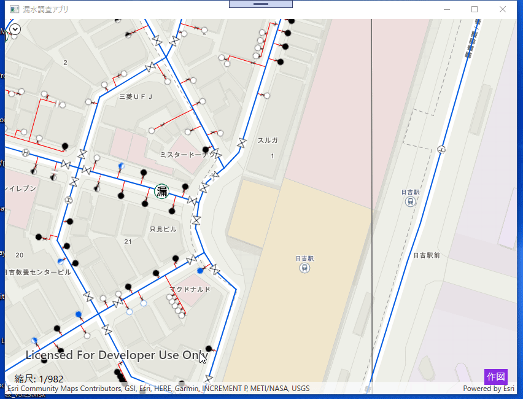

# ステップ 4 ：削除機能を実装

## 演習の目的
ステップ 4 ではローカルにダウンロードしたオフラインデータを削除する機能を実装します。


## 手順
- ① 概要の説明
- ② DeleteMapAreasAsync の実装

### ① 概要の説明
このステップでは削除ボタン押下時に呼び出されるメソッドを実装します。
ステップ 2 同様に「ESRIJOfflineApp」フォルダを開き、ソリューションファイル「ESRIJOfflineApp.sln」を起動します。  
  

ソリューションエクスプローラーから「ESRIJOfflineApp」→「Modelsフォルダ」→「OfflineAreaPanelModel.cs」を開きます。  
  

「OfflineAreaPanelModel.cs」ファイルにある以下のメソッドを実装します。  
```cs
private async Task DeleteMapAreasAsync(PreplannedMapArea mapArea)  
```

上記 DeleteMapAreasAsync メソッドにオフラインデータを削除するために必要な次のクラスを使用して処理を記述します。  
- GeodatabaseSyncTask クラス：FeatureService からオフライン データを生成して同期するタスク  

DeleteMapAreasAsync メソッドの引数について 
- mapArea ：画面で選択したオフラインのエリア

それでは、次の手順より実際にコードを記述してメソッドを完成させます。

### ② DeleteMapAreasAsync の実装
1. はじめに削除するするオフラインデータが選択されているかチェックする処理を記述します。
    ```cs
    if (mapArea == null)
    {
        MessageBox.Show("削除するエリアを選択してください。");
        return;
    }
    ```
2. オフラインデータの削除処理を次のような手順で実行します。
    - GeodatabaseSyncTask クラスのインスタンスを作成します。  
    - GeodatabaseSyncTask クラスの UnregisterGeodatabaseAsync メソッドを使って同期を解除します。  
    - モバイル マップ パッケージを閉じます。  
    - ローカルに保存されているモバイル マップ パッケージを削除します。  
    ```cs
    try
    {            
        // 削除するマップ パッケージフォルダ パスを作成します。
        string path = System.IO.Path.Combine(_offlineDataFolder, mapArea.PortalItem.Title);

        if (Directory.Exists(path))
        {
            // MainWindow  Busy パネル のステータスを変更
            BusyIndicatorVisibility = true;
            OnPropertyChanged(nameof(BusyIndicatorVisibility));

            string[] mgdb = Directory.GetFiles(path, "*.geodatabase", SearchOption.AllDirectories);

            // オンライン フィーチャ サービスを使用して、新しい GeodatabaseSyncTask を作成します。
            GeodatabaseSyncTask gdbSyncTask = await GeodatabaseSyncTask.CreateAsync(new Uri(_featureServiceUrl));

            _localGeodatabase = await Geodatabase.OpenAsync(mgdb[0]);

            // サービスから生成されたローカル ジオデータベースの登録を解除します。
            await gdbSyncTask.UnregisterGeodatabaseAsync(_localGeodatabase);
            _localGeodatabase.Close();

            // 開いているモバイルマップパッケージを閉じる
            _mobileMapPackage?.Close();

            // フォルダに保存されている該当のマップパッケージを削除する
            Directory.Delete(path, true);

            // 現在のモードをコンフィグに記載
            ConfigSet(ConnectivityMode.Online, "");

            MessageBox.Show("削除が完了しました。");
        }
        else
        {
            MessageBox.Show("選択されたオフラインデータはありません。");
            return;
        }                
    }
    catch (Exception ex)
    {
        // エラーメッセージ
        MessageBox.Show(ex.Message, "Deleting map area failed.");
    }
    finally
    {
        BusyIndicatorVisibility = false;
        OnPropertyChanged(nameof(BusyIndicatorVisibility));
    }
    ```

以上が削除機能の実装となります。  

漏水調査アプリを実行して動作を確認してみてください。  
アプリケーションの機能については、[Step0：漏水調査アプリの機能説明](./Step0.md) に記載しています。


オフラインデータの削除については以下のサイトに詳細な情報が記載されています。  

ArcGIS Developers サイト：[ジオデータベースの登録を解除する](https://developers.arcgis.com/net/latest/wpf/guide/finish-using-an-offline-map.htm)

## まとめ：
Step2 ～ Step4 でプレプランのデータを活用したオフラインアプリに必要な実装について学習しました。  
オフラインアプリを作成する際の基本はこれらのステップで活用したコーディングで実現できるので、各自で必要な機能を盛り込みオフラインで活用できるアプリケーションを作成してください。  

