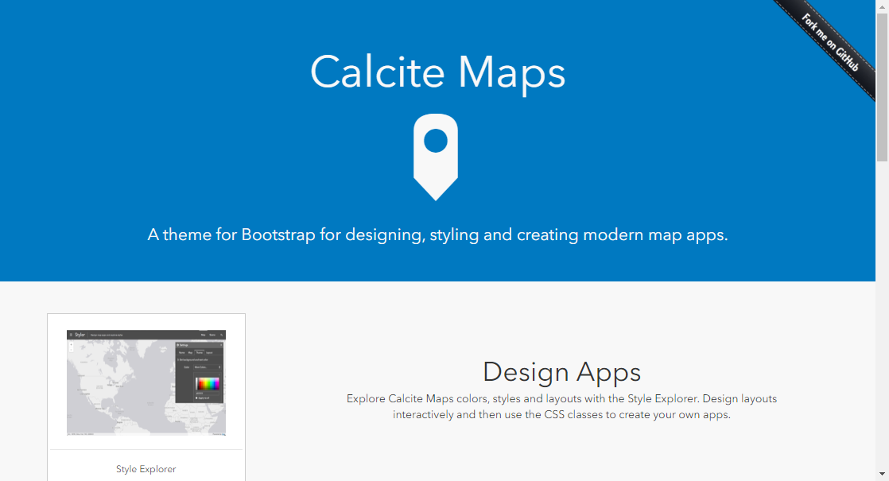

# ArcGIS プラットフォームを活用した Web アプリ開発ハンズオン 

## 目的
Calcite Map と ArcGIS API for JavaScript を使用してウィジェット開発​を行います。

## 流れ

- [Step1：ハンズオンの準備](#Step1：ハンズオンの準備)
  - 開発環境へのソースの配置

- [Step2：地図メイン部の実装](#Step2：地図メイン部の実装)
  - Web マップの設定

- [Step3：標準ウィジェットの実装](./Step3#Step3：標準ウィジェットの実装)
  - 標準ウィジェットを活用したウィジェット作成

* [Step4：概観図の実装](./Step4#Step4：概観図の実装)
  * 概観図を表示するウィジェットを作成

* [Step5：属性検索の実装](./Step5#Step5：属性検索の実装)
  * 属性検索用のウィジェットを作成
  * フィーチャ テーブル ウィジェットに検索結果を表示

## Calcite Map とは？​
Esri がオープンソースとして提供しており、Bootstrap を使用しているため、レスポンシブでモダンなマップアプリを開発することができます。

||
|:-:|

http://esri.github.io/calcite-maps/samples/index.html

## ArcGIS API for JavaScript が提供するウィジェットについて​
ウィジェットとは、ArcGIS API for JavaScript が提供している GIS 機能を兼ね備えた UI コンポーネントです。  
ArcGIS API for JavaScript では、GIS でよく使用するウィジェットを標準で幾つか提供しているので、ウィジェットを活用することで GIS の機能と同時にリッチな UI を Web マッピングアプリケーションに簡単に組み込むことができます。

詳細は、GeoNet ブログ [続編-はじめてのweb-マッピングアプリケーション開発-ウィジェット編](
https://community.esri.com/docs/DOC-14692)をご参照ください。 

## Step1：ハンズオンの準備
### 1. 開発の準備

開発には、Visual Studio Code を使用し、拡張機能の Live Server を使用します。開発環境の構築には、環境構築の [ArcGIS プラットフォームを活用したWebアプリ開発ハンズオン](https://github.com/EsriJapan/workshops/tree/master/20200825_app-development-hands-on/Environment)をご参照ください。

### 2. アプリの配置

[本ハンズオンで使用するアプリはこちらでダウンロードできます](https://github.com/EsriJapan/workshops/tree/master/20200825_app-development-hands-on/Session/3_DevelopWebApp/HandsOn_WebApp.zip)

上記リンクでダウンロードする HandsOn_WebApp.zip 内の calcite-maps フォルダがプロジェクトです。  

- ハンズオン用のアプリ
  - HandsOn_WebApp.zip\source\exercise\calcite-maps

- 解答用のアプリ
  - HandsOn_WebApp.zip\source\answer\calcite-maps

上記のダウンロードしたアプリ (ハンズオン用) を Visual Studio Code を使用して開きます。

① ファイル＞フォルダーを開くを選択します。
||
|:-:|

② ダウンロードした Hands-On > source > exercise を選択して、フォルダーの選択をクリックして、開きます。
||
|:-:|

③ ./calcite-maps/js/main.js を開いてください。
||
|:-:|

これで準備は完了です。

### 3. Calcite-Maps ​の構成

- calcite-maps ​
  - css・・・bootstrap が使用できる CSS ファイル、本アプリで定義した CSS ファイル​
  - fonts・・・ bootstrap が使用できる fonts ファイル​
  - js​
    - jquery ・・・・・・・・・bootstrap のコンポーネント群​
    - main.js ・・・ ・・・・地図メイン部（地図表示、標準ウィジェットの作成）​
    - over-view-map.js ・・・・概観図の設定と表示​
    - query-task.js ・・・ ・・・属性検索用のウィジェットを作成​
    - search-feature-table.js ・・属性検索の実行と結果をフィーチャテーブル ウィジェットに表示​
    - setting-popup-template.js ・・ポップアップの設定
    - index.html・・・ bootstrap の要素を適用した HTML ファイル

## Step2：地図メイン部の実装
### 1. Web マップの設定

Web マップを設定して、地図を表示します。  
Map と View を作成します。
```JavaScript
// TODO: Map の作成
map = new WebMap({
  portalItem: {
    id: "<Web Map ID>"
  }
});

// TODO: View の作成
mapView = new MapView({
  container: "mapViewDiv",
  map: map,
  padding: {
    top: 50,
    bottom: 0
  }
});
```

Map と View を設定したら Live Server を使用して地図を表示します。

### 2. Live Server の起動

index.html を選択して、マウスの左クリックをクリックすると、一覧が表示されますので、一覧から [Open with Live Server] を右クリックをクリックして、Live Server を起動します。
||
|:-:|

Live Server が起動することで、ローカルでサーバーを立ち上げることができます。
以下の URL でアプリが表示されます。   
http://127.0.0.1:5500/calcite-maps/index.html

ここで、ArcGIS Online にログインするため、ご自身のユーザー名、パスワードを入力して、[OK] ボタンをクリックします。
||
|:-:|

すると、Web Map を参照して地図が表示されます。
||
|:-:|


Map と View の関係ですが、Map はレイヤーを管理し、View はスクリーン上に Map を描画します。マップは、作成した Map を View に設定することでページに表示されます。  

マップの作成に関しての詳細は、API リファレンスの Map と View をご参照ください。

- API リファレンス
  - [Map](https://developers.arcgis.com/javascript/latest/api-reference/esri-Map.html)
  - [View](https://developers.arcgis.com/javascript/latest/api-reference/esri-views-MapView.html)

Step 2 はここまでです。  

次の Step3 は、「[Step3：標準ウィジェットの実装](./Step3#Step3：標準ウィジェットの実装) 」をご参照ください。
    
