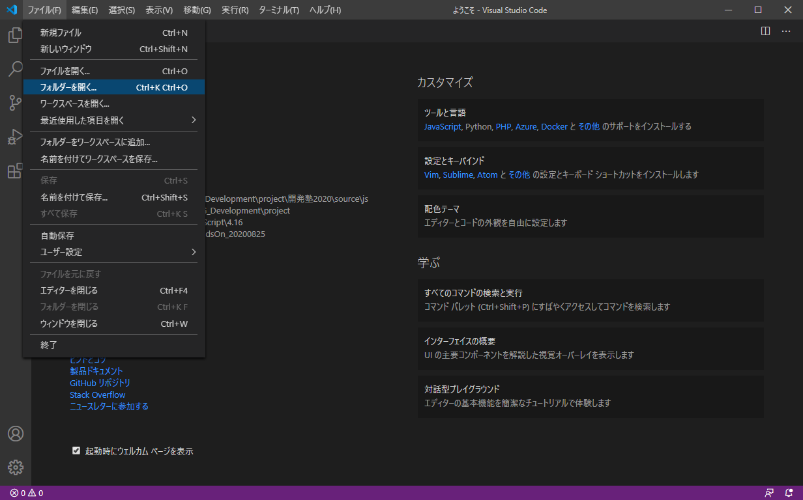
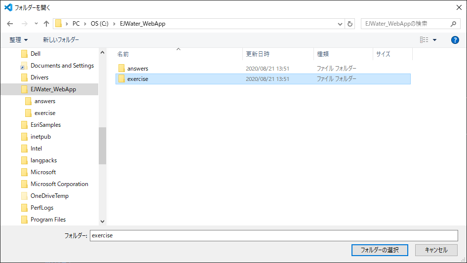
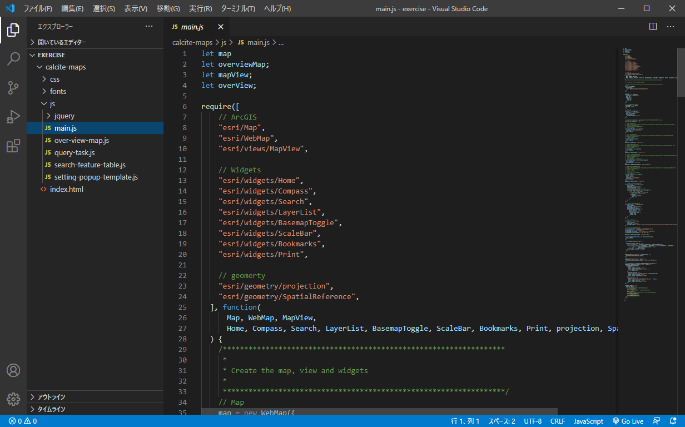
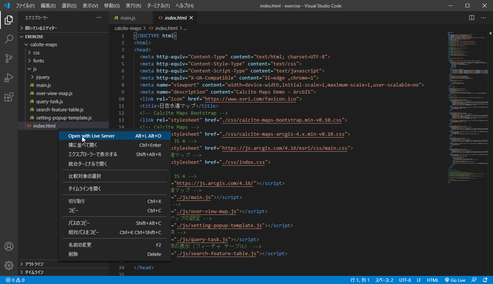
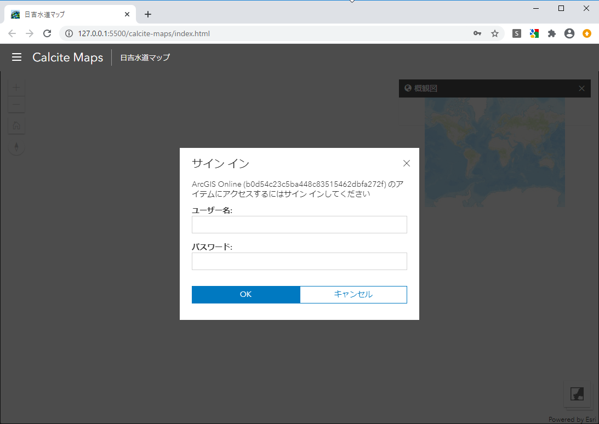
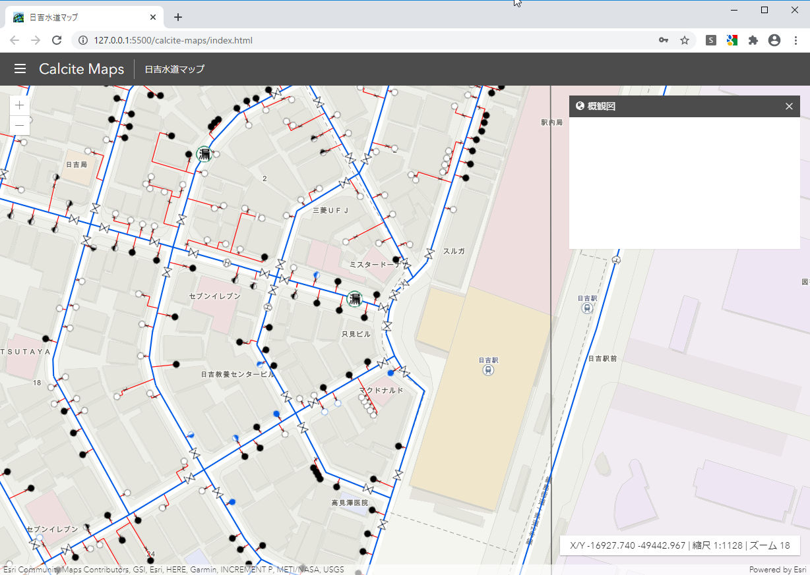

## Step1：ハンズオンの準備
### 1. 開発の準備

開発には、Visual Studio Code を使用し、拡張機能の Live Server を使用します。開発環境の構築には、環境構築の [ArcGIS プラットフォームを活用したWebアプリ開発ハンズオン](https://github.com/EsriJapan/workshops/tree/master/20200825_app-development-hands-on/Environment#arcgis-プラットフォームを活用したwebアプリ開発ハンズオン)をご参照ください。

### 2. アプリの配置

[本ハンズオンで使用するアプリはこちらでダウンロードできます](https://github.com/tkamiya0625/workshops/raw/master/20200825_app-development-hands-on/Session/3_DevelopWebApp/HandsOn_WebApp.zip)

上記リンクでダウンロードする HandsOn_WebApp.zip を任意の場所（作業フォルダ等）に配置して解凍してください。HandsOn_WebApp.zip 内の calcite-maps フォルダがプロジェクトです。  

- ハンズオン用のアプリ
  - HandsOn_WebApp.zip\source\exercise\calcite-maps

- 解答用のアプリ
  - HandsOn_WebApp.zip\source\answer\calcite-maps

上記のダウンロードしたアプリ (ハンズオン用) を Visual Studio Code を使用して開きます。

① ファイル＞フォルダーを開くを選択します。
||
|:-:|

② ダウンロードした Hands-On > source > exercise を選択して、フォルダーの選択をクリックして、開きます。
||
|:-:|

③ ./calcite-maps/js/main.js を開いてください。
||
|:-:|

これで準備は完了です。

### 3. Calcite-Maps ​の構成

- calcite-maps ​
  - css・・・bootstrap を定義した CSS ファイル、本アプリで使用するために定義した CSS ファイル​
  - fonts・・・ bootstrap が使用できる fonts ファイル​
  - js​
    - jquery ・・・・・・・・・bootstrap のコンポーネント群​
    - main.js ・・・ ・・・・地図メイン部（地図表示、標準ウィジェットの作成）​
    - over-view-map.js ・・・・概観図の設定と表示​
    - query-task.js ・・・ ・・・属性検索用のウィジェットを作成​
    - search-feature-table.js ・・属性検索の実行と結果をフィーチャテーブル ウィジェットに表示​
    - setting-popup-template.js ・・ポップアップの設定
  - index.html・・・ bootstrap の要素を適用した HTML ファイル

## Step2：地図メイン部の実装
### 1. Web マップの設定

Web マップを設定して、地図を表示します。
Map と View を作成します。  
main.js を開いて、以下のコードを記述します。
```JavaScript
// TODO: Map の作成
map = new WebMap({
  portalItem: {
    id: "<WebMap の ID>"
  }
});

// TODO: View の作成
mapView = new MapView({
  container: "mapViewDiv",
  map: map,
  padding: {
    top: 50,
    bottom: 0
  }
});
```

上記の portalItem の id には「ArcGIS Pro を使用したWeb マップの作成」のハンズオンで作成した WebMap の ID を指定します。
ハンズオンでは以下の条件に基づいて作成しているかと思います。

- ArcGIS Pro をお持ちの方
https://bit.ly/2WCVHyQ


- ArcGIS Pro をお持ちでない方
https://bit.ly/2Dl74EB
 

もし、作成ができていない方は、以下の Webmap の ID（ハンズオン限定で公開）を使用してください。

- 8e285147abe044cb851fbec6a1bed5cd

Map と View を設定したら Live Server を使用して地図を表示します。

### 2. Live Server の起動

Visual Studio Code で、index.html を選択して、マウスの左クリックをクリックすると、一覧が表示されますので、一覧から [Open with Live Server] を右クリックをクリックして、Live Server を起動します。
||
|:-:|

Live Server が起動することで、ローカルでサーバーを立ち上げることができます。
以下の URL でアプリが表示されます。   
http://127.0.0.1:5500/calcite-maps/index.html

ここで、ArcGIS Online にログインするため、ご自身のユーザー名、パスワードを入力して、[OK] ボタンをクリックします。
||
|:-:|

すると、Web Map を参照して地図が表示されます。
||
|:-:|

Step 2 はここまでです。  

### Step2 のまとめ
Map と View の関係ですが、Map はレイヤーを管理し、View はスクリーン上に Map を描画します。マップは、作成した Map を View に設定することでページに表示されます。  
また、Map の作成には、Map クラスを使用してベースマップなどを指定して
作成する場合と上記のようにWeb マップを利用する方法があります。

```JavaScript
// コードで Map を作成
const map = new Map({
    basemap: "topo",
    layers: [......]
});

// Web マップを利用
// ポータル（ArcGIS Online/ArcGIS Enterprise）と連携
const map = new WebMap({
    portalItem: {
        id: "webmapid"
    }
});
```

マップの作成に関しての詳細は、API リファレンスの Map、WebMap、View をご参照ください。

- API リファレンス
  - [Map](https://developers.arcgis.com/javascript/latest/api-reference/esri-Map.html)
  - [WebMap](https://developers.arcgis.com/javascript/latest/api-reference/esri-WebMap.html)
  - [View](https://developers.arcgis.com/javascript/latest/api-reference/esri-views-MapView.html) 


次の Step3 は、「[Step3：標準ウィジェットの実装](./Step3.md#Step3標準ウィジェットの実装) 」をご参照ください。
   
