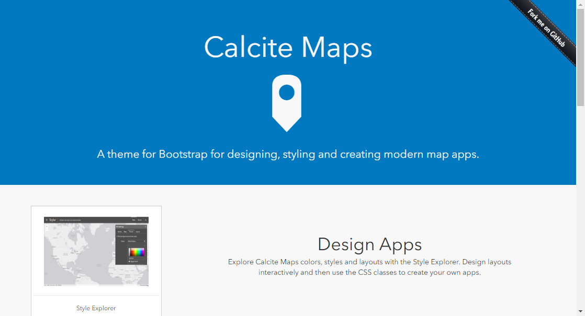

## Step1：ハンズオンの準備
### はじめに
- 本ハンズオンでは、Esri が提供している Calcite Map と ArcGIS API for JavaScript を使用して、ウィジェット開発を行います。ここでは、ハンズオンで使用するソースコードの配置を行い、Visual Studio Code でソースコードを開き、開発の準備を行います。

### Calcite Map とは？​
Esri がオープンソースとして提供しており、Bootstrap をテーマを使用しているため、レスポンシブでモダンなマップアプリを開発することができます。

||
|:-:|

http://esri.github.io/calcite-maps/samples/index.html

### ArcGIS API for JavaScript が提供するウィジェットについて​
ウィジェットとは、ArcGIS API for JavaScript が提供している GIS 機能を兼ね備えた UI コンポーネントです。  ArcGIS API for JavaScript では、GIS でよく使用するウィジェットを標準で幾つか提供しているので、ウィジェットを活用することで GIS の機能と同時にリッチな UI を Web マッピングアプリケーションに簡単に組み込むことができます。

詳細は、GeoNet ブログ [続編-はじめてのweb-マッピングアプリケーション開発-ウィジェット編](
https://community.esri.com/docs/DOC-14692)をご参照ください。 

 

以下の手順に従って開発の準備を行います。

### 1. 開発の準備

開発には、Visual Studio Code を使用し、拡張機能の Live Server を使用します。開発環境の構築には、環境構築の [ArcGIS プラットフォームを活用したWebアプリ開発ハンズオン](https://github.com/EsriJapan/workshops/tree/master/20200825_app-development-hands-on/Environment#arcgis-プラットフォームを活用したwebアプリ開発ハンズオン)をご参照ください。

### 2. アプリの配置

[本ハンズオンで使用するアプリはこちらでダウンロードできます](https://github.com/EsriJapan/workshops/raw/master/20200825_app-development-hands-on/Session/3_DevelopWebApp/EJWater_WebApp.zip)

上記リンクでダウンロードする EJWater_WebApp.zip を任意の場所（例 C：\EJWater_WebApp）に配置して解凍してください。EJWater_WebApp.zip 内の calcite-maps フォルダがプロジェクトになります。 

- ハンズオン用のアプリ
  - EJWater_WebApp\exercise\calcite-maps

- 解答用のアプリ
  - EJWater_WebApp\answer\calcite-maps

上記のダウンロードしたアプリ (ハンズオン用) を Visual Studio Code を使用して開きます。

① ファイル＞フォルダーを開くを選択します。
||
|:-:|

② ダウンロードした Hands-On > source > exercise を選択して、フォルダーの選択をクリックして、開きます。
||
|:-:|

③ ./calcite-maps/js/main.js を開いてください。
||
|:-:|

これで準備は完了です。

### 3. Calcite-Maps ​の構成

- calcite-maps ​
  - css・・・bootstrap を定義した CSS ファイル、本アプリで使用するために定義した CSS ファイル​
  - fonts・・・ bootstrap が使用できる fonts ファイル​
  - js​
    - jquery ・・・・・・・・・bootstrap のコンポーネント群​
    - main.js ・・・ ・・・・地図メイン部（地図表示、標準ウィジェットの作成）​
    - over-view-map.js ・・・・概観図の設定と表示​
    - query-task.js ・・・ ・・・属性検索用のウィジェットを作成​
    - search-feature-table.js ・・属性検索の実行と結果をフィーチャテーブル ウィジェットに表示​
    - setting-popup-template.js ・・ポップアップの設定
  - index.html・・・ bootstrap の要素を適用した HTML ファイル

### Step1 のまとめ
開発環境の構築でご紹介した Visual Studio Code は、多くの便利なツールがございます。GeoNet ブログの [Web マッピング アプリ開発に便利なツールをご紹介：～Visual Studio Code で開発環境を構築～](https://community.esri.com/docs/DOC-13101)でも紹介していますのでご参照ください。

次の Step2 は、「[Step2：地図メイン部の実装](./Step2.md#Step2地図メイン部の実装)」をご参照ください。
