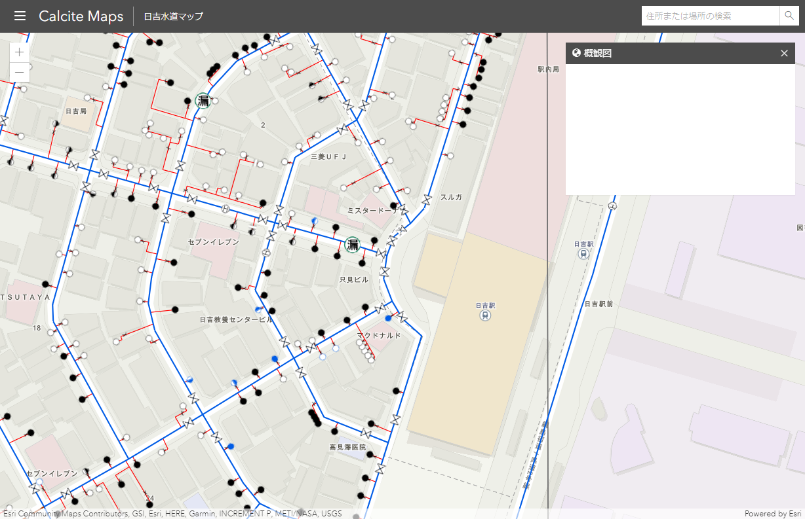
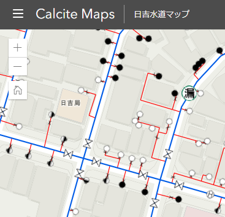
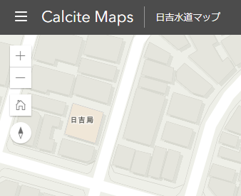
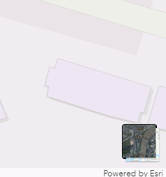
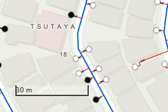
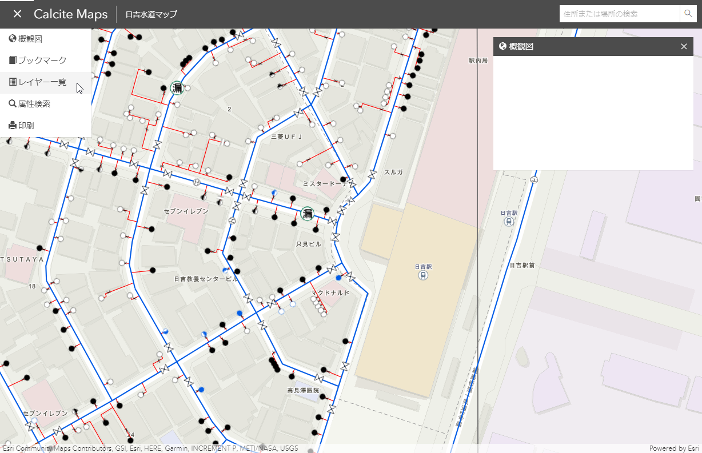
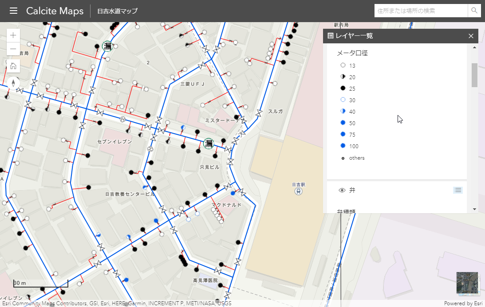
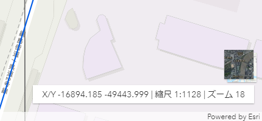

## Step3：標準ウィジェットの実装
### 標準ウィジェットを活用したウィジェット作成
 
<b>① 検索 ウィジェットの実装</b>  
 マップ内の目標物や場所を検索するためのウィジェットです。
 
 <span style="font-size: 70%">※ このウィジェットは Esri が提供している [ArcGIS World Geocoding Service](https://community.esri.com/external-link.jspa?url=https%3A%2F%2Fdevelopers.arcgis.com%2Frest%2Fgeocode%2Fapi-reference%2Foverview-world-geocoding-service.htm) を参照しており、住所や場所、建物名などを検索する機能を備えています。さらに、検索キーワードなどを入力すると、候補を自動的に表示して、最適なものを選択するオプションなども提供しています。  
 また、ArcGIS World Geocoding Service は、リクエスト結果を保存しなければ [100 万リクエスト](https://community.esri.com/external-link.jspa?url=https%3A%2F%2Fdevelopers.arcgis.com%2Ffeatures%2Fgeocoding%2F)までは、無償で使用できます。</span>

 - API リファレンス: [検索ウィジェット](https://developers.arcgis.com/javascript/latest/api-reference/esri-widgets-Search.html)

以下のコードを記述してください。
```JavaScript
const searchWidget = new Search({
  container: "searchWidgetDiv",
  view: mapView
});
```

検索 ウィジェットは、Search クラスを使用して、Search オブジェクトを作成します。Search オブジェクト の view プロパティに mapView を設定します。container には、DOM の要素を指定します。
DOM の要素 として、"searchWidgetDiv" を指定します。ここでは、boostrap の Navbarとして、ナビゲーションバーに表示しています。

コードを記述し、保存することで、ブラウザが自動的に更新されます。もし、ブラウザを閉じた場合は、再度、Liver Server を起動してください。

||
|:-:|

画面右上に検索 ウィジェットが追加されてます。
検索 ウィジェットに住所などを指定することで検索を行うことができます。

<br/>

<b>② ホーム ウィジェットの実装</b>  
 ホーム ウィジェットは、初期のマップの範囲を表示します。

- API リファレンス: [ホーム ウィジェット](https://developers.arcgis.com/javascript/latest/api-reference/esri-widgets-Home.html)

以下のコードを記述してください。
```javascript
const home = new Home({
  view: mapView
});

// ホーム ウィジェットをマップに追加して表示
mapView.ui.add(home, "top-left");
```

地図上に ホーム ウィジェットを組み込むために、View に追加します。ここでは、View の左上隅にウィジェットを追加しています。View への追加については、API リファレンスの UI の [add プロパティ](https://developers.arcgis.com/javascript/latest/api-reference/esri-views-ui-UI.html#add)をご参照ください。

画面左上にホーム ウィジェットが追加されます。
||
|:-:|

<br/>

<b>③ コンパス ウィジェットの実装</b>     
コンパス ウィジェットは、地図の回転やカメラの方向に対して北がどこにあるかを示します。

- API リファレンス: [コンパス ウィジェット](https://developers.arcgis.com/javascript/latest/api-reference/esri-widgets-Compass.html)

以下のコードを記述してください。
```javascript
const compass = new Compass({
  view: mapView
});

// コンパス ウィジェットをマップに追加して表示
mapView.ui.add(compass, "top-left");
```

画面左上にコンパス ウィジェットが追加されます。
||
|:-:|

<br/>

<b>③ ベースマップ ウィジェット</b>   
ベースマップ ウィジェットは、ベースマップを切り替えることができます。

- API リファレンス: [ベースマップ ウィジェット](https://developers.arcgis.com/javascript/latest/api-reference/esri-widgets-BasemapToggle.html)

以下のコードを記述してください。
```javascript
const basemapToggle = new BasemapToggle({
  view: mapView,
  secondBasemap: "satellite"
});

// ベースマップウィジェットをマップに追加して表示
mapView.ui.add(basemapToggle, "bottom-right");  
```

画面左下にベースマップ ウィジェットが追加されます。
||
|:-:|

<br/>

<b>④ スケールバー ウィジェット</b>   
スケールバー ウィジェットは、スケールバーを地図上に表示します。 

- API リファレンス: [スケールバー ウィジェット](https://developers.arcgis.com/javascript/latest/api-reference/esri-widgets-ScaleBar.html)

以下のコードを記述してください。
```javascript
const scaleBar = new ScaleBar({
  style: "line",
  unit: "metric",
  container: "scaleBarDiv",
  view: mapView
});

// manual を使用することで CSS を使用して任意の位置に配置することができます。
mapView.ui.add(scaleBar, "manual");
```

ScaleBar クラスのコンストラクタのプロパティにはスケールバーを表現するための設定があります。スタイルの設定 [style プロパティ](https://developers.arcgis.com/javascript/latest/api-reference/esri-widgets-ScaleBar.html#style)には "line"、 単位の設定 [unit プロパティ](https://developers.arcgis.com/javascript/latest/api-reference/esri-widgets-ScaleBar.html#unit)には、"metric" を設定します。

scaleBar の地図配置は、"manual" としています。"manual" とすることで、 container プロパティで設定した DOM 要素の "scaleBarDiv" に対して、CSS を設定することで、任意の位置に配置することができます。

以下の CSS は、index.css に設定しています。
```css
#scaleBarDiv {
  bottom: 50px;
  left: 30px;
}
```

画面左下にスケールバー  ウィジェットが追加されます。
||
|:-:|

<br/>

<b>⑤ レイヤーリスト ウィジェット</b>   
レイヤーリスト ウィジェットは、レイヤーのリストを作成し、各レイヤーの表示・非表示の制御を行うウィジェットを作成します。

- API リファレンス: [レイヤーリスト ウィジェット](https://developers.arcgis.com/javascript/latest/api-reference/esri-widgets-LayerList.html)

以下のコードを記述してください。
```javascript
const layerList = new LayerList({
    selectionEnabled: true,
    container: "layerListDiv",
    view: mapView,
    listItemCreatedFunction: function(event) {
        const item = event.item;
        if (item.layer.type != "group") {
          item.panel = {
            content: "legend",
            open: true
          };
        }
    }
});
```
LayerList クラスのコンストラクタのプロパティには、レイヤーを制御するための設定があります。[selectionEnabled プロパティ](https://developers.arcgis.com/javascript/latest/api-reference/esri-widgets-LayerList.html#selectionEnabled)には、true を設定します。selectionEnabled は、ユーザーがリストの項目を選択できるかどうかの設定になります。選択した項目は、マウスやタッチスクリーンでドラッグしたりすることで、リスト内の順番を入れ替えることができます。
[listItemCreatedFunction](https://developers.arcgis.com/javascript/latest/api-reference/esri-widgets-LayerList.html#listItemCreatedFunction) では、各レイヤーのリストアイテム [ListItem](https://developers.arcgis.com/javascript/latest/api-reference/esri-widgets-LayerList-ListItem.html) にアクセスする関数を指定することができます。ここでは、レイヤーリストにアクセスすることで凡例を表示するようにしています。　

レイヤーリスト ウィジェットの起動は、メニューのレイヤー一覧を選択します。
||
|:-:|

すると、以下のようなレイヤーリスト ウィジェットを表示します。
||
|:-:|

<br/>

<b>⑥ 印刷 ウィジェット</b>   
印刷 ウィジェットは、ユーザーが現在見ている状態の地図画面をそのまま出力することができます。

- API リファレンス: [印刷 ウィジェット](https://developers.arcgis.com/javascript/latest/api-reference/esri-widgets-Print.html)

以下のコードを記述してください。
```javascript
const print = new Print({
  view: mapView,
  container: "printDiv",
  printServiceUrl: "https://utility.arcgisonline.com/arcgis/rest/services/Utilities/PrintingTools/GPServer/Export%20Web%20Map%20Task"
});
```

Print クラスのコンストラクタの printServiceUrl プロパティには ArcGIS Online が提供する印刷サービスを指定します。このプロパティに [ArcGIS Enterprise がホストする印刷サービス](https://community.esri.com/external-link.jspa?url=https%3A%2F%2Fenterprise.arcgis.com%2Fja%2Fserver%2Flatest%2Fcreate-web-apps%2Fwindows%2Ftutorial-publishing-additional-services-for-printing.htm)を指定することで、ユーザーが独自にカスタマイズしたレイアウトが使えるようになります。

その他、[GeoNet ブログの-続編-はじめてのweb-マッピングアプリケーション開発-印刷ウィジェット編](https://community.esri.com/docs/DOC-14697)も併せてご参照ください。

印刷 ウィジェットもレイヤーリスト ウィジェットと同様にメニューの印刷を選択することで立ち上がります。

<br/>

<b>⑧ ブックマーク ウィジェット</b>  
目的の場所をブックマークとして追加し、ブックマークを選択してその場所へ移動することができます。

- API リファレンス: [ブックマーク ウィジェット](https://developers.arcgis.com/javascript/latest/api-reference/esri-widgets-Bookmarks.html)

以下のコードを記述してください。
```javascript
const bookmarks = new Bookmarks({
  view: mapView,
  container: "bookmarksDiv",
  editingEnabled: true,
  bookmarkCreationOptions: {
      takeScreenshot: true,
      captureExtent: true,
      screenshotSettings: {
        width: 100,
        height: 100
      }
  }
});
```

Bookmarks クラスのコンストラクタの [editingEnabled プロパティ](https://developers.arcgis.com/javascript/latest/api-reference/esri-widgets-Bookmarks.html#editingEnabled)は、true にすることでブックマークを編集することができます。ブックマークの追加、編集、並べ替え、削除することができます。ただし、ブックマークの編集等の結果はローカル上で表示されるのみで保存はされません。  
[bookmarkCreationOptions プロパティ](https://developers.arcgis.com/javascript/latest/api-reference/esri-widgets-Bookmarks.html#bookmarkCreationOptions)は、ブックマークの作成時に、スクリーンショットの取得、または現在の地図に基づいた範囲の作成を有効または無効にするために使用できます。

<b>チャレンジ：ブックマークの保尊</b>  
追加したブックマークは WebMap に保存します。WebMap に保存することで、次回アプリを起動時にも追加したブックマークが有効となっています。

以下のコードを記述してください。
```javaScript
const webmapSave = document.getElementById("WebmapSave");
webmapSave.addEventListener("click", (event) => {
  map.updateFrom(mapView)
    .then(() => {
      event.target.disabled = true;
      event.target.textContent = "保存中..."
      return map.save();
    })
    .then((portalItem) => {
      alert("お気に入りを保存しました。:" + portalItem.id);
      event.target.disabled = false;
      event.target.textContent = "保存"
    })
    .catch((error) => {
      alert("お気に入りの保存に失敗しました。:" + error);
      event.target.disabled = false;
      event.target.textContent = "保存"
    });
});
```
Bookmarks ウィジェットもレイヤーリスト ウィジェットと同様にメニューのブックマークを選択することで立ち上がります。

<br/>

<b>⑨Coordinates ウィジェット</b>  
Coordinates ウィジェットは、マウスポイントが指定している座標、現在のスケールを表示するためのウィジェットです。この ウィジェットは、標準で用意されていないため、新規に作成します。

はじめに以下のコードを記述してください。
```javaScript
// 新しい div 要素を作成します。
const coordsWidget = document.createElement("div");
coordsWidget.id = "coordsWidget";
coordsWidget.className = "esri-widget esri-component";
coordsWidget.style.padding = "7px 15px 5px";

mapView.ui.add(coordsWidget, "bottom-right");
```

新しい div 要素を作成して、View に追加することで、UI を作成することができます。そして、その UI に対して、座標とスケールを表示するように制御します。

マウスポインタの座標を取得して表示するため、View に対してのイベントを発行する必要があります。以下のコードを記述してください。
```javaScript
mapView.on("pointer-move", (evt) => {
  showCoordinates(mapView.toMap({ x: evt.x, y: evt.y }));
});
```
MapView のイベントとして、["pointer-move"](https://developers.arcgis.com/javascript/latest/api-reference/esri-views-MapView.html#event-pointer-move) を指定することで、マウスポインタの座標が変った場合にイベントが発行されます。イベント後の処理として、ここでは、showCoordinates 関数を作成し、そこに x, y を指定します。 showCoordinates 関数では、上記で作成した UI に対して、座標とスケールを表示する処理を行います。

<br>

最後に showCoordinates 関数のコードを記述してください。
```javaScript
const outSpatialReference = new SpatialReference({
  wkid: 6677
});

const showCoordinates = (pt) => {      
  projection.load().then(() => {
    const projgeometry = projection.project(pt, outSpatialReference);    
    const coords = "X/Y " + projgeometry.x.toFixed(3) + " " + projgeometry.y.toFixed(3) +
        " | 縮尺 1:" + Math.round(mapView.scale * 1) / 1 +
        " | ズーム " + mapView.zoom;
    coordsWidget.innerHTML = coords;
  });
}
```    

showCoordinates 関数では、座標と縮尺を表示する処理を記述しています。ここでは、[projection](https://developers.arcgis.com/javascript/latest/api-reference/esri-geometry-projection.html#project) の project メソッドを使用して、座標をワールドメルカトルから平面直角座標系の9系に変換して表示するようにしています。project メソッドには座標を変換する空間参照系の [SpatialReference](https://developers.arcgis.com/javascript/latest/api-reference/esri-geometry-SpatialReference.html#wkid) を指定します。wkid には、6677 を指定します。

画面左下に Coordinates ウィジェットが追加されます。
||
|:-:|

Step 3 はここまでです。  

次の Step4 は、「[Step4：概観図の実装](./Step4#Step4：概観図の実装) 」をご参照ください。