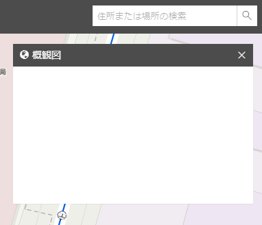
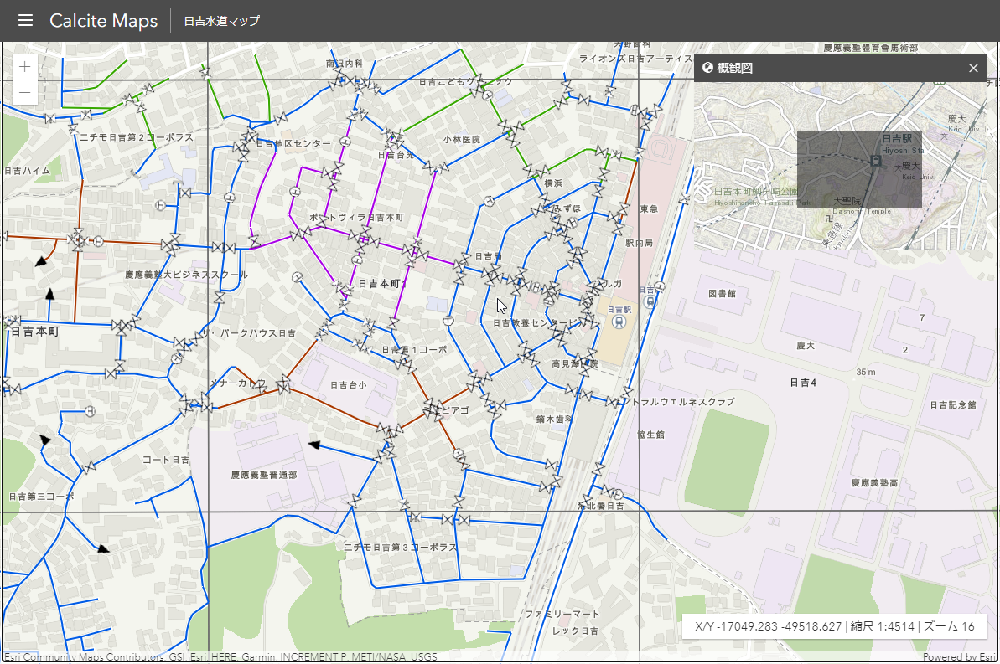

## Step4：概観図の実装
### 概観図を表示するウィジェットを作成
 
<b>概観図 ウィジェットの実装</b>  
現在概観図には何も表示されていない状態です。ここに概観図を実装していきます。概観図とは、別の地図の表示範囲を枠などで表示した小縮尺の地図になります。

||
|:-:|

main.js を開いて、58行目あたりに概観図を表示するための Map と MapView を定義します。以下のコードを記述します。
```JavaScript
// overviewMap（概観図）
overviewMap = new Map({
  basemap: "topo"
});

// overView
overView = new MapView({
  container: "overViewDiv",
  map: overviewMap,
  constraints: {
    rotationEnabled: false
  }
});

// UI コンポーネントの初期化（デフォルトのウィジェットとして設定）
overView.ui.components = [];
```
概観図では、地図以外は何も表示しないため、UI のコンポーネントを初期化します。

<br/>

次に main.js の 255 行目以降にある mapView.when() 内で、以下のコードを記述します。
```JavaScript
overView.when(() => {
  mapView.when(() => {
    // Todo: Step4 概観図を表示（概観図ウィジェット）
    overViewMapSet();
    // Todo: Step5 属性検索の設定（属性検索ウィジェット）

    // Todo: Step5 検索結果の表示（フィーチャ テーブルウィジェット）

    // ポップアップの設定
    settingPopupTemplate();
  });
});
```

View の [when()](https://developers.arcgis.com/javascript/latest/api-reference/esri-views-View.html#when) を使用することで、overView と mapView のインスタンスが作成されたあとに overViewMapSet() を実行するようにしています。  
overViewMapSet() の処理を呼び出しているファイルは、over-view-map.js になります。

<br>

次に over-view-map.js を開いて、overViewMapSet() 関数内に以下のコードを記述します。
```JavaScript
// グラフィックの追加
const extent3Dgraphic = new Graphic({
  geometry: null,
  symbol: {
    type: "simple-fill",
    color: [0, 0, 0, 0.5],
    outline: null
  }
});
overView.graphics.add(extent3Dgraphic);
```
このグラフィックでは、概観図で使用する地図の表示範囲の枠を設定します。[Graphic](https://developers.arcgis.com/javascript/latest/api-reference/esri-Graphic.html) クラスを使用して、グラフィックを作成して overView に追加します。


次にメインの地図の表示を変更 (拡大、縮小など) するたびに表示範囲の枠が連動するように以下のコードを記述します。

```JavaScript
watchUtils.init(mapView, "extent", (extent) => {
  // mapView が更新（地図の表示を変更）した場合は、概観図と同期する
  if (mapView.updating) {
    overView
      .goTo({
        center: mapView.center,
        scale: 
        mapView.scale *
          2 *
          Math.max(
            mapView.width / overView.width,
            mapView.height / overView.height
          )
      })
      .catch((error) => {
        // goto-interrupted エラーは無視する
        if (error.name != "view:goto-interrupted") {
          console.error(error);
        }
      });
  }
  extent3Dgraphic.geometry = extent;
});
```

watchUtils の [init](https://developers.arcgis.com/javascript/latest/api-reference/esri-core-watchUtils.html#init) で、プロパティの変更を監視し、プロパティの初期値で呼び出すようにします。mapView の地図の表示が変更になった場合に mapView の表示範囲 (extent) を取得して、extent3Dgraphic の geometry に extent を設定します。  
また、mapView が 更新 ([updating](https://developers.arcgis.com/javascript/latest/api-reference/esri-views-MapView.html#updating)) された場合に、メインの地図の表示に合わせて、概観図を [goTo](https://developers.arcgis.com/javascript/latest/api-reference/esri-views-MapView.html#goTo) で移動するように設定します。


以下の画面のようにメインの地図と連動した概観図が作成されます。
||
|:-:|

サンプルの [Overview map](https://developers.arcgis.com/javascript/latest/sample-code/overview-map/index.html) も併せてご参照ください。

Step 4 はここまでです。  

次の Step5 は、「[Step5：属性検索の実装](./Step5#Step5：属性検索の実装)」をご参照ください。
