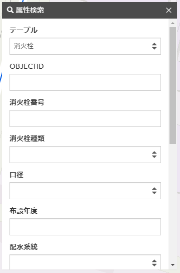

## Step5：属性検索の実装

### 演習の目的
-  属性検索ウィジェットの作成方法の習得
   - 属性検索ウィジェットでは標準で用意されていないため、独自ウィジェットとして作成します。
-  属性検索の実行方法の習得
   - クエリを利用して属性検索を行います。
-  フィーチャ テーブルウィジェットの利用方法の習得
   - 属性検索の結果は、フィーチャ テーブルウィジェットに表示します。

以下の画面は属性検索を行って結果をフィーチャ テーブルウィジェットに表示している例です。
||
|:-:|

コードは、main.js、query-task.js、search-feature-table.js に対して実装していきます。

### 1．属性検索ウィジェットの実装  
各属性に対して検索機能を実装していきます。はじめに属性検索ウィジェットを実装します。

main.js の 255 行目以降にある mapView.when() 内で、Todo: Step5 に対して以下のコードを記述します。
```JavaScript
overView.when(() => {
  mapView.when(() => {
    // Todo: Step4 概観図を表示（概観図ウィジェット）
    overViewMapSet();
    // Todo: Step5 属性検索の設定（属性検索ウィジェット）
    queryTaskSet();
    // Todo: Step5 検索結果の表示（フィーチャ テーブルウィジェット）
    searchFeatureTable();
    // ポップアップの設定
    settingPopupTemplate();
  });
});
```

View の [when()](https://developers.arcgis.com/javascript/latest/api-reference/esri-views-View.html#when) を使用することで、overView と mapView のインスタンスが作成されたあとに queryTaskSet() と searchFeatureTable() を実行します。queryTaskSet() の処理を呼び出しているファイルは、query-task.js となり、searchFeatureTable() の処理を呼び出しているファイルは、search-feature-table.js になります。

属性検索ウィジェットは、HTML で定義した以下の要素に対して処理を行っていきます。

```HTML
<form id="form-water-supply-map">
  <div class="form-group">
    <label for="table-water-supply-map">テーブル</label>
    <select class="form-control" id="table-water-supply-map"></select>
  </div>
  <div id="fields-water-supply-map"></div>
  <button type="submit" class="btn btn-primary">実行</button>
  <br/>
  <p class="text-danger" id="searchResult"><span style="font-size: 90%">検索条件に合致する結果が⾒つかりませんでした。</span></p>
</form>
```

<b>Step5 属性検索ウィジェット（テーブルを選択）</b>

次に query-task.js を開いて、属性検索ウィジェットのイベント（テーブルの選択）に対して処理を行います。イベントは、DOM の selectWaterSupplyMapTable に対してイベントを追加しています。以下のコードを記述します。   

```JavaScript
// Todo: Step5 選択したテーブルを setFieldsWaterSupplyMap() に指定
const layerId = event.target.value;
const layers = map.allLayers.map((layer) => {
  if (layer.layerId == layerId) {
    setFieldsWaterSupplyMap(layer);
  }
})
```

<b>Step5 属性検索ウィジェット（項目名の設定）</b>

そして、属性検索ウィジェットに対して各属性の項目を設定します。
以下のコードを記述します。

```JavaScript
// Todo: Step5 DOM の fieldsWaterSupplyMap に対して属性項目を設定
// 各レイヤーからフィールド名を取得
for (let field of layer.fields) {  
  const fieldName = field.name;
  // ドメイン
  if (field.domain) {
    if (field.domain.type === "coded-value") {
      let option = "<option value=''></option>";
      for (let codedValue of field.domain.codedValues) {
        option += "<option value="+ codedValue.code + ">"+ codedValue.name +"</option>";
      }
      fieldsWaterSupplyMap.innerHTML += 
        "<div class='form-group'>" + 
        "<label class='control-label'>" + fieldName + "</label>" + 
        "<select class='form-control' id='" + fieldName + "'>" +
          option +
        "</select>" +
        "</div>";
    }
  // サブタイプ
  } else if (layer.typeIdField === fieldName) {
    let option = "<option value=''></option>";
    for (let type of layer.types) {
      if (type.id && type.name) {
        option += "<option value="+ type.id + ">"+ type.name +"</option>";
      }
    }
    fieldsWaterSupplyMap.innerHTML += 
      "<div class='form-group'>" + 
      "<label class='control-label'>" + fieldName + "</label>" + 
      "<select class='form-control' id='" + fieldName + "'>" +
      option +
      "</select>" +
      "</div>";
  } else {
    fieldsWaterSupplyMap.innerHTML += 
        "<div class='form-group'>" + 
          "<label class='control-label'>" + fieldName + "</label>" +
          "<input type='text' class='form-control' id='" + fieldName + "'>" +
        "</div>";
  }
}
```

属性には、[ドメイン](https://developers.arcgis.com/javascript/latest/api-reference/esri-layers-support-Field.html#domain)と呼ばれるデータの整合性を維持するために有効な属性値のルールを定義しているため、それらの属性も表現する必要があります。
そのため、field の type を "coded-value" で判断する処理を入れています。
```JavaScript
if (field.domain.type === "coded-value") {
  :
  :
}
```

また、[サブタイプ](https://developers.arcgis.com/javascript/latest/api-reference/esri-layers-FeatureLayer.html#typeIdField)を定義している場合もあるため、以下のコードようにサブタイプを取得して表現するようにしています。

```JavaScript
if (layer.typeIdField === fieldName) {
  for (let type of layer.types) {
    if (type.id && type.name) {
      option += "<option value="+ type.id + ">"+ type.name +"</option>";
    }
  }
}
```

すべてのコードの記述後にアプリを実行して、メニューから属性検索を選択します。以下の画面が表示されます。
||
|:-:|

<br/>

### 2．フィーチャ テーブルウィジェットの実装 
次に属性検索ウィジェットで検索して、検索結果をフィーチャ テーブルウィジェットに表示する処理を実装していきます。

<b>Step5 レイヤーのクエリ処理</b>

search-feature-table.js を開いて、queryWaterSupplyMap() にクエリの処理を実装していきます。以下のコードを記述してください。
```JavaScript
// Todo: Step5 該当の属性データからレイヤーに対してクエリを行います。
let query, querylayer;
const layers = map.allLayers.map((layer) => {
  layerId = self.event.target.elements[0].value;
  if (layer.layerId == layerId) {            
    let searchCondition;
    for (let i = 1; i < self.event.target.elements.length; i++) {
      const field = self.event.target.elements[i].id;
      const value = self.event.target.elements[i].value;
      // 検索条件の設定
      if (value && !searchCondition) {
        searchCondition = field + "=" + "'" + value + "'";
      } else if (value && searchCondition) {
        searchCondition += " AND " + field + "=" + "'" + value + "'";
      }
    }
    // query オブジェクトの作成
    query = layer.createQuery();
    if (searchCondition) {
      query.where = searchCondition;
    }
    query.returnGeometry = true;
    query.outFields = ["*"];
    querylayer = layer;
    return;
  }
});
return querylayer.queryFeatures(query);
```

フィーチャの検索にはクエリを実行します。クエリは、マップ サービスまたはフィーチャ サービスのレイヤーに対して実行します。パラメーターに設定された検索条件に一致するフィーチャを取得することができます。

クエリには、[FeatureLayer](https://developers.arcgis.com/javascript/latest/api-reference/esri-layers-FeatureLayer.html) の queryFeature() メソッドを使用します。[queryFeatures()](https://developers.arcgis.com/javascript/latest/api-reference/esri-layers-FeatureLayer.html#queryFeatures) メソッドに検索条件の [query](https://developers.arcgis.com/javascript/latest/api-reference/esri-tasks-support-Query.html) オブジェクトを指定することで、FeatureLayer に対して検索を行うことができます。

詳細については、[Query features form a FeatureLayer](https://developers.arcgis.com/javascript/latest/sample-code/featurelayer-query/index.html) も併せてご参照ください。


<b>Step5 フィーチャ テーブルウィジェットの作成</b>

次に検索結果をフィーチャ テーブルウィジェットに表示する処理を実装します。
displayWaterSupplyMapResults() 内に対して以下のコードを記述してください。
```JavaScript
// Todo: Step5 検索結果をフィーチャ テーブルウィジェットに表示
const searchResult = document.getElementById("searchResult");
// 検索結果が存在する場合
if (results.features.length > 0) {
  searchResult.style.display = "none";

  const collapseQueryTask = document.getElementById("collapseQueryTask");
  collapseQueryTask.classList.remove("in");
  
  const headingQueryTask = document.getElementById("headingQueryTask");
  const panellabel = headingQueryTask.querySelector(".panel-label");
  panellabel.classList.add("visible-xs-inline-block")

  const panelclose = headingQueryTask.querySelector(".panel-close");
  panelclose.classList.add("visible-xs-flex");
// 検索結果が０件の場合は、処理を終了する
} else {
  searchResult.style.display = "flex";
  return;
}

// フィールド名の作成
const fieldConfigs = [];
for (let field of results.fields) {
    const fieldName =  {
      name: field.name,
      label: field.alias
    }
    fieldConfigs.push(fieldName);
}

// フィーチャ レイヤーの作成
waterSupplyMapLayer = new FeatureLayer({
  title: results.features[0].layer.title,
  fields: results.fields,       
  objectIdField: "ObjectID",
  source: results.features, 
});

const featureTableDiv = document.getElementById("featureTableDiv");
featureTableDiv.innerText = null; 
featureTableDiv.style.display = "flex";
const mapViewDiv = document.getElementById("mapViewDiv");
mapViewDiv.style.height = "60%";

const actionsDiv = document.getElementById("actions");      
actionsDiv.style.display = "flex";

if (highlights.length > 0) {
    for (let highlight of highlights) {
      highlight.highlight.remove();
    }
    highlights.splice(0);
}

// フィーチャ レイヤーの取得
let featureLayer;
for (let item of map.layers.items) {
  if (layerId == item.layerId) {
    featureLayer = item;
  }
}

// フィーチャ テーブルの作成
const featureTable = new FeatureTable({
  layer: waterSupplyMapLayer,
  fieldConfigs: fieldConfigs,
  container: featureTableDiv
});
```
フィーチャ テーブルウィジェットは、フィーチャ レイヤーのデータをテーブル形式で表示します。テーブルの行を選択したり、属性に基づいてソートしたり、列 (属性) の表示/非表示を選択することもできます。  
フィーチャ テーブルウィジェットの作成には、[FeatureTable](https://developers.arcgis.com/javascript/latest/api-reference/esri-widgets-FeatureTable.html) クラスを使用します。FeatureTable クラス の[プロパティ](https://developers.arcgis.com/javascript/latest/api-reference/esri-widgets-FeatureTable.html#properties-summary)には、layer や fieldConfigs など幾つか設定が必要な項目があります。layer には、ウィジェット内に表示するフィールドと属性を含んだ FeatureLayer を指定し、fieldConfigs には、個々に設定したフィールドの配列を指定します。また、フィーチャ テーブルウィジェットで編集する場合は、[editingEnabled](https://developers.arcgis.com/javascript/latest/api-reference/esri-widgets-FeatureTable.html#editingEnabled) を true にすることで編集が可能となります。

そして、次にフィーチャ テーブルウィジェットで各レコードが選択された場合の処理を実装します。
以下のコードを記述します。
```JavaScript
// Todo: Step5 フィーチャ テーブルウィジェットでの各レコードを選択
mapView.whenLayerView(featureLayer).then((layerView) => {
  featureTable.on("selection-change", (changes) => {
      // 選択が解除された場合は、ハイライトされた部分を layerView から削除します。
      changes.removed.forEach((item) => {
          const data = highlights.find((data) => {
              return data.feature === item.feature;
          });
          if (data) {
              highlights.splice(highlights.indexOf(data), 1);
              data.highlight.remove();
          }
      });
      // 選択された場合は、該当のデータに対して layerView をハイライトします。
      changes.added.forEach((item) => {
          const feature = item.feature;
          highlight = layerView.highlight(item.feature);
          highlights.push({
              feature: feature,
              highlight: highlight
          });
      });
  });
}).catch(function(error) {
  // layerView の作成中にエラーが発生しました。
  console.log(error)
});
```

<b>Step5 クリックイベントにおける処理（選択したフィーチャに移動）</b>

最後にフィーチャ テーブルウィジェットで選択したフィーチャに移動する処理を実装します。
以下のコードを記述します。
```JavaScript
// Todo: Step5 選択したフィーチャに移動
// フィーチャーレイヤーからクエリを作成します
const query = waterSupplyMapLayer.createQuery();
// ハイライトを繰り返し処理して、フィーチャーの objectID を取得します。
const featureIds = highlights.map((result) => {
  return result.feature.getAttribute(waterSupplyMapLayer.objectIdField);
});
// クエリの objectId を設定します。
query.objectIds = featureIds;
// 目的の場所に移動するためジオメトリを必ず返すようにします。
query.returnGeometry = true;
// フィーチャ レイヤーで queryFeatures を呼び出し，結果として得られるフィーチャの場所に移動します．
waterSupplyMapLayer.queryFeatures(query).then((results) => {
    const proj = [];
    projection.load()
        .then(() => {
            // projection クラス の project メソッドを使用して、平面直角座標系の9系からワールドメルカトルに変換しています。
            for (let feature of results.features) {   
                const transformation = projection.getTransformation(feature.geometry.spatialReference, mapView.spatialReference);
                const projgeometry = projection.project(feature.geometry, mapView.spatialReference, transformation);   
                proj.push(projgeometry);
            }
            return Promise.all(proj);
        })
        .then((geo) => {
          let target;
          if (geo.length > 1) {
            target = geo;
          } else {
            target = {target: geo, zoom: 19};
          }
          // 選択したフィーチャに移動します。
          mapView.goTo(target).catch((error) => {
            if (error.name != "AbortError") {
              console.error(error);
            }
          });
        })
        .catch((error) => {
            console.error(error);
        });
});
```

1件、もしくは複数のフィーチャを選択した場合によって処理を分けています。1件のフィーチャを選択した場合は、その1つの場所にズームし、複数のフィーチャを選択した場合は、すべての位置の合わせた範囲にズームします。フィーチャの移動には、MapView の [goTo](https://developers.arcgis.com/javascript/latest/api-reference/esri-views-MapView.html#goTo) メソッドを使用します。


```JavaScript
let target;
if (geo.length > 1) {
  // 複数のフィーチャの場合
  target = geo;
} else {
  // 1件のフィーチャの場合
  target = {target: geo, zoom: 19};
}
// 選択したフィーチャに移動します。
mapView.goTo(target).catch((error) => {
  if (error.name != "AbortError") {
    console.error(error);
  }
});
```          

||
|:-:|

### Step 5 のまとめ

フィーチャの検索としてクエリを使用しました。クエリには、[FeatureLayer](https://developers.arcgis.com/javascript/latest/api-reference/esri-layers-FeatureLayer.html) の queryFeature() メソッドを使用しました。[queryFeatures()](https://developers.arcgis.com/javascript/latest/api-reference/esri-layers-FeatureLayer.html#queryFeatures) メソッドに検索条件の [query](https://developers.arcgis.com/javascript/latest/api-reference/esri-tasks-support-Query.html) オブジェクトを指定することで、FeatureLayer に対して検索を行うことができます。

そして、検索結果の表示には、フィーチャ テーブルウィジェットを使用しました。フィーチャ テーブルウィジェットは、フィーチャ レイヤーのデータをテーブル形式で表示し、テーブルの行を選択したり、属性に基づいてソートしたり、列 (属性) の表示/非表示を選択することもできます。 
フィーチャ テーブルウィジェットの作成には、[FeatureTable](https://developers.arcgis.com/javascript/latest/api-reference/esri-widgets-FeatureTable.html) クラスを使用することで作成できます。
現在このフィーチャ テーブルウィジェットはベータ版として提供されており、今後も拡張機能が追加されていく予定です。

今回のハンズオンはここまでです。
