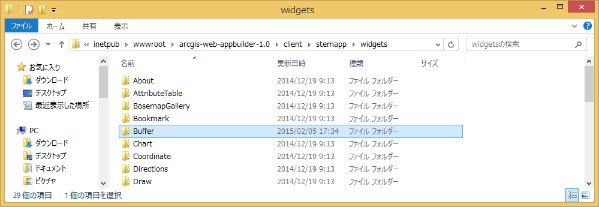
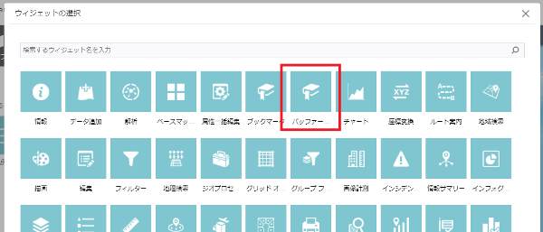
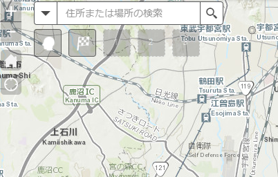
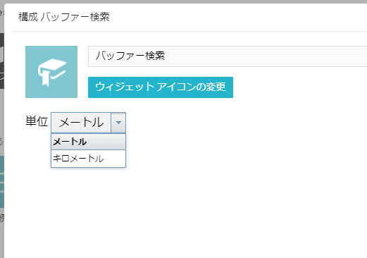
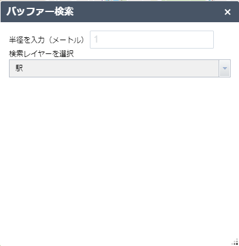
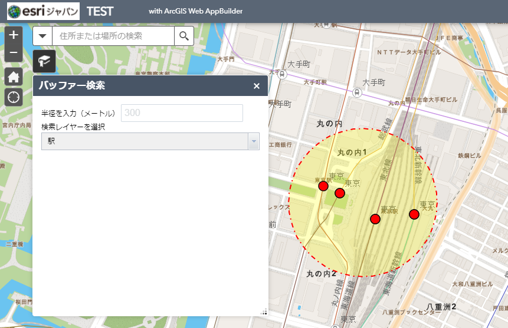

# ArcGIS Web AppBuilder (Developer Edition) を使用したカスタム ウィジェット開発ガイド

## 概要

このガイドは ArcGIS Web AppBuilder (Developer Edition) （以下、Web AppBuilder）で使用するカスタム ウィジェットを作成する方法を説明します。  
Web AppBuilder のインストール方法に関しては、[ArcGIS Web AppBuilder (Developer Edition) インストールガイド](https://esrijapan.github.io/arcgis-dev-resources/webappbuilder/install-guide/)をご参照ください。

## カスタム ウィジェットの開発

### 1. ウィジェット ボタンを配置する

本ガイドでは簡単なバッファー検索を行う In-Panel ウィジェットを開発していきます。ウィジェットを追加するには `<Web AppBuilder のインストール ディレクトリ>\client\stemapp\widgets` にウィジェットのフォルダーを配置します。

1. `<Web AppBuilder のインストール ディレクトリ>\client\stemapp\widgets\samplewidgets` にある `CustomWidgetTemplate` フォルダーを `<Web AppBuilder のインストール ディレクトリ>\client\stemapp\widgets` にコピーします。

2. `CustomWidgetTemplate` フォルダーの名前を `Buffer` に変えます。  
  
フォルダー名がウィジェット名となります。ウィジェット名は半角英数字である必要があります。

3. `Buffer` フォルダー直下にある `manifest.json` ファイルを開きます。

4. `name` 属性の値を `Buffer` に変更し、保存します。

```js
{
  "name": "Buffer",
  "2D": true,
  "3D": false,
  "platform": "HTML",
  // ...
```

> #### manifest.json
> 
> ウィジェットの名前やバージョン等を設定するファイルです。`properties` 属性でカスタム ウィジェットのプロパティを構成できます。ウィジェットのプロパティについては<a href="https://developers.arcgis.com/web-appbuilder/guide/widget-manifest.htm" target="_blank">Widget manifest</a>をご参照ください。

5. Web AppBuilder のウィジェットの追加画面で表示されるウィジェット名をローカライズします。ウィジェットのローカライズは `Buffer` フォルダーの直下にある `nls` フォルダーで設定します。  
`Buffer\nls` フォルダーにある `strings.js` ファイルを開き、以下のコードを入力し保存します。

```js
define({
  root:({
    _widgetLabel: "Buffer"
  }),
  "ja": 1
});
```

6. `nls` フォルダー直下に `ja` フォルダーを作成します。

7. `ja` フォルダーに `strings.js` ファイルを作成し、以下のコードを入力し保存します。  

```js
define({
  _widgetLabel: "バッファー検索"
});
```

> #### nls フォルダー
> 
> カスタム ウィジェットを多言語化する場合に使用します。アクセスするブラウザーのロケールにより該当する言語が表示されます。`_widgetLabel` はウィジェット追加時に表示されるラベルをローカライズするための固有の属性です。

8. Web AppBuilder を起動し、アプリケーションを作成します。ウィジェットの追加画面に「バッファー検索」というウィジェット名が表示されます。  


> #### images\icon.png
> 
> カスタム ウィジェットのボタンのアイコンを変更したい場合は、このファイルを置き換えます。  
> 

### 2. config.json の定義

`config.json` は JSON 形式のオブジェクト格納ファイルです。ウィジェット初期化時のデフォルトの値を設定します。`config.json` に設定した値は構成画面やウィジェットから取得できます。  

1. 作成するバッファーのデフォルトの距離単位を設定します。  
`Buffer` フォルダーの `config.json` ファイルを開き、以下のコードを入力します。  

```json
{
  "measurement": {
    "lengthUnit": "meters",
    "lengthUnitLabel": "メートル"
  }
}
```

### 3. ウィジェットの構成画面を作成する

ウィジェットの構成を行う画面を作成します。今回は、構成画面で、検索に使用するバッファーの距離単位を設定します。

1. `Buffer` フォルダーに `setting` フォルダーを作成します。

2. `setting` フォルダーに `Setting.html` ファイルを作成し、以下のコードを入力します。  

```html
<div>
  <div>
    <label>単位</label>
    <select data-dojo-type="dijit/form/Select" data-dojo-attach-point="selectLengthUnit">
      <option value="meters">メートル</option>
      <option value="kilometers">キロメートル</option>
    </select>
  </div>
</div>
```

> dojo では、要素に `data-dojo-type` 属性を使い、<a href="https://dojotoolkit.org/reference-guide/1.10/dijit/info.html" target="_blank">Dijit</a> と呼ばれる UI コンポーネントを設定すると、要素を Dijit に置き換えることができます。ここでは、`Select` を `dijit/form/Select` に置き換えています。  
> また、`data-dojo-attach-point` を使用すると、ウィジェットのプロパティとして、要素を参照することが可能になります。`data-dojo-attach-point` の使用は `id` の競合を避けることができます。

3. `setting` フォルダーに `Setting.js` ファイルを作成し、構成画面での処理を記述します。  
まず、処理に使用するモジュールを読み込みます。  
そして、`declare()` を使用して、構成画面のベースとなる `BaseWidgetSetting` を継承し子クラスを作成します。

```js
define([
  'dojo/_base/declare',
  'jimu/BaseWidgetSetting',
  'dijit/_WidgetsInTemplateMixin',
  'dijit/form/Select'
], function(declare, BaseWidgetSetting, _WidgetsInTemplateMixin) {
  return declare([BaseWidgetSetting, _WidgetsInTemplateMixin], {
    // ...
  });
});
```

> dojo は、モジュール システムを導入しており、各機能はモジュールとして管理されています。`define()` の第1引数にモジュールを渡すとモジュールが読み込まれ、第2引数に渡したコールバック関数が実行されます。  
> `declare()` は dojo が用意するクラス ベースの開発を実現するモジュールです。ウィジェット開発では、ベースとなるウィジェットを継承し、拡張することで、新しいウィジェットの作成を実現しています。`declare()` の第1引数に継承元のモジュールを渡します。ここでは、構成画面のベースとなる `BaseWidgetSetting` とウィジェットのテンプレート（HTML）で定義した `data-dojo-type` をモジュールに置き換える `_WidgetsInTemplateMixin` を渡しています。第2引数には、クラスに含むメソッドやプロパティを定義したオブジェクトを渡します。

4. `baseClass` を設定します。ここで設定した値は、ウィジェットを表示する親ノードの CSS クラス名として使用されます。

```js
baseClass: 'jimu-widget-buffer-setting',
```

5. `setConfig`、`getConfig` を定義します。  

```js
postCreate: function() {
  this.setConfig(this.config);
},

setConfig: function(config) {
  // 構成画面の距離単位に config.json に設定されている値を表示する
  this.selectLengthUnit.set('value', config.measurement.lengthUnit);
},

getConfig: function() {
  // 構成画面の値を取得する
  var lengthUnit = this.selectLengthUnit.value;
  var lengthUnitLabel = (lengthUnit === 'kilometers') ? 'キロメートル' : 'メートル';

  // 取得した値を保存する
  return {
    measurement: {
      lengthUnit: lengthUnit,
      lengthUnitLabel: lengthUnitLabel
    }
  };
}
```

> `BaseWidgetSetting` には、`config.json` に定義された値を構成画面に表示する `setConfig()` と、構成画面で設定した値を保存する `getConfig()` 関数が用意されています。  
> `setConfig()` に `config.json` で設定した距離単位の値を `Select` に表示する処理を、`getConfig()` に構成画面でユーザーが指定した値を取得して `config.json` に保存する処理を記述します。`setConfig()` は自動では呼ばれないので、`postCreate` 関数内で `setConfig()` を呼び出すようにしています。
※ dojo のウィジェットは、ライフサイクル内のタイミングでいくつかのコールバック関数を呼びます。`postCreate` はウィジェットの生成が終了した後に実行されます。

6. `Buffer\manifest.json` を開き `hasSettingLocale` と `hasSettingStyle` 属性を `false` にします。  
`setting` フォルダーに `css` や `nls` フォルダーを作成することで、構成画面用のスタイル定義、ローカライズが可能ですが、ここでは使用しないため `false` にします。

```js
// ...
"hasSettingPage":true,
"hasSettingUIFile":true,
"hasSettingLocale":false,
"hasSettingStyle":false,
```

7. ブラウザーで Web AppBuilder を更新後、ウィジェットの追加画面で、バッファー検索ウィジェットを追加すると、ウィジェットの構成画面が表示されます。  


> #### Setting\Setting.html
> 
> Web AppBuilder でウィジェットの設定を行う画面を作成します。
> 
> #### Setting\Setting.js
> 
> Web AppBuilder でウィジェットの設定を行う際の処理を実装します。`jimu/BaseWidgetSetting` の子クラスを作成し、`baseClass` に親ノードの CSS クラス名（`jimu-widget-<ウィジェット名>-setting`）を指定します。以下のイベントが用意されています。
> * setConfig：設定画面の初期化時
> * getConfig：設定変更時（変更内容を `config.json` のオブジェクトに格納）

8. OK ボタンをクリックし、ウィジェットを追加します。

### 4. ウィジェットの処理を実装する

ウィジェットの処理を実装します。

> Web AppBuilder では新規にアプリを作成するときに、`<Web AppBuilder のインストール ディレクトリ>\client\stemapp\widgets` フォルダーに配置されたウィジェットが読み込まれます。一方、作成済みの既存アプリは、`<Web AppBuilder のインストール ディレクトリ>\server\app\<ウィジェット ID>` に配置され、アプリ下のフォルダーにあるウィジェットを参照します。そのため、`<Web AppBuilder のインストール ディレクトリ>\client\stemapp\widgets` フォルダーに配置したウィジェットの更新内容は、既存アプリのウィジェットに反映されず、ウィジェットを更新する度に新規にアプリを作成する作業が発生してしまい、非常に面倒です。作成したアプリが参照するウィジェットを更新することで、新規アプリを作成しなくとも更新内容を反映させることができます。  
> 
> 1. `<Web AppBuilder のインストール ディレクトリ>\server\apps` フォルダーを開きます。このフォルダーには Web AppBuilder で作成したアプリが配置されています。  
フォルダー名にはアプリの作成順に数字が割り当てられます。
> 
> 2. `<Web AppBuilder のインストール ディレクトリ>\server\apps\<作成したアプリ>\Widgets\Buffer` を開きます。以降は、このフォルダーに格納されているファイルを更新していきます。

まず、ウィジェットのパネルに表示する画面を作成します。パネルには、バッファーの半径と、マップ上にあるレイヤーから検索対象のレイヤーを選択する画面を作成します。

1. `Buffer` フォルダーにある `Widget.html` ファイルを開き編集します。  
`config.json` から、構成画面で選択した単位のラベルを取得し半径入力ラベルに表示します。  
半径を入力する `input` と選択するレイヤーを表示する `select` 要素を作成します。各要素は、`data-dojo-attach-point` を設定し、ウィジェットからアクセスできるようにします。

```html
<div>
  <div>
    <label>半径を入力（${config.measurement.lengthUnitLabel}）</label>
    <input class="jimu-input" data-dojo-attach-point="distanceInputNode" value="1">
  </div>
  <div>
    <label>検索レイヤーを選択</label>
    <select data-dojo-type="dijit/form/Select" data-dojo-attach-point="layerSelectNode" style="width:100%;"></select>
  </div>
</div>
```

2. `Buffer` フォルダーにある `Widget.js` ファイルを開き編集します。  
`Widget.js` で使用するモジュールを読み込み、ウィジェットのベースとなる `BaseWidget` を継承し、`baseClass` にウィジェットの親ノードのクラス名を設定します。

```js
define([
  'dojo/_base/declare',
  'jimu/BaseWidget',
  'dijit/_WidgetsInTemplateMixin',
  'dojo/_base/lang',
  'dojo/_base/array',
  'jimu/LayerInfos/LayerInfos',
  'esri/geometry/geometryEngine',
  'esri/symbols/SimpleFillSymbol',
  'esri/symbols/SimpleLineSymbol',
  'esri/symbols/SimpleMarkerSymbol',
  'esri/Color',
  'esri/graphic',
  'esri/tasks/query',
  'dijit/form/Select'
], function(declare, BaseWidget, _WidgetsInTemplateMixin, lang, array, LayerInfos, geometryEngine, SimpleFillSymbol, SimpleLineSymbol, SimpleMarkerSymbol, Color, Graphic, Query) {
  return declare([BaseWidget, _WidgetsInTemplateMixin], {

    baseClass: 'jimu-widget-buffer',
    // ...

  });
});
```

3. ウィジェット開閉時の処理を実装します。  

```js
// ウィジェットのパネルを開いたときの処理
onOpen: function() {
  // レイヤーの一覧をパネルに表示
  this._createLayerlist();

  // マップをクリックしたときのイベントを作成
  this.mapClickFunc = this.map.on('click', lang.hitch(this, this._mapClickEvent));
},

// パネルを閉じたときの処理
onClose: function() {
  // マップ上のグラフィックをクリア
  this.map.graphics.clear();

  // マップのクリック イベントを削除
  this.mapClickFunc.remove();
},
```

> ウィジェットは、作成から廃棄されるまでのライフサイクルに、いくつかのタイミングでコールバック関数を呼びます。このコールバック関数に適切な処理を実装していくことで、ウィジェットの開発を進めていきます。構成画面の作成時に `Setting.js` で作成した `postCreate()` もこのライフサイクルで呼ばれます。  
> ここでは、ウィジェットを開いたときに呼ばれる `onOpen()` に、マップ上のフィーチャ レイヤーを取得し、`select` 要素に表示させるメソッドを実行し、マップをクリックしたときのイベントを作成します。`onClose()` では、ウィジェットを閉じたときに、マップ上のグラフィクをクリアし、`onOpen` で作成したイベントを削除するよう記述します。  
> ライフサイクルの詳細は <a href="https://developers.arcgis.com/web-appbuilder/guide/widget-life-cycle.htm" target="_blank">Widget lifecycle</a> をご参照ください。

4. `onOpen` メソッド実行時に呼ばれる `this._createLayerList()` を作成します。  

```js
_createLayerlist: function() {
  // マップ コンストラクタを取得
  var map = this.map;

  // マップ上のレイヤーを取得し、レイヤー一覧を selectlayerNode に表示
  LayerInfos.getInstance(map, map.itemInfo).then(lang.hitch(this, function(layerInfosObj) {
    var infos = layerInfosObj.getLayerInfoArray();
    var options = [];
    array.forEach(infos, function(info) {
      if (info.originOperLayer.layerType === 'ArcGISFeatureLayer') {
        options.push({
          label: info.title,
          value: info.id
        });
      }
    });
    this.layerSelectNode.set('options', options);
  }));

  this.layerSelectNode.on('change', lang.hitch(this, function(value) {
    this.layerId = value;
  }));
},
```

> Web AppBuilder には、マップの操作レイヤーを取得する <a href="https://developers.arcgis.com/web-appbuilder/api-reference/layerinfos.htm" target="_blank">LayerInfos</a> クラスが用意されています。これを使ってマップにあるレイヤーを取得します。  
> 取得したレイヤーを `data-dojo-attach-point` を使用して、ウィジェットのプロパティとして参照できるようにした `select` 要素、`this.layerSelectNode` に渡します。dijit は、`set()` や `get()` を利用して簡単に値を設定、取得することが可能です。  
> そして、`select` が変更されたら、値を `this.layerId` に入れるイベントを作成します。`this.layerId` は、選択したレイヤーをマップから取得する際に使用されます。

5. マップ クリック時のイベントリスナーを実装します。  
ウィジェットはマップのプロパティへアクセスすることで、アプリが参照する Web マップを取得することができます。  
続いて、`distance` に、バッファーの半径として入力された値、`lengthUnit` に、構成画面で選択した単位を入れます。これらは、バッファー作成時に使用します。

```js
// マップクリック時のイベントリスナー
_mapClickEvent: function(evt) {
  // マップ コンストラクタを取得
  var map = this.map;

  // マップのグラフィックスをクリア
  map.graphics.clear();

  // distanceInputNode に入力されたバッファーの距離を取得
  var distance = this.distanceInputNode.value;
  // 構成画面で選択された単位を config.json から取得
  var lengthUnit = this.config.measurement.lengthUnit;

  // ...

}
```

6. `_mapClickEvent` 内にバッファーを作成し、マップに表示する処理を実装します。

☆ タスク

1. クライアント側でジオメトリ演算を行う <a href="https://developers.arcgis.com/javascript/3/jsapi/esri.geometry.geometryengine-amd.html#buffer" target="_blank">`geometryEngine.buffer()`</a> を使って、クリック地点からバッファーを作成してみましょう。  
バッファーの距離は `distance`、距離の単位は `lengthUnit` が参照する値を使用します。

2. 作成したバッファーをマップ上に表示してみましょう。  
マップに表示するには<a href="https://developers.arcgis.com/javascript/3/jsapi/graphic-amd.html">グラフィック</a>を作成します。  
グラフィックには、表示する位置の情報を持つジオメトリと、表示するスタイル情報を持つシンボルが含まれます。  
ジオメトリは、作成したバッファーです。シンボルは、<a href="https://developers.arcgis.com/javascript/3/jsapi/simplefillsymbol-amd.html" target="_blank">塗りつぶし シンボル</a>を使用して作成します。  
最後に、作成したグラフィックを、<a href="https://developers.arcgis.com/javascript/3/jsapi/map-amd.html#graphics" target="_blank">マップのグラフィックス レイヤー</a>に追加します。

★ [回答例](example/task1.md)

7. フィーチャ レイヤーをクエリし、作成したバッファーに含まれるフィーチャを取得します。

```js
// バッファーにあるフィーチャを検索
var query = new Query();
query.geometry = graphic.geometry;
query.spatialRelationship = Query.SPATIAL_REL_CONTAINS;

// マップ上からレイヤー ID を指定してフィーチャ レイヤーを取得
var layer = map.getLayer(this.layerId);
```

☆ タスク

フィーチャ レイヤーからフィーチャをクエリする <a href="https://developers.arcgis.com/javascript/3/jsapi/featurelayer-amd.html#queryfeatures" target="_blank">`layer.queryFeatures()`</a> を使って、バッファー内に含まれるフィーチャを取得してみましょう。  
`layer.queryFeatures()` の第1引数には、手順 7 で作成したクエリ オブジェクト、第2引数には、クエリ完了時に実行するコールバック関数を渡します。  
コールバック関数に返ってきたクエリの結果結果からフィーチャを取得し、ハイライトするシンボルを<a href="https://developers.arcgis.com/javascript/3/jsapi/simplemarkersymbol-amd.html" target="_blank">ポイント</a>、<a href="https://developers.arcgis.com/javascript/3/jsapi/simplelinesymbol-amd.html" target="_blank">ライン</a>、<a href="https://developers.arcgis.com/javascript/3/jsapi/simplefillsymbol-amd.html" target="_blank">ポリゴン</a>ごとに作成します。  
取得したフィーチャと作成したシンボルを使用して、<a href="https://developers.arcgis.com/javascript/3/jsapi/graphic-amd.html">グラフィック</a>を作成、<a href="https://developers.arcgis.com/javascript/3/jsapi/map-amd.html#graphics" target="_blank">マップに表示</a>します。

★ [回答例](example/task2.md)

これでウィジェットの開発は完了です。

> #### Widget.html
> 
> ウィジェットの画面を作成します。
> 
> #### css\style.css
> 
> `Widget.html` のスタイル定義ファイルです。
> 
> #### Widget.js
> 
> ウィジェットの機能を実装するファイルです。`jimu/BaseWidget` の子クラスを作成します。

## ウィジェットの動作を確認する

ウィジェットを起動し、動作を確認します。

1. Web AppBuilder の [マップ] タブを開き、[Web マップの選択] をクリックします。  
[Web の選択] 画面が開いたら、[パブリック] をクリックし、[ArcGIS Online] にチェックを入れます。  
検索ボックスに「MapsApp用Webアプリ」と入力し、検索結果に表示された Web マップを選択します。  

2. バッファー ウィジェットを開きます。  
テキスト ボックスに任意の距離、レイヤー一覧から「駅」を選択します。



3. マップ上の任意の地点をクリックします。バッファーが作成され、バッファー内のフィーチャがハイライト表示されます。  

