# 演習1

## 演習の概要
### 1-a. アドイン ボタンの作成

**演習時間**
* 15 分

**処理概要**
 - 属性検索 (ジオプロセシング ツール) を実行
 - 属性検索 (ジオプロセシング ツール) で選択されたフィーチャにズーム

**演習の目的**
以下トピックについて理解を深める
* アドイン作成
* DAML
* 非同期処理

__※完成イメージ__

 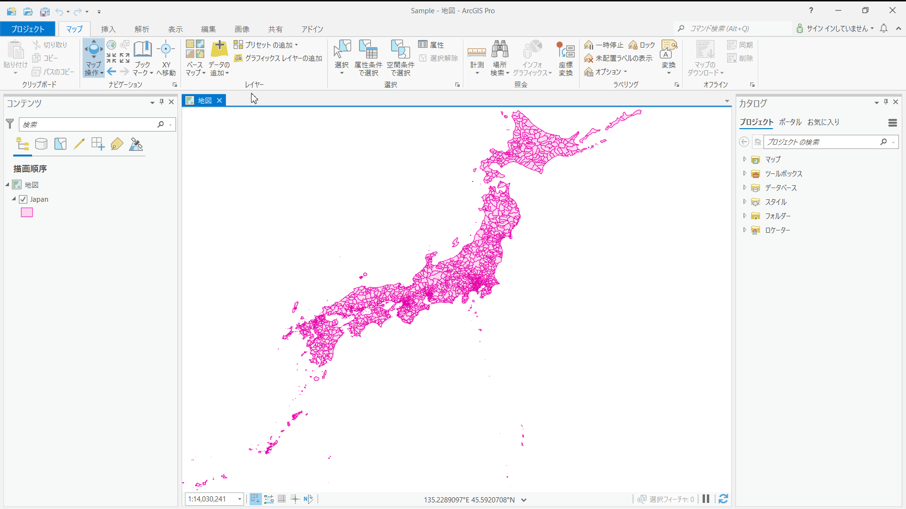

### 1-b. ドッキング ウインドウの作成

**演習時間**
* 15 分

**処理概要**
 - 「Japan」レイヤーのフィーチャを全て選択
 - 選択されたフィーチャにズーム

**演習の目的**
以下トピックについて理解を深める
* 非同期処理
* MVVM

 __※完成イメージ__

 

## 演習解答
[演習の解答はこちらでダウンロードできます](https://github.com/EsriJapan/workshops/raw/master/20211001_arcgis-pro-sdk-hands-on/hands-on/%E6%BC%94%E7%BF%921/source/Exercise1.zip)

## 1-a. アドイン ボタンの作成

### 手順
1. プロジェクト作成
2. ボタン作成
3. 非同期処理の実装
4. デバッグ

#### 1.プロジェクト作成
1-1.Visual Studio を起動します。

1-2.[新しいプロジェクトの作成] をクリックしてください。

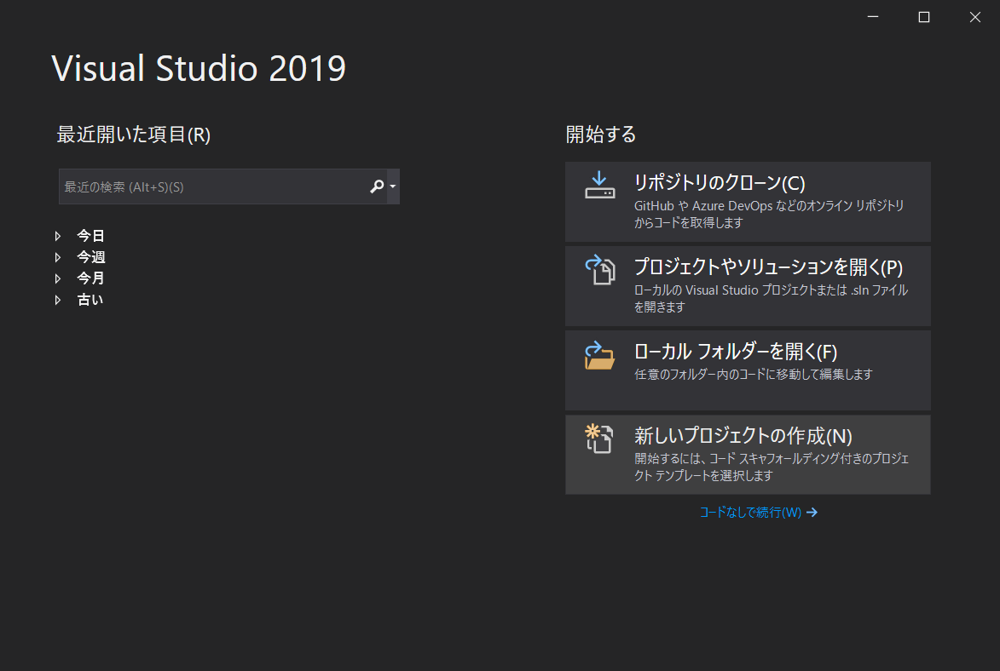

1-3.プロジェクトの種類に [ArcGIS Pro SDK] を設定し、[ArcGIS Pro モジュール アドイン] を選択して [次へ] をクリックしてください。

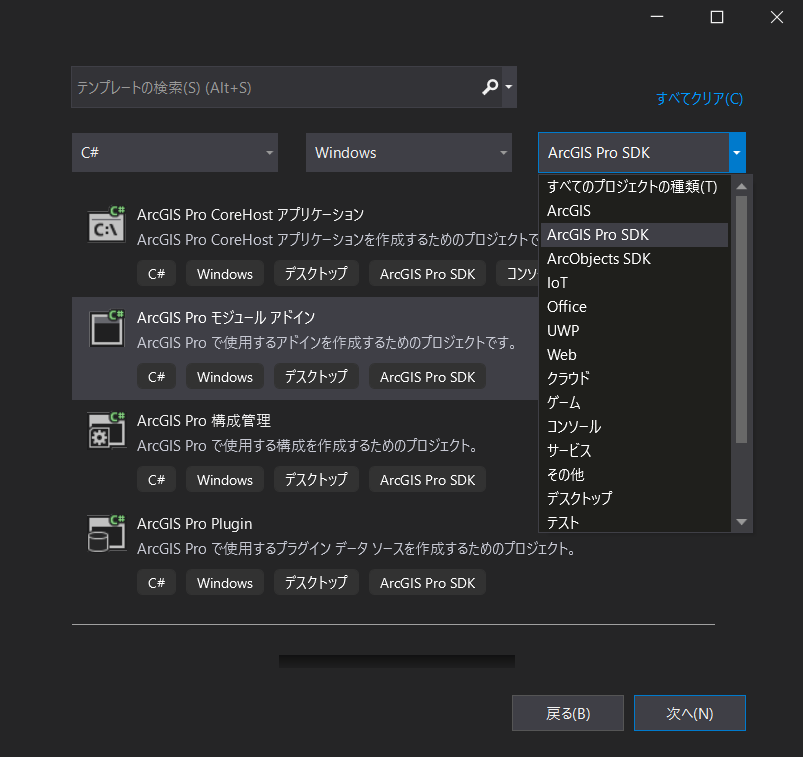

1-4.プロジェクト名を「Exercise1」に変更し [作成] をクリックしてください。

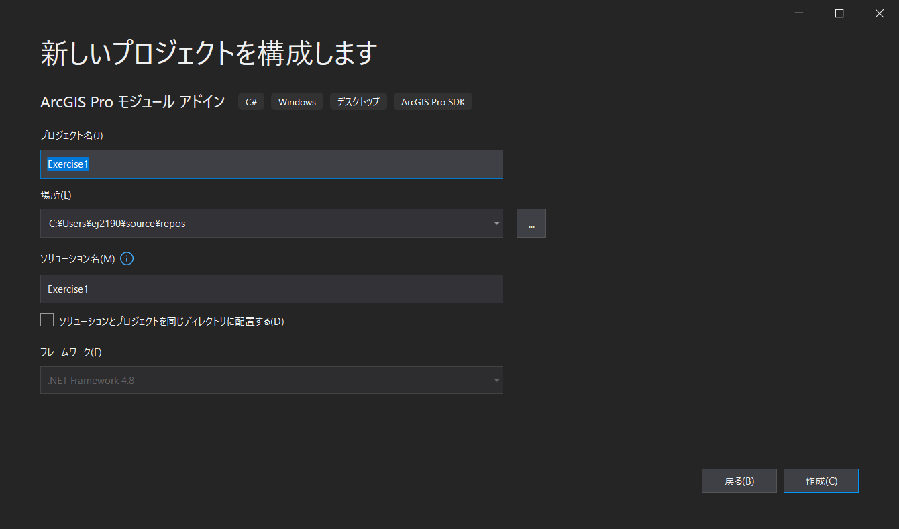

<font color="Red">__※フレームワークには .NET Framework 4.8 を選択してください。__</font>

#### 2.ボタン作成
2-1.Config.daml を開いて中身を確認してください。

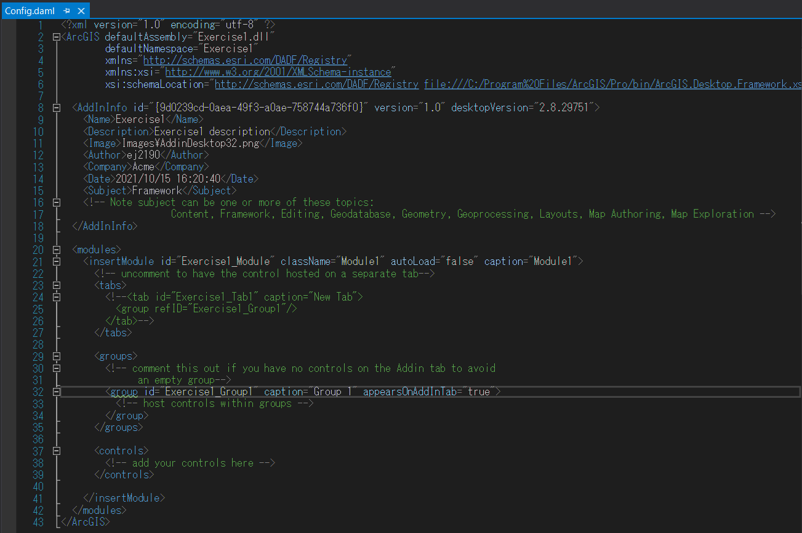

2-2.Config.daml の \<group> 要素の caption を 以下のように「Exercise1」に変更してください。

<font color="Red">__※caption を設定することで ArcGIS Pro 上でのラベルの設定を行うことができます。__</font>

```xml
<groups>
<!-- comment this out if you have no controls on the Addin tab to avoid
        an empty group-->
    <group id="Exercise1_Group1" caption="Exercise1" appearsOnAddInTab="true">
        <!-- host controls within groups -->
    </group>
</groups>
```

2-3.プロジェクトを右クリック > [追加] > [新しい項目] をクリックしてください。

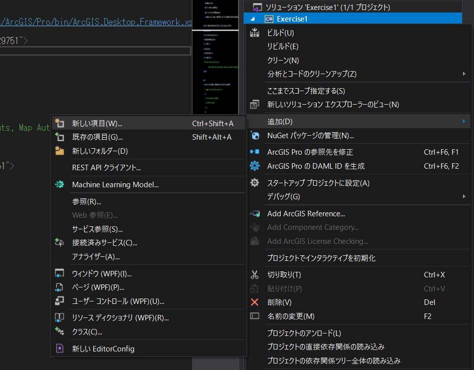

2-4.[ArcGIS Pro Add-ins] の [ArcGIS Pro ボタン] を選択してください。
また、ファイル名を「TestAddinButton.cs」に変更し [追加] をクリックしてください。

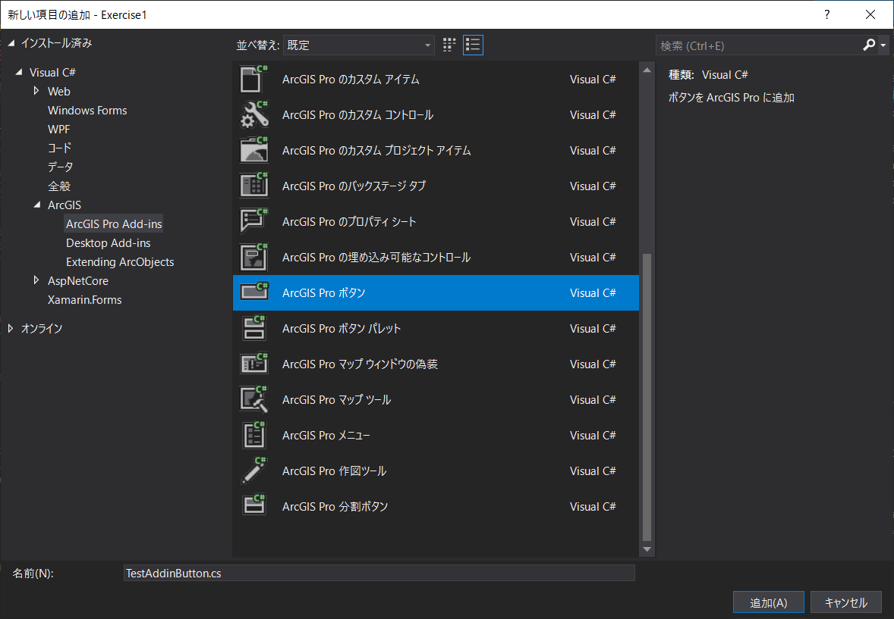

2-5.TestAddinButton.cs がプロジェクトに追加され、Config.daml の中身が更新されていることを確認してください。

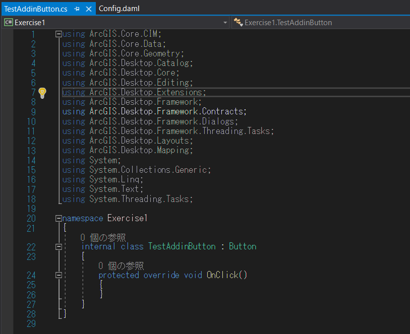</br>

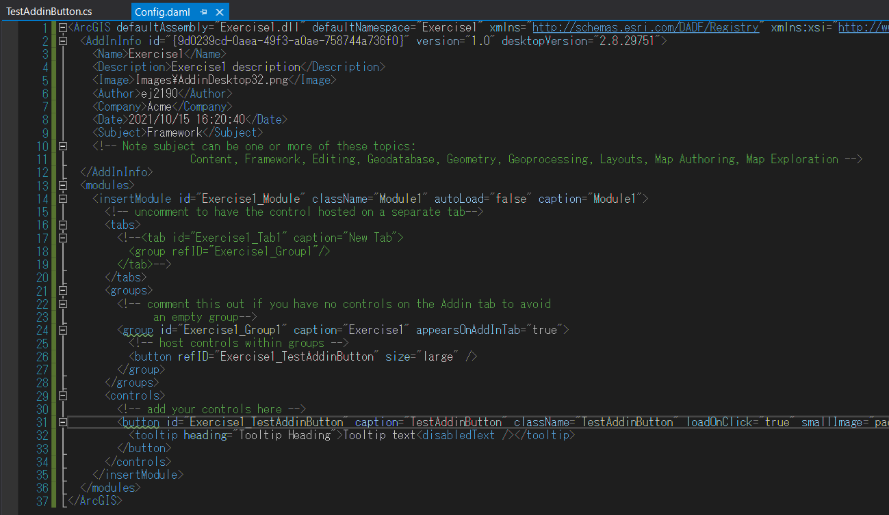

2-6.Config.daml の \<button> 要素の caption を 以下のように「アドイン ボタン」に変更してください。

```xml
<controls>
    <!-- add your controls here -->
    <button id="Exercise1_TestAddinButton" caption="アドイン ボタン" className="TestAddinButton" loadOnClick="true" smallImage="pack://application:,,,/ArcGIS.Desktop.Resources;component/Images/GenericButtonBlue16.png" largeImage="pack://application:,,,/ArcGIS.Desktop.Resources;component/Images/GenericButtonBlue32.png">
      <tooltip heading="Tooltip Heading">Tooltip text<disabledText /></tooltip>
    </button>
</controls>
```

#### 3.非同期処理の実装
3-1.TestAddinButton.cs を開いてください。

3-2.以下を using に追加してください。
```csharp
using ArcGIS.Desktop.Core.Geoprocessing;
```

3-3.OnClick メソッドを以下のように書き換えてください (属性検索とズーム処理を行います)。
```csharp
protected async override void OnClick()
{
    // 属性検索 (ジオプロセシング ツール) を実行
    await Geoprocessing.ExecuteToolAsync("SelectLayerByAttribute_management",
                                          new string[] {"Japan", "NEW_SELECTION", "KEN = '神奈川県'"});

    // 選択されたフィーチャに 3秒かけてズーム
    await MapView.Active.ZoomToSelectedAsync(new TimeSpan(0, 0, 3), true);
}
```

**ポイント**
- 属性検索時に await を使用 (検索が完了するまで待機しないと、次のズーム処理が想定通り動作しないため)
- await を使用する必要があるため、OnClick メソッド に async をつける

#### 4.デバッグ
4-1.プロジェクトをビルドしてください。

<font color="Red">__※ArcGIS Pro 2.8 以上を利用している場合は、プラットフォーム ターゲットを x64 に設定してビルドしてください。__</font>

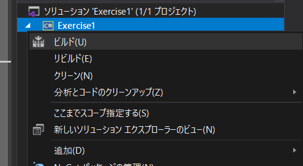

4-2.[開始] をクリックし、デバッグを実行します。

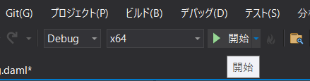

4-3.ArcGIS Pro が起動します。起動後 [別のプロジェクトを開く] をクリックし、事前にダウンロードしていただいたハンズオン データに格納されている「Sample.aprx」を開いてください。

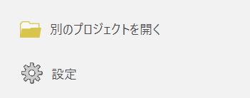</br>

 __※ダウンロードされていない方は [Sample.zip](https://github.com/EsriJapan/workshops/raw/master/20211001_arcgis-pro-sdk-hands-on/hands-on/%E6%BC%94%E7%BF%92%E3%83%87%E3%83%BC%E3%82%BF/Sample.zip) をダウンロードしてください__

4-4.ArcGIS Pro が起動したら [アドイン] タブ > [アドイン ボタン] をクリックしてください。

4-5.神奈川県のフィーチャが選択され、そこにズームします。

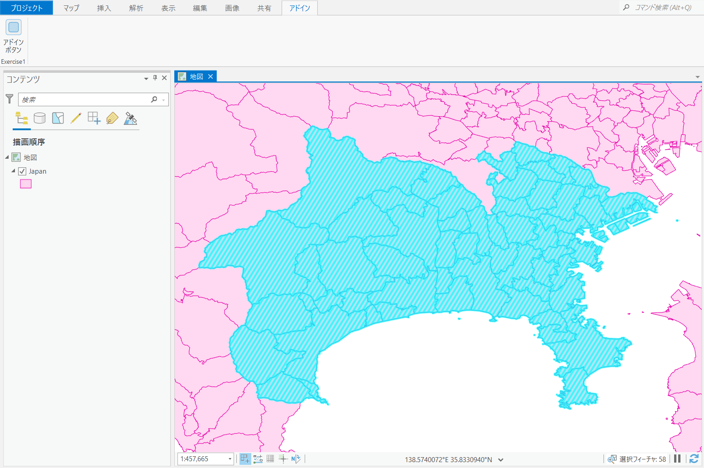

4-6.Visual Studio 上で [デバッグの停止] をクリックしてください。

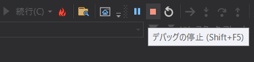

## 1-b. ドッキング ウインドウの作成

 __※「1-a. アドイン ボタンの作成」で作ったプロジェクトを使用します。__

### 手順
1. ドッキング ウインドウ作成
2. ドッキング ウインドウにボタンを配置 (View(XAML) の編集)
3. View(XAML) と ViewModel のバインディング
4. デバッグ

#### 1.ドッキング ウインドウ作成
1-1.プロジェクトを右クリック > [追加] > [新しい項目] をクリックしてください。


1-2.[ArcGIS Pro Add-ins] の [ArcGIS Pro ドッキング ウインドウ] を選択してください。ファイル名を「TestAddinDockpane.xaml」に変更し [追加] をクリックしてください。

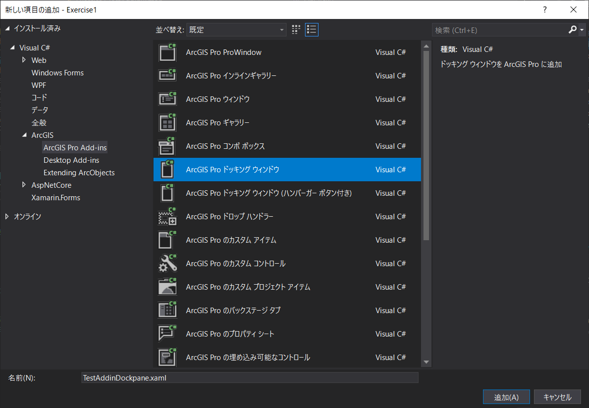

1-3.Config.damlの \<button> 要素 (id="Exercise1_TestAddinDockpane_ShowButton") の caption を 以下のように「ドッキング ウインドウ」に変更してください。

```xml
<button id="Exercise1_TestAddinDockpane_ShowButton" caption="ドッキング ウインドウ" className="TestAddinDockpane_ShowButton" loadOnClick="true" smallImage="pack://application:,,,/ArcGIS.Desktop.Resources;component/Images/GenericButtonPurple16.png" largeImage="pack://application:,,,/ArcGIS.Desktop.Resources;component/Images/GenericButtonPurple32.png">
    <tooltip heading="Show Dockpane">Show Dockpane<disabledText /></tooltip>
</button>
```

#### 2.ドッキング ウインドウにボタンを配置（View(XAML) の編集）

2-1.TestAddinDockpane.xaml を開いてください。</br>
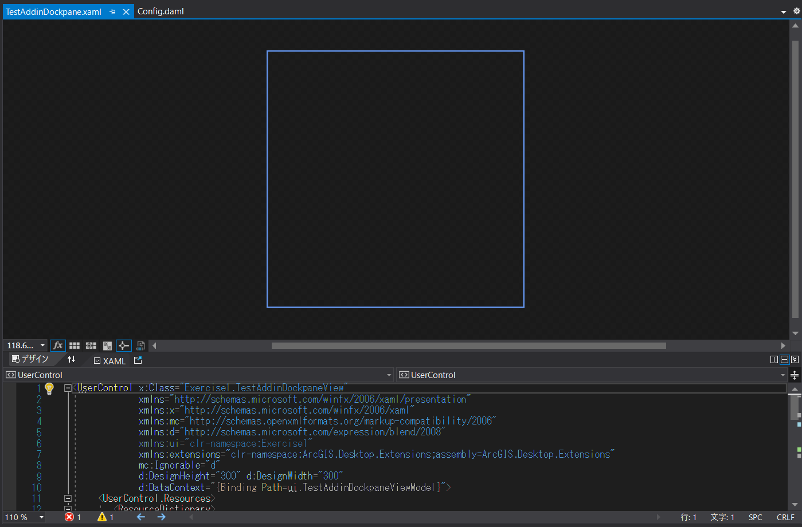

2-2.ツールボックスでボタンを選択し、以下のように配置してください。</br>
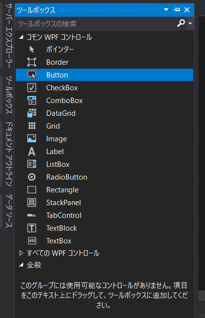</br>
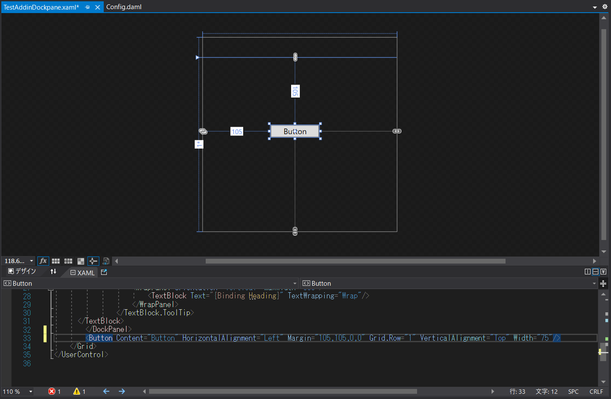

<br/>

#### 3.View(XAML) と ViewModel のバインディング
3-1.TestAddinDockpane.xaml の \<Button> 要素内に 以下のように Command="{Binding Path=HookTest}" を追記してください。
```xml
<Button Content="Button" HorizontalAlignment="Left" Margin="150,150,0,0" Grid.Row="1" VerticalAlignment="Top" Width="75" Command="{Binding Path=HookTest}"/>
```

3-2.TestAddinDockpaneViewModel.cs を開いてください。

3-3.以下を using に追加してください。
```csharp
using System.Windows.Input;
```

3-4.コンストラクター (protected TestAddinDockpaneViewModel() { }) の上に以下処理を追加してください。
```csharp
public ICommand HookTest { get; set; }
```

3-5.コンストラクター (protected TestAddinDockpaneViewModel() { }) の中に以下処理を追加してください。
```csharp
HookTest = new RelayCommand(() => HookButtonClick(), () => true);
```

3-6.コンストラクター (protected TestAddinDockpaneViewModel() { }) の下に以下のメソッドを追加してください。

```csharp
private void HookButtonClick()
{
    QueuedTask.Run(() =>
    {
        // 「Japan」レイヤーを選択
        var layers = MapView.Active.Map.FindLayers("Japan").OfType<FeatureLayer>().ToList();
        layers[0].Select();

        // 選択されたフィーチャに 3秒かけてズーム
        MapView.Active.ZoomToSelected(new TimeSpan(0, 0, 3), true);
    });
}
```
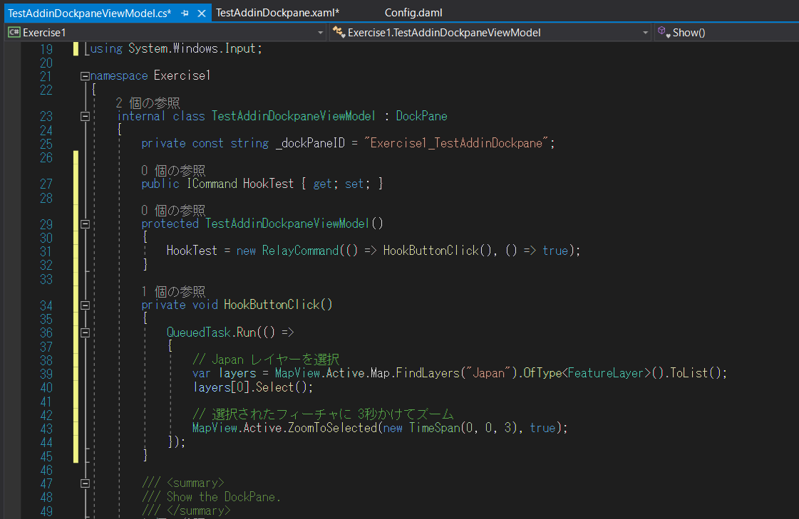

**ポイント**
- ズーム処理において、「1-a. アドイン ボタンの作成」の「3-3」で使用した ZoomToSelectedAsync メソッドは非同期処理 (Coarse-Grained Methods)、今回使用している ZoomToSelected メソッドは同期処理 (Fine-Grained Methods)。そのため、QueuedTask を使用する必要がある。
- コンストラクター (protected TestAddinDockpaneViewModel() { }) でイベント ハンドラー (HookButtonClick()) を登録

#### 4.デバッグ
4-1.「1-a. アドイン ボタンの作成」の「4-1」～「4-3」の手順を行ってください。

4-2.ArcGIS Pro が起動したら [アドイン] タブ > [ドッキング ウインドウ] をクリックしてください。</br>

4-3.ドッキング ウインドウが起動したら、[Button] を押してください。</br>

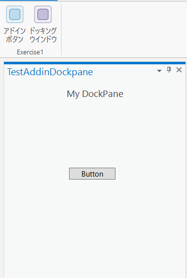

4-4.「Japan」レイヤーの全フィーチャが選択され、そこにズームします。

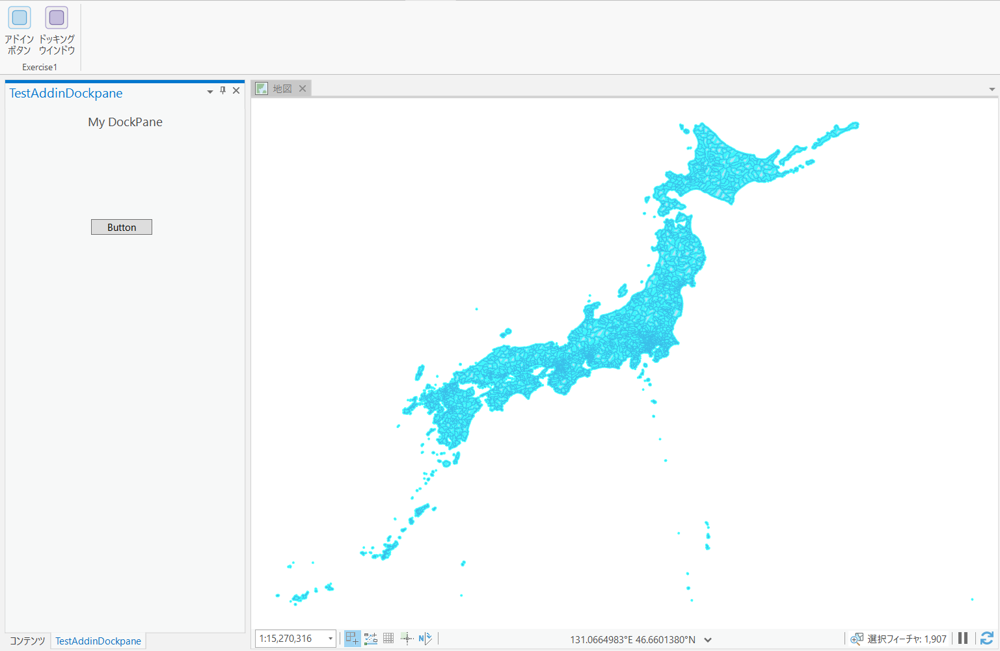

4-5.Visual Studio 上で [デバッグの停止] をクリックしてください。


4-6.(オプション) Windows エクスプローラーを起動し、"C:\Users\<ユーザー名>\Documents\ArcGIS\AddIns\ArcGISPro"
 に移動してください。
アドイン用のフォルダーが作成されていますので、そのフォルダーを削除してください。

※フォルダー内には拡張子が「.esriAddinX」のアドイン ファイルが作成されています。</br>
　これを削除することで、作成したアドインを ArcGIS Pro 上から削除することができます (ArcGIS Pro 上から削除することも可能)。