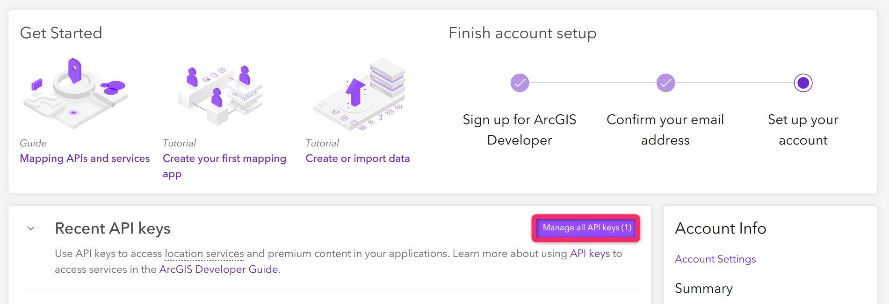
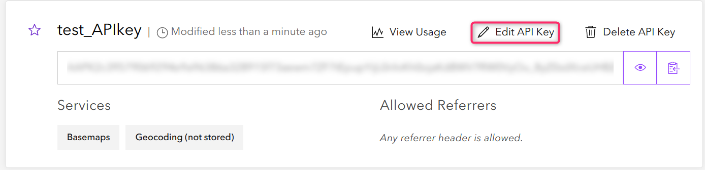
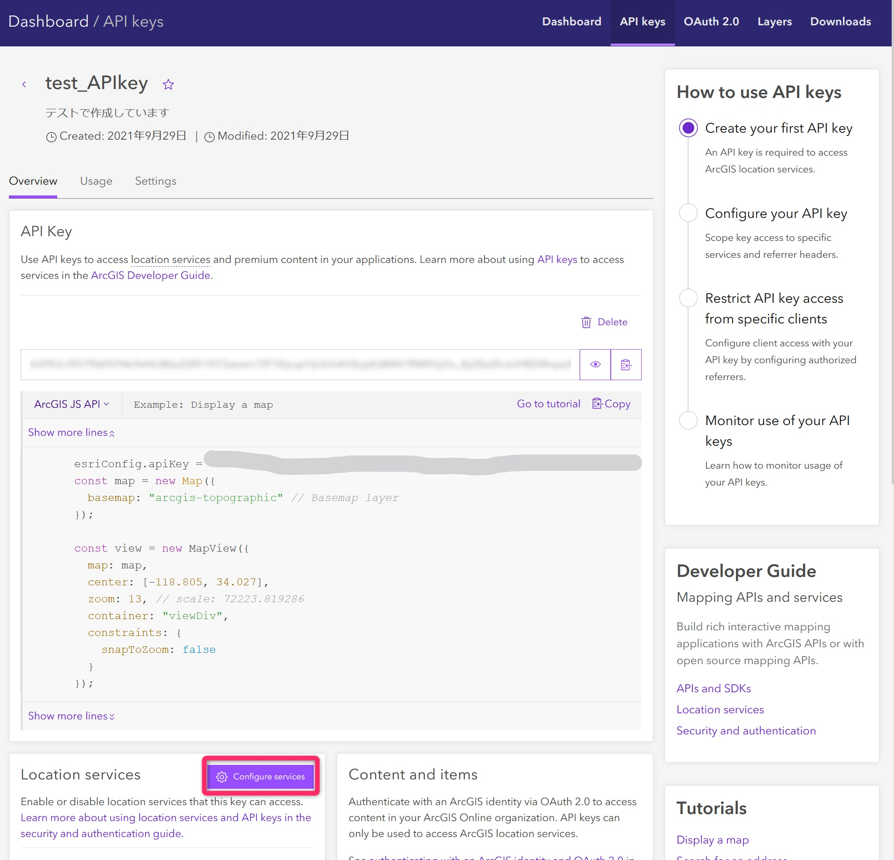
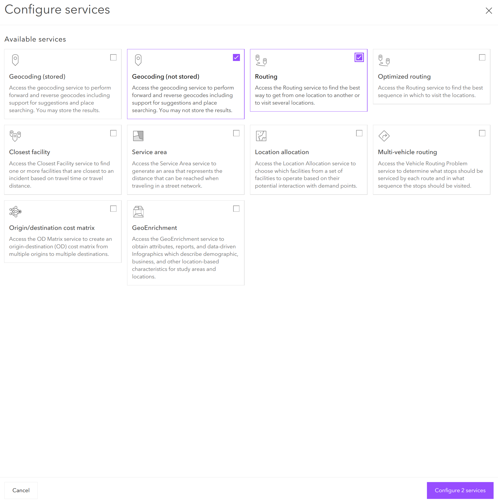
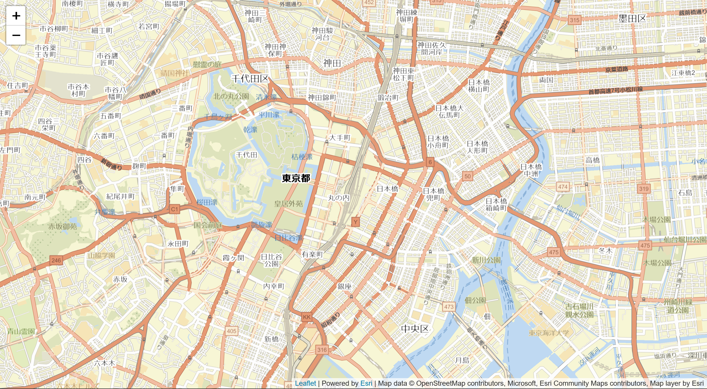

# オープンソースの Esri Leaflet を使用したルート検索アプリ開発のハンズオン
本ハンズオンでは、オープンソースの JavaScript ライブラリを使用して、地図をクリックするか地名検索を実行するとルート検索を行うアプリを開発します。
本ハンズオンの流れは以下の通りとなっています。開発パートは、本リポジトリの1.～5.にそって行なっていきます。6.では、このハンズオンで開発するアプリの発展形を紹介しています。

0. [使用する JavaScript ライブラリと本リポジトリの構成](#0-使用する-javascript-ライブラリと本リポジトリの構成)

本ハンズオンで使用する JavaScript ライブラリについて記載しております。また、本リポジトリの構成についても説明しています。

1. [API キーの作成と設定について](#1-api-キーの作成と設定について)

開発に使用する Esri のロケーションサービスにアクセスするための API キーの作成と設定について説明しています。

2. [地図の描画](#2-地図の描画)

Leaflet 及び Esri Leaflet を使用した地図の描画をします。ベースマップに Esri が提供するベースマップ レイヤーを使用しています。

3. [地名検索の導入](#3-地名検索の導入)

Esri Leaflet のプラグインを使用し、地名または住所を検索すると検索した場所にマーカーを表示するコードを実装しています。ここでは JavaScript のコードについて二段階に分けて説明しています。

4. [ルート検索の導入](#4-ルート検索の導入)

ArcGIS REST JS を使用し、地図上でクリックした二つの地点のルート検索を実行するコードを実装しています。ここでは JavaScript のコードについて三段階に分けて説明しています。

5. [地名検索をルート検索に反映](#5-地名検索をルート検索に反映)

3.で導入した地名検索の結果を4.のルート検索に反映するコードを実装しています。

6. [Calcite Design System によるアプリデザインの一例](#6-calcite-design-system-によるデザイン)

Esri が提供している Calcite Design System を用いたアプリデザインの一例を紹介しています。

なお、今回の開発にあたり JavaScript を触ったことがない方や環境設定が特殊な方などは、[CodePen](https://codepen.io/pen/) にアクセスすることでオンライン上で開発を体験することができるので、おすすめです。なお、Visual Studio Code を使用するなど自身の環境で行う方は、本ハンズオンでは、index.html と main.js という形式で解説していますので、同じ形式で進めていただければと思います。その際には、[過去のハンズオン](https://github.com/EsriJapan/workshops/tree/master/20200825_app-development-hands-on/Environment#2-%E9%96%8B%E7%99%BA%E7%92%B0%E5%A2%83)での環境設定も参考にしてください。

## 0. 使用する JavaScript ライブラリと本リポジトリの構成
[Leaflet](https://leafletjs.com/) は、メジャーで軽量なオープンソースのマッピング JavaScript ライブラリです。Leaflet は主に地図の表示や地図内に表示されるレイヤーの処理などを得意としています。
[Esri Leaflet](https://esri.github.io/esri-leaflet/) は、Esri のロケーションサービスが使えるオープンソースの Leaflet のプラグインとなっています。

今回は、Leaflet と Esri Leaflet 及び、同じくオープンソースとして Esri が提供している [ArcGIS REST JS](https://developers.arcgis.com/arcgis-rest-js/) を使ったルート検索アプリを作成します。

ArcGIS REST JS は、Esri が提供している ArcGIS REST API の JavaScript ベースのラッパーです。今回は、こちらを使用することでルート検索を実装していきます。 

本リポジトリには、ハンズオンで作成するアプリの完成形として、index.html と main.js を用意していますので、完成した状態の動作を確認したい方はこちらのソースコードを参考にしてください。また、本リポジトリにある [calcite_design フォルダ](./calcite_design) には発展形としてご紹介しているソースコードが用意されていますので、今後の開発の参考にしてください。

## 1. API キーの作成と設定について
始めにルート検索と地名検索の機能を使用するうえで必要となる開発者アカウントと API キーを作成します。

「[開発者アカウントの作成](https://esrijapan.github.io/arcgis-dev-resources/guide/get-dev-account/)」と「[API キーの取得](https://esrijapan.github.io/arcgis-dev-resources/guide/get-api-key/)」を参照して作成を行ってください。

「API キーの取得」が完了しましたら、以下の流れでロケーションサービスであるジオコーディングとルーティングを使用できるように設定します。

1. 開発者アカウントにログインし、ダッシュボードから API キーの設定編集ページに移動

ダッシュボードから API キーの管理画面へ移動します。


API キーの管理画面。使用する API キーの Edit API Key をクリックし、API キーの設定編集ページへ。


2. API キーで使用するロケーションサービスを設定

ページ中部の Location services の欄から Configure services をクリックします。


この中から Geocoding (not stored) と Routing にチェックします。


ここまでで、使用するロケーションサービスが利用できるようになりましたので、ここからルート検索アプリを開発していきます。


## 2. 地図の描画
まず、はじめに地図を描画しましょう。以下に HTML と JavaScript のコードを記します。この時、参照するリンクは leaflet.js と Esri Lealfet と Esri が提供しているベースマップを表示するために [esri-leaflet-vector](https://github.com/Esri/esri-leaflet-vector) を参照します。

### 2-1. ライブラリの参照を含んだ index.html の作成する
Leaflet と Esri Leaflet の参照を含む index.html を作成します。

```HTML
<html>

    <head>
        <meta charset="utf-8">
        <meta name="viewport" content="initial-scale=1,maximum-scale=1,user-scalable=no" />
        <title>ルート検索アプリ</title>

        <!-- 2-1. CDN から Leaflet の css と JS を取得 -->
        <link rel="stylesheet" href="https://unpkg.com/leaflet@1.7.1/dist/leaflet.css"
            integrity="sha512-xodZBNTC5n17Xt2atTPuE1HxjVMSvLVW9ocqUKLsCC5CXdbqCmblAshOMAS6/keqq/sMZMZ19scR4PsZChSR7A=="
            crossorigin=""/>
        <script src="https://unpkg.com/leaflet@1.7.1/dist/leaflet.js"
            integrity="sha512-XQoYMqMTK8LvdxXYG3nZ448hOEQiglfqkJs1NOQV44cWnUrBc8PkAOcXy20w0vlaXaVUearIOBhiXZ5V3ynxwA=="
            crossorigin=""></script>

        <!--  2-1. CDN から esri-leaflet の js を取得 -->
        <script src="https://unpkg.com/esri-leaflet@3.0.3/dist/esri-leaflet.js"></script>

        <!--  2-1. Esri のベクタータイルを使用するため CDN から esri-leaflet-vector の js を取得 -->
        <script src="https://unpkg.com/esri-leaflet-vector@3.1.0/dist/esri-leaflet-vector.js"></script>
        <style>
            body { margin:0; padding:0; }
            /* 2-1. 地図を表示する領域の CSS を指定 */
            #map {
                position: absolute;
                top:0;
                bottom:0;
                right:0;
                left:0;
            }
        </style>

   </head>
    <body>
        <!--  2-1. map オブジェクトを表示する要素を作成-->
        <div id="map"></div>
        <script type="text/javascript" src="main.js"></script>
    </body>

</html>
```

### 2-2. main.js に指定の地図を描画する機能を実装 
地図を描画するための main.js を作成します。

```JavaScript
// 2-2. API キーを入力
const apiKey="YOUR_API_KEY";
const basemap = "OSM:Streets";

// 2-2. ベースマップの追加 

// 2-2. マップを描画する場所を東京駅上空に指定
const map = L.map('map', {
    minZoom: 2
}).setView([35.68109305881504, 139.76717512821057], 14);

// 2-2. Esri のベクタータイルをベースマップに設定
L.esri.Vector.vectorBasemapLayer(basemap, {
  apiKey: apiKey
}).addTo(map);

```

Leaflet では、`L.map` でベースマップを反映する map オブジェクトを生成します。この時、map オブジェクトを `map` の id 属性を持つ要素に付与します。この時指定できる option に関しては、Leaflet の API リファレンス上にある [`L.map`](https://leafletjs.com/reference-1.7.1.html#map-l-map)の欄をご参考にしてください。
今回、日本国内でルート検索を行いたいと考えているため地図を表示する初期位置とズームレベルを指定する `.setView()` メソッドを map オブジェクトに付与します。
次に使用するベースマップとして、Esri の提供するベースマップを使うため Esri Leaflet のプラグイン esri-leaflet-vector の `L.esri.Vector.vectorBasemapLayer` を使用しています。この時、必要な値は API キーと使用したいベースマップの名前になります。今回は、ルート案内を行うことを目的としているため、道路の見やすい `OSM:Streets` を選択しています。このベースマップはオープンソースの Web 地図である [OpenStreetMap](https://openstreetmap.jp/#zoom=5&lat=38.06539&lon=139.04297&layers=B000) を基に Esri がベクタータイルにしたものになっています。

実際に地図を描画した様子は、以下の通りとなっています。これは東京駅を中心にして表示しています。


ここまで、ベースマップの描画で Esri が提供するベースマップを使用しましたが、例に示しているベースマップ( `OSM:Streets` )だけではなく、多くのベクタータイル ベースマップを提供しています。詳細は、[Basemap layer service](https://developers.arcgis.com/documentation/mapping-apis-and-services/maps/services/basemap-layer-service/) を参照してください。
Esri Leaflet でもベクタータイル ベースマップを選択する[サンプル](https://developers.arcgis.com/esri-leaflet/maps/change-the-basemap-layer/)などが用意されています。こちらは、目的にあったベースマップの選択が可能です。また、
[カスタムのベクタータイル ベースマップ](https://developers.arcgis.com/esri-leaflet/styles-and-visualization/display-a-custom-vector-tile-style/)の表示なども可能ですのでぜひご覧ください。

## 3. 地名検索の導入
今回、ルート検索を地名や住所から行えるようにするために [esri-leaflet-geocoder](https://github.com/Esri/esri-leaflet-geocoder) を参照しています。上記の地図を描画させた index.html と main.js に住所検索、地名検索を追加していきます。

### 3-1. index.html に esri-leaflet-geocoder の参照を追加

```HTML
<html>

    <head>
        <meta charset="utf-8">
        <meta name="viewport" content="initial-scale=1,maximum-scale=1,user-scalable=no" />
        <title>ルート検索アプリ</title>

          <!-- 2-1. CDN から Leaflet の css と JS を取得 -->
        <link rel="stylesheet" href="https://unpkg.com/leaflet@1.7.1/dist/leaflet.css"
            integrity="sha512-xodZBNTC5n17Xt2atTPuE1HxjVMSvLVW9ocqUKLsCC5CXdbqCmblAshOMAS6/keqq/sMZMZ19scR4PsZChSR7A=="
            crossorigin=""/>
        <script src="https://unpkg.com/leaflet@1.7.1/dist/leaflet.js"
            integrity="sha512-XQoYMqMTK8LvdxXYG3nZ448hOEQiglfqkJs1NOQV44cWnUrBc8PkAOcXy20w0vlaXaVUearIOBhiXZ5V3ynxwA=="
            crossorigin=""></script>

        <!--  2-1. CDN から esri-leaflet の js を取得 -->
        <script src="https://unpkg.com/esri-leaflet@3.0.3/dist/esri-leaflet.js"></script>

        <!--  2-1. Esri のベクタータイルを使用するため CDN から esri-leaflet-vector の js を取得 -->
        <script src="https://unpkg.com/esri-leaflet-vector@3.1.0/dist/esri-leaflet-vector.js"></script>

        <!-- 3-1. esri-Leaflet-geocoder への参照を追加 -->
        
        <!-- 3-1. CDN から esri-Leaflet-geocoder の css と js を取得 -->
        <link rel="stylesheet" href="https://unpkg.com/esri-leaflet-geocoder@3.1.1/dist/esri-leaflet-geocoder.css" integrity="sha512-IM3Hs+feyi40yZhDH6kV8vQMg4Fh20s9OzInIIAc4nx7aMYMfo+IenRUekoYsHZqGkREUgx0VvlEsgm7nCDW9g==" crossorigin="">
        <script src="https://unpkg.com/esri-leaflet-geocoder@3.1.1/dist/esri-leaflet-geocoder.js"integrity="sha512-enHceDibjfw6LYtgWU03hke20nVTm+X5CRi9ity06lGQNtC9GkBNl/6LoER6XzSudGiXy++avi1EbIg9Ip4L1w==" crossorigin=""></script>
        
        <!-- 3-1. esri-Leaflet-geocoder への参照を追加終了 -->
        
        <style>
            body { margin:0; padding:0; }
            /* 2-1. 地図を表示する領域の CSS を指定 */
            #map {
                position: absolute;
                top:0;
                bottom:0;
                right:0;
                left:0;
            }
        </style>

    </head>

    <body>
      <!--  2-1. map オブジェクトを表示する要素を作成-->
        <div id="map"></div>
        <script type="text/javascript" src="main.js"></script>
    </body>

</html>
```

### 3-2. main.js に地名検索の機能の実装
地名検索の機能の実装に関しては、二つに分けて解説します。

#### 3-2-1.  地名検索を行う機能を実装

```JavaScript
// 2-2. API キーを入力
const apiKey="YOUR_API_KEY";
const basemap = "OSM:Streets";

// 2-2. ベースマップの追加 

// 2-2. 地図を描画する場所を東京駅上空に指定
const map = L.map('map', {
    minZoom: 2
}).setView([35.68109305881504, 139.76717512821057], 14);

// 2-2. Esri のベクタータイルをベースマップに設定
L.esri.Vector.vectorBasemapLayer(basemap, {
  apiKey: apiKey
}).addTo(map);

// 2-2. ベースマップの追加の終了


// 3-2-1. 地名検索の追加

// 3-2-1. 地名検索
const searchControl = L.esri.Geocoding.geosearch({
    position: 'topleft', // 検索窓をどこに配置するかを指定
    placeholder: '住所または場所の名前を入力',
    useMapBounds: false, // 世界中からの検索結果を出力
    providers: [L.esri.Geocoding.arcgisOnlineProvider({
      apikey: apiKey
    })]
}).addTo(map);

// 3-2-1. 地名検索の追加を終了
```

`L.esri.Geocoding.geosearch` を使用して、地名検索を行うボタンを地図上に表示し、それらを変数 `searchControl` に入れています。今回指定している option とその説明を以下に羅列します。 

- position:検索バーと検索ボタンをどこに配置するかを指定します。デフォルトでは `topleft` を指定します。
- placeholder:検索バー内に何を入力する場所かについての説明を記します。
- useMapBounds:検索する縮尺範囲を指定します。デフォルトでは縮尺範囲 12 で検索をします。今回は false に指定し、全国で検索をかけます。
- provideers:地名の検索時使用するプロバイダを指定します。今回は、ArcGIS Online サーバーを使用しているので、API キーをセットして使用します。

これらの詳しい使い方、これ以外の option については、[API リファレンス](https://esri.github.io/esri-leaflet/api-reference/controls/geosearch.html)を参照してください。

しかし、このままでは地名の検索を行っただけですので、結果を地図上に反映することが出来ません。そのため次に地名検索を行った後に地図上に結果を反映させます。

#### 3-2-2. 地名検索を実行した後、マーカーを作成
```JavaScript
// 2-2. API キーを入力
const apiKey="YOUR_API_KEY";
const basemap = "OSM:Streets";

// 2-2. ベースマップの追加 

// 2-2. 地図を描画する場所を東京駅上空に指定
const map = L.map('map', {
    minZoom: 2
}).setView([35.68109305881504, 139.76717512821057], 14);

// 2-2. Esri のベクタータイルをベースマップに設定
L.esri.Vector.vectorBasemapLayer(basemap, {
  apiKey: apiKey
}).addTo(map);

// 2-2. ベースマップの追加の終了

// 3-2-1. 地名検索の追加

// 3-2-1. 地名検索
const searchControl = L.esri.Geocoding.geosearch({
    position: 'topleft', // 検索窓をどこに配置するかを指定
    placeholder: '住所または場所の名前を入力',
    useMapBounds: false, // 世界中からの検索結果を出力
    providers: [L.esri.Geocoding.arcgisOnlineProvider({
      apikey: apiKey
    })]
}).addTo(map);

// 3-2-1. 地名検索の追加を終了


// 3-2-2. 地名検索を行った後の動作を追加

// 3-2-2. 検索結果を入れるレイヤーの作成
let searchlayers=L.layerGroup().addTo(map);

// 3-2-2. 検索後の動作を指定。結果を地図上に描画。検索結果最上位を基本的に取得
searchControl.on('results', function (data) {
    if(data.results){
        coordinates = data.results[0].latlng;
        searchlayers.clearLayers(); //前回の結果を削除
        L.marker(coordinates).addTo(searchlayers);
    }    
});

// 3-2-2. 地名検索を行った後の動作を追加の終了
```

先に検索したものをまとめて管理するためにポイント用のレイヤーとして `searchlayers` を用意します。[`L.layer.Group()`](https://leafletjs.com/reference-1.7.1.html#layergroup) は、Leaflet の関数で、Leaflet 上で扱えるレイヤーを作成します。このレイヤーは、地名検索の結果を入れておくレイヤーになります。

`searchControl.on` は、変数 `searchControl` の `results` の値が変更されたときに起動します。そのイベントが起動した時 `data.results` に値が入っていれば、変数 `coordinates` に `data.results` の一個目の値から `latlng`(位置情報) を取得します。その時、検索結果が地図上に反映されている場合その値を `.clearLayers()` で削除します。これによって地図上に検索した値が残らずに新しく検索した結果のみ表示することができます。 [`L.marker`](https://leafletjs.com/reference-1.7.1.html#marker) は、地図上に立てるピンを生成します。この値を `searchLayers` に追加することで地図上に検索した地点にピンを立てることができます。

地名検索で「羽田空港」と「東京ディズニーランド」を検索した結果が以下のようになります。


esri-leaflet-geocoder には他にも機能が搭載されています。座標から住所を取り出す [reverse-geocode](https://developers.arcgis.com/esri-leaflet/geocode-and-search/reverse-geocode/) や地名ではなく、施設の種類で検索を行う [Find pleces](https://developers.arcgis.com/esri-leaflet/geocode-and-search/find-places/) などがありますので、今回のルート検索アプリを発展させた多機能なルート検索などを開発したい方は、参考にしてください。
これらのジオコーディングに関する機能は [ArcGIS REST API](https://developers.arcgis.com/documentation/mapping-apis-and-services/search/) を参照しています。

## 4. ルート検索の導入
ルート検索を導入するために ArcGIS REST JS を参照します。ここでは、マップ上でクリックをするとマーカーが表示され、もう一度クリックした場所へのルート検索を実行するようなサンプルを作成しています。また、ルートまでの案内文も表示しています。

### 4-1. index.html に ArcGIS REST JS の参照を追加。ルート案内のメッセージを記すために div 要素も追加

```HTML
<html>

    <head>
        <meta charset="utf-8">
        <meta name="viewport" content="initial-scale=1,maximum-scale=1,user-scalable=no" />
        <title>ルート検索アプリ</title>

          <!-- 2-1. CDN から Leaflet の css と JS を取得 -->
        <link rel="stylesheet" href="https://unpkg.com/leaflet@1.7.1/dist/leaflet.css"
            integrity="sha512-xodZBNTC5n17Xt2atTPuE1HxjVMSvLVW9ocqUKLsCC5CXdbqCmblAshOMAS6/keqq/sMZMZ19scR4PsZChSR7A=="
            crossorigin=""/>
        <script src="https://unpkg.com/leaflet@1.7.1/dist/leaflet.js"
            integrity="sha512-XQoYMqMTK8LvdxXYG3nZ448hOEQiglfqkJs1NOQV44cWnUrBc8PkAOcXy20w0vlaXaVUearIOBhiXZ5V3ynxwA=="
            crossorigin=""></script>

        <!--  2-1. CDN から esri-leaflet の js を取得 -->
        <script src="https://unpkg.com/esri-leaflet@3.0.3/dist/esri-leaflet.js"></script>

        <!--  2-1. Esri のベクタータイルを使用するため CDN から esri-leaflet-vector の js を取得 -->
        <script src="https://unpkg.com/esri-leaflet-vector@3.1.0/dist/esri-leaflet-vector.js"></script>

        <!-- 3-1. esri-leaflet-geocoder への参照を追加 -->
        
        <!-- 3-1. CDN から esri-leaflet-geocoder の css と js を取得 -->
        <link rel="stylesheet" href="https://unpkg.com/esri-leaflet-geocoder@3.1.1/dist/esri-leaflet-geocoder.css" integrity="sha512-IM3Hs+feyi40yZhDH6kV8vQMg4Fh20s9OzInIIAc4nx7aMYMfo+IenRUekoYsHZqGkREUgx0VvlEsgm7nCDW9g==" crossorigin="">
        <script src="https://unpkg.com/esri-leaflet-geocoder@3.1.1/dist/esri-leaflet-geocoder.js"integrity="sha512-enHceDibjfw6LYtgWU03hke20nVTm+X5CRi9ity06lGQNtC9GkBNl/6LoER6XzSudGiXy++avi1EbIg9Ip4L1w==" crossorigin=""></script>

        <!-- 4-1.ArcGIS REST JS を追加 -->

        <!-- 4-1.CDN から ArcGIS REST JS の js を取得 -->
        <script src="https://unpkg.com/@esri/arcgis-rest-request@3.0.0/dist/umd/request.umd.js"></script>
        <script src="https://unpkg.com/@esri/arcgis-rest-routing@3.0.0/dist/umd/routing.umd.js"></script>
        <script src="https://unpkg.com/@esri/arcgis-rest-auth@3.0.0/dist/umd/auth.umd.js"></script>

        <!-- 4-1.追加終了 -->

        <style>
            body { margin:0; padding:0; }
            /* 2-1. 地図を表示する領域の CSS を指定 */
            #map {
            position: absolute;
            top:0;
            bottom:0;
            right:0;
            left:0;
            }

            /* 4-1.ルート案内文を記載する領域の CSS の追加 */
            
            #directions {
            position: absolute;
            z-index: 1000;
            width: 30%;
            max-height: 50%;
            right: 20px;
            top: 20px;
            overflow-y: auto; 
            background: white;
            line-height: 1.5;
            font-size: 14px;
            padding: 10px;
            }

            /* 4-1. CSS の追加終了 */
        
        </style>

    </head>

    <body>
        <!--  2-1. map オブジェクトを表示する要素を作成-->
        <div id="map"></div>
        
        <!-- 4-1. ルート案内の内容を表記する要素を追加 -->
        
        <div id="directions">ルート検索をしたい場所をクリックしてください</div>
        
        <!-- 4-1. 追加終了 -->
        <script type="text/javascript" src="main.js"></script>
    </body>

</html>
```

### 4-2. main.js にクリックした地点でルート検索を行う機能を実装
ルート検索の機能の実装については、三つに分けて説明します。

#### 4-2-1. ルート検索に必要な値を作成する関数を用意

```JavaScript
// 2-2. API キーを入力
const apiKey="YOUR_API_KEY";
const basemap = "OSM:Streets";

// 2-2. ベースマップの追加 

// 2-2. 地図を描画する場所を東京駅上空に指定
const map = L.map('map', {
    minZoom: 2
}).setView([35.68109305881504, 139.76717512821057], 14);

// 2-2. Esri のベクタータイルをベースマップに設定
L.esri.Vector.vectorBasemapLayer(basemap, {
  apiKey: apiKey
}).addTo(map);

// 2-2. ベースマップの追加の終了

/* 3-2. 地名検索の機能 */

// 3-2-1. 地名検索
const searchControl = L.esri.Geocoding.geosearch({
    position: 'topleft', // 検索窓をどこに配置するかを指定
    placeholder: '住所または場所の名前を入力',
    useMapBounds: false, // 世界中からの検索結果を出力
    providers: [L.esri.Geocoding.arcgisOnlineProvider({
      apikey: apiKey
    })]
}).addTo(map);

// 3-2-2. 地名検索を行った後の動作を追加

// 3-2-2. 検索結果を入れるレイヤーの作成
let searchlayers=L.layerGroup().addTo(map);

// 3-2-2. 検索後の動作を指定。結果を地図上に描画。検索結果最上位を基本的に取得
searchControl.on('results', function (data) {
    if(data.results){
        coordinates = data.results[0].latlng;
        searchlayers.clearLayers(); //前回の結果を削除
        L.marker(coordinates).addTo(searchlayers);
    }    
});


// 4-2. ルート検索の機能の追加

// 4-2-1. ルート検索に使う変数と始点終点を決めるための関数の追加


// 4-2-1. directions の要素を取得し、ルート案内を表示する
const directions=document.getElementById("directions");

// 4-2-1. マップ上の検索結果をリセットするために始点と終点、ルート案内のラインのレイヤーグループを作成
const startLayerGroup = L.layerGroup().addTo(map);
const endLayerGroup = L.layerGroup().addTo(map);
const routeLines = L.layerGroup().addTo(map);

let currentStep = "start"; 
let startCoords, endCoords;

// 4-2-1. ルート検索をしたい始点終点を決めるための関数
function addstoppoint(){
    if (currentStep === "start") {
      startLayerGroup.clearLayers(); 
      endLayerGroup.clearLayers(); 
      routeLines.clearLayers(); 
      L.marker(coordinates).addTo(startLayerGroup); // 始点にマーカーを作成
      startCoords = [coordinates.lng,coordinates.lat]; 
      currentStep = "end"; 
    } else {
      L.marker(coordinates).addTo(endLayerGroup); // 終点にマーカーを作成
      endCoords = [coordinates.lng,coordinates.lat]; 
      currentStep = "start"; 
    }
  
    if (startCoords && endCoords) {
      searchRoute(); // 始点と終点ができたらルート検索をかける
    }
}


// 4-2-1. ルート検索に使う変数と始点終点を決めるための関数の追加終了
```

まず始めにルート検索に必要な始点と終点を設置するために変数と関数を作成します。ルート検索をしたあと、もう一度別のルート検索を行う際に以前の検索結果を削除するために始点情報を入れるレイヤー `startLayerGroup` 、終点情報を入れるレイヤー `endLayerGroup`、ルートのライン情報を入れる `routeLines` に `L.layerGroup()` で Layer オブジェクトを設定します。他にも設定するポイントが始点か終点かを判定するために使うフラグとして変数 `currentStep` を作成し、始点の位置情報として `startCoords` 、終点の位置情報として `endCoords` を用意します。

次にルート検索をしたい始点、終点の情報を作成する関数 `addstoppoint` を作成します。この関数では、ルート検索をかける前の位置情報の収納と始点終点の位置にピンを立てる役割を持たせます。また、始点終点の値に位置情報が設置されたらルート検索を行う条件分岐を用意します。次にルート検索を行う ArcGIS REST JS の `arcgisRest.solveRoute` を扱う関数 `searchRoute` を作成します。

#### 4-2-2. ルート検索を行う関数を実装

```JavaScript
// 2-2. API キーを入力
const apiKey="YOUR_API_KEY";
const basemap = "OSM:Streets";

// 2-2. ベースマップの追加 

// 2-2. 地図を描画する場所を東京駅上空に指定
const map = L.map('map', {
    minZoom: 2
}).setView([35.68109305881504, 139.76717512821057], 14);

// 2-2. Esri のベクタータイルをベースマップに設定
L.esri.Vector.vectorBasemapLayer(basemap, {
  apiKey: apiKey
}).addTo(map);

// 2-2. ベースマップの追加の終了

/* 3-2. 地名検索の機能 */

// 3-2-1. 地名検索
const searchControl = L.esri.Geocoding.geosearch({
    position: 'topleft', // 検索窓をどこに配置するかを指定
    placeholder: '住所または場所の名前を入力',
    useMapBounds: false, // 世界中からの検索結果を出力
    providers: [L.esri.Geocoding.arcgisOnlineProvider({
      apikey: apiKey
    })]
}).addTo(map);

// 3-2-2. 地名検索を行った後の動作を追加

// 3-2-2. 検索結果を入れるレイヤーの作成
let searchlayers=L.layerGroup().addTo(map);

// 3-2-2. 検索後の動作を指定。結果を地図上に描画。検索結果最上位を基本的に取得
searchControl.on('results', function (data) {
    if(data.results){
        coordinates = data.results[0].latlng;
        searchlayers.clearLayers(); //前回の結果を削除
        L.marker(coordinates).addTo(searchlayers);
    }    
});

// 4-2. ルート検索の機能の追加

// 4-2-1. directions の要素を取得し、ルート案内を表示する
const directions=document.getElementById("directions");

// 4-2-1. マップ上の検索結果をリセットするために始点と終点、ルート案内のラインのレイヤーグループを作成
const startLayerGroup = L.layerGroup().addTo(map);
const endLayerGroup = L.layerGroup().addTo(map);
const routeLines = L.layerGroup().addTo(map);

let currentStep = "start"; 
let startCoords, endCoords;

// 4-2-1. ルート検索をしたい始点終点を決めるための関数
function addstoppoint(){
    if (currentStep === "start") {
      startLayerGroup.clearLayers(); 
      endLayerGroup.clearLayers(); 
      routeLines.clearLayers(); 
      L.marker(coordinates).addTo(startLayerGroup); // 始点にマーカーを作成
      startCoords = [coordinates.lng,coordinates.lat]; 
      currentStep = "end"; 
    } else {
      L.marker(coordinates).addTo(endLayerGroup); // 終点にマーカーを作成
      endCoords = [coordinates.lng,coordinates.lat]; 
      currentStep = "start"; 
    }
  
    if (startCoords && endCoords) {
      searchRoute(); // 始点と終点ができたらルート検索をかける
    }
}


// 4-2-2. ルート検索の関数の追加開始

// 4-2-2. ルート検索の実行をする関数
function searchRoute() {
    // arcgis-rest-js を利用するための認証用の変数を用意します。
    const authentication = new arcgisRest.ApiKey({
      key: apiKey
    });
    // ルート検索
    arcgisRest
      .solveRoute({
        stops: [startCoords, endCoords], 
        endpoint: "https://route-api.arcgis.com/arcgis/rest/services/World/Route/NAServer/Route_World/solve",
        authentication,
        params:{directionsLanguage:"ja"} // 使用言語を日本語に変更
        })
        // 結果の表示
      .then((response) => {
        L.geoJSON(response.routes.geoJson).addTo(routeLines); 
        const directionsHTML = response.directions[0].features.map((f) => f.attributes.text).join("<br/>");
        directions.innerHTML = directionsHTML;
        startCoords = null; // 最後にスタート、終点の位置情報をリセット
        endCoords = null;
      })
      // エラー時の表示
      .catch((error) => {
        console.error(error);
        alert("ルート検索に失敗しました<br>始点と終点の情報をリセットします");
        startCoords = null; // エラー時にも始点、終点の位置情報をリセット
        endCoords = null;
      });
 }

// 4-2-2. ルート検索の関数の追加を終了
```
関数 `searchRoute` では、初めに ArcGIS REST API を呼び出すために必要な API キーを ArcGIS REST JS で使用するために [arcgisRest.ApiKey](https://esri.github.io/arcgis-rest-js/api/auth/ApiKey/) で使用する API キーを指定します。そのあと、ルート検索を行う `arcgisRest.solveRoute` の設定をします。実行前に始点と終点を指定する必要があるため、 `startCoords` と `endCoords` の値が入力された後にルート検索を実行します。`arcgisRest.solveRoute` にはいくつか option が設定されていますが、今回使用している option の説明を以下に羅列します。

- stops:ルート検索を行う始点と終点の座標をここで指定します。
- endpoint:ルート検索を行うためのサービスのエンドポイントを指定します。今回は、ArcGIS REST API を使用します。
- authenticaion:ルート検索を行うルート案内のサービスへのリクエストをするための認証を指定します。
- params:ArcGIS REST JS の option に追加で与えるリクエストを指定します。今回は、ルート案内の言語を日本語に指定するために directionsLanguage パラメータを設定します。

この他の option に関しては [API リファレンス](https://esri.github.io/arcgis-rest-js/api/routing/solveRoute/)を参考にしてください。
このルート検索の結果は、`respose` に入ります。これを `.then` メソッドで出力します。そこから [`L.geoJSON`](https://leafletjs.com/reference-1.7.1.html#geojson)で検索結果からルートのラインを描画します。そして、ルート案内の文章がある `response.direction` からルート案内の文章を取得し、その文章を `directionsHTML` に入れ、directions の id 属性が設定されている要素を持っている `directions` の文章を `.innnerHTML` で `directionsHTML` に書き換えます。そのあと、始点終点の位置情報をリセットし、次の検索にスムーズに移行できるようにします。
また、`.catch` メソッドも使用し、結果が返ってこないときやエラーが起きた際に Web コンソールにエラー値を返し、アラートを表示するようにします。

#### 4-2-3. クリックした地点の間でルート検索を実行
```JavaScript
// 2-2. API キーを入力
const apiKey="YOUR_API_KEY";
const basemap = "OSM:Streets";

// 2-2. ベースマップの追加 

// 2-2. 地図を描画する場所を東京駅上空に指定
const map = L.map('map', {
    minZoom: 2
}).setView([35.68109305881504, 139.76717512821057], 14);

// 2-2. Esri のベクタータイルをベースマップに設定
L.esri.Vector.vectorBasemapLayer(basemap, {
  apiKey: apiKey
}).addTo(map);

// 2-2. ベースマップの追加の終了

/* 3-2. 地名検索の機能 */

// 3-2-1. 地名検索
const searchControl = L.esri.Geocoding.geosearch({
    position: 'topleft', // 検索窓をどこに配置するかを指定
    placeholder: '住所または場所の名前を入力',
    useMapBounds: false, // 世界中からの検索結果を出力
    providers: [L.esri.Geocoding.arcgisOnlineProvider({
      apikey: apiKey
    })]
}).addTo(map);

// 3-2-2. 地名検索を行った後の動作を追加

// 3-2-2. 検索結果を入れるレイヤーの作成
let searchlayers=L.layerGroup().addTo(map);

// 3-2-2. 検索後の動作を指定。結果を地図上に描画。検索結果最上位を基本的に取得
searchControl.on('results', function (data) {
    if(data.results){
        coordinates = data.results[0].latlng;
        searchlayers.clearLayers(); //前回の結果を削除
        L.marker(coordinates).addTo(searchlayers);
    }    
});

// 4-2. ルート検索の機能の追加

// 4-2-1. directions の要素を取得し、ルート案内を表示する
const directions=document.getElementById("directions");

// 4-2-1. マップ上の検索結果をリセットするために始点と終点、ルート案内のラインのレイヤーグループを作成
const startLayerGroup = L.layerGroup().addTo(map);
const endLayerGroup = L.layerGroup().addTo(map);
const routeLines = L.layerGroup().addTo(map);

let currentStep = "start"; 
let startCoords, endCoords;

// 4-2-1. ルート検索をしたい始点終点を決めるための関数
function addstoppoint(){
    if (currentStep === "start") {
      startLayerGroup.clearLayers(); 
      endLayerGroup.clearLayers(); 
      routeLines.clearLayers(); 
      L.marker(coordinates).addTo(startLayerGroup); // 始点にマーカーを作成
      startCoords = [coordinates.lng,coordinates.lat]; 
      currentStep = "end"; 
    } else {
      L.marker(coordinates).addTo(endLayerGroup); // 終点にマーカーを作成
      endCoords = [coordinates.lng,coordinates.lat]; 
      currentStep = "start"; 
    }
  
    if (startCoords && endCoords) {
      searchRoute(); // 始点と終点ができたらルート検索をかける
    }
}

// 4-2-2. ルート検索の関数の追加開始

// 4-2-2. ルート検索の実行をする関数
function searchRoute() {
    // arcgis-rest-js を利用するための認証用の変数を用意します。
    const authentication = new arcgisRest.ApiKey({
      key: apiKey
    });
    // ルート検索
    arcgisRest
      .solveRoute({
        stops: [startCoords, endCoords], 
        endpoint: "https://route-api.arcgis.com/arcgis/rest/services/World/Route/NAServer/Route_World/solve",
        authentication,
        params:{directionsLanguage:"ja"} // 使用言語を日本語に変更
        })
        // 結果の表示
      .then((response) => {
        L.geoJSON(response.routes.geoJson).addTo(routeLines); 
        const directionsHTML = response.directions[0].features.map((f) => f.attributes.text).join("<br/>");
        directions.innerHTML = directionsHTML;
        startCoords = null; // 最後にスタート、終点の位置情報をリセット
        endCoords = null;
      })
      // エラー時の表示
      .catch((error) => {
        console.error(error);
        alert("ルート検索に失敗しました<br>始点と終点の情報をリセットします");
        startCoords = null; // エラー時にも始点、終点の位置情報をリセット
        endCoords = null;
      });
 }


// 4-2-3. 地図上をクリックした場所の位置情報をルート検索の始点もしくは終点に登録するメソッドを追加

 // 4-2-3. クリックした場所の位置情報を返す
map.on("click", (e) => {
    coordinates = e.latlng;
    addstoppoint();
  });

// 4-2-3. 地図上をクリックした場所の位置情報をルート検索の始点もしくは終点に登録するメソッドを追加の終了
```
最後にルート検索を実行する方法として、`map.on` メソッドで地図上をクリックするとクリックした場所の情報を返すように指定します。その位置情報を `coordinates` に与えます。その後、関数 `addstopoint()` を起動して、ルート検索の始点終点を設定します。

地図上でクリックすると以下の動画のようにルート検索を実行し、結果を地図上に描画し、右上に始点から終点までのルート案内を表示します。


シンプルなルート検索だけではなく、出発地点と時間の指定をすることで到達できる場所の領域を生成することができる[到達圏エリアの作成](https://developers.arcgis.com/esri-leaflet/route-and-directions/find-service-areas/)も可能です。

こちらは、[ArcGIS REST API](https://developers.arcgis.com/documentation/mapping-apis-and-services/routing/) を参照しています。

## 5. 地名検索をルート検索に反映
最後に地名検索をルート検索に反映させます。

### 5-1. 地名検索後、ルート検索の機能が動作するように設定

```HTML
<html>

<head>
  <meta charset="utf-8">
  <meta name="viewport" content="initial-scale=1,maximum-scale=1,user-scalable=no" />
  <title>ルート検索アプリ</title>

      <!-- 2-1. CDN から Leaflet の css と JS を取得 -->
        <link rel="stylesheet" href="https://unpkg.com/leaflet@1.7.1/dist/leaflet.css"
            integrity="sha512-xodZBNTC5n17Xt2atTPuE1HxjVMSvLVW9ocqUKLsCC5CXdbqCmblAshOMAS6/keqq/sMZMZ19scR4PsZChSR7A=="
            crossorigin=""/>
        <script src="https://unpkg.com/leaflet@1.7.1/dist/leaflet.js"
            integrity="sha512-XQoYMqMTK8LvdxXYG3nZ448hOEQiglfqkJs1NOQV44cWnUrBc8PkAOcXy20w0vlaXaVUearIOBhiXZ5V3ynxwA=="
            crossorigin=""></script>

        <!--  2-1. CDN から esri-leaflet の js を取得 -->
        <script src="https://unpkg.com/esri-leaflet@3.0.3/dist/esri-leaflet.js"></script>

        <!--  2-1. Esri のベクタータイルを使用するため CDN から esri-leaflet-vector の js を取得 -->
        <script src="https://unpkg.com/esri-leaflet-vector@3.1.0/dist/esri-leaflet-vector.js"></script>

        <!-- 3-1. esri-leaflet-geocoder への参照を追加 -->
        
        <!-- 3-1. CDN から esri-leaflet-geocoder の css と js を取得 -->
        <link rel="stylesheet" href="https://unpkg.com/esri-leaflet-geocoder@3.1.1/dist/esri-leaflet-geocoder.css" integrity="sha512-IM3Hs+feyi40yZhDH6kV8vQMg4Fh20s9OzInIIAc4nx7aMYMfo+IenRUekoYsHZqGkREUgx0VvlEsgm7nCDW9g==" crossorigin="">
        <script src="https://unpkg.com/esri-leaflet-geocoder@3.1.1/dist/esri-leaflet-geocoder.js"integrity="sha512-enHceDibjfw6LYtgWU03hke20nVTm+X5CRi9ity06lGQNtC9GkBNl/6LoER6XzSudGiXy++avi1EbIg9Ip4L1w==" crossorigin=""></script>

        <!-- 4-1.CDN から ArcGIS REST JS の js を取得 -->
        <script src="https://unpkg.com/@esri/arcgis-rest-request@3.0.0/dist/umd/request.umd.js"></script>
        <script src="https://unpkg.com/@esri/arcgis-rest-routing@3.0.0/dist/umd/routing.umd.js"></script>
        <script src="https://unpkg.com/@esri/arcgis-rest-auth@3.0.0/dist/umd/auth.umd.js"></script>

  <style>
    body { margin:0; padding:0; }
    /* 2-1. 地図を表示する領域の CSS を指定 */
    #map {
        position: absolute;
        top:0;
        bottom:0;
        right:0;
        left:0;
      }
      /* 4-1. ルート案内文を記載する領域の CSS を指定 */
      #directions {
      position: absolute;
      z-index: 1000;
      width: 30%;
      max-height: 50%;
      right: 20px;
      top: 20px;
      overflow-y: auto; 
      background: white;
      line-height: 1.5;
      font-size: 14px;
      padding: 10px;
    }
  </style>

</head>

<body>
   <!--  2-1. map オブジェクトを表示する要素を作成-->
   <div id="map"></div>
   <!-- 4-1. ルート案内の内容を表記する要素を追加 -->

  <!-- 5-1. ルート案内の内容を表記する要素の最初の文章を変更 -->
  
  <div id="directions">ルート検索をしたい場所をクリックまたは左の検索ボタンで追加してください</div>
  
  <!-- 5-1. ルート案内の内容を表記する要素の最初の文章を変更を終了 -->
  
  <script type="text/javascript" src="main.js"></script>
</body>

</html>
```

```JavaScript
// 2-2. API キーを入力
const apiKey="YOUR_API_KEY";
const basemap = "OSM:Streets";

// 2-2. ベースマップの追加 

// 2-2. 地図を描画する場所を東京駅上空に指定
const map = L.map('map', {
    minZoom: 2
}).setView([35.68109305881504, 139.76717512821057], 14);

// 2-2. Esri のベクタータイルをベースマップに設定
L.esri.Vector.vectorBasemapLayer(basemap, {
  apiKey: apiKey
}).addTo(map);

// 2-2. ベースマップの追加の終了

/* 3-2. 地名検索の機能 */

// 3-2-1. 地名検索
const searchControl = L.esri.Geocoding.geosearch({
    position: 'topleft', // 検索窓をどこに配置するかを指定
    placeholder: '住所または場所の名前を入力',
    useMapBounds: false, // 世界中からの検索結果を出力
    providers: [L.esri.Geocoding.arcgisOnlineProvider({
      apikey: apiKey
    })]
}).addTo(map);

// 3-2-2. 地名検索を行った後の動作を追加

/*
使用しなくてよいため削除
// 3-2-2. 検索結果を入れるレイヤーの作成
let searchlayers=L.layerGroup().addTo(map);
*/

// 3-2-2. 検索後の動作を指定。結果を地図上に描画。検索結果最上位を基本的に取得
searchControl.on('results', function (data) {
    if(data.results){
        coordinates = data.results[0].latlng;
        
        // 5-1. 関数を追加

        addstoppoint();
        
        // 5-1. 追加終了
        
        /*
        使用しなくてよいため削除
        searchlayers.clearLayers(); //前回の結果を削除
        L.marker(coordinates).addTo(searchlayers);
        */
    }    
});

/* 4-2. ルート検索の機能 */

// 4-2-1. directions の要素を取得し、ルート案内を表示する
const directions=document.getElementById("directions");

// 4-2-1. マップ上の検索結果をリセットするために始点と終点、ルート案内のラインのレイヤーグループを作成
const startLayerGroup = L.layerGroup().addTo(map);
const endLayerGroup = L.layerGroup().addTo(map);
const routeLines = L.layerGroup().addTo(map);

let currentStep = "start"; 
let startCoords, endCoords;

// 4-2-1. ルート検索をしたい始点終点を決めるための関数
function addstoppoint(){
    if (currentStep === "start") {
      startLayerGroup.clearLayers(); 
      endLayerGroup.clearLayers(); 
      routeLines.clearLayers(); 
      L.marker(coordinates).addTo(startLayerGroup); // 始点にマーカーを作成
      startCoords = [coordinates.lng,coordinates.lat]; 
      currentStep = "end"; 
    } else {
      L.marker(coordinates).addTo(endLayerGroup); // 終点にマーカーを作成
      endCoords = [coordinates.lng,coordinates.lat]; 
      currentStep = "start"; 
    }
  
    if (startCoords && endCoords) {
      searchRoute(); // 始点と終点ができたらルート検索をかける
    }
}

// 4-2-2. ルート検索の関数の追加開始

// 4-2-2. ルート検索の実行をする関数
function searchRoute() {
    // arcgis-rest-js を利用するための認証用の変数を用意します。
    const authentication = new arcgisRest.ApiKey({
      key: apiKey
    });
    // ルート検索
    arcgisRest
      .solveRoute({
        stops: [startCoords, endCoords], 
        endpoint: "https://route-api.arcgis.com/arcgis/rest/services/World/Route/NAServer/Route_World/solve",
        authentication,
        params:{directionsLanguage:"ja"} // 使用言語を日本語に変更
        })
        // 結果の表示
      .then((response) => {
        L.geoJSON(response.routes.geoJson).addTo(routeLines); 
        const directionsHTML = response.directions[0].features.map((f) => f.attributes.text).join("<br/>");
        directions.innerHTML = directionsHTML;
        startCoords = null; // 最後にスタート、終点の位置情報をリセット
        endCoords = null;
      })
      // エラー時の表示
      .catch((error) => {
        console.error(error);
        alert("ルート検索に失敗しました<br>始点と終点の情報をリセットします");
        startCoords = null; // エラー時にも始点、終点の位置情報をリセット
        endCoords = null;
      });
 }

// 4-2-3. 地図上をクリックした場所の位置情報をルート検索の始点もしくは終点に登録するメソッドを追加

 // 4-2-3. クリックした場所の位置情報を返す
map.on("click", (e) => {
    coordinates = e.latlng;
    addstoppoint();
  });

```
ここでは、地名検索を行った後 `coordinates` にジオコーディングした結果を持たせ、関数 `addstoppoint()` を起動します。この時、地名検索を結果を入れるようにしていたレイヤー `searchlayers` は使わないため、ここでは消しています。

これを実行することで、以下のように地名検索後、ルート検索を行うようにされます。


## 6. Calcite Design System によるデザイン
ここまで、ルート検索の基本的な機能を作ってきました。最後に発展形として [Calcite Design System](https://developers.arcgis.com/calcite-design-system/) を使ったアプリのデザインの例をご紹介します。
Calcite Design System は、Esri が提供しているアプリのデザイン作成をサポートするものです。これらを使って以下のようなデザインをアプリに組み込んむことができます。今回は、[アコーディオンメニューのコンポーネント](https://developers.arcgis.com/calcite-design-system/components/accordion/)といくつかの [アイコン](https://developers.arcgis.com/calcite-design-system/icons/)を使用して、ルート検索結果の表示方法を変更しています。ここで使用している機能の詳細については、同リポジトリ内にある[calcite_design](./calcite_design)をご参照ください。


