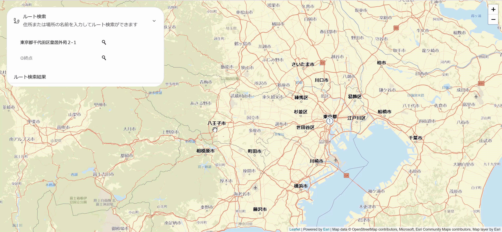
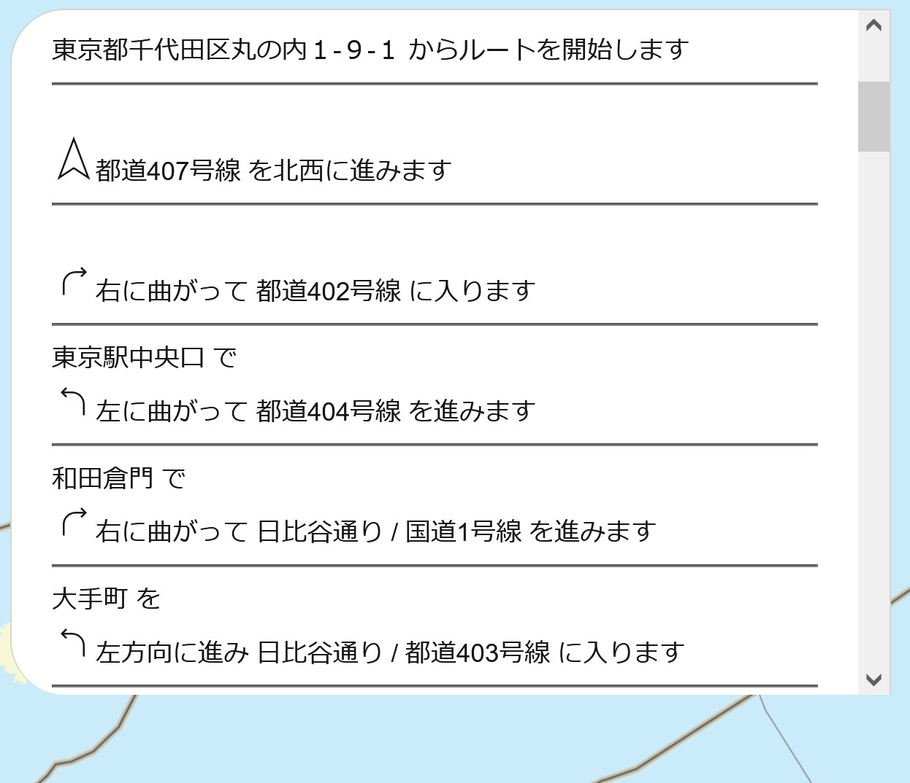

# Calcite Design System によるデザイン
[ハンズオン](../README.md)では、ルート検索の基本的な機能を作ってきました。ここでは発展形として [Calcite Design System](https://developers.arcgis.com/calcite-design-system/) を使ったアプリのデザインのサンプルコードを用意しています。


## Calcite Design System の使用方法について
Calcite Design System は、Esri のデザインフレームワークを StencilJS によって構築された Web Components です。以下のように CDN から JS と CSS を参照することで利用できます。

```HTML
<!-- CDN から Calcite Design System を参照 -->
<script type="module" src="https://js.arcgis.com/calcite-components/1.0.0-beta.65/calcite.esm.js"></script>
<link rel="stylesheet" type="text/css" href="https://js.arcgis.com/calcite-components/1.0.0-beta.65/calcite.css" />
```

今回のアプリデザインを実現するために使用しているコンポーネントは、[calcite-loader](https://developers.arcgis.com/calcite-design-system/components/loader/) と [calcite-accordion](https://developers.arcgis.com/calcite-design-system/components/accordion/) ,[アイコンデザイン](https://developers.arcgis.com/calcite-design-system/icons/)の三つです。それぞれ使用している部分の動作とアイコンをご紹介します。

### calcite-loader
loader を表示します。active 属性を設定することで loader が表示され、active 属性を消すことで表示が消えます。

今回は、ルート検索の結果が表示されるまで loader を表示するために使っています。これを実装するためにルート検索を実行する関数 `searchRoute()` を実行すると active になり、結果が入力されると active 属性を削除します。

```HTML
<calcite-loader active text="ルート検索中"></calcite-loader>
```

```JavaScript
function searchRoute() { 

  // ルート検索開始後に calcite-loader を active にする
  loading[0].setAttribute("active",""); 
  
  // arcgis-rest-js のサービスを利用するために API キーを指定
   const authentication = new arcgisRest.ApiKey({
     key: apiKey
   });
      arcgisRest
      //　ルート検索の開始
     .solveRoute({
       stops: [startCoords, endCoords], 
       endpoint: "https://route-api.arcgis.com/arcgis/rest/services/World/Route/NAServer/Route_World/solve",
       authentication,
       params:{directionsLanguage:"ja"} // 使用言語を日本語に変更
       })
       // 結果の表示
     .then((response) => {
       geojson=L.geoJSON(response.routes.geoJson).addTo(routeLines); // geojson 化したルートを表示
       const directionsHTML = response.directions[0].features.map((f) => f.attributes.text).join("<br>");
       directions.innerHTML = add_direction(directionsHTML,startpoint,endpoint);
       startCoords = null; // 最後にスタート、ゴール地点の情報を消す
       endCoords = null;

       // ルート検索終了後に calcite-loader を削除
       loading[0].removeAttribute("active"); 

     })
     // エラー時の表示
     .catch((error) => {
       console.error(error);
       alert("ルート検索に失敗しました<br>始点と終点の情報をリセットします");
       startCoords = null; // エラー時にも始点、終点の位置情報をリセット
       endCoords = null;

      // ルート検索終了後に calcite-loader を削除
       loading[0].removeAttribute("active"); 
     
     });
}
```



### calcite-accordion
アコーディオン メニューは親要素となる `calcite-accordion` と小項目の `calcite-accordion-item` で構成されています。使用例としては以下のように使用することができます。

```HTML
<!-- calcite_design/index.html の表記とは異ります -->
<calcite-accordion>
    <calcite-accordion-item icon="tour" item-title="ルート検索"
      item-subtitle="住所または場所の名前を入力してルート検索ができます" active>
      ルート検索結果
    </calcite-accordion-item> 
</calcite-accordion>
```

今回は、検索バーとルート案内の文章をメニューバーにまとめて表示するために使用しています。


### calcite-icon
アイコンのみを使用したい場合には、`calcite-icon` 要素に `icon` 属性を指定して使用します。

```HTML
<calcite-icon icon="left"></calcite-icon> 左折アイコン
<calcite-icon icon="right"></calcite-icon> 右折アイコン
```

ここでは、ルート案内文を図も用いてわかりやすく補完するために使用しています。



また、ルートの始点終点のマーカーにも使っています。アイコンを使用するため、leaflet の `L.divIcon` の中で `calcite-icon` 要素を入れています。

```JavaScript
const divIcon1 = L.divIcon({
  html: '<calcite-icon icon="number-circle-1" /></calcite-icon>',
  className: 'divicon',
  iconSize: [25,25],
  popupAnchor: [0, 0]
});
```

## ハンズオンでは使用しなかった機能について
ハンズオンでは使わなかったいくつかの機能やベースマップも使っています。ここで使用している機能の詳細については、以下のリストからご確認ください。

- [leaflet](https://leafletjs.com/)
    - [`L.control.zoom`](https://leafletjs.com/reference-1.7.1.html#control-zoom): zoom ボタンの設定ができます。ボタンの位置を変えるために使用しています。
    - [`L.divIcon`](https://leafletjs.com/reference-1.7.1.html#divicon):アイコンを画像ではなく、`div` 要素で作成します。ルートの始点終点のアイコンを使用するために使っています。
    - `.getContainer()`: leaflet 上で動作するオブジェクトの HTML 要素を取得します。検索バーをメニューバー内の子要素として入れるために使用しています。 

- [esri-leaflet-vector](https://github.com/Esri/esri-leaflet-vector)
    - `ArcGIS:Navigation`: Esri が提供している道路の見やすいベクタータイル ベースマップです。

- [esri-laeflet-geocoder](https://github.com/Esri/esri-leaflet-geocoder)
    - [`L.esri.Geocoding.geocodeService`](http://esri.github.io/esri-leaflet/api-reference/services/geocode-service.html): ArcGIS Online のジオコーディングサービスのラッパー。リバースジオコーディングを行うために使用しています。
    - `.reverse()`: `L.esri.Geocoding.geocodeService` からリバースジオコーディングを実行します。クリックした地点の地名や位置情報を入力されていない検索バー内に入力するためなどに使用しています。

