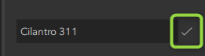
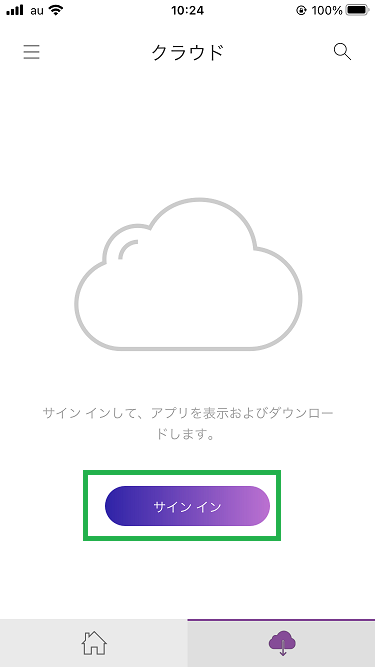
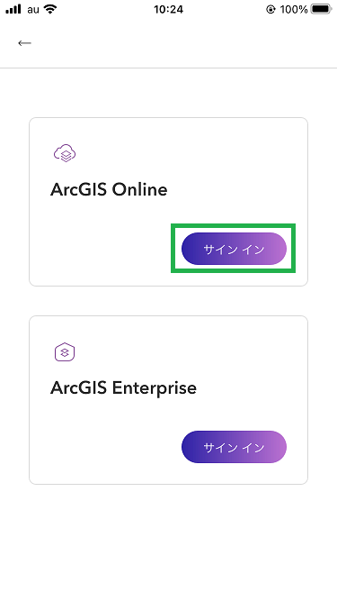
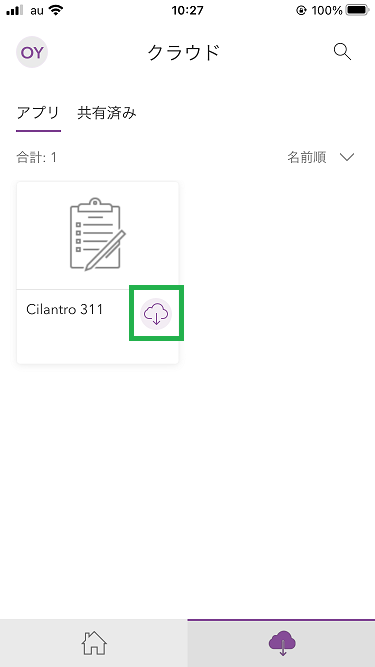
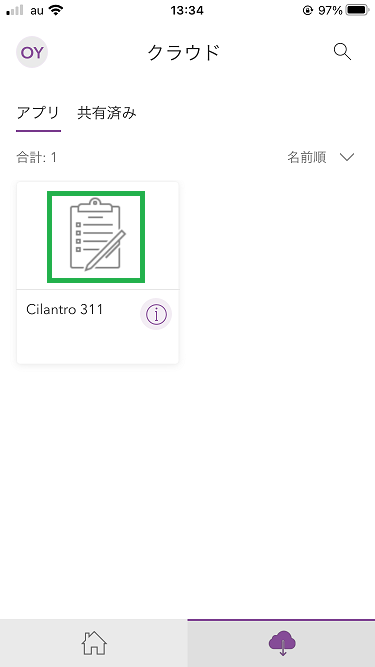

# AppStudio を使用したネイティブ アプリ作成ハンズオン

## ハンズオンの内容
このハンズオンでは、ArcGIS AppStudio の Quick Report（クイック レポート）テンプレートを使用して、クロスプラットフォームのモバイル アプリを作成します。

クイック レポート テンプレートは、データ収集アプリ用のテンプレートです。このテンプレートを使用することにより、位置/属性情報を入力してフィーチャ サービスにフィーチャを追加できます。アプリ名やアイコン、起動画面を変更して、アプリをブランド化することもできます。

このハンズオンは「[Learn ArcGIS : ArcGIS AppStudio を使用して 311 モバイル アプリを構築します](https://learn.arcgis.com/ja/projects/use-arcgis-appstudio-to-build-a-311-mobile-app/)」の内容を抜粋したものです。完全なスッテプは上記リンクをご参照ください。

## 必要な環境
* [ArcGIS AppStudio](https://www.esri.com/ja-jp/arcgis/products/arcgis-appstudio/resources?rmedium=www_esri_com_EtoF&rsource=/en-us/arcgis/products/appstudio-for-arcgis/resources#settingup) (Windows または macOS)
* [ArcGIS AppStudio Player](https://www.esri.com/ja-jp/arcgis/products/arcgis-appstudio/resources?rmedium=www_esri_com_EtoF&rsource=/en-us/arcgis/products/appstudio-for-arcgis/resources#settingup) (Andoid または iOS)
* [ArcGIS Online](https://www.esrij.com/products/arcgis-online/) アカウント または [ArcGIS 開発者アカウント](https://esrijapan.github.io/arcgis-dev-resources/guide/get-dev-account/)

## ハンズオンの流れ
### [1. アプリの作成](#アプリの作成)
ArcGIS AppStudio のテンプレートを使用して、ネイティブ アプリを作成します。
### [2. アプリのカスタマイズ](#アプリのカスタマイズ)
アプリ名やアイコン等を変更して独自のブランディングを設定します。
### [3. データの追加](#データの追加)
使用するデータ（フィーチャ サービス）は事前に作成済みです。アプリで使用するデータを設定します。
### [4. アプリのテスト](#アプリのテスト)
デスクトップ PC とモバイルデバイス（Android または iOS）で作成したアプリを確認します。

# 手順
## アプリの作成
最初に、AppStudio および Cilantro 市のロゴとアイコンをいくつかダウンロードしてインストールします。次に、クイック レポート テンプレートを使用してアプリを作成します。

1. [Cilantro-City-Branding](https://www.arcgis.com/home/item.html?id=2672cb7635f644d199e1e1425ccc0be0#overview) に移動します。
1. [ダウンロード] をクリックします。
1. [Cilantro-City-Branding.zip] のコンテンツを選択した場所 (例: C:\Cilantro-City) に展開します。
1. AppStudio を開きます。
1. AppStudio アプリケーション リボンで、[サイン イン] をクリックします。
1. [サイン イン] ウィンドウで、[サイン イン] を選択します。

    

1. [サイン イン] ウィンドウで、ArcGIS Online アカウントまたは ArcGIS 開発者アカウントの認証情報を入力して [サイン イン] をクリックします。
1. AppStudio アプリケーションで [新しいアプリ] をクリックします。

    

1. [新しいアプリ] ウィンドウで、[テンプレート] タブをクリックし、[Quick Report] テンプレートを選択します。

    

1. サイド ウィンドウで、[作成] ボタンをクリックします。
1. アプリのリストで、新しいクイック レポート アプリをクリックして選択します。 サイド ウィンドウで、[タイトルの編集] ボタンをクリックします。

    

1. [タイトル] に「Cilantro 311」と入力し、[変更を保存] ボタンをクリックしてアプリ タイトルを更新します。

    

[変更を保存] ボタンの画像を追加

## アプリのカスタマイズ
Cilantro 311 アプリのデザインは、組織、アプリの使用と機能を明確に表すものである必要があります。アプリの視覚的効果と情報価値を向上するために、アプリのアイコンと背景を更新します。

1. アプリのリストで、Cilantro 311 アプリが選択されていることを確認し、サイド ウィンドウの [設定] ボタンをクリックします。

    

1. [AppStudio 設定] ウィンドウで、[リソース] タブをクリックします。
1. [リソース] ウィンドウで、[アプリ アイコン] アイコンの画像をクリックします。

    

1. ブラウザー ウィンドウで、抽出した Cilantro-City-Branding コンテンツを含むフォルダーを見つけます。 [Icon-cilantro311] 画像をダブルクリックします。
1. メッセージ ウィンドウで、[はい] をクリックして、アイコンが更新されます。次に、背景画像を追加します。
1. [AppStudio 設定] ウィンドウで、[プロパティ] タブをクリックします。[QuickReport プロパティ] ウィンドウが表示されます。
1. [開始画面] タブの [背景画像] で、デフォルトの背景画像をクリックします。

    

1. ブラウザー ウィンドウで、抽出した Cilantro-City-Branding コンテンツを含むフォルダーを見つけます。[background-cilantro311] 画像をダブルクリックします。
1. 画像をアプリのフォルダーにコピーするかどうかたずねるメッセージが表示された場合は、[はい] をクリックします。
1. [開始画面] タブをスクロールして、[ロゴの表示] プロパティを見つけ、[ロゴの表示] ボタンをクリックしてロゴをオフにします。

    

1. [AppStudio 設定] ウィンドウの下部にある [適用] をクリックして、変更内容を保存します。

## データの追加
1. [QuickReport プロパティ] ウィンドウで、[フォーム] タブを見つけてクリックします。

    

1. [フォーム] ウィンドウで、[フィーチャ サービスのアドレス] プロパティを探して確認します。

1. [フィーチャ サービスのアドレス] プロパティで、デフォルトのアドレスを次の URL に置き換えます。

    https://services2.arcgis.com/j80Jz20at6Bi0thr/arcgis/rest/services/Cilantro/FeatureServer

    

1. [フィーチャ サービスのレイヤー ID] に「0」と入力します。
Cilantro 市のフィーチャ レイヤー ID: 0 は、落書き、街灯、ごみ箱、標識の問題を取集するポイント フィーチャです。
1. [AppStudio 設定] ウィンドウの下部にある [適用] をクリックしてから、ウィンドウを閉じます。

1. AppStudio ウィンドウで、[Cilantro 311] アプリが選択されていることを確認して、[アップロード] ボタンをクリックします。

    

1. [AppStudio アップロード] ウィンドウの [共有] オプションで、[未共有 (プライベート)] をクリックし、[+ アップロード] ボタンをクリックします。アプリが正常にアップロードされると、緑色の [アップロードに成功しました] メッセージが表示されます。

1. [AppStudio アップロード] ウィンドウを閉じます。

## アプリのテスト
次に、アプリをテストします。デスクトップ アプリケーションとモバイル デバイスでアプリをテストします。

### デスクトップでのテスト
1. AppStudio ウィンドウで、[Cilantro 311] アプリが選択されていることを確認します。
1. サイド ウィンドウで [実行] をクリックします。

    

1. Cilantro 311 アプリが新しいウィンドウで開きます。

    

1. 各自で、[Cilantro 311] アプリの機能をテストします。
    * [新規] をクリックして、放置された車両、新しい落書き、道路の損傷に関する新しいレポートを生成します。
    * [次へ] ボタンを使用して、さまざまなアプリ オプションを試します。
    * [位置の追加] ウィンドウで、マップを移動してレポートする場所を絞り込みます。
    * 作業が済んだら、アプリを閉じます。
    
    

### モバイルでのテスト
1. モバイル デバイス（Android または iOS）で AppStudio Player を起動します。 [サイン イン] をタップします。
    
    

1. ArcGIS Online のサインインをタップして最初にサイン インしたアカウントと同じアカウントでサイン インします。
    
    

1. [Cilantro 311] アプリの [ダウンロード] ボタンをタップして、アプリをダウンロードします。

    
1. 画面のサムネイル部分をタップしてダウンロードしたアプリを実行します。新しいレポートを追加し、アプリをテストします。

    
