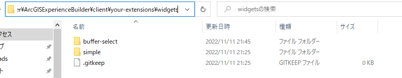
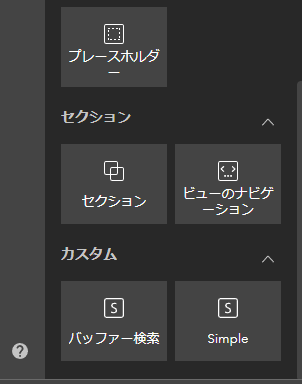
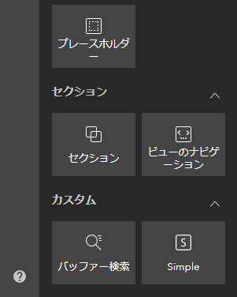
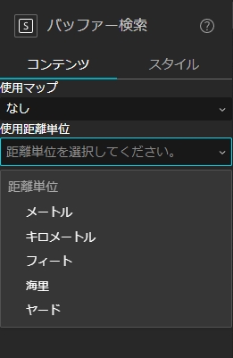
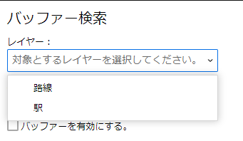
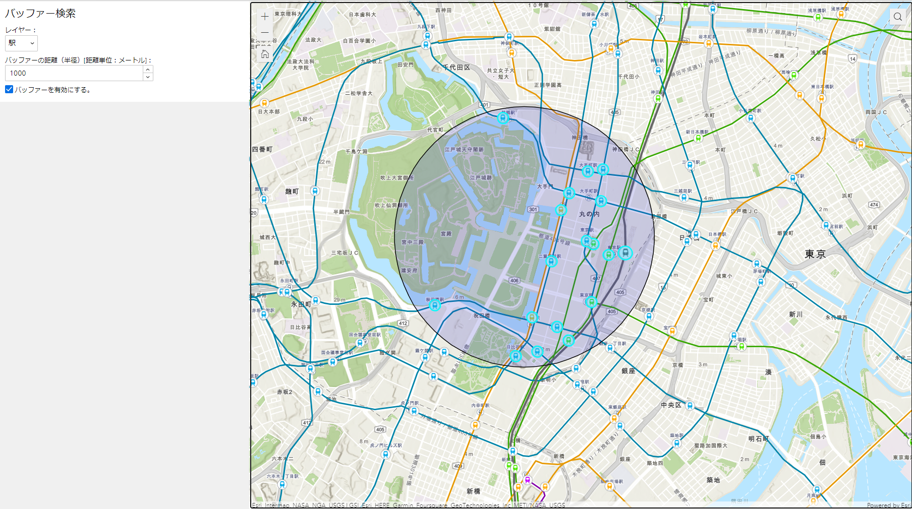

# ArcGIS Experience Builder (Developer Edition) を使用したカスタム ウィジェット開発ガイド

## 概要

このガイドは ArcGIS Experience Builder (Developer Edition) （以下、Experience Builder）で使用するカスタム ウィジェットを作成する方法を説明します。  
Experience Builder のインストール方法に関しては、[ArcGIS Experinece Builder (Developer Edition) インストールガイド](https://esrijapan.github.io/arcgis-dev-resources/tips/experience-builder/install-guide/)をご参照ください。


## カスタム ウィジェットの開発

### 1. ウィジェット ボタンを配置する

本ガイドでは簡単なバッファー検索を行う In-Panel ウィジェットを開発していきます。ウィジェットを追加するには `<Experience Builder のインストール ディレクトリ>\client\your-extensions\widgets\` にウィジェットのフォルダーを配置します。

1. `<Experience Builder のインストール ディレクトリ>\client\your-extensions\widgets\` に新規で `buffer-select` という名前で新しいフォルダーを作成します。  
  
フォルダー名がウィジェット名となります。ウィジェット名は半角英数字である必要があります。


2. Exerience Builder のウィジェットを作成するにあたっての最低限のフォルダー構成を作成します。  
`buffer-select` フォルダーの直下に `src` フォルダーを作成し、作成した `src` フォルダーの直下に `setting` と `runtime` フォルダーを作成します。


3. 今回のウィジェットにて作成するにあたって必要なソースコードを記述するファイルを作成します。  
`setting` フォルダーに `setting.tsx` と `runtime` フォルダーに `widget.tsx` ファイルを作成します。


4. ウィジェットを作成するにあたって必要なメタデータとアイコン画像を配置します。  
`<Experience Builder のインストール ディレクトリ>\client\your-extensions\widgets\simple` 直下にある `manifest.json` と `icon.svg` をコピーし、`buffer` フォルダーの直下に張り付けます。  


5. `buffer` フォルダー直下にある `manifest.json` ファイルを開きます。


6. `name` 属性の値を `buffer-select`、`label` 属性の値を `BufferSelect` に変更します。

```json
{
    "name": "buffer-select",
    "label": "BufferSelect",
    "type": "widget",
    "version": "1.x.0",
  // ...
}
```


7. `translatedLocales` 属性の値に `ja` を追加します。

```json
{
  // ...
    "translatedLocales": [
      "en",
      "ja"
    ],
  // ...
}
```


8. `defaultSize` 属性内にある `width`、`height` 属性の値を変更します。
`defaultSize` 属性を変更することで、ウィジェットを追加した際のウィジェットのサイズを変更することができます。

```json
{
  // ...
  "defaultSize": {
    "width": 350,
    "height": 200
  }
}
```


9. `dependency` 属性を追加します。値には `jimu-arcgis` を設定し、保存します。  
`dependency` 属性に `jimu-arcgis` を設定することでウィジェット内で ArcGIS API for JavaScript を使用することができます。

```json
{
  // ...
  "defaultSize": {
    "width": 350,
    "height": 200
  },
  "dependency": "jimu-arcgis"
}
```


10. `publishMessages` 属性を追加します。値は配列で設定します。配列内の値には `DataRecordsSelectionChange` を設定し、保存します。
`publishMessages` 属性はウィジェット間で連携を行う場合に使用します。`DataRecordsSelectionChange` を設定することで選択した値を他のウィジェットに連携することができます。`DataRecordsSelectionChange` の他の処理に応じた値が用意されています。その他の処理については、<a href="https://developers.arcgis.com/experience-builder/guide/core-concepts/message-action/" target="_blank">Message and action</a>をご参照ください。


```json
{
  // ...
  "dependency": "jimu-arcgis",
  "publishMessages": [
    "DataRecordsSelectionChange"
  ]
}
```


> #### manifest.json
> 
> ウィジェットの名前やバージョン等を設定するファイルです。`properties` 属性でカスタム ウィジェットのプロパティを構成できます。ウィジェットのプロパティについては、<a href="https://esrijapan.github.io/arcgis-dev-resources/tips/experience-builder/widget-development/widget-manifest/" target="_blank">Widget manifest</a>をご参照ください。


11. Experience Builder のウィジェットの追加画面で表示されるウィジェット名をローカライズします。ウィジェットのローカライズは 2. で作成した `runtime` フォルダーの直下に `translations` フォルダーを作成し、`translations` フォルダーに設定していきます。  
`buffer\src\runtime\transelations` フォルダーの直下に `ja.js` ファイルを作成し、以下のコードを入力し保存します。

```js
define({
  _widgetLabel:"バッファー選択"
});
```

> #### translations フォルダー
> 
> カスタム ウィジェットを多言語化する場合に使用します。アクセスするブラウザーのロケールにより該当する言語が表示されます。`_widgetLabel` はウィジェット追加時に表示されるラベルをローカライズするための固有の属性です。


12. Experience Builder を起動し、アプリケーションを作成します。ウィジェットの追加画面に「バッファー選択」というウィジェット名が表示されます。  


> #### icon.svg
> 
> カスタム ウィジェットのボタンのアイコンを変更したい場合は、このファイルを置き換えます。  
> 

### 2. config.json の定義

`config.json` は JSON 形式のオブジェクト格納ファイルです。ウィジェット初期化時のデフォルトの値を設定することができます。`config.json` に設定した値は構成画面やウィジェットから初期値として取得されます。  

1. `buffer` フォルダーの直下に `config.json` ファイルを作成し、以下のコードを入力して保存します。
```json
{
}
```

> ### Note
>
> 作成するバッファーのデフォルトの距離単位を設定する場合、  
> `config.json` ファイルに以下のコードを入力し、保存します。  

```json
{
  "distanceUnit": "meters",
  "distanceUnitName": "メートル"
}
```


### 3. ウィジェットの設定画面を作成する

ウィジェットで使用するパラメーターの設定を行う画面を作成します。  
今回は、設定画面で、対象とするマップ ウィジェットとバッファーを作成する際の距離単位を設定します。


1. `buffer\src\setting` フォルダーの `setting.tsx` ファイルを開き、以下のコードを入力します。  

```tsx
/** 3-1 設定画面用モジュールの設定 Start */
/** @jsx jsx */
import { React, jsx } from "jimu-core";
import { AllWidgetSettingProps } from "jimu-for-builder";
import { MapWidgetSelector } from "jimu-ui/advanced/setting-components";
import { Select, Option } from 'jimu-ui';

export default class Setting extends React.PureComponent<AllWidgetSettingProps<any>, any> {

}
/** 3-1 設定画面用モジュールの設定 End */
```


> ウィジェットの設定画面を作成するにあたって必要なモジュールを必要に応じて読み込みます。
> Experience Builder は React を使用しているため、React に関するモジュールと Experience Builder の設定画面用に用意されているコンポーネントである `AllWidgetSettingProps` を指定します。
> また、Experience Builder には <a href="https://developers.arcgis.com/experience-builder/guide/storybook/" target="_blank">`Storybook`</a> というウィジェット構築用の UI コンポーネントが用意されています。今回は Web アプリ上に設定した Web マップを選択する `MapWidgetSelector` と距離単位を選択するためのセレクト ボックスを構成するための `Select`, `Option` を指定します。


2. `setting.tsx` ファイルに設定画面の画面構成を記述します。 

```tsx
// ...
export default class Setting extends React.PureComponent<AllWidgetSettingProps<any>, any> {
    
    /** 3-2 設定画面の画面構成追加 Start */
    render() {
        return <div className="widget-setting-demo">
            使用マップ
            <MapWidgetSelector
                useMapWidgetIds={this.props.useMapWidgetIds}
                onSelect={this.onMapWidgetSelected}
            />
            使用距離単位
            <Select
                onChange={this.setUint}
                placeholder="距離単位を選択してください。"
                defaultValue={this.props.config.distanceUnit}
            >
                <Option header>
                    距離単位
                </Option>
                <Option value="meters" title="メートル" >
                    メートル
                </Option>
                <Option value="kilometers" title="キロメートル">
                    キロメートル
                </Option>
                <Option value="feet" title="フィート">
                    フィート
                </Option>
                <Option value="nautical-miles" title="海里マイル">
                    海里
                </Option>
                <Option value="yards" title="ヤード">
                    ヤード
                </Option>
            </Select>
        </div>;
    }
    /** 3-2 設定画面の画面構成追加 End */
}
/** 3-1 設定画面用モジュールの設定 End */
```


> `React` では `render` メソッドの戻り値に設定した画面構成要素をレンダリングします。
> 今回の場合は、使用する Web マップを選択する要素と使用する距離単位を選択する要素を記述しています。


3. 各コンポーネントには値を変更した際のイベントが設定されているため、イベントの処理を `setting.tsx` ファイルに記述し、保存します。

```tsx

// ...
export default class Setting extends React.PureComponent<AllWidgetSettingProps<any>, any> {
    /** 3-3 コンポーネントのイベント処理追記 Start */
    // 対象のマップを設定
    onMapWidgetSelected = (useMapWidgetIds: string[]) => {
        this.props.onSettingChange({
            id: this.props.id,
            useMapWidgetIds: useMapWidgetIds
        });
    };

    // 距離単位の名称と値を設定
    setUint = (distanceUnit: React.FormEvent<HTMLInputElement>) => {
        this.props.onSettingChange({
            id: this.props.id,
            config: this.props.config.set('distanceUnit', distanceUnit.currentTarget.value).set('distanceUnitName', distanceUnit.currentTarget.title)
        });
    };
    /** 3-3 コンポーネントのイベント処理追記 End */

    /** 3-2 設定画面の画面構成追加 Start */
// ...
```


> `onMapWidgetSelected`, `setUint` の処理は、作成する Web アプリに対して設定画面で選択したパラメーターを設定します。


4. ブラウザーで Experience Builder を更新後、ビルダー画面でバッファー検索ウィジェットを追加すると、設定画面に定義した構成が表示されます。  


> #### setting\setting.tsx
> 
> Experience Builder でウィジェットの設定を行う画面と設定の処理を記述します。


### 4. ウィジェットの処理を実装する

ウィジェットの処理を実装します。


> Experience Builder では、`<Experience Builder のインストール ディレクトリ>\client` を実行すると `<Experience Builder のインストール ディレクトリ>\client\your-extensions\widgets` フォルダーに配置されたウィジェットは `<Experience Builder のインストール ディレクトリ>\client\dist\widgets` フォルダーにコピーされ、ビルダーはそのフォルダーを参照して Web アプリを作成します。  
> `client` が実行している間は実行時点で存在するファイルが更新された場合、都度 `<Experience Builder のインストール ディレクトリ>\client\dist\widgets` の内容も更新されるため、ブラウザーの更新をすることでビルダーにおいてもウィジェットの更新内容を反映する事ができます。


まず、ウィジェットのパネルに表示する画面を作成します。  
パネルには、マップ上にあるレイヤーから検索対象のレイヤーと、バッファーの半径を選択する画面を作成します。


1. `buffer\src\runtime` フォルダーにある `widget.tsx` ファイルを開き編集します。  
ウィジェットの設定画面を作成するにあたって必要なモジュールを必要に応じて読み込みます。

```tsx
/** 4-1 ウィジェットの画面用モジュールの設定 Start */
/** @jsx jsx */
import { React, AllWidgetProps, css, jsx, DataSourceManager, QueriableDataSource, QueryParams, MessageManager, DataRecordsSelectionChangeMessage } from "jimu-core";
import { JimuMapViewComponent, JimuMapView } from "jimu-arcgis";
import { Label, Select, Option, NumericInput, Checkbox, Table } from "jimu-ui";
export default class Widget extends React.PureComponent<AllWidgetProps<any>, any> {

}
/** 4-1 ウィジェットの画面用モジュールの設定 End */
```


> ウィジェットの画面を作成するにあたって必要なモジュールを必要に応じて読み込みます。
> 設定画面と同様に、React に関するモジュールと Experience Builder のウィジェット画面用に用意されているコンポーネントである `AllWidgetProps` を指定します。  
> また、UI のコンポーネントに関しても同様に <a href="https://developers.arcgis.com/experience-builder/guide/storybook/" target="_blank">`Storybook`</a> を用いて必要となるものを指定します。今回は、`Label`,`Select`,`Option`,`NumericInput`,`Checkbox`,`Table` というコンポーネントを使用します。  


2. ウィジェット画面上で使用するコンポーネントの情報を管理するために `State` に変数を定義します。

```tsx
// ...
export default class Widget extends React.PureComponent<AllWidgetProps<any>, any> {

  /** 4-2 State の定義 Start */
  // 処理内で利用する変数を定義
    state = {
        jimuMapView: null, /** 対象 Webマップ */
        webmapLayers: [], /** Web マップのレイヤー情報 */
        selectLayer: null, /** 選択したレイヤー情報 */
        distance: 0, /** バッファーの半径距離 */
        widgetEnable: false, /** バッファー処理実行フラグ */
        selDataSource: null, /** 選択したレイヤーのデータソース */
    };
  /** 4-2 State の定義 End */

}
/** 4-1 ウィジェットの画面用モジュールの設定 End */
```


3. ウィジェット画面の画面構成を記述します。  

```tsx
// ...
  /** 4-2 State の定義 End */
  
  /** 4-3 画面構成の定義 Start */
  // UI 情報レンダリング
  render() {
    // UI のデザインを設定
    const widgetStyle = css`
    background-color: var(--white);
    padding: 10px;
    height: 200px;
    `
    const tableStyle = css`
    background-color: var(--white);
    `

    // レイヤーリストをプルダウンに設定
    const { webmapLayers } = this.state;
    let layerList = webmapLayers.length > 0
      && webmapLayers.map((item, idx) => {
        return (
          <Option key={idx} value={String(item.id)}>{item.name}</Option>
        )
      }, this);

    return (
      <div className="widget-starter jimu-widget" css={widgetStyle}>
        {this.props.hasOwnProperty("useMapWidgetIds") &&
          this.props.useMapWidgetIds &&
          this.props.useMapWidgetIds[0] && (
            <JimuMapViewComponent
              useMapWidgetId={this.props.useMapWidgetIds?.[0]}
              onActiveViewChange={this.activeViewChangeHandler}
            />
          )
        }
        <h3>バッファー検索</h3>
        <Table css={tableStyle}>
          <tr>
            <Label>
              レイヤー：
              <Select
                onChange={this.selLayer}
                autoWidth={true}
                placeholder="対象とするレイヤーを選択してください。">
                {layerList}
              </Select>
            </Label>
          </tr>
          <tr>
            <Label>
              バッファーの距離（半径）[距離単位：{this.props.config.distanceUnitName}]：
              <NumericInput defaultValue={Number(0)} onChange={this.chgBufDst} />
            </Label>
          </tr>
          <tr>
            <Label>
              <Checkbox onChange={this.chgWdgEbl} checked={this.state.widgetEnable} /> バッファーを有効にする。
            </Label>
          </tr>
        </Table>
      </div>
    );
  }
  /** 4-3 画面構成の定義 End */
}
```


> マップ ウィジェットからマップの情報を設定する `JimuMapViewComponent` というコンポーネントを構成することによって、カスタム ウィジェットにマップ ウィジェットを紐づけることができます。今回はマップ ウィジェットに対して操作を実施した時に、バッファー検索の処理を実施するワークフローを設定します。
> ウィジェット画面の UI は、検索対象のレイヤーを選択するセレクトボックス、バッファーの半径を入力するフォーム、バッファー検索機能を有効化するかを決定するチェックボックスの 3 つの UI コンポーネントにて構成しています。各コンポーネントでは入力値が変更されると `State` の値を変更するファンクションを設定しています。


4. バッファー検索処理で使用する ArcGIS API for JavaScript のモジュールをインポートします。

```tsx
// ...
import { Label, Select, Option, NumericInput, Checkbox, Table } from "jimu-ui";
/** 4-4 使用する ArcGIS API for JavaScript のモジュールをインポート Start */
import Point from "esri/geometry/Point";
import Polygon from "esri/geometry/Polygon";
import geometryEngine from "esri/geometry/geometryEngine";
import SimpleFillSymbol from "esri/symbols/SimpleFillSymbol";
import Graphic from "esri/Graphic";
import Query from "esri/rest/support/Query";
import LayerView from "esri/views/layers/LayerView";
import Collection from "esri/core/Collection";
/** 4-4 使用する ArcGIS API for JavaScript のモジュールをインポート End */
export default class Widget extends React.PureComponent<AllWidgetProps<any>, any> {
// ...
```


> Experience Builder の GIS 処理は、Web アプリ上で ArcGIS Online および ArcGIS Enterprise で提供している GIS 機能を使用することができる、<a href="https://developers.arcgis.com/javascript/latest/" target="_blank">`ArcGIS API for JavaScript`</a> という API を使用します。  


5. 各 UI コンポーネントに設定されているファンクションを記述します。  

```tsx
  // ...
  /** 4-2 State の定義 End */

  /** 4-5 UI コンポーネント用ファンクション Start */
  // マーキング対象のレイヤーを設定
  selLayer = (selected: React.FormEvent<HTMLInputElement>) => {
      // アプリに設定した Web マップ、FeatureLayer のデータソース一覧を取得
      let dsManager = DataSourceManager.getInstance();
      // マップ ウィジェットに設定した Web マップのレイヤー一覧を取得
      const layerViews = this.state.jimuMapView.jimuLayerViews;
      let dataSource = null;
      // 検索対象としたレイヤーのデータソースを取得する。
      for (let layerView in layerViews) {
          let layer = layerViews[layerView];
          if (layer.jimuLayerId === selected.currentTarget.value) {
              dataSource = dsManager.getDataSource(layer.layerDataSourceId);
          }
      }
      this.setState({
          selectLayer: selected.currentTarget.value,
          selLayerSource: dataSource
      });
  };

  // バッファーの半径を設定
  chgBufDst = (numVal: Number) => {
      this.setState({
          distance: numVal
      });
  };

  // 処理実行可否の設定
  chgWdgEbl = () => {
      const ebl = this.state.widgetEnable;
      if (ebl) {
          this.setState({ widgetEnable: false });
          this.state.jimuMapView.view.graphics.removeAll();
          this.state.selLayerSource.selectRecordsByIds([]);
      } else {
          this.setState({ widgetEnable: true });
      }
  };
  /** 4-5 UI コンポーネント用ファンクション End */

  /** 4-3 画面構成の定義 Start */
  // ...
```


6. マップ ウィジェットを操作した際のイベントを記述します。

```tsx
  // ...
  /** 4-2 State の定義 End */

  /** 4-6 マップ ウィジェット イベント追加 Start */
  // マップ ウィジェットが変更されたときにマップ情報とクリックイベントの設定
  activeViewChangeHandler = (jmv: JimuMapView) => {
      if (jmv) {
          this.setState({
              jimuMapView: jmv,
              webmapLayers: this.setLayerList(jmv.view.layerViews)
          });
          // 対象のマップをクリック イベントを取得
          jmv.view.on("click", (evt) => {
              // バッファー処理はチェックがオンになっている時のみ実行
              if (this.state.widgetEnable) {
                  // 必須項目入力チェック
                  let msg = this.eventErrorCheck();
                  if (msg.length != 0) {
                      // 必須項目が入力されていない場合はエラー
                      alert(msg);
                      return;
                  }
                  // バッファー検索の本処理を実行
                  this.doBufferSerch(evt);
              }
          });
      }
  };
  /** 4-6 マップ ウィジェット イベント追加 End */

  /** 4-5 UI コンポーネント用ファンクション Start */
  // ...
```


> ここでは、マップ ウィジェットで設定されているマップ情報を取得して `State` に設定しています。
> また、マップ ウィジェット内でクリックした際のイベントを取得し、処理を実行します。実際にクリック イベントが発生した際は、実行可否のチェック処理とバッファー検索の本処理が実行されます。


7. マップ ウィジェットに設定されているレイヤー情報を取得する処理を記述します。

```tsx
  // ...
  /** 4-6 マップ ウィジェット イベント追加 End */

  /** 4-7 レイヤー情報の取得処理追加 Start */
  // マップ ウィジェットに設定されいてるレイヤー情報の取得
  setLayerList = (layers: Collection<LayerView>) => {
      const list = [];
      for (let idx = layers.length; 0 < idx; idx--) {
          const layer = layers.items[idx - 1];
          list[idx] = { id: layer.layer.id, name: layer.layer.title }
      }
      return list
  }
  /** 4-7 レイヤー情報の取得処理追加 End */

  /** 4-5 UI コンポーネント用ファンクション Start */
  // ...
```


> この処理にてウィジェット画面のレイヤーリストに設定しているレイヤーを表示することができます。  
> ここまでの内容でウィジェット画面の UI を Web ブラウザー上で確認することができます。


8. 必須項目チェック処理を記述します。
バッファー検索処理では、バッファーの半径とレイヤーが設定されていないと処理が成り立たないため必須条件とします。
条件を満たさない場合エラーとし、アラート メッセージを表示します。

```tsx
  // ...
  /** 4-6 マップ ウィジェット イベント追加 End */

  /** 4-8 必須項目チェック追加 Start */
  // 必須項目入力チェック
  eventErrorCheck = () => {
      let requrirdMsg = ""; /** エラーメッセージ格納用 */

      // レイヤーが選択されていない場合はエラー
      if (this.state.selectLayer.length == 0) {
          requrirdMsg = "対象のレイヤーを選択してください。\n";
      }

      // バッファー距離半径が 0 以下の場合はエラー
      if (this.state.distance <= 0) {
          requrirdMsg = requrirdMsg + "バッファーの距離（半径）は 0 より大きい値を入力してください。";
      }

      return requrirdMsg;
  }
  /** 4-8 必須項目チェック追加 End */

  /** 4-7 レイヤー情報の取得処理追加 End */
  // ...
```

9. バッファー検索の本処理を記述します。

``` tsx
  // ...
  /** 4-8 必須項目チェック追加 End */

  /** 4-9 バッファー検索の本処理追加 Start */
  // バッファー検索の本処理
  doBufferSerch = (evt: Object) => {

      // 前回の実行結果があれば削除する。
      this.state.jimuMapView.view.graphics.removeAll();

      // マップをクリックした地点の位置情報を取得
      const point: Point = this.state.jimuMapView.view.toMap({
          x: evt.x,
          y: evt.y
      });

      // 指定した条件でバッファーを作成
      const buffer = geometryEngine.geodesicBuffer(point, this.state.distance, this.props.config.distanceUnit, false);

      // バッファーの作成が正常に終了した場合に描画処理を実行
      if (buffer) {
          // バッファーのグラフィックを定義
          let bufGraphic = new Graphic({
              geometry: buffer,
              symbol: this.setBufferSymbol()
          });
          // バッファーのグラフィックをマップに表示
          this.state.jimuMapView.view.graphics.add(bufGraphic);

          // バッファー内のレイヤー取得および選択、連携処理実行
          this.layerGetAndMarking(buffer);
      }
  }
  /** 4-9 バッファー検索の本処理追加 End */

  /** 4-7 レイヤー情報の取得処理追加 End */
  // ...
```


> ここでは、以下の流れで処理を実行しています。
> 1. マップ ウィジェット上にある前回のバッファー検索処理結果を削除する。
> 2. マップをクリックした地点の位置情報を取得する。
> 3. 取得した位置情報とウィジェット画面で設定されているバッファーの半径距離、設定画面で設定した距離単位を基にバッファーを作成する。
> 4. バッファーが正常に作成された場合、そのバッファーをマップ ウィジェットに表示する。
> 5. バッファー内に含まれるレイヤーの取得および選択、他のウィジェットへの連携処理の呼び出し

10. バッファー内に含まれるレイヤーの取得および選択、他のウィジェットへの連携の処理を記述します。

```tsx
  // ...
  /** 4-9 バッファー検索の本処理追加 End */

  /** 4-10 バッファー内に含まれるレイヤーの取得および選択、連携の処理追加 Start */
  // バッファー内のレイヤー取得および選択、連携の処理
  layerGetAndMarking = async (buffer: Polygon) => {
      // プルダウンで選択したレイヤーをウェブマップから取得
      const targetLayer = this.state.jimuMapView.view.map.findLayerById(this.state.selectLayer);
      // 取得したレイヤータイプがフィーチャレイヤーの場合描画処理を実行
      if (targetLayer.type == "feature") {
          // バッファー内にある対象のレイヤーを取得
          const query = new Query({ returnGeometry: true, outFields: ["*"] });
          query.geometry = buffer;
          query.spatialRelationship = "contains";

          // 選択した対象レイヤーのデータソースでクエリを取得できる方で宣言。
          const dataSource = this.state.selLayerSource as QueriableDataSource;

          // バッファー内にあるオブジェクトを取得
          const objList = await targetLayer.queryFeatures(query).then(results => {
              let objList = [];
              // バッファー内にあるオブジェクトをリストに格納
              for (let idx = 0; idx < results.features.length; idx++) {
                  objList.push(results.features[idx].attributes.OBJECTID);
              }
              return objList;
          })
              .catch(error => {
                  console.log("targetLayer.queryFeatures error:", error.messagae);
                  return [];
              });
          
          // Where 句を作成
          const selectedQuery =
              objList && objList.length > 0
                  ? `OBJECTID IN (${objList
                      .map(item => {
                          return item
                      })
                      .join()})`
                  : '1=2';
          
          // データソースから対象のクエリを取得
          dataSource.query({
              where: selectedQuery,
              returnGeometry: true
          } as QueryParams)
              .then(result => {
                  // 実行結果からレコード属性を取得
                  const records = result?.records
                  if (records) {
                      // 他のウィジェットへ選択対象を連携する。
                      MessageManager.getInstance().publishMessage(
                          new DataRecordsSelectionChangeMessage(this.props?.widgetId, result.records)
                      )
                      if (records.length > 0) {
                          // 対象データを選択する。
                          dataSource.selectRecordsByIds(
                              records.map(record => record.getId()),
                              records
                          )
                      } else {
                          dataSource.clearSelection()
                      }
                  }
              })
      }
  }
  /** 4-10 バッファー内に含まれるレイヤーの取得および選択、連携の処理追加 End */

  /** 4-7 レイヤー情報の取得処理追加 End */
  // ...
```


> ここでは、以下の流れで処理を実行しています。
> 1. ウェジェット画面で設定したフィーチャレイヤーの情報をマップ ウィジェットに設定された Web マップから取得
> 2. 取得したフィーチャレイヤーの情報から作成したバッファー内にあるフィーチャのみを抽出
> << 3. の処理は 2. で抽出されたフィーチャの件数分繰り返す>>
> 3. フィーチャのジオメトリ タイプに合ったマーキング用のグラフィックを作成し、マップ ウィジェット上の対象のフィーチャに対して重ねて表示

11. バッファー、マーキング用のシンボル定義を記述します。
バッファー、マーキング用のシンボル定義を外出しし、ファンクション化しているため定義を記述します。

```tsx
  // ...
  /** 4-10 バッファー内に含まれるレイヤーの取得およびマーキングの処理追加 End */
  
  /** 4-11 バッファー用のシンボル定義を追加 Start */
  // バッファー用のシンボル（ポリゴン）を定義
  setBufferSymbol = () => {
      return new SimpleFillSymbol({
          color: [51, 51, 204, 0.2],
          style: "solid",
          outline: {
              color: "black",
              width: 1
          }
      });
  }
  /** 4-11 バッファー用のシンボル定義を追加 End */

  /** 4-7 レイヤー情報の取得処理追加 End */
  // ...
```

これでウィジェットの開発は完了です。

> #### runtime\widget.tsx
> 
> ウィジェットの画面と実際の処理を記述します。
> 


## ウィジェットの動作を確認する

ウィジェットを起動し、動作を確認します。

1. Experiecne Builder にマップ ウィジェットを追加して任意の `Web マップ` を設定します。

2. 作成したバッファー検索ウィジェットを追加して、
画面右側の設定画面から`マップ`と`距離単位`を設定します。

3. 画面上部にあるライブビューにチェックを入れます。
チェックを入れることで Web アプリの操作ができるようになります。
バッファー検索のウィジェット画面でレイヤーとバッファーの半径距離、有効化を設定します。



4. マップ ウィジェット上の任意の地点をクリックします。バッファーが作成され、バッファー内のフィーチャがハイライトされます。  


>### Note
> Experiecne Builder にテーブル ウィジェットやチャート ウィジェット（データを「選択したフィーチャ」を選択した場合）を追加しているとバッファー検索ウィジェットで選択されたフィーチャが連携されます。
>
