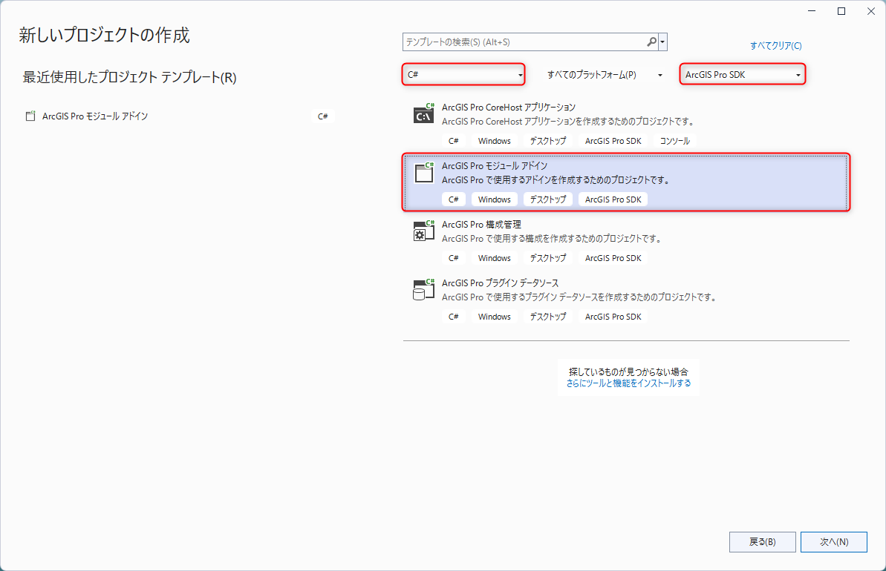
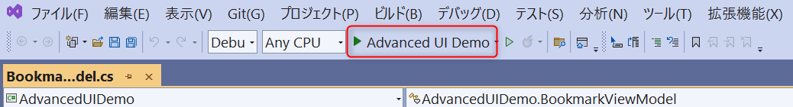

# ArcGIS Pro SDK：はじめてのアドイン作成ハンズオン

## ハンズオンの内容
このハンズオンでは、ArcGIS Pro SDK 初心者向けに、ArcGIS Pro に新規ボタンを作成します。

作成したボタンに ArcGIS Pro のプロジェクトファイルが格納されているパスを表示する機能を実装します。

このハンズオンは Esri が公開している「[ProGuide Build your first add in](https://github.com/EsriJapan/arcgis-pro-sdk/wiki/ProGuide-Build-Your-First-Add-in)」を再編集したものです。

完成イメージ


## 必要な環境

* [ArcGIS Pro](https://pro.arcgis.com/ja/pro-app/latest/get-started/arcgis-pro-system-requirements.htm)
* [ArcGIS Pro SDK for .NET](https://github.com/EsriJapan/arcgis-pro-sdk/wiki#%E9%96%8B%E7%99%BA%E8%A6%81%E4%BB%B6)
* Visual Studio 2022

**前提条件:** 初めてアドインをビルドする前に、ArcGIS Pro と対応するバージョンの ArcGIS Pro SDK を開発用マシンにインストールする必要があります。本ハンズオンでは ArcGIS Pro/ArcGIS Pro SDK のバージョン 3.1 を使用します。それぞれのインストール方法の詳細については、下記のインストールガイドをご参照ください。
* [ArcGIS Pro SDK for .NET インストールガイド](https://github.com/EsriJapan/arcgis-pro-sdk/wiki/ProGuide-Installation-and-Upgrade)
* [ArcGIS Pro インストールガイド](https://doc.esrij.com/pro/get-started/setup/user/install/#%E3%82%A4%E3%83%B3%E3%82%B9%E3%83%88%E3%83%BC%E3%83%AB)

## ハンズオンの流れ
### [1. プロジェクトの作成](#プロジェクトの作成)
ArcGIS Pro SDK のテンプレートを使用して、Visual Studio プロジェクトを作成します。
### [2. ボタンの追加](#ボタンの追加)
アドインボタンを追加し、処理を実装します。
### [3. アドインのテスト](#アドインのテスト)
Visual Studio のデバッガーでアドインを確認します。


## 手順
## プロジェクトの作成
1. Visual Studio を起動して、[新しいプロジェクトの作成] を選択します。

    

2.  [すべての言語] で C# を、[すべてのプロジェクトの種類] で ArcGIS Pro SDK を選択し、表示されたテンプレートの中から [ArcGIS Pro SDK モジュール アドイン] を選択して [次へ] をクリックします。

    

3. プロジェクト名に _ProAppModule1_ と入力します。場所は任意の場所に変更するか、デフォルトのままにし、[作成] をクリックします。

    

4. 新しいプロジェクトが作成されます。プロジェクトには以下の内容が含まれていることを確認できます。

    


    デフォルトでは Config.daml ファイルが Visual Studio 内で開きます。Module1.cs ファイルにはアドイン モジュールのコードが含まれています。コードは以下のようになっています。

    ```cs
    internal class Module1 : Module {

        private static Module1 _this = null;

        /// <summary>
        /// Retrieve the singleton instance to this module here
        /// </summary>
        public static Module1 Current => _this ??= (Module1)FrameworkApplication.FindModule("ProAppModule1_Module");
    }
    ```
    "ProAppModule1_Module" の文字列はモジュール ID です。この ID を使用して、DAML ファイル内のモジュールを参照しています。

    Config.daml ファイルでは、insertModule タグの id 属性が Module1.cs ファイル内の ID と一致し、className 属性がモジュールのクラス名と一致していることも確認できます。

    ```xml

    <modules>
        <insertModule id="ProAppModule1_Module" className="Module1" autoLoad="false" caption="Module1">

    ```

5. Visual Studio のメニューから [ビルド] ＞ [ソリューションのビルド] をクリックしプロジェクトをビルドします。出力ウィンドウにエラーが表示される場合は、ArcGIS Pro アプリケーションと ArcGIS Pro SDK for .NET が正しくインストールされていることを確認してください。プロジェクト テンプレートから生成されたファイルの構文を変更していない限り、コンパイル エラーは発生しないはずです。

    

6. エクスプローラーを開き、`C:\Users\<ユーザー名>\Documents\ArcGIS\AddIns\ArcGISPro` フォルダに移動します。新しくアドイン フォルダが作成されています。フォルダ名は、アドインのID (GUID) に対応しています。フォルダ内にアドイン ファイルが作成されていることが確認できます。

    ```xml
    <AddInInfo id="{3620585a-c921-4a53-b5ba-e273f66087c6}" ...
    ```

    

## ボタンの追加
1. Visual Studio ソリューション エクスプローラーのプロジェクト タイトル(ProAppModule1) を右クリックし、プロジェクト コンテキスト メニューから[追加] > [新しい項目] を選択します。

    


2. 新しい項目の追加 ダイアログ ボックスで、使用可能な ArcGIS Pro SDK アイテム テンプレートから ArcGIS Pro ボタン を選択します。デフォルトの名前 Button1.cs のままにして、[追加] をクリックします。

    

3. Config.daml を開き group タグの caption を以下のように「グループ1」に変更してください。
    ```xml
    <group id="ProAppModule1_Group1" caption="グループ1" appearsOnAddInTab="true">
    ```
    

    caption を設定することで ArcGIS Pro 上での表示を設定することができます。
    

4. Config.daml の button タグの caption も同様に「ボタン」に変更してください。
    その次の行の tooltip タグの heading を「ツールチップ」に変更し、Tooltip text を「プロジェクト ファイルのパスを表示します。」と変更してください。
    
    ```xml
    <button id="ProAppModule1_Button1" caption="ボタン" className="Button1" loadOnClick="true" smallImage="pack://application:,,,/ArcGIS.Desktop.Resources;component/Images/GenericButtonBlue16.png" largeImage="pack://application:,,,/ArcGIS.Desktop.Resources;component/Images/GenericButtonBlue32.png">
          <tooltip heading="ツールチップ">プロジェクト ファイルのパスを表示します。<disabledText /></tooltip>
        </button>
    ```
    

    button の caption も同様に ArcGIS Pro 上での表示を設定することができます。
    tooltip はボタンにカーソルを合わせたときに表示される説明を設定することができます。

    


4. Button1.cs を開き、次のコードを OnClick メソッドに入力してください。

    ```cs
    internal class Button1 : Button {

        protected override void OnClick() 
        {
        //追加
        string uri = ArcGIS.Desktop.Core.Project.Current.URI;
        ArcGIS.Desktop.Framework.Dialogs.MessageBox.Show($"プロジェクト ファイルのパス： {uri}");
        //追加ここまで
        }
        
    }
    ```

5. アドインをビルドし、コンパイルします。

    

## アドインのテスト
1. OnClick メソッドの余白にブレークポイントを設定し、Visual Studio デバッガーでアドインを実行します。

    

2. ArcGIS Pro が起動します。任意のテンプレートを使用して新しい空のプロジェクトを作成するか、既存のプロジェクトの 1 つを開きます。

    


3. アドイン タブに新しく追加された ボタン をクリックします。

    

4. Visual Studio でブレークポイントがヒットします。[F5] キーを押すか、[続行] ボタンをクリックして実行を続けると実装したプロジェクトファイルの場所を示す以下のメッセージ ボックスが表示されます。

    

    

5. [OK] をクリックし、デバッグを停止します。

    


## オプション
早く終わった方は Esri が公開している [ArcGIS Pro SDK のサンプル](https://github.com/Esri/arcgis-pro-sdk-community-samples/tree/master)を自由に触ってみてください。各種サンプルの操作方法も記載されています。
ソースコードとサンプルに必要なデータが公開されています。
* [ソースコード](https://github.com/Esri/arcgis-pro-sdk-community-samples/archive/refs/tags/3.1.0.41834.zip)
* [サンプル データ](https://github.com/Esri/arcgis-pro-sdk-community-samples/releases/download/3.1.0.41834/CommunitySampleData-09-30-2022.zip)


### 例：ブックマークの作成
https://github.com/EsriJapan/arcgis-pro-sdk-community-samples/tree/master/Framework/DockPaneBookmarkAdvanced

1. [サンプル](https://github.com/Esri/arcgis-pro-sdk-community-samples/archive/refs/tags/3.1.0.41834.zip) をダウンロードし任意の場所に解凍してください。

2. 解凍したフォルダ内の `\Framework\DockPaneBookmarkAdvanced\Advanced UI Demo.sln` を Visual Studio で開きます。

3. [ビルド] > [ソリューションのビルド] をクリックしアドインをコンパイルします。
    

4. Visual Studio デバッガーでアドインを実行します。
    

5. ArcGIS Pro が開くので任意のプロジェクト ファイルか、新規のプロジェクト ファイルを開きます。

6. アドインタブに Show Bookmarks ボタンが追加されているのでクリックするとドックパネルが開きます。

7. マップビューで新しくブックマークを作成したい任意の場所に移動し、ドックパネル下方の [New Bookmark] をクリックします。任意の名前を入力し OK をクリックします。
    
    

8. ドックパネルで [Get Maps] をクリックしてドロップダウンリストから [マップ] をクリックすると、作成したブックマークの一覧が表示されます。
ブックマークをクリックすると、作成した位置に移動することができます。
また、手順7 を繰り返し行うことでブックマークを複数作成することが可能です。
    
    

9. Visual Studio でデバッグを停止します。
