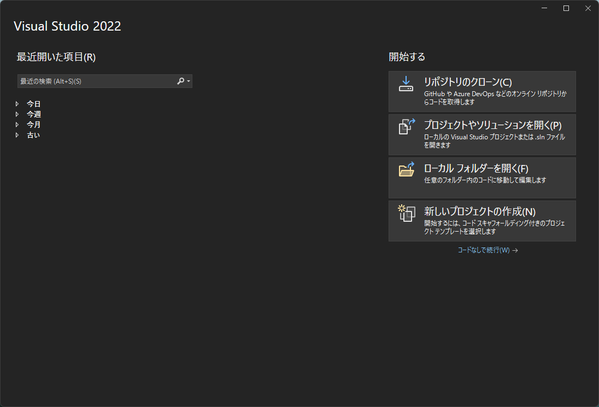
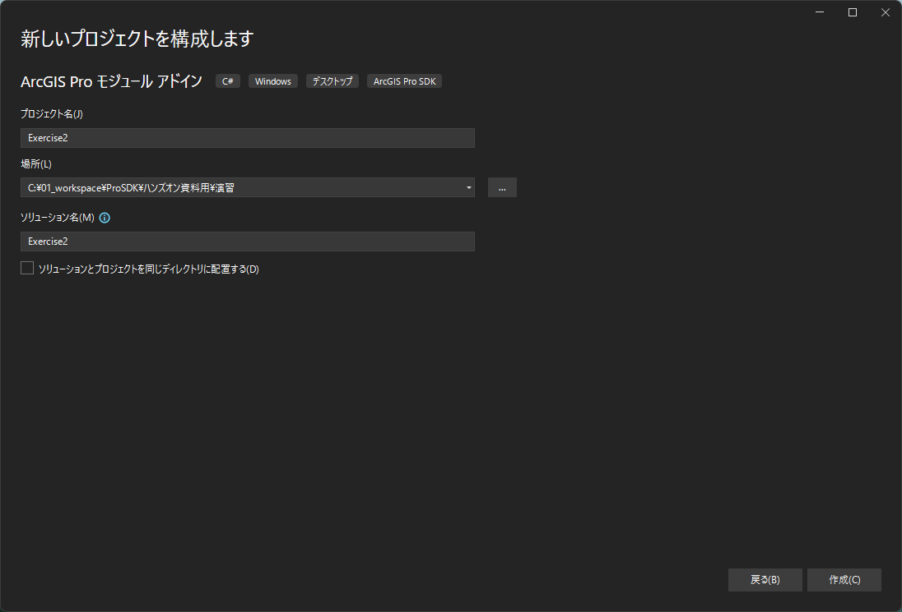
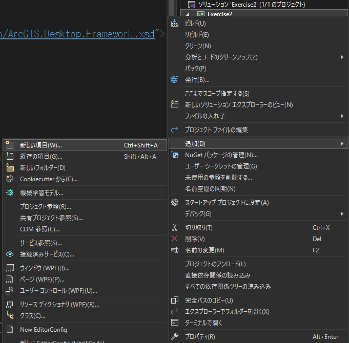
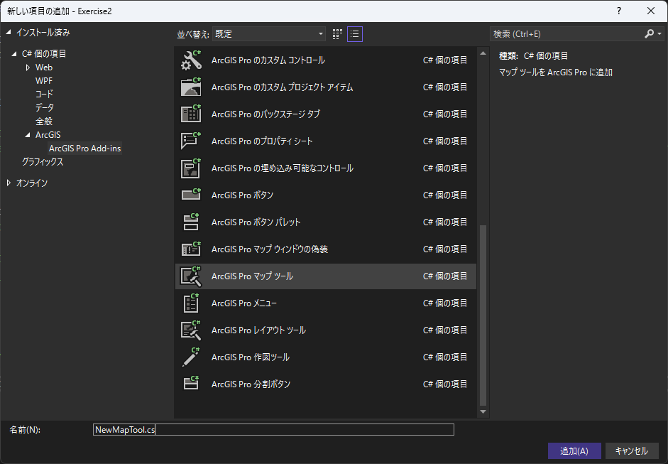
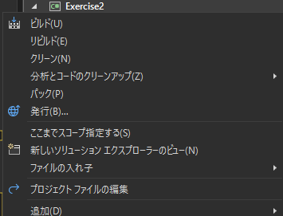
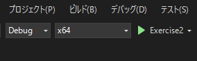
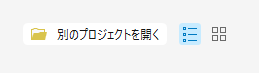
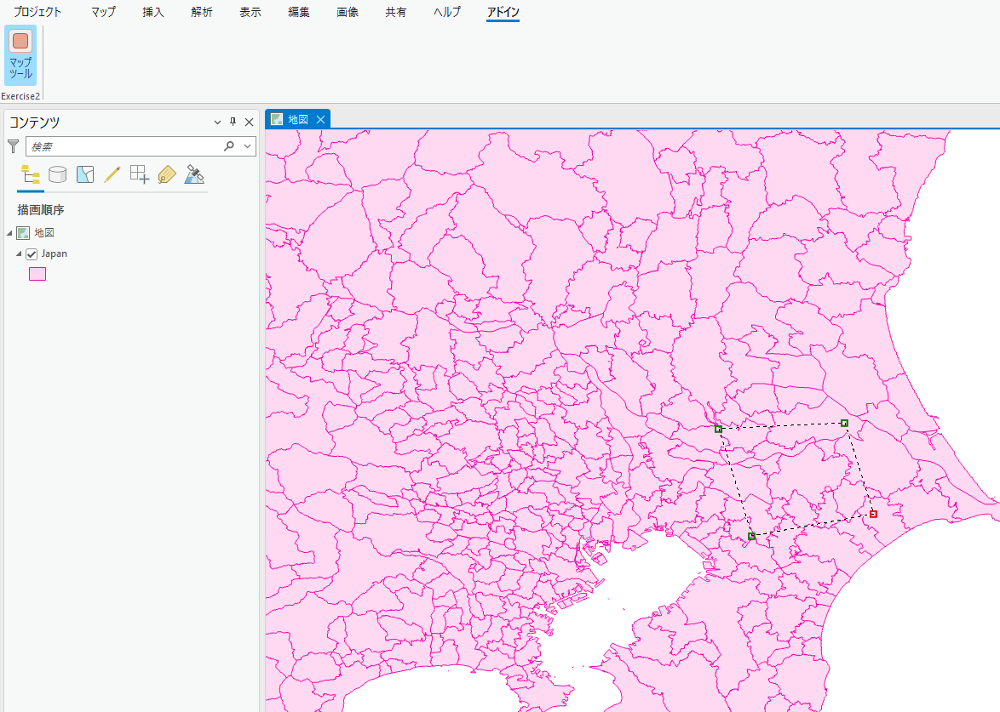
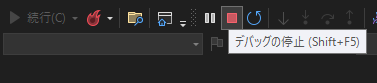

# 演習2

## 演習の概要
### 2-a. マップ ツールの作成

**演習時間**

* 20 分

**処理概要**

- スケッチしたポリゴンと交差するフィーチャを取得しズーム
- プロジェクト、マップ、レイヤーの名称と取得したフィーチャの件数のメッセージを出力
- 取得したフィーチャをフラッシュさせる

**演習の目的**

以下トピックについて理解を深める

* プロジェクトの操作
* マップ ビューの操作
* マップとの対話的な操作

__※完成イメージ__


### 2-b. レイヤーに等級色レンダラーを割り当てる

**演習時間**

* 20 分

**処理概要**

- マップ上のレイヤーを取得
- 等級色レンダラーの設定
- レンダラーの更新

**演習の目的**

以下トピックについて理解を深める

* レイヤーの操作
* レンダリングの設定

__※完成イメージ__


## 演習解答
<!--TODO GitHub更新時リンク更新-->
[演習の解答はこちらでダウンロードできます](./source/Exercise2.zip)

## 2-a. マップ ツールの作成

### 手順
1. プロジェクト作成
2. マップ ツール作成
3. マップとの対話的な操作の実装
4. デバッグ

#### 1.プロジェクト作成
1-1.Visual Studio を起動します。

1-2.[新しいプロジェクトの作成] をクリックしてください。



1-3.プロジェクトの種類に [ArcGIS Pro SDK] を設定し、[ArcGIS Pro モジュール アドイン] を選択して [次へ] をクリックしてください。


1-4.プロジェクト名を「Exercise2」に変更し [作成] をクリックしてください。



#### 2.マップ ツール作成
2-1.[Config.daml](https://github.com/EsriJapan/arcgis-pro-sdk/wiki/ProConcepts-Framework#damldesktop-application-markup-language%E3%81%AE%E6%A6%82%E8%A6%81) を開いて中身を確認してください。


2-2.Config.daml の \<group> 要素の caption を 以下のように「Exercise2」に変更してください。

<font color="Red">__※caption を設定することで ArcGIS Pro 上でのラベルの設定を行うことができます。__</font>

```xml
<groups>
<!-- comment this out if you have no controls on the Addin tab to avoid an empty group-->
    <group id="Exercise2_Group1" caption="Exercise2" appearsOnAddInTab="true">
        <!-- host controls within groups -->
    </group>
</groups>
```

2-3.プロジェクトを右クリック > [追加] > [新しい項目] をクリックしてください。



2-4.[ArcGIS Pro Add-ins] の [[ArcGIS Pro マップ ツール]](https://pro.arcgis.com/en/pro-app/latest/sdk/api-reference/topic9984.html) を選択してください。
また、ファイル名を「NewMapTool.cs」に変更し [追加] をクリックしてください。



2-5.Config.daml の \<tool> 要素の caption を 以下のように「マップ ツール」に変更してください。

```xml
<controls>
    <!-- add your controls here -->
    <tool id="Exercise2_NewMapTool" caption="マップ ツール" className="NewMapTool" loadOnClick="true" smallImage="pack://application:,,,/ArcGIS.Desktop.Resources;component/Images/GenericButtonRed16.png" largeImage="pack://application:,,,/ArcGIS.Desktop.Resources;component/Images/GenericButtonRed32.png" condition="esri_mapping_mapPane">
        <tooltip heading="Tooltip Heading">Tooltip text<disabledText /></tooltip>
    </tool>
</controls>
```

#### 3.マップとの対話的な操作の実装
3-1.NewMapTool.cs を開いてください。

3-2.コンストラクター (NewMapTool()) を以下のように書き換えてください。

```csharp
public NewMapTool()
{
    IsSketchTool = true;
    // ポリゴンをスケッチする
    SketchType = SketchGeometryType.Polygon;
    SketchOutputMode = SketchOutputMode.Map;
}
```

3-3.[OnSketchCompleteAsync](https://pro.arcgis.com/en/pro-app/latest/sdk/api-reference/topic10008.html) メソッドを以下のように書き換えてください。

```csharp
protected override Task<bool> OnSketchCompleteAsync(Geometry geometry)
{
    return QueuedTask.Run(() =>
    {
        // 現在のプロジェクトを取得
        var project = Project.Current;

        // アクティブなマップ ビューを取得
        var mapView = MapView.Active;

        // スケッチしたポリゴンと交差するフィーチャを取得
        var results = mapView.GetFeatures(geometry);

        // フィーチャを選択
        mapView.SelectFeatures(geometry);

        // 選択されたフィーチャに 3秒かけてズーム
        MapView.Active.ZoomToSelected(new TimeSpan(0, 0, 3), true);

        // プロジェクト、マップ、レイヤーの名称と取得したフィーチャの件数のメッセージを作成
        var sb = new StringBuilder();
        sb.AppendLine(String.Format("プロジェクト名:{0}", project.Name));
        sb.AppendLine(String.Format("マップ名:{0}", mapView.Map.Name));
        sb.AppendLine(String.Format("レイヤー名:{0}", String.Format(String.Join("\n", results.ToDictionary().Select(kvp => String.Format("{0}", kvp.Key.Name))))));
        sb.AppendLine(String.Format("フィーチャ数:{0}", String.Format(String.Join("\n", results.ToDictionary().Select(kvp => String.Format("{0}", kvp.Value.Count()))))));

        // メッセージを出力
        MessageBox.Show(sb.ToString(), "結果");

        // 取得したフィーチャをフラッシュ
        mapView.FlashFeature(results);

        return true;
    });
}
```

#### 4.デバッグ
4-1.プロジェクトをビルドしてください。

<font color="Red">__※プラットフォーム ターゲットを x64 に設定してビルドしてください。__</font>



4-2.[開始] ボタンをクリックし、デバッグを実行します。



4-3.ArcGIS Pro が起動します。起動後 [別のプロジェクトを開く] をクリックし、事前にダウンロードしていただいたハンズオン データに格納されている「Sample.aprx」を開いてください。



<!--TODO GItHub更新時、リンク更新-->
__※ダウンロードされていない方は [Sample.zip](../演習データ/Sample.zip) をダウンロードしてください__

4-4.ArcGIS Pro が起動したら [アドイン] タブ > [マップ ツール] をクリックしてください。

4-5.地図上の任意の範囲でポリゴンをスケッチしてください。



4-6.範囲内のフィーチャにズームし、メッセージを出力、フィーチャがフラッシュされることを確認してください。


4-7.Visual Studio 上で [デバッグの停止] をクリックしてください。



## 2-b. レイヤーに等級色レンダラーを割り当てる

 __※「2-a. マップ ツールの作成」で作ったプロジェクトを使用します。__

### 手順
1. ボタン作成
2. 等級色レンダラーの割り当て
3. デバッグ

#### 1.ボタン作成
1-1.プロジェクトを右クリック > [追加] > [新しい項目] をクリックしてください。


1-2.[ArcGIS Pro Add-ins] の [[ArcGIS Pro ボタン]](https://pro.arcgis.com/en/pro-app/latest/sdk/api-reference/topic10318.html) を選択してください。
また、ファイル名を「NewAddinButton.cs」に変更し [追加] をクリックしてください。


1-3.Config.daml の \<button> 要素 (id="Exercise2_NewAddinButton") の caption を以下のように「レンダリング」に変更してください。

```xml
<button id="Exercise2_NewAddinButton" caption="レンダリング" className="NewAddinButton" loadOnClick="true" smallImage="pack://application:,,,/ArcGIS.Desktop.Resources;component/Images/GenericButtonBlue16.png" largeImage="pack://application:,,,/ArcGIS.Desktop.Resources;component/Images/GenericButtonBlue32.png">
    <tooltip heading="Tooltip Heading">Tooltip text<disabledText /></tooltip>
</button>
```

#### 2.等級色レンダラーの割り当て
2-1.NewAddinButton.cs を開いてください。

2-2.[OnClick](https://pro.arcgis.com/en/pro-app/latest/sdk/api-reference/topic10323.html) メソッドを以下のように書き換えてください

```csharp
protected override void OnClick()
{
    // 等級色設定
    List<CIMClassBreak> listClassBreaks = new List<CIMClassBreak>
    {
        new CIMClassBreak
        {
　　　       // 0～1万人の場合はグレー
            Symbol = SymbolFactory.Instance.ConstructPolygonSymbol(ColorFactory.Instance.GreyRGB).MakeSymbolReference(),
            UpperBound = 10000,　 // 上限値
            Label = "0～1万人"　  // ラベル
        },
        new CIMClassBreak
        {
　　　       // 1～10万人の場合は青
            Symbol = SymbolFactory.Instance.ConstructPolygonSymbol(ColorFactory.Instance.BlueRGB).MakeSymbolReference(),
            UpperBound = 100000,　// 上限値
            Label = "1～10万人"　 // ラベル
        },
        new CIMClassBreak
        {
　　　       // 10～50万人の場合は緑
            Symbol = SymbolFactory.Instance.ConstructPolygonSymbol(ColorFactory.Instance.GreenRGB).MakeSymbolReference(),
            UpperBound = 500000,　//上限値
            Label = "10～50万人"　//ラベル
        },
        new CIMClassBreak
        {
　　　       // 50万～100万人の場合は赤
            Symbol = SymbolFactory.Instance.ConstructPolygonSymbol(ColorFactory.Instance.RedRGB).MakeSymbolReference(),
            UpperBound = 1000000,  　//上限値
            Label = "50万～100万人"　//ラベル
        }
    };

    // 等級色でレンダリング
    QueuedTask.Run(() =>
    {
        // プロジェクトにある "地図" というマップを取得
        var mpj = Project.Current.GetItems<MapProjectItem>().First(item => item.Name.Equals("地図"));
        var map = mpj.GetMap();

        // マップにあるポリゴン レイヤーを取得
        var lyr = map.GetLayersAsFlattenedList().OfType<FeatureLayer>().FirstOrDefault(f => f.ShapeType == esriGeometryType.esriGeometryPolygon);

        // 等級色の新規作成
        CIMClassBreaksRenderer cimClassBreakRenderer = new CIMClassBreaksRenderer
        {
            Field = "P_NUM",                                     //フィールド
            ClassificationMethod = ClassificationMethod.Manual,  //手法
            Breaks = listClassBreaks.ToArray()                   //クラス
        };
        lyr.SetRenderer(cimClassBreakRenderer);
    });
}
```

#### 3.デバッグ
3-1.「2-a. マップ ツールの作成」の「4-1」~「4-3」の手順を行ってください。

3-2.ArcGIS Pro が起動したら [アドイン] タブ > [レンダリング] をクリックしてください。

3-3.「Japan」レイヤーが等級色でレンダリングされることを確認してください。


3-4.Visual Studio 上で [デバッグの停止] をクリックしてください。


3-5.(オプション) Windows エクスプローラーを起動し、"C:\Users\<ユーザー名>\Documents\ArcGIS\AddIns\ArcGISPro" に移動してください。
アドイン用のフォルダーが作成されていますので、そのフォルダーを削除してください。

※フォルダー内には拡張子が「.esriAddinX」のアドイン ファイルが作成されています。<br>
　これを削除することで、作成したアドインを ArcGIS Pro 上から削除することができます。

※また、ArcGIS Pro の [設定 (またはプロジェクト)] > [アドインマネージャー] > [アドイン]で削除したいアドインを選択し、[このアドインを削除] からでも削除することができます。

