# 演習3

## 演習の概要
### 3-a. 属性検索の実行

**演習時間**

* 20 分

**処理概要**

- マップ上のフィーチャ レイヤーを取得し、そのフィーチャ レイヤーが格納されている GDB に接続
- 属性検索を実行し、取得した値をメッセージ ボックスに出力する

**演習の目的**

以下トピックについて理解を深める

* GDB への接続
* GDB 内の特定のデータを抽出

__※完成イメージ__

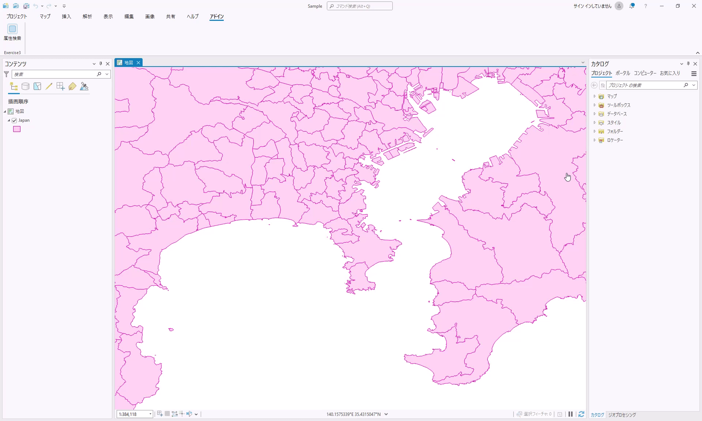

### 3-b. 作図ツールの作成

**演習時間**

* 20 分

**処理概要**

- バッファーをつけてポリゴンを作図
- 作図時にポリゴンに属性を付与

**演習の目的**

以下トピックについて理解を深める

* ジオメトリの作成
* ジオメトリの操作
* 作成したジオメトリに対する属性の付与

__※完成イメージ__

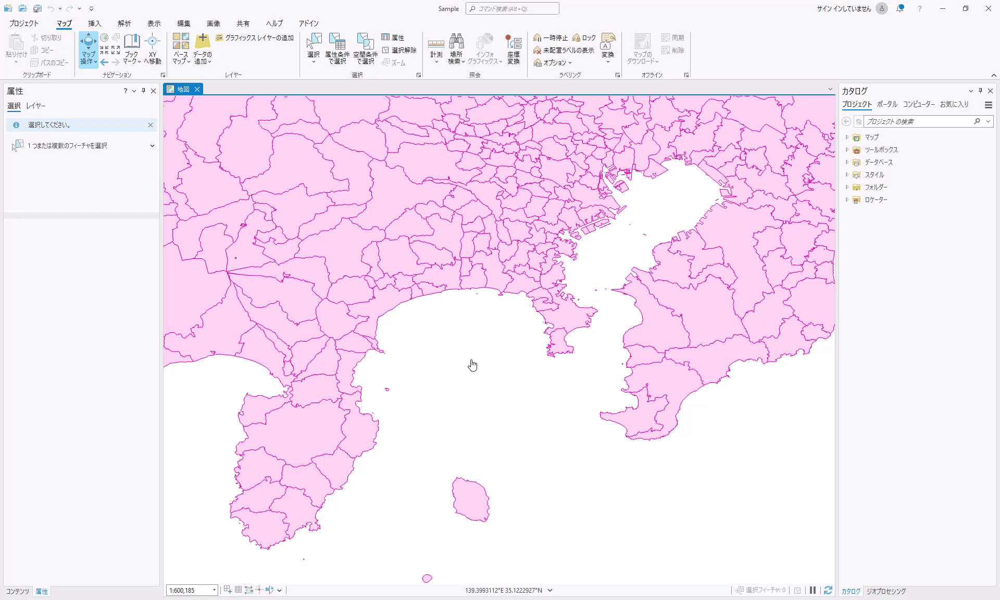

## 演習解答
<!--TODO GitHub更新時、リンク更新-->
[演習の解答はこちらでダウンロードできます](./source/Exercise3.zip)

## 3-a. 属性検索の実行

### 手順
1. プロジェクト作成
2. ボタン作成
3. 属性処理の実装
4. デバッグ

#### 1.プロジェクト作成
1-1.Visual Studio を起動します。

1-2.[新しいプロジェクトの作成] をクリックしてください。


1-3.プロジェクトの種類に [ArcGIS Pro SDK] を設定し、[ArcGIS Pro モジュール アドイン] を選択して [次へ] をクリックしてください。

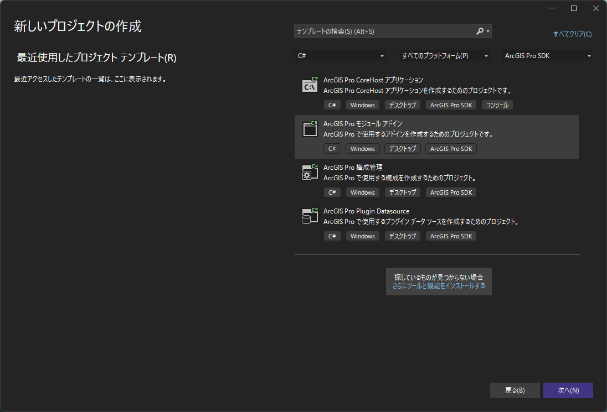

1-4.プロジェクト名を「Exercise3」に変更し [作成] をクリックしてください。

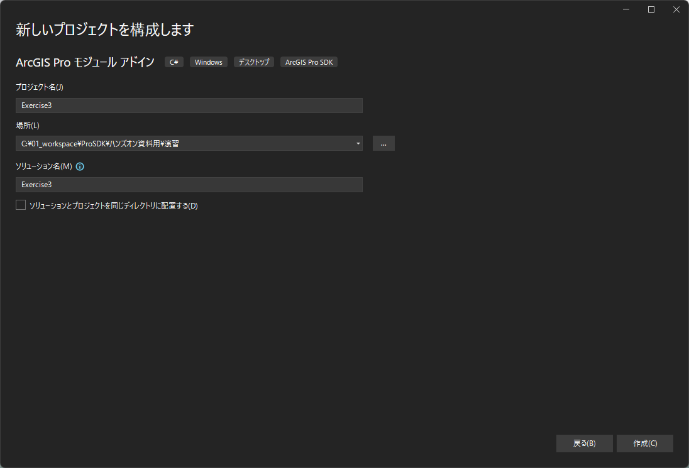

#### 2.ボタン作成
2-1.[Config.daml](https://github.com/EsriJapan/arcgis-pro-sdk/wiki/ProConcepts-Framework#damldesktop-application-markup-language%E3%81%AE%E6%A6%82%E8%A6%81) を開いて中身を確認してください。

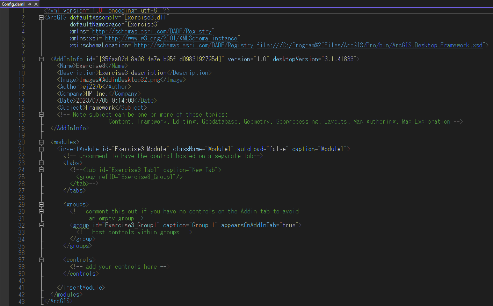

2-2.Config.daml の \<group> 要素の caption を 以下のように「Exercise3」に変更してください。

<font color="Red">__※caption を設定することで ArcGIS Pro 上でのラベルの設定を行うことができます。__</font>

```xml
<groups>
<!-- comment this out if you have no controls on the Addin tab to avoid an empty group-->
    <group id="Exercise3_Group1" caption="Exercise3" appearsOnAddInTab="true">
        <!-- host controls within groups -->
    </group>
</groups>
```

2-3.プロジェクトを右クリック > [追加] > [新しい項目] をクリックしてください。

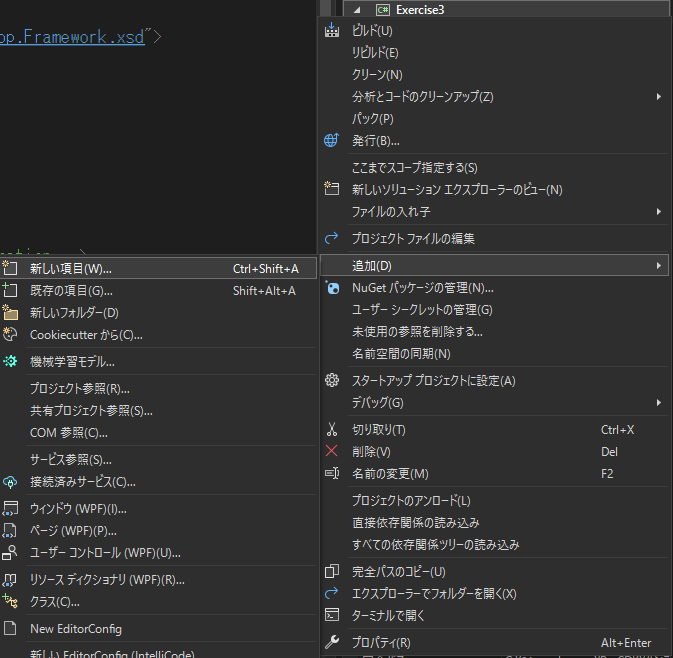

2-4.[ArcGIS Pro Add-ins] の [[ArcGIS Pro ボタン]](https://pro.arcgis.com/en/pro-app/latest/sdk/api-reference/topic10318.html) を選択してください。
ファイル名を「SelectLayerByAttribute.cs」に変更し [追加] をクリックしてください。

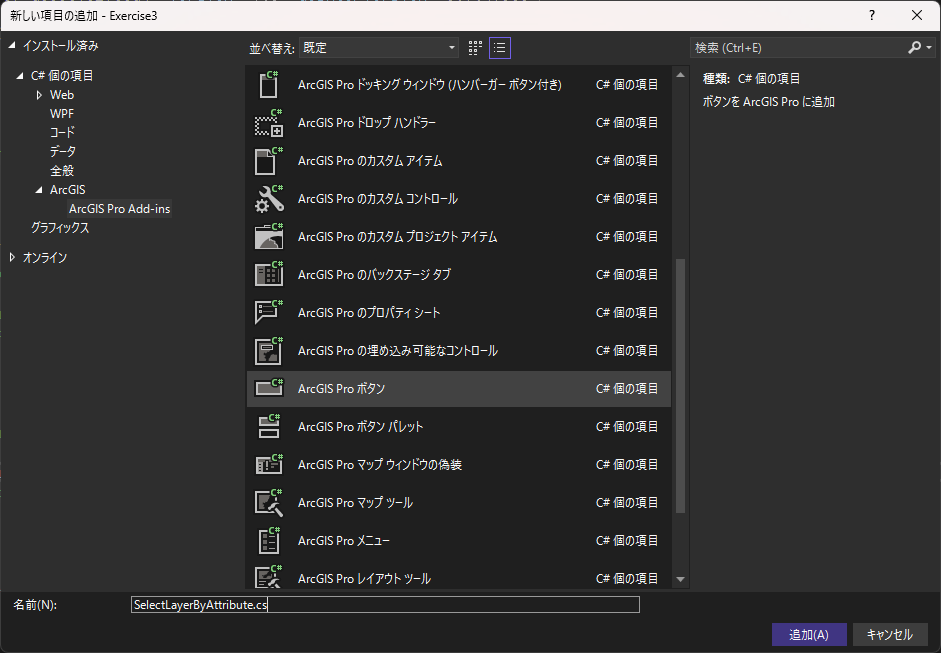

2-5.Config.damlの \<button> 要素の caption を 以下のように「属性検索」に変更してください。

```xml
<controls>
    <!-- add your controls here -->
    <button id="Exercise3_SelectLayerByAttribute" caption="属性検索" className="SelectLayerByAttribute" loadOnClick="true"
            smallImage="pack://application:,,,/ArcGIS.Desktop.Resources;component/Images/GenericButtonBlue16.png"
            largeImage="pack://application:,,,/ArcGIS.Desktop.Resources;component/Images/GenericButtonBlue32.png">
        <tooltip heading="Tooltip Heading">Tooltip text<disabledText /></tooltip>
    </button>
</controls>
```

#### 3.属性検索処理の実装
3-1.SelectLayerByAttribute.cs を開いてください。

3-2.[OnClick](https://pro.arcgis.com/en/pro-app/latest/sdk/api-reference/topic10323.html) メソッドを以下のように書き換えてください

```csharp
protected override void OnClick()
{
    // アクティブなマップを取得
    Map map = MapView.Active.Map;

    // 「Japan」レイヤーを取得
    FeatureLayer featureLayer = map.GetLayersAsFlattenedList().OfType<FeatureLayer>().FirstOrDefault(l => l.Name == "Japan");

    QueuedTask.Run(() =>
    {
        // データストアを取得
        using (Datastore datastore = featureLayer.GetFeatureClass().GetDatastore())
        {
            Geodatabase geodatabase = datastore as Geodatabase;

            using (Table table = geodatabase.OpenDataset<Table>("Japan"))
            {
                // 検索条件
                QueryFilter queryFilter = new QueryFilter
                {
                    // SQL Where 句によって条件を指定
                    WhereClause = "SIKUCHOSON = '横須賀市'",

                    // 取得するカラム
                    SubFields = "KEN, SIKUCHOSON, P_NUM"
                };

                // 検索条件と合致したフィーチャを取得
                using (RowCursor rowCursor = table.Search(queryFilter, true))
                {
                    while (rowCursor.MoveNext())
                    {
                        // レコードを取得
                        using (Row row = rowCursor.Current)
                        {
                            // 検索結果をメッセージ ボックスに表示
                            ArcGIS.Desktop.Framework.Dialogs.MessageBox.Show(string.Format("県: {0} " + Environment.NewLine +
                                                                                            "市町村: {1} " + Environment.NewLine +
                                                                                            "人口: {2}",
                                                                                            Convert.ToString(row["KEN"]),
                                                                                            Convert.ToString(row["SIKUCHOSON"]),
                                                                                            Convert.ToString(row["P_NUM"])), "検索結果");
                        }
                    }
                }
            }

        }
    });
}
```

#### 4.デバッグ
4-1.プロジェクトをビルドしてください。

<font color="Red">__※プラットフォーム ターゲットを x64 に設定してビルドしてください。__</font>

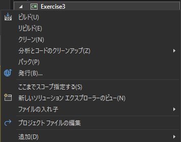

4-2.[開始] ボタンをクリックし、デバッグを実行します。

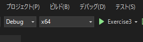

4-3.ArcGIS Pro が起動します。起動後 [別のプロジェクトを開く] をクリックし、事前にダウンロードしていただいたハンズオン データに格納されている「Sample.aprx」を開いてください。


<!--GitHub更新時、リンク更新-->
__※ダウンロードされていない方は [Sample.zip](../演習データ/Sample.zip) をダウンロードしてください__

4-4.ArcGIS Pro が起動したら [アドイン] タブ > [属性検索] をクリックしてください。

4-5.以下のようなメッセージ ボックスが出力されることを確認してください。


4-6.Visual Studio 上で [デバッグの停止] をクリックしてください。

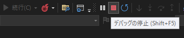

## 3-b. 作図ツールの作成

 __※「3-a. 属性検索の実行」で作ったプロジェクトを使用します。__

### 手順
1. 作図ツール作成
2. 作図ツールを使用したジオメトリの作成と操作
3. デバッグ

#### 1.作図ツール作成
1-1.プロジェクトを右クリック > [追加] > [新しい項目] をクリックしてください。


1-2.[ArcGIS Pro Add-ins] の [[ArcGIS Pro 作図ツール]](https://pro.arcgis.com/en/pro-app/latest/sdk/api-reference/topic9984.html) を選択してください。
また、ファイル名を「EditTool.cs」に変更し [追加] をクリックしてください。

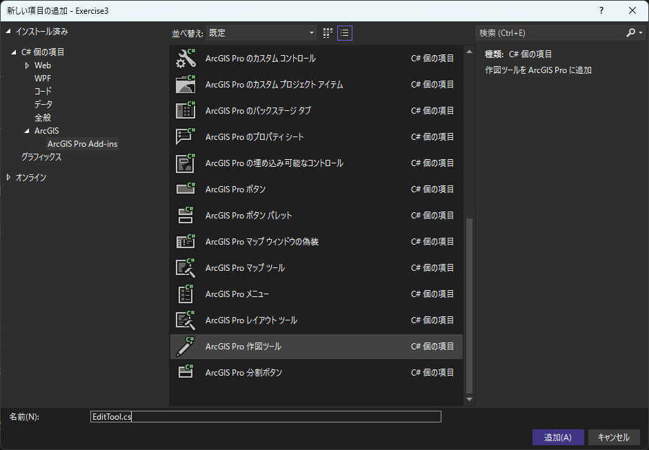

1-3.Config.daml を以下のように変更してください。

- \<tooltip heading></tooltip> を以下のように修正
- categoryRefID を「esri_editing_construction_polygon」に変更

```xml
<tool id="Exercise3_EditTool" categoryRefID="esri_editing_construction_polygon" caption="EditTool" className="EditTool"  loadOnClick="true"
      smallImage="pack://application:,,,/ArcGIS.Desktop.Resources;component/Images/GenericButtonRed16.png"
      largeImage="pack://application:,,,/ArcGIS.Desktop.Resources;component/Images/GenericButtonRed32.png" >
    <tooltip heading="ポリゴン作図">バッファーをつけてポリゴンを作図します<disabledText /></tooltip>
</tool>
```

#### 2.作図ツールを使用したジオメトリの作成と操作
2-1.EditTool.cs を開いてください。

2-2.コンストラクター (EditTool()) を以下のように書き換えてください。

```csharp
public EditTool()
{
    IsSketchTool = true;
    UseSnapping = true;
    SketchType = SketchGeometryType.Polygon;
}
```

2-3.[OnSketchCompleteAsync](https://pro.arcgis.com/en/pro-app/latest/sdk/api-reference/topic10008.html) メソッドを以下のように書き換えてください。

```csharp
protected override Task<bool> OnSketchCompleteAsync(Geometry geometry)
{
    if (CurrentTemplate == null || geometry == null)
        return Task.FromResult(false);

    // バッファーの距離
    var BufferDistance = 0.03;

    return QueuedTask.Run(() =>
    {
        // 作図したジオメトリからバッファーを作成
        Geometry bufferedGeometry = GeometryEngine.Instance.Buffer(geometry, BufferDistance);

        // アクティブなマップを取得
        Map map = MapView.Active.Map;

        // 「Japan」レイヤーを取得
        FeatureLayer lyr = map.GetLayersAsFlattenedList().OfType<FeatureLayer>().FirstOrDefault(l => l.Name == "Japan");

        // フィーチャクラスの Shape フィールドを取得
        string shapeField = lyr.GetFeatureClass().GetDefinition().GetShapeField();

        // ジオメトリの属性値設定
        var attributes = new Dictionary<string, object>();
        attributes.Add(shapeField, bufferedGeometry);  // shape フィールドにジオメトリ設定
        attributes.Add("KEN", "TEST");                 // KEN フィールドに値を設定

        // エディット オペレーションを作成
        var createOperation = new EditOperation();

        // ジオメトリの作成
        createOperation.Create(lyr, attributes);

        // 作図完了
        return createOperation.ExecuteAsync();
    });
}
```

#### 3.デバッグ
3-1.「3-a. 属性検索の実行」の「4-1」~「4-3」の手順を行ってください。

3-2.ArcGIS Pro が起動したら [編集] タブ > [作成] をクリックし、「フィーチャ作成」ウィンドウが表示されることを確認してください。

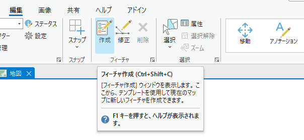<br>

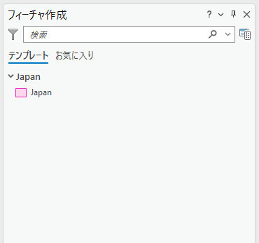

3-4.[フィーチャ作成] ウィンドウ > [Japan] > [ポリゴン作図] (作成した作図ツール) をクリックし、ポリゴンを作図してください。

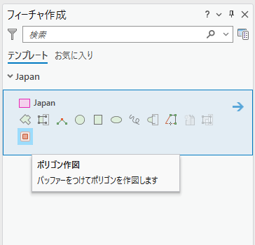<br>

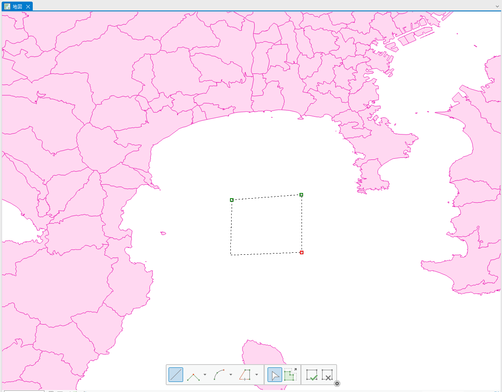

3-5.ダブル クリックで作図を完了すると、作図した図形からバッファーがついたポリゴン (属性付き) が作成されることを確認してください。

<br>

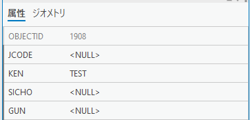

3-6.Visual Studio 上で [デバッグの停止] をクリックしてください。


3-7.(オプション) Windows エクスプローラーを起動し、"C:\Users\<ユーザー名>\Documents\ArcGIS\AddIns\ArcGISPro" に移動してください。
アドイン用のフォルダーが作成されていますので、そのフォルダーを削除してください。

※フォルダー内には拡張子が「.esriAddinX」のアドイン ファイルが作成されています。<br>
　これを削除することで、作成したアドインを ArcGIS Pro 上から削除することができます。

※また、ArcGIS Pro の[設定 (またはプロジェクト)] > [アドインマネージャー] > [アドイン]で削除したいアドインを選択し、[このアドインを削除] からでも削除することができます。

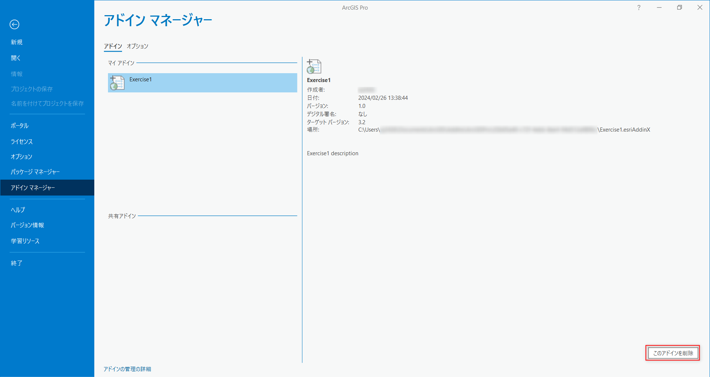