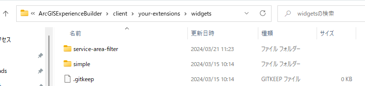
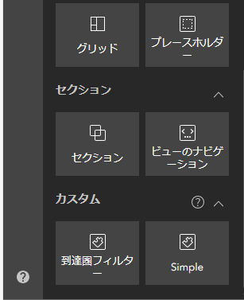
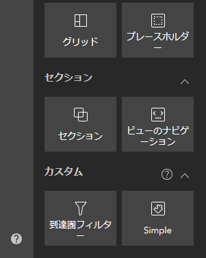
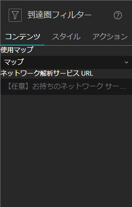
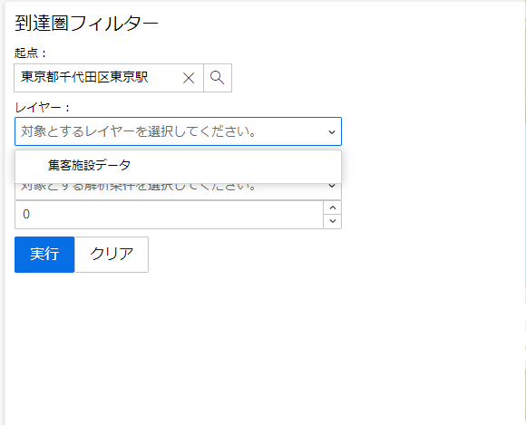
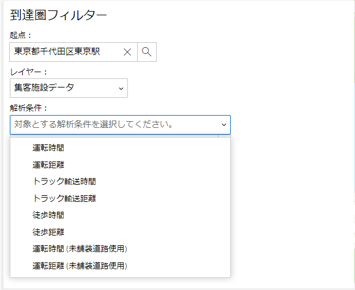
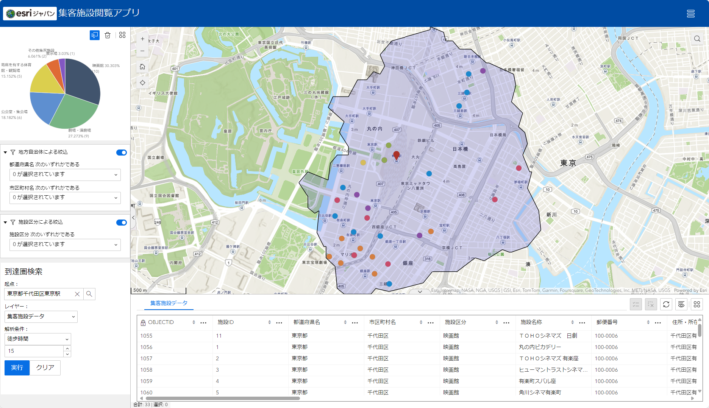

# ArcGIS Experience Builder (Developer Edition) を使用したカスタム ウィジェット開発ガイド

## 概要

このガイドは ArcGIS Experience Builder (Developer Edition) （以下、Experience Builder）で使用するカスタム ウィジェットを作成する方法を説明します。  
Experience Builder のインストール方法に関しては、[ArcGIS Experinece Builder (Developer Edition) インストールガイド](https://esrijapan.github.io/arcgis-dev-resources/tips/experience-builder/install-guide/)をご参照ください。

> [!WARNING]
> 本ハンズオンで作成するカスタム ウィジェットは ArcGIS Online の[クレジット](https://doc.esrij.com/online/users-guide/credits/)を消費します。  


## カスタム ウィジェットの開発

### 1. ウィジェット ボタンを配置する

本ガイドでは簡単な到達圏フィルターを行う In-Panel ウィジェットを開発していきます。ウィジェットを追加するには `<Experience Builder のインストール ディレクトリ>\client\your-extensions\widgets\` にウィジェットのフォルダーを配置します。

1. `<Experience Builder のインストール ディレクトリ>\client\your-extensions\widgets\` に新規で `service-area-filter` という名前で新しいフォルダーを作成します。  
  
フォルダー名がウィジェット名となります。ウィジェット名は半角英数字である必要があります。


2. Exerience Builder のウィジェットを作成するにあたっての最低限のフォルダー構成を作成します。  
`service-area-filter` フォルダーの直下に `src` フォルダーを作成し、作成した `src` フォルダーの直下に `setting` と `runtime` フォルダーを作成します。


3. 今回のウィジェットにて作成するにあたって必要なソースコードを記述するファイルを作成します。  
`setting` フォルダーに `setting.tsx` と `runtime` フォルダーに `widget.tsx` ファイルを作成します。


4. ウィジェットを作成するにあたって必要なメタデータとアイコン画像を配置します。  
`<Experience Builder のインストール ディレクトリ>\client\your-extensions\widgets\simple` 直下にある `manifest.json` と `icon.svg` をコピーし、`service-area-filter` フォルダーの直下に張り付けます。  


5. `service-area-filter` フォルダー直下にある `manifest.json` ファイルを開きます。


6. `name` 属性の値を `service-area-filter`、`label` 属性の値を `ServiceAreaFilter` に変更します。

```json
{
    "name": "service-area-filter",
    "label": "ServiceAreaFilter",
    "type": "widget",
    "version": "1.x.0",
  // ...
}
```


7. `translatedLocales` 属性の値に `ja` を追加します。

```json
{
  // ...
    "translatedLocales": [
      "en",
      "ja"
    ],
  // ...
}
```


8. `defaultSize` 属性内にある `width`、`height` 属性の値を変更します。
`defaultSize` 属性を変更することで、ウィジェットを追加した際のウィジェットのサイズを変更することができます。

```json
{
  // ...
  "defaultSize": {
    "width": 350,
    "height": 350
  }
}
```


9. `dependency` 属性を追加します。値には `jimu-arcgis` を設定し、保存します。  
`dependency` 属性に `jimu-arcgis` を設定することでウィジェット内で ArcGIS Maps SDK for JavaScript を使用することができます。

```json
{
  // ...
  "defaultSize": {
    "width": 350,
    "height": 350
  },
  "dependency": "jimu-arcgis"
}
```


10. `publishMessages` 属性を追加します。値は配列で設定します。配列内の値には `DATA_SOURCE_FILTER_CHANGE` を設定し、保存します。
`publishMessages` 属性はウィジェット間で様々な情報や状態の連携を行う場合に使用します。`DATA_SOURCE_FILTER_CHANGE` を設定することでフィルターしたフィーチャを他のウィジェットに連携することができます。`DATA_SOURCE_FILTER_CHANGE` の他の処理に応じた値が用意されています。その他の処理については、<a href="https://developers.arcgis.com/experience-builder/guide/core-concepts/message-action/" target="_blank">Message and action</a> をご参照ください。


```json
{
  // ...
  "dependency": "jimu-arcgis",
  "publishMessages": [
    "DATA_SOURCE_FILTER_CHANGE"
  ]
}
```


> #### manifest.json
> 
> ウィジェットの名前やバージョン等を設定するファイルです。`properties` 属性でカスタム ウィジェットのプロパティを構成できます。ウィジェットのプロパティについては、<a href="https://esrijapan.github.io/arcgis-dev-resources/tips/experience-builder/widget-development/widget-manifest/" target="_blank">Widget manifest</a> をご参照ください。


11. Experience Builder のウィジェットの追加画面で表示されるウィジェット名をローカライズします。ウィジェットのローカライズは 手順 1-2. で作成した `runtime` フォルダーの直下に `translations` フォルダーを作成します。  
`service-area-filter\src\runtime\translations` フォルダーの直下に `ja.js` ファイルを作成し、以下のコードを入力し保存します。

```js
define({
  _widgetLabel:"到達圏フィルター"
});
```

> #### translations フォルダー
> 
> カスタム ウィジェットを多言語化する場合に使用します。アクセスするブラウザーのロケールにより該当する言語が表示されます。`_widgetLabel` はウィジェット追加時に表示されるラベルをローカライズするための固有の属性です。

12. ウィジェットの設定画面にて必要なファイルを作成します。`<Experience Builder のインストール ディレクトリ>` 直下に `config.json` を作成し、以下のコードを入力し保存します。

```json
{

}
```
> #### config.json ファイル
>
> ウィジェットの設定画面の表示および初期値を設定する場合に使用します。今回は初期値を設定しないため中括弧のみ設定しています。


13. Experience Builder の server、client サービスのそれぞれを起動し、アプリケーションを作成します。ウィジェットの追加画面に「到達圏フィルター」というウィジェット名が表示されます。  
server、client の起動するにはコマンドプロンプトを 2 つ起動し、server および client にパスを移動し以下のコマンドを実行することで起動されます。
> npm start

server、client が起動したら `https://localhost:3001` をブラウザの URL バーに入力することで Experience Builder のビルダー画面を表示できます。



> [!TIP]
> #### icon.svg
> 
> カスタム ウィジェットのボタンのアイコンを変更したい場合は、このファイルを置き換えます。  
> 

### 2. ウィジェットの設定画面を作成する

ウィジェットで使用するパラメーターの設定を行う画面を作成します。  
今回は、設定画面で、対象とするマップ ウィジェットと任意で自前のネットワーク解析サービスを設定します。


1. `service-area-filter\src\setting` フォルダーの `setting.tsx` ファイルを開き、以下のコードを入力します。  

> [!NOTE]
> #### setting\setting.tsx
> Experience Builder でウィジェットの設定を行う画面と設定の処理を記述します。

```tsx
/** 2-1 設定画面用モジュールの設定 Start */
/** @jsx jsx */
import { React, jsx } from "jimu-core";
import { AllWidgetSettingProps } from "jimu-for-builder";
import { TextInput } from "jimu-ui";
import { MapWidgetSelector } from "jimu-ui/advanced/setting-components";

export default class Setting extends React.PureComponent<AllWidgetSettingProps<any>, any> {

}
/** 2-1 設定画面用モジュールの設定 End */
```

> [!NOTE]
> ウィジェットの設定画面を作成するにあたって必要なモジュールを必要に応じて読み込みます。
> Experience Builder は React を使用しているため、React に関するモジュールと Experience Builder の設定画面用に用意されているコンポーネントである `AllWidgetSettingProps` を指定します。
> また、Experience Builder には <a href="https://developers.arcgis.com/experience-builder/guide/storybook/" target="_blank">`Storybook`</a> というウィジェット構築用の UI コンポーネントが用意されています。今回は Web アプリ上に設定した Web マップを選択する `MapWidgetSelector` と任意のネットワーク解析サービス URL を入力する `TextInput` を指定します。


2. `setting.tsx` ファイルに設定画面の画面構成を記述します。 

```tsx
// ...
export default class Setting extends React.PureComponent<AllWidgetSettingProps<any>, any> {
    
    /** 2-2 設定画面の画面構成追加 Start */
    render() {
        return <div className="widget-setting-demo">
            使用マップ
            <MapWidgetSelector
                useMapWidgetIds={this.props.useMapWidgetIds}
                onSelect={this.onMapWidgetSelected}
            />
            ネットワーク解析サービス URL
            <TextInput 
                type="text" 
                placeholder="【任意】お持ちのネットワーク サービスを利用したい方は入力してください。" 
                defaultValue={this.props.config.serviceUrl} 
                onChange={this.onNetworkAnalysisServiceUrlSet}>
            </TextInput>
        </div>;
    }
    /** 2-2 設定画面の画面構成追加 End */
}
/** 2-1 設定画面用モジュールの設定 End */
```

> [!NOTE]
> `React` では `render` メソッドの戻り値に設定した画面構成要素をレンダリングします。
> 今回の場合は、使用する Web マップを選択する要素と任意のネットワーク解析サービス URL を入力する要素を記述しています。


3. 各コンポーネントには値を変更した際のイベントが設定されているため、イベントの処理を `setting.tsx` ファイルに記述し、保存します。

```tsx

// ...
export default class Setting extends React.PureComponent<AllWidgetSettingProps<any>, any> {
    /** 2-3 コンポーネントのイベント処理追記 Start */
    // 対象のマップを設定
    onMapWidgetSelected = (useMapWidgetIds: string[]) => {
        this.props.onSettingChange({
            id: this.props.id,
            useMapWidgetIds: useMapWidgetIds
        });
    };

    // 使用するネットワーク解析サービス URL を設定
    onNetworkAnalysisServiceUrlSet = (url: React.FormEvent<HTMLInputElement>) => {
        this.props.onSettingChange({
            id: this.props.id,
            config: this.props.config.set('serviceUrl', url.currentTarget.value)
        })
    };
    /** 2-3 コンポーネントのイベント処理追記 End */

    /** 2-2 設定画面の画面構成追加 Start */
// ...
```

> [!NOTE]
> `onMapWidgetSelected`, `onNetworkAnalysisServiceUrlSet` の処理は、作成するウィジェットに対して設定画面で選択したパラメーターを利用できるようにします。


4. ブラウザーで Experience Builder を更新後、ビルダー画面で到達圏フィルター ウィジェットを追加すると、設定画面に定義した構成が表示されます。  



### 3. ウィジェットの処理を実装する

ウィジェットの処理を実装します。

> [!NOTE]
> Experience Builder では、`<Experience Builder のインストール ディレクトリ>\client` を実行すると `<Experience Builder のインストール ディレクトリ>\client\your-extensions\widgets` フォルダーに配置されたウィジェットは `<Experience Builder のインストール ディレクトリ>\client\dist\widgets` フォルダーにコピーされ、ビルダーはそのフォルダーを参照して Web アプリを作成します。  
> `client` が実行している間は実行時点で存在するファイルが更新された場合、都度 `<Experience Builder のインストール ディレクトリ>\client\dist\widgets` の内容も更新されるため、ブラウザーの更新をすることでビルダーにおいてもウィジェットの更新内容を反映する事ができます。


まず、ウィジェットのパネルに表示する画面を作成します。  
パネルには、到達圏を作成する起点と、マップ上にあるレイヤーから検索対象のレイヤーと、到達圏を作成する条件を設定する画面を作成します。


1. `service-area-filter\src\runtime` フォルダーにある `widget.tsx` ファイルを開き編集します。  
ウィジェットの設定画面を作成するにあたって必要なモジュールを必要に応じて読み込みます。

> [!NOTE]
> #### runtime\widget.tsx
> ウィジェットの画面と実際の処理を記述します。 

```tsx
/** 3-1 ウィジェットの画面用モジュールの設定 Start */
/** @jsx jsx */
import { React, AllWidgetProps, css, jsx, DataSourceManager, QueriableDataSource, MessageManager, DataSourceFilterChangeMessage } from "jimu-core";
import { JimuMapViewComponent, JimuMapView } from "jimu-arcgis";
import { Label, Select, Option, NumericInput, Table, Button } from "jimu-ui";
export default class Widget extends React.PureComponent<AllWidgetProps<any>, any> {

}
/** 3-1 ウィジェットの画面用モジュールの設定 End */
```

> [!NOTE]
> ウィジェットの画面を作成するにあたって必要なモジュールを必要に応じて読み込みます。
> 設定画面と同様に、React に関するモジュールと Experience Builder のウィジェット画面用に用意されているコンポーネントである `AllWidgetProps` を指定します。  
> また、UI のコンポーネントに関しても同様に <a href="https://developers.arcgis.com/experience-builder/guide/storybook/" target="_blank">`Storybook`</a> を用いて必要となるものを指定します。今回は、`Label`,`Select`,`Option`,`NumericInput`,`Table`,`Button` というコンポーネントを使用します。  


2. ウィジェット画面上で使用するコンポーネントの情報を管理するために `State` に変数を定義します。

```tsx
// ...
export default class Widget extends React.PureComponent<AllWidgetProps<any>, any> {

  /** 3-2 State の定義 Start */
  // 処理内で利用する変数を定義
    state = {
        jimuMapView: null, /** 対象 Webマップ */
        webmapLayers: [], /** Web マップのレイヤー情報 */
        selectLayer: null, /** 選択したレイヤー情報 */
        breaks: 0, /** 到達圏を作成する大きさ */
        beforTargetLayer: null, /** 直前に実行対象としたレイヤー */
        serviceAreaUrl: null, /** 到達圏解析用 Url */
        networkDescription: null, /** ネットワークの説明 */
        travelModes: [], /** 到達圏解析条件一覧 */
        selTravelMode: null, /** 選択した到達圏解析条件 */
        serviceAreaPolygon: null /** 到達圏解析の結果ポリゴン */
    };
  /** 3-2 State の定義 End */

}
/** 3-1 ウィジェットの画面用モジュールの設定 End */
```


3. ウィジェット画面の画面構成を記述します。  

```tsx
// ...
  /** 3-2 State の定義 End */
  
    /** 3-3 画面構成の定義 Start */
    // UI 情報レンダリング
    render() {
        // UI のデザインを設定
        const widgetStyle = css`
    background-color: var(--white);
    padding: 10px;
    margin: 2px;
    `
        const tableStyle = css`
    background-color: var(--white);
    `

        // レイヤーリストをプルダウンに設定
        const { webmapLayers, travelModes } = this.state;
        let layerList = webmapLayers.length > 0
            && webmapLayers.map((item, idx) => {
                return (
                    <Option key={idx} value={String(item.id)}>{item.name}</Option>
                )
            }, this);

        let  travelList = travelModes.length > 0
                && travelModes.map((item, idx) => {
                    return(
                        <Option key={idx} value={String(item.name)}>{item.name}</Option>
                    )
                }, this);

        return (
            <div className="widget-starter jimu-widget" css={widgetStyle}>
                {this.props.hasOwnProperty("useMapWidgetIds") &&
                    this.props.useMapWidgetIds &&
                    this.props.useMapWidgetIds[0] && (
                        <JimuMapViewComponent
                            useMapWidgetId={this.props.useMapWidgetIds?.[0]}
                            onActiveViewChange={this.activeViewChangeHandler}
                        />
                    )
                }
                <h3>到達圏検索</h3>
                <Table css={tableStyle}>
                    <tr>
                        <Label>
                            起点：
                            <div id="searchArea"></div>
                        </Label>
                    </tr>
                    <tr>
                        <Label>
                            レイヤー：
                            <Select
                                onChange={this.selLayer}
                                autoWidth={true}
                                placeholder="対象とするレイヤーを選択してください。">
                                {layerList}
                            </Select>
                        </Label>
                    </tr>
                    <tr>
                        <Label>
                            解析条件：
                            <Select
                                onChange={this.selTravelMode}
                                autoWidth={true}
                                placeholder="対象とする解析条件を選択してください。">
                                {travelList}
                            </Select>
                            <NumericInput defaultValue={Number(0)} onChange={this.chgServiceTime} />
                        </Label>
                    </tr>
                    <tr>
                        <Button size="lg" onClick={this.doAction} type="primary">実行</Button>
                        <Button size="lg" onClick={this.doClear} type="default">クリア</Button>
                    </tr>
                </Table>
            </div>
        );
    }
    /** 3-3 画面構成の定義 End */
}
```

> [!NOTE]
> マップ ウィジェットからマップの情報を設定する `JimuMapViewComponent` というコンポーネントを構成することによって、カスタム ウィジェットにマップ ウィジェットを紐づけることができます。今回はマップ ウィジェットに対して操作を実施した時に、到達圏フィルターの処理を実施するワークフローを設定します。
> ウィジェット画面の UI は、到達圏の起点となる場所を決定する検索ウィジェット、検索対象のレイヤーを選択するセレクトボックス、到達圏を作成する条件を設定するセレクト ボックスおよびインプット エリア、処理の実行およびクリアをする 4 つの UI コンポーネントにて構成しています。各コンポーネントでは入力値が変更されると `State` の値を変更するファンクションを設定しています。


4. 到達圏フィルター処理で使用する ArcGIS Maps SDK for JavaScript のモジュールをインポートします。

```tsx
// ...
import { Label, Select, Option, NumericInput, Checkbox, Table } from "jimu-ui";
/** 3-4 使用する ArcGIS API for JavaScript のモジュールをインポート Start */
import Polygon from "esri/geometry/Polygon";
import SimpleFillSymbol from "esri/symbols/SimpleFillSymbol";
import Graphic from "esri/Graphic";
import Query from "esri/rest/support/Query";
import LayerView from "esri/views/layers/LayerView";
import Collection from "esri/core/Collection";
import FeatureLayerView from "esri/views/layers/FeatureLayerView";
import FeatureFilter from "esri/layers/support/FeatureFilter";
import serviceArea from "esri/rest/serviceArea";
import ServiceAreaParameters from "esri/rest/support/ServiceAreaParameters";
import networkService from "esri/rest/networkService";
import TravelMode  from "esri/rest/support/TravelMode"
import FeatureSet from "esri/rest/support/FeatureSet";
import Search from "esri/widgets/Search";
import WebStyleSymbol from "esri/symbols/WebStyleSymbol";
/** 3-4 使用する ArcGIS API for JavaScript のモジュールをインポート End */
export default class Widget extends React.PureComponent<AllWidgetProps<any>, any> {
// ...
```

> [!NOTE]
> Experience Builder の GIS 処理は、Web アプリ上で ArcGIS Online および ArcGIS Enterprise で提供している GIS 機能を使用することができる、<a href="https://developers.arcgis.com/javascript/latest/" target="_blank">`ArcGIS Maps SDK for JavaScript`</a> という API を使用します。  


5. 各 UI コンポーネントに設定されているファンクションを記述します。  

```tsx
    // ...
    /** 3-2 State の定義 End */

    /** 3-5 UI コンポーネント用ファンクション Start */
    // マーキング対象のレイヤーを設定
    selLayer = (selected: React.FormEvent<HTMLInputElement>) => {
        this.setState({
            selectLayer: selected.currentTarget.value
        });
    };
    
    // マーキング対象のレイヤーを設定
    selTravelMode = (selected: React.FormEvent<HTMLInputElement>) => {
        this.setState({
            selTravelMode: selected.currentTarget.value
        });
    };

    // 到達距離および時間を設定
    chgServiceTime = (numVal: Number) => {
        this.setState({
            breaks: numVal
        });
    };

    // メイン処理を実行
    doAction = () => {
        const msg = this.eventErrorCheck();
        if (!msg) {
            this.doServiceAreaSearch();
        } else {
            alert(msg);
        }
    }

    // クリア処理の実行
    doClear = () => {
        this.state.jimuMapView.view.graphics.removeAll();
        this.state.serviceAreaPolygon = null;

        this.state.jimuMapView.view.map.layers.forEach(layer => {
            this.doFilterAction(layer, "1=1");    
        })
    }
    /** 3-5 UI コンポーネント用ファンクション End */

    /** 3-3 画面構成の定義 Start */
    // ...
```


6. マップ ウィジェットを操作した際のイベントを記述します。

```tsx
    // ...
    /** 3-2 State の定義 End */

    /** 3-6 マップ ウィジェット イベント追加 Start */
    // マップ ウィジェットが変更されたときにマップ情報と検索ウィジェットの設定
    activeViewChangeHandler = async (jmv: JimuMapView) => {
        if (jmv) {
            this.state.serviceAreaUrl = this.props.config.serviceUrl ? this.props.config.serviceUrl : "https://route-api.arcgis.com/arcgis/rest/services/World/ServiceAreas/NAServer/ServiceArea_World";
            this.state.networkDescription = await networkService.fetchServiceDescription(this.state.serviceAreaUrl);
            this.setState({
                jimuMapView: jmv,
                webmapLayers: this.setLayerList(jmv.view.layerViews),
                travelModes: this.setTravelList(this.state.networkDescription.supportedTravelModes)
            });
            const searchWidget: Search = new Search({
                view: jmv.view,
                popupEnabled: false,
                container: document.getElementById("searchArea")
            });
            const pinSymbol = new WebStyleSymbol({
                name: "Pushpin 3",
                styleName: "EsriIconsStyle"
            })

            searchWidget.viewModel.defaultSymbols = {
                point: pinSymbol
            } 
        }
    };
    /** 3-6 マップ ウィジェット イベント追加 End */

    /** 3-5 UI コンポーネント用ファンクション Start */
    // ...
```

> [!NOTE]
> ここでは、マップ ウィジェットで設定されているマップ情報、ネットワーク解析サービスに必要な情報を `State` に設定しています。
> また、到達圏を作成する際の起点とする検索ウィジェットと検索結果を表示するシンボルを設定しています。


7. マップ ウィジェットに設定されているレイヤー情報を取得する処理および到達圏を作成する際の移動条件を記述します。

```tsx
    // ...
    /** 3-7 レイヤー情報の取得処理および移動条件情報の取得処理追加 Start */
    // マップ ウィジェットに設定されいてるレイヤー情報の取得
    setLayerList = (layers: Collection<LayerView>) => {
        const list = [];
        for (let idx = layers.length; 0 < idx; idx--) {
            const layer = layers.items[idx - 1];
            list[idx] = { id: layer.layer.id, name: layer.layer.title }
        }
        return list;
    }

    setTravelList = (modes: TravelMode[]) => {
        const list = [];
        for (let idx = 0; idx < modes.length; idx++) {
            const mode = modes[idx];
            list[idx] = {name: mode.name}
        }
        return list;
    }
    /** 3-7 レイヤー情報の取得処理および移動条件情報の取得処理 End */

    /** 3-5 UI コンポーネント用ファンクション Start */
    // ...
```

> [!NOTE]
> この処理にてウィジェット画面のレイヤーリストに設定しているレイヤーを表示することができます。  
> また、ウィジェット画面の解析条件のリストにネットワーク解析サービスに設定されている移動条件を表示することができます。
> ここまでの内容でウィジェット画面の UI を Web ブラウザー上で確認することができます。


8. 必須項目チェック処理を記述します。
到達圏フィルター処理では、到達圏の起点となる地点と各パラメーターが設定されていないと処理が成り立たないため必須条件とします。
条件を満たさない場合エラーとし、アラート メッセージを表示します。

```tsx
    // ...
    /** 3-6 マップ ウィジェット イベント追加 End */

    /** 3-8 必須項目チェック追加 Start */
    // 必須項目入力チェック
    eventErrorCheck = () => {
        let requrirdMsg = ""; /** エラー メッセージ格納用 */

        const point = this.state.jimuMapView.view.graphics.find((graphic : Graphic) => {
            return graphic.geometry.type == "point"
        });
        if (!point) {
            requrirdMsg = "起点が設定されていません。\n";
        }

        // レイヤーが選択されていない場合はエラー
        if (!this.state.selectLayer || this.state.selectLayer.length == 0) {
            requrirdMsg = requrirdMsg + "対象のレイヤーを選択してください。\n";
        }

        // 解析条件が選択されていない場合はエラー
        if (!this.state.selTravelMode || this.state.selTravelMode.length == 0) {
            requrirdMsg = requrirdMsg + "解析条件を選択してください。\n";
        }

        // 到達距離または到達時間が 0 以下の場合はエラー
        if (this.state.breaks <= 0) {
            requrirdMsg = requrirdMsg + "到達距離または時間は 0 より大きい値を入力してください。";
        }

        return requrirdMsg;
    }
    /** 3-8 必須項目チェック追加 End */

    /** 3-7 レイヤー情報の取得処理追加 End */
    // ...
```

9. 到達圏フィルターの本処理を記述します。

``` tsx
    // ...
    /** 3-8 必須項目チェック追加 End */

    /** 3-9 到達圏フィルターの本処理追加 Start */
    // 到達圏フィルターの本処理
    doServiceAreaSearch = async () => {

        // 前回の実行結果があれば削除する。
        if (this.state.serviceAreaPolygon) {
            if (this.state.beforTargetLayer.id !== this.state.selectLayer) this.doFilterAction(this.state.beforTargetLayer, "1=1");
            this.state.jimuMapView.view.graphics.remove(this.state.serviceAreaPolygon);
            this.state.serviceAreaPolygon = null;
        }

        // 指定した条件で到達圏を作成
        const travelMode = this.state.networkDescription.supportedTravelModes.find(
            (travelMode) => (travelMode.name === this.state.selTravelMode)
        );
        const basePoint: Graphic = this.state.jimuMapView.view.graphics.find((graphic : Graphic) => {
            return graphic.geometry.type == "point"
        });
        const serviceAreaParameters: ServiceAreaParameters = new ServiceAreaParameters({
            facilities: new FeatureSet({
                features: [basePoint]
            }),
            defaultBreaks: [this.state.breaks],
            travelMode,
            travelDirection: "from-facility",
            outSpatialReference: this.state.jimuMapView.view.spatialReference,
            trimOuterPolygon: true
        });

        // 到達圏解析を実行
        const results = await serviceArea.solve(this.state.serviceAreaUrl, serviceAreaParameters);
        const area: any = results.serviceAreaPolygons.features[0]?.geometry;
        // 到達圏の作成が正常に終了した場合に描画処理を実行
        if (area) {
            // 到達圏のグラフィックを定義
            let areaGraphic = new Graphic({
                geometry: area,
                symbol: this.setAreaSymbol()
            });
            // 到達圏のグラフィックをマップに表示
            this.state.jimuMapView.view.graphics.add(areaGraphic);
            this.state.serviceAreaPolygon = areaGraphic;

            // 到達圏内のレイヤー取得およびフィルター、連携処理実行
            this.layerGetAndMarking(area);
        }

    }
    /** 3-9 到達圏フィルターの本処理追加 End */

    /** 3-7 レイヤー情報の取得処理追加 End */
    // ...
```

> [!NOTE]
> ここでは、以下の流れで処理を実行しています。
> 1. マップ ウィジェット上にある前回の到達圏フィルター結果を削除する。
> 2. 検索ウィジェットにて検索した位置情報とウィジェット画面で設定されている到達圏の作成条件を基に作成する。
> 3. 到達圏が正常に作成された場合、その到達圏をマップ ウィジェットに表示する。
> 4. 到達圏内に含まれるレイヤーの取得およびフィルター、他のウィジェットへの連携処理の呼び出し

10. 到達圏内に含まれるレイヤーの取得およびフィルター、他のウィジェットへの連携の処理を記述します。

```tsx
    // ...
    /** 3-9 到達圏フィルターの本処理追加 End */

    /** 3-10 到達圏内に含まれるレイヤーの取得およびフィルター連携処理の呼び出し追加 Start */
    // 到達圏内のレイヤー取得およびフィルター、連携の処理
    layerGetAndMarking = async (area: Polygon) => {
        // プルダウンで選択したレイヤーを Web マップから取得
        const targetLayer: any = this.state.jimuMapView.view.map.findLayerById(this.state.selectLayer);
        let primaryKey: string;
        // 取得したレイヤータイプがフィーチャ レイヤーの場合描画処理を実行
        if (targetLayer.type == "feature") {
            // 到達圏内にある対象のレイヤーを取得
            const query = new Query({ returnGeometry: true, outFields: ["*"] });
            query.geometry = area;
            query.spatialRelationship = "contains";

            primaryKey = targetLayer.objectIdField;
            // 到達圏内にあるオブジェクトを取得
            const objList = await targetLayer.queryFeatures(query).then(results => {
                let objList = [];
                // 到達圏内にあるオブジェクトをリストに格納
                for (let idx = 0; idx < results.features.length; idx++) {
                    objList.push(results.features[idx].attributes[primaryKey]);
                }
                return objList;
            })
                .catch(error => {
                    console.log("targetLayer.queryFeatures error:", error.messagae);
                    return [];
                });

            // Where 句を作成
            const selectedQuery =
                objList && objList.length > 0
                    ? primaryKey + ` IN (${objList
                        .map(item => {
                            return item
                        })
                        .join()})`
                    : '1=2';

            // フィルター処理を実行
            this.doFilterAction(targetLayer, selectedQuery);

            this.state.jimuMapView.view.goTo(area);
            this.state.beforTargetLayer = targetLayer;
        }
    }
    /** 3-10 到達圏内に含まれるレイヤーの取得およびフィルタリング連携処理の呼び出し追加 End */

    /** 3-7 レイヤー情報の取得処理追加 End */
    // ...
```

> [!NOTE]
> ここでは、以下の流れで処理を実行しています。
> 1. ウィジェット画面で設定したフィーチャ レイヤーの情報をマップ ウィジェットに設定された Web マップから取得
> 2. 取得したフィーチャレイヤーの情報から作成した到達圏内にあるフィーチャを取得
> 3. 取得したフィーチャより OBJECTID を元にフィルター条件の Where 句を作成
> 4. フィルター処理の呼び出し
> 5. 到達圏のポリゴンに対してズーム

11. フィルター処理を記述します。
```tsx
    // ...
    /** 3-10 到達圏内に含まれるレイヤーの取得およびフィルタリング連携処理の呼び出し追加 End */

    /** 3-11 フィルター処理の追加  Start */
    doFilterAction = async (targetLayer: any, wherePhrase: string) => {
        // フィルター条件の設定
        const featureFilter: FeatureFilter = new FeatureFilter({
            where: wherePhrase
        });
        const queryParams = { where: wherePhrase } as any

       // アプリに設定した Web マップ、FeatureLayer のデータソース一覧を取得
       let dsManager = DataSourceManager.getInstance();
       // マップ ウィジェットに設定した Web マップのレイヤー一覧を取得
       const layerViews = this.state.jimuMapView.jimuLayerViews;
       let dataSource = null;
       // 検索対象としたレイヤーのデータソースを取得する。
       for (let layerView in layerViews) {
           let layer = layerViews[layerView];
           if (layer.jimuLayerId === targetLayer.id) {
               dataSource = dsManager.getDataSource(layer.layerDataSourceId);
           }
       }

        // フィルター対象の LayerView を設定、フィルター
        let targetLayerView: FeatureLayerView;
        await this.state.jimuMapView.view.whenLayerView(targetLayer).then(layerview => {
            targetLayerView = layerview;
        });
        targetLayerView.filter = featureFilter;

        // フィルター処理の実施
        if (dataSource) {
            // ウィジェット間連携（フィルターされているデータを連携）
            (dataSource as QueriableDataSource).updateQueryParams?.(queryParams, this.props.id);
            MessageManager.getInstance().publishMessage(new DataSourceFilterChangeMessage(this.props.id, [dataSource.id]));
        }
    }
    /** 3-11 フィルター処理の追加  End  */

    /** 3-7 レイヤー情報の取得処理および移動条件情報の取得処理追加 Start */
    // ...
```

> [!NOTE]
> ここでは、以下の流れで処理を実行しています。
> 1. 前の手順で作成した Where 句で対象のフィーチャ レイヤーをフィルター
> 2. フィルターした情報を他のウィジェットに連携

12. 到達圏用のシンボル定義を記述します。
到達圏用のシンボル定義を外出しし、ファンクション化しているため定義を記述します。

```tsx
    // ...
    /** 3-11 フィルター処理の追加  End  */
    /** 3-12 到達圏用のシンボル定義を追加 Start */
    // 到達圏用のシンボル（ポリゴン）を定義
    setAreaSymbol = () => {
        return new SimpleFillSymbol({
            color: [51, 51, 204, 0.2],
            style: "solid",
            outline: {
                color: "black",
                width: 1
            }
        });
    }
    /** 3-12 到達圏用のシンボル定義を追加 End */

    /** 3-7 レイヤー情報の取得処理および移動条件情報の取得処理追加 Start */
    // ...
```

これでウィジェットの開発は完了です。


## ウィジェットの動作を確認する

ウィジェットを起動し、動作を確認します。

1. Experiecne Builder にマップ ウィジェットを追加して任意の `Web マップ` を設定します。

2. 作成した到達圏フィルター ウィジェットを追加して、
画面右側の設定画面から`マップ`と独自のネットワーク サービスをお持ちの場合は`ネットワーク サービス`を設定します。

3. 画面上部にあるライブビューにチェックを入れます。  
チェックを入れることで Web アプリの操作ができるようになります。  
到達圏フィルターのウィジェット画面で場所検索を行います。その後、レイヤーと到達圏の作成条件を設定します。  
  
  

4. 到達圏フィルターの実行ボタンをクリックします。到達圏が作成され、到達圏内のフィーチャのみが表示されます。  


> [!NOTE]
> Experiecne Builder にテーブル ウィジェットやチャート ウィジェット（データにフィルター対象のフィーチャ レイヤーを設定している場合）を追加していると到達圏フィルター ウィジェットでフィルターされたフィーチャが連携されます。
>
