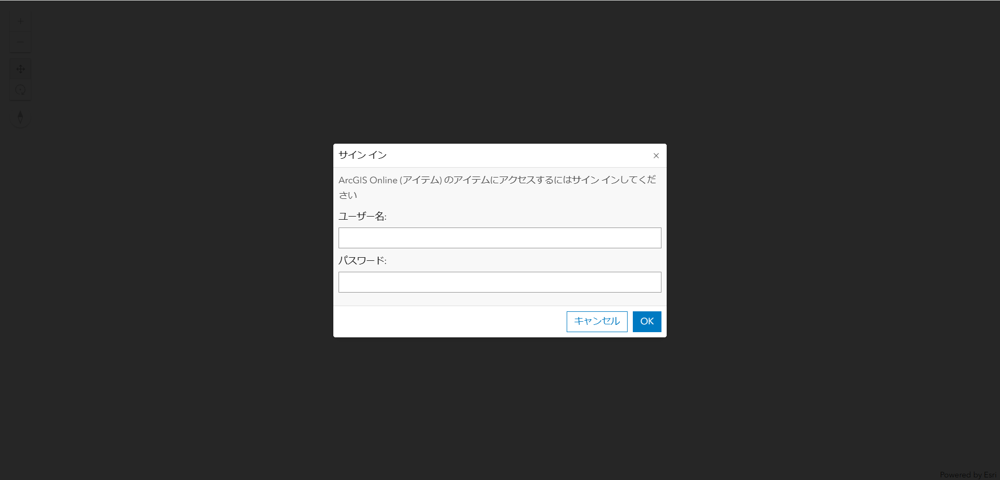
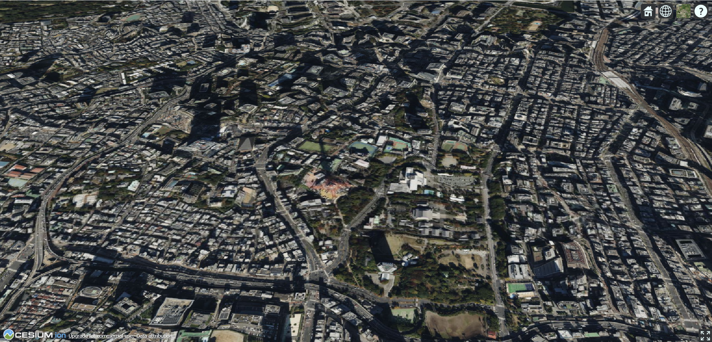
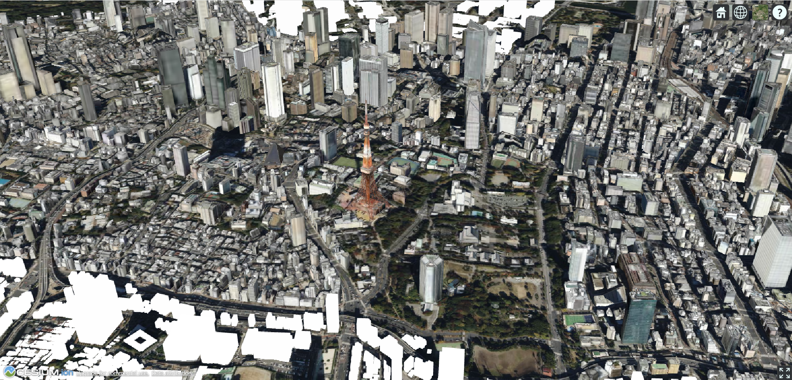
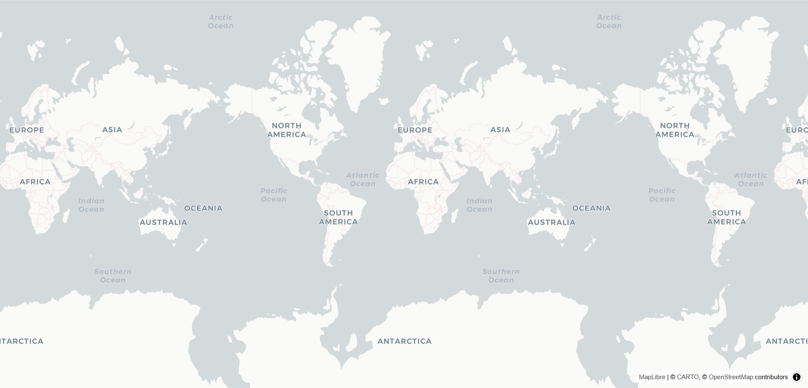
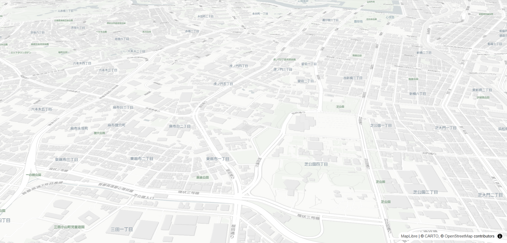
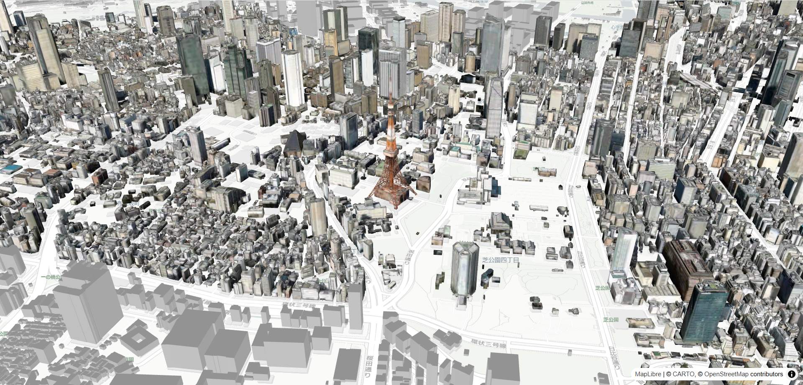
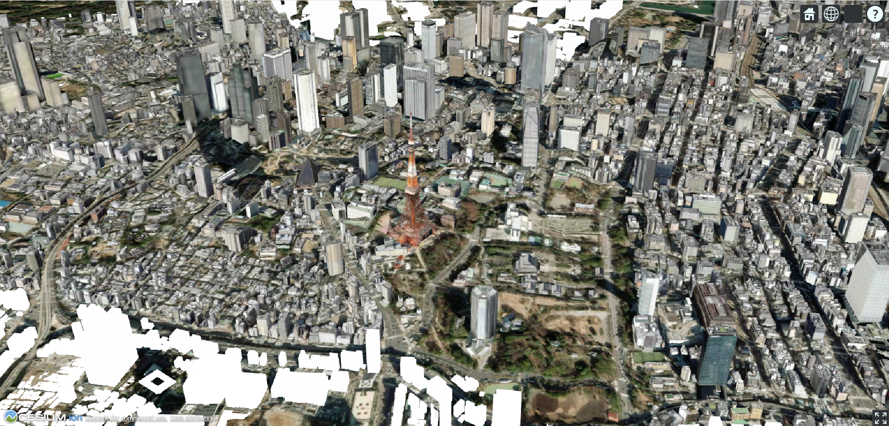
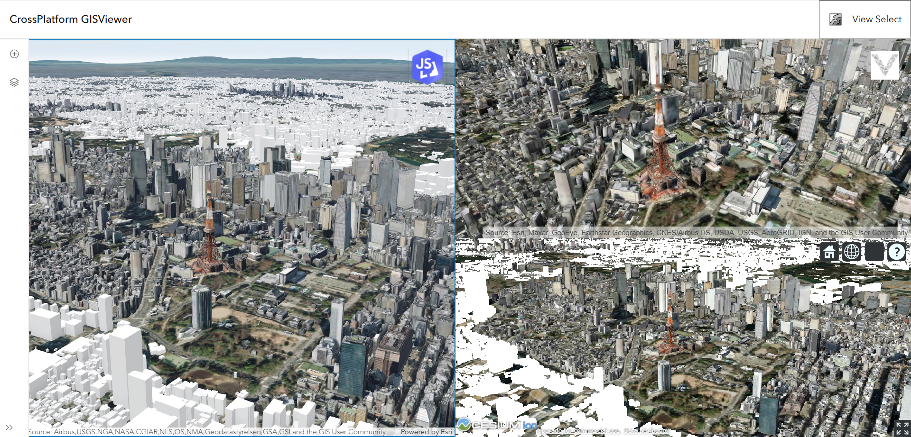

# WebGIS と連携した JavaScript によるプログラミング演習

各ライブラリで ArcGIS Online にホストされている I3S 形式の東京都 PLATEAU データを表示します。

1. [ArcGIS Maps SDK for JavaScript](#1-arcgis-maps-sdk-for-javascript)
  
  Esri の ArcGIS Maps SDK for JavaScript を使って東京都の PLATEAU データを表示します。

2. [Cesium JS](#2-cesium-js)

Cesium GS, Inc. が提供する Cesium JS を使って東京都の PLATEAU データを表示します。

3. [Deck GL JS](#3-deck-gl-js)

OpenJS Foundation が提供する vis.gl の一部である Deck GL を使って東京都の PLATEAU データを表示します。
また、マップの表示には MapLibre GL JS を使っています。

## 1. ArcGIS Maps SDK for JavaScript

この章では、ArcGIS Maps SDK for JavaScript を使います。

### 1-1. ライブラリの参照を含んだ arcgis.html を作成

まず初めに ArcGIS Maps SDK for JavaScript の JavaScript 参照と CSS を参照した `arcgis.html` を作成します。下記のようなコードを書いてみましょう。
また、マップを表示する場所を指定するために `id` 属性として `arcgis` を含んだ `div` タグを作成し、表示範囲を決めるために `style` タグも記述します。

``` HTML
<html lang="ja">
  <head>
    <meta charset="UTF-8">
    <meta name="viewport" content="width=device-width, initial-scale=1.0">
    <title>ArcGIS Maps SDK for JavaScript</title>
    <style>
      html,
      body,
      #arcgis {
        padding: 0;
        margin: 0;
        height: 100%; /* ブラウザ縦の表示範囲 */
        width: 100%; /* ブラウザ横の表示範囲 */
      }
    </style>
    <!-- CSS ファイルと JS ライブラリへの参照を追加 -->
    <link rel="stylesheet" href="https://js.arcgis.com/4.31/esri/themes/light/main.css">
    <script src="https://js.arcgis.com/4.31/"></script>
  </head>
  <body>
    <div id="arcgis"></div>
  </body>
</html>
```

上記のコードのみではマップは表示されていません。
次項でマップを表示してみましょう。

### 1-2. シーンの作成
ここからは、シーンの表示を試してみましょう。

#### 1-2-1. 各種クラスの追加
まずは、ArcGIS Maps SDK for JavaScript でマップを描画するために必要な各種クラスを呼び出します。下記のように arcgis.html に `script` タグを追加し、その内側に JavaScript のコードを記述します。
ここでは、表示するマップの設定を記述する [`Map`](https://developers.arcgis.com/javascript/latest/api-reference/esri-Map.html) クラス、3D のシーンの表示設定を記述する [`SceneView`](https://developers.arcgis.com/javascript/latest/api-reference/esri-views-SceneView.html) クラスを記述します。

``` HTML
<html lang="ja">
  <head>
    <meta charset="UTF-8">
    <meta name="viewport" content="width=device-width, initial-scale=1.0">
    <title>ArcGIS Maps SDK for JavaScript</title>
    <style>
      html,
      body,
      #arcgis {
        padding: 0;
        margin: 0;
        height: 100%; /* ブラウザ縦の表示範囲 */
        width: 100%; /* ブラウザ横の表示範囲 */
      }
    </style>
    <!-- CSS ファイルと JS ライブラリへの参照を追加 -->
    <link rel="stylesheet" href="https://js.arcgis.com/4.31/esri/themes/light/main.css">
    <script src="https://js.arcgis.com/4.31/"></script>
  </head>
  <body>
    <div id="arcgis"></div>
    <!-- JavaScript のコードを記述 -->
    <script>
      // 1-2-1. 各種クラスの追加
      require([
        "esri/Map",
        "esri/views/SceneView"
        ], 
        function ( 
          Map,
          SceneView
        ) {
      
      });
      // 1-2-1. 各種クラスの追加の終了
    </script>
  </body>
</html>
```

#### 1-2-2. シーンを表示
次にシーンを表示してみましょう。
前項で追加した `script` タグ内の `require` で囲われた内側にそれぞれ必要なパラメータを記述します。

``` HTML
<html lang="ja">
  <head>
    <meta charset="UTF-8">
    <meta name="viewport" content="width=device-width, initial-scale=1.0">
    <title>ArcGIS Maps SDK for JavaScript</title>
    <style>
      html,
      body,
      #arcgis {
        padding: 0;
        margin: 0;
        height: 100%; /* ブラウザ縦の表示範囲 */
        width: 100%; /* ブラウザ横の表示範囲 */
      }
    </style>

    <!-- CSS ファイルと JS ライブラリへの参照を追加 -->
    <link rel="stylesheet" href="https://js.arcgis.com/4.31/esri/themes/light/main.css">
    <script src="https://js.arcgis.com/4.31/"></script>
  </head>
  <body>
    <div id="arcgis"></div>
    <!-- JavaScript のコードを記述 -->
    <script>
       // 1-2-1. 各種クラスの追加の開始
      require([
        "esri/Map",
        "esri/views/SceneView"
        ], 
        function ( 
          Map,
          SceneView
        ) {
          // 1-2-2. シーンを表示 の開始

          // マップの作成
          const map = new Map({
            basemap:{
              style:{
              id:"arcgis/imagery/standard", // 表示したいマップの種類。ここでは衛星画像を使用
              }
            },
            ground: "world-elevation" // 使用する標高サービスの指定。今回はデフォルトで用意されているものを使用
          });

          // シーン ビューの作成
          const view = new SceneView({
            map: map, // 使用するマップ情報を記述
            camera: {
              position: [139.74621414799225, 35.6412203881348, 1010], // カメラの位置と高さを指定
              tilt: 63, // カメラの縦方向
              heading: 0 // カメラの横方向
            },
            container: "arcgis", // MapView を表示する HTML 上の div タグの ID　属性を記述
          });

        // 1-2-2. シーンを表示 の終了
      });
      // 1-2-1. 各種クラスの追加の終了
    </script>
  </body>
</html>
```

ここまでで、`arcgis.html` を開くと、下図のようにサイン インが求められますので、お手持ちの ArcGIS アカウントでサイン インします。



サイン インすると東京タワー周辺の衛星画像を少し上の角度から見下ろすような視点が表示されます。


次項では、PLATEAU データを表示してみましょう。

### 1-3. PLATEAU データの追加
今回参照する PLATEAU データは ArcGIS Online 上に上げられている I3S 形式の Scene Layer サービスなので Scene Layer を参照して設定を記述する [`SceneLayer`](https://developers.arcgis.com/javascript/latest/api-reference/esri-layers-SceneLayer.html) クラスを利用します。

``` HTML
<html lang="ja">
  <head>
    <meta charset="UTF-8">
    <meta name="viewport" content="width=device-width, initial-scale=1.0">
    <title>ArcGIS Maps SDK for JavaScript</title>
    <style>
      html,
      body,
      #arcgis {
        padding: 0;
        margin: 0;
        height: 100%; /* ブラウザ縦の表示範囲 */
        width: 100%; /* ブラウザ横の表示範囲 */
      }
    </style>

    <!-- CSS ファイルと JS ライブラリへの参照を追加 -->
    <link rel="stylesheet" href="https://js.arcgis.com/4.31/esri/themes/light/main.css">
    <script src="https://js.arcgis.com/4.31/"></script>
  </head>
  <body>
    <div id="arcgis"></div>
    <!-- JavaScript のコードを記述 -->
    <script>
       // 1-2-1. 各種クラスの追加の開始
      require([
        "esri/Map",
        "esri/views/SceneView", 
        "esri/layers/SceneLayer" // 1-3. PLATEAU データの追加
        ], 
        function ( 
          Map,
          SceneView,
          SceneLayer // 1-3. PLATEAU データの追加
        ) {
       
          // 1-2-2. シーンを表示 の開始

          // マップの作成
          const map = new Map({
            basemap:{
              style:{
              id:"arcgis/imagery/standard", // 表示したいマップの種類。ここでは衛星画像を使用
              }
            },
            ground: "world-elevation" // 使用する標高サービスの指定。今回はデフォルトで用意されているものを使用
          });

          // シーン ビューの作成
          const view = new SceneView({
            map: map, // 使用するマップ情報を記述
            camera: {
              position: [139.74621414799225, 35.6412203881348, 1010], // カメラの位置と高さを指定
              tilt: 63, // カメラの縦方向
              heading: 0 // カメラの横方向
            },
            container: "arcgis", // MapView を表示する HTML 上の div タグの ID　属性を記述
          });

          // 1-2-2. シーンを表示 の終了

          // 1-3. PLATEAU データの追加の開始

          // 表示する PLATEAU データの参照
          const plateau_layer= new SceneLayer({
            url: "https://tiles.arcgis.com/tiles/wlVTGRSYTzAbjjiC/arcgis/rest/services/13100_13201_Tokyo-23ku_Minamiosawa_Building/SceneServer"
          });

          // マップに PLATEAU データを追加
          view.map.add(plateau_layer);

        // 1-3. PLATEAU データの追加の終了
      });

       // 1-2-1. 各種クラスの追加の終了
    </script>
  </body>
</html>
```

`arcgis.html` にアクセスし、サイン インをすると下図のように東京タワーの少し上の角度から見下ろすような視点で PLATEAU データを確認することができます。


## 2. Cesium JS
この章では、Cesium JS を使います。

### 2-1. ライブラリの参照を含んだ cesium.html を作成
Cesium JS の JavaScript ライブラリの参照と CSS を参照した `cesium.html` を作成します。
マップを表示する場所を指定するために `id` 属性として `cesium` を含んだ `div` タグを作成し、表示範囲を決めるために `style` タグも記述します。

``` HTML
<html lang="ja">
  <head>
    <meta charset="UTF-8">
    <meta name="viewport" content="width=device-width, initial-scale=1.0">
    <title>Cesium</title>
    <style>
      html,
      body,
      #cesium {
        padding: 0;
        margin: 0;
        height: 100%; /* ブラウザ縦の表示範囲 */
        width: 100%; /* ブラウザ横の表示範囲 */
      }
    </style>
    <!-- CSS ファイルと JS ライブラリへの参照を追加 -->
    <script src="https://cesium.com/downloads/cesiumjs/releases/1.124/Build/Cesium/Cesium.js"></script>
    <link href="https://cesium.com/downloads/cesiumjs/releases/1.124/Build/Cesium/Widgets/widgets.css" rel="stylesheet">
  </head>
  <body>
    <div id="cesium"></div>
  </body>
</html> 
```

### 2-2. シーンの作成

#### 2-2-1. アクセス トークンの情報を追加
下記のように `cesium.html` に `script` タグを追加し、その内側に JavaScript のコードを記述します。
この時、`script` タグの `type` 属性には `module` を指定します。これは、今回使用する内容に非同期処理を必要とする処理があるためです。module について、詳しくは MDN の [JavaScript モジュール](https://developer.mozilla.org/ja/docs/Web/JavaScript/Guide/Modules)のページを参照してください。
ここでは、Cesium JS で使用することのできるマップにアクセスするためのアクセス トークンを取得します。
Cesium ion のアクセス トークンは[こちら](https://ion.cesium.com/tokens)から取得し、変数 `cesiumAccessToken` に格納し、[`defaultAccessToken`](https://cesium.com/learn/cesiumjs/ref-doc/Ion.html#.defaultAccessToken) にその変数を参照する形でトークンを使用します。

``` HTML
<html lang="ja">
  <head>
    <meta charset="UTF-8">
    <meta name="viewport" content="width=device-width, initial-scale=1.0">
    <title>Cesium</title>
    <style>
      html,
      body,
      #cesium {
        padding: 0;
        margin: 0;
        height: 100%; /* ブラウザ縦の表示範囲 */
        width: 100%; /* ブラウザ横の表示範囲 */
      }
    </style>
    <!-- CSS ファイルと JS ライブラリへの参照を追加 -->
    <script src="https://cesium.com/downloads/cesiumjs/releases/1.124/Build/Cesium/Cesium.js"></script>
    <link href="https://cesium.com/downloads/cesiumjs/releases/1.124/Build/Cesium/Widgets/widgets.css" rel="stylesheet">
  </head>
  <body>
    <div id="cesium"></div>
    <!-- モジュール形式のスクリプトで作成 -->
    <script type="module">
        // 2-2-1. アクセス トークンの情報を追加 の開始

        // Cesium ion の アクセストークン
        const cesiumAccessToken = "cesium ion のアクセストークン";
        Cesium.Ion.defaultAccessToken = cesiumAccessToken;

        // 2-2-1. アクセス トークンの情報を追加 の終了

    </script>
  </body>
</html> 
```

#### 2-2-2. シーンを表示
Cesium でデフォルトで参照されるマップを表示してみます。
[`Viewer`](https://cesium.com/learn/cesiumjs/ref-doc/Viewer.html) エンジンで第1引数に表示したい `id` 属性の値(今回は `cesium` )を入力します。
参照する標高データとして Cesium ion で用意されている標高データを参照するために [`fromWorldTerrain`](https://cesium.com/learn/cesiumjs/ref-doc/Terrain.html#.fromWorldTerrain) を呼び出します。また、今回は PLATEAU とマップのみ表示するために Cesium JS の各操作パネルをオフにします。

``` HTML
<html lang="ja">
  <head>
    <meta charset="UTF-8">
    <meta name="viewport" content="width=device-width, initial-scale=1.0">
    <title>Cesium</title>
    <style>
      html,
      body,
      #cesium {
        padding: 0;
        margin: 0;
        height: 100%; /* ブラウザ縦の表示範囲 */
        width: 100%; /* ブラウザ横の表示範囲 */
      }
    </style>
    <!-- CSS ファイルと JS ライブラリへの参照を追加 -->
    <script src="https://cesium.com/downloads/cesiumjs/releases/1.124/Build/Cesium/Cesium.js"></script>
    <link href="https://cesium.com/downloads/cesiumjs/releases/1.124/Build/Cesium/Widgets/widgets.css" rel="stylesheet">
  </head>
  <body>
    <div id="cesium"></div>
    <!-- モジュール形式のスクリプトで作成 -->
    <script type="module">
        // 2-2-1. アクセス トークンの情報を追加 の開始

        // Cesium ion の アクセストークン
        const cesiumAccessToken = "cesium ion のアクセストークン";
        Cesium.Ion.defaultAccessToken = cesiumAccessToken;

        // 2-2-1. アクセス トークンの情報を追加 の終了

        // 2-2-2. シーンを表示 の開始

        // Cesium によるシーンに表示する内容の設定
        const viewer = new Cesium.Viewer("cesium", {
          terrain: Cesium.Terrain.fromWorldTerrain(), // 使用する 標高データ
          timeline: false, // タイムスライダーの UI を無しに設定
          animation: false, // アニメーション効果を無しに設定
          geocoder:false // ジオコーディング機能を無しに設定
        });
        
        // カメラの位置、角度を設定
        viewer.camera.setView({
            destination : Cesium.Cartesian3.fromDegrees(139.74624895282653, 35.6446339299256, 1010),
            orientation : {
                heading : Cesium.Math.toRadians(0.0),
                pitch : Cesium.Math.toRadians(-30),
            }
        });
        // 2-2-2. シーンを表示 の終了
    </script>
  </body>
</html> 
```

ここまでで、`cesium.html` にアクセスすると、下図のように東京タワー周辺の衛星画像を少し上の角度から見下ろすような視点が表示されます。



次項では、PLATEAU データを表示してみましょう。

### 2-3. PLATEAU データを追加
今回参照する PLATEAU データは ArcGIS Online 上に上げられている I3S 形式の Scene Layer なので Cesium JS で I3S 形式のレイヤーを読み込む [`I3SDataProvider`](https://cesium.com/learn/cesiumjs/ref-doc/I3SDataProvider.html) エンジンの [`fromUrl`](https://cesium.com/learn/cesiumjs/ref-doc/I3SDataProvider.html#.fromUrl) メソッドを利用します。

``` HTML
<html lang="ja">
  <head>
    <meta charset="UTF-8">
    <meta name="viewport" content="width=device-width, initial-scale=1.0">
    <title>Cesium</title>
    <style>
      html,
      body,
      #cesium {
        padding: 0;
        margin: 0;
        height: 100%; /* ブラウザ縦の表示範囲 */
        width: 100%; /* ブラウザ横の表示範囲 */
      }
    </style>
    <!-- CSS ファイルと JS ライブラリへの参照を追加 -->
    <script src="https://cesium.com/downloads/cesiumjs/releases/1.124/Build/Cesium/Cesium.js"></script>
    <link href="https://cesium.com/downloads/cesiumjs/releases/1.124/Build/Cesium/Widgets/widgets.css" rel="stylesheet">
  </head>
  <body>
    <div id="cesium"></div>
        <!-- モジュール形式のスクリプトで作成 -->
    <script type="module">
        // 2-2-1. アクセス トークンの情報を追加 の開始

        // Cesium ion の アクセストークン
        const cesiumAccessToken = "cesium ion のアクセストークン";
        Cesium.Ion.defaultAccessToken = cesiumAccessToken;

        // 2-2-1. アクセス トークンの情報を追加 の終了

        // 2-2-2. シーンを表示 の開始

        // Cesium によるシーンに表示する内容の設定
        const viewer = new Cesium.Viewer("cesium", {
          terrain: Cesium.Terrain.fromWorldTerrain(), // 使用する 標高データ
          timeline: false, // タイムスライダーの UI を無しに設定
          animation: false, // アニメーション効果を無しに設定
          geocoder:false // ジオコーディング機能を無しに設定
        });
        // 2-3. PLATEAU データを追加 の開始

        // ArcGIS のジオイドモデルを参照
        const geoidService = await Cesium.ArcGISTiledElevationTerrainProvider.fromUrl("https://tiles.arcgis.com/tiles/z2tnIkrLQ2BRzr6P/arcgis/rest/services/EGM2008/ImageServer");
        
        // ArcGIS Online 上にある東京都の PLATEAU データの URL
        const plateau_url = "https://tiles.arcgis.com/tiles/wlVTGRSYTzAbjjiC/arcgis/rest/services/13100_13201_Tokyo-23ku_Minamiosawa_Building/SceneServer/layers/0";
        
        // I3S 形式を Cesium　で読み込むメソッド
        const plateau_layer = await Cesium.I3SDataProvider.fromUrl(plateau_url, {
            geoidTiledTerrainProvider: geoidService, // 参照するジオイドを定義 
        });

        // PLATEAU のデータをシーンに追加
        viewer.scene.primitives.add(plateau_layer);
        // 2-3. PLATEAU データを追加 を終了

        // カメラの位置、角度を設定
        viewer.camera.setView({
            destination : Cesium.Cartesian3.fromDegrees(139.74624895282653, 35.6446339299256, 1010),
            orientation : {
                heading : Cesium.Math.toRadians(0.0),
                pitch : Cesium.Math.toRadians(-30),
            }
        });
        // 2-2-2. シーンを表示 の終了

    </script>
  </body>
</html> 
```

ここで、`cesium.html` にアクセスすると、下図のように東京タワーの少し上の角度から見下ろすような視点で PLATEAU データを確認することができます。



## 3. Deck GL JS
この章では、Deck GL JS を使います。
Deck GL JS では、参照するデフォルトの地図が用意されていない他、地図の表示には別途 JS ライブラリが必要なので、今回は MapLibre GL JS を使います。

### 3-1. ライブラリの参照を含んだ deckgl.html を作成
まず初めに `deckgl.html` を作成します。マップを表示する場所を指定するために `id` 属性として `deckgl` を含んだ `div` タグを作成し、表示範囲を決めるために `style` タグも記述します。

```HTML
<html lang="ja">
  <head>
    <meta charset="UTF-8">
    <meta name="viewport" content="width=device-width, initial-scale=1.0">
    <title>DeckGL</title>
    <style>
      html,
      body,
      #deckgl {
        padding: 0;
        margin: 0;
        height: 100%; /* ブラウザ縦の表示範囲 */
        width: 100%; /* ブラウザ横の表示範囲 */
      }
    </style>
  </head>
  <body>
    <div id="deckgl"></div>
  </body>
</html>
```

ここから各ライブラリを参照していきます。

#### 3-1-1.Deck GL JS の参照
ここで Deck GL JS を参照してきます。`style` タグの下に `script` タグを作成し、 `src` 属性で参照を記述しましょう。

```HTML
<html lang="ja">
  <head>
    <meta charset="UTF-8">
    <meta name="viewport" content="width=device-width, initial-scale=1.0">
    <title>DeckGL</title>
    <style>
      html,
      body,
      #deckgl {
        padding: 0;
        margin: 0;
        height: 100%; /* ブラウザ縦の表示範囲 */
        width: 100%; /* ブラウザ横の表示範囲 */
      }
    </style>
    <!-- 3-1-1. Deck GL JS の参照 -->
    <script src="https://unpkg.com/deck.gl@latest/dist.min.js"></script>
  </head>
  <body>
    <div id="deckgl"></div>
  </body>
</html>
```

#### 3-1-2.Loaders GL JS の参照
次に Loaders GL JS を参照してきます。
Loaders GL JS は、vis.gl が提供するライブラリの１つで、フレームワークに依存しないローダーとして開発が進めらています。今回は、I3S 形式のデータを読み込むために利用します。
前項で追加した `Deck GL` の参照の下に `script` タグで追加しましょう。

```HTML
<html lang="ja">
  <head>
    <meta charset="UTF-8">
    <meta name="viewport" content="width=device-width, initial-scale=1.0">
    <title>DeckGL</title>
    <style>
      html,
      body,
      #deckgl {
        padding: 0;
        margin: 0;
        height: 100%; /* ブラウザ縦の表示範囲 */
        width: 100%; /* ブラウザ横の表示範囲 */
      }
    </style>
    <!-- 3-1-1. Deck GL JS の参照 -->
    <script src="https://unpkg.com/deck.gl@latest/dist.min.js"></script>
    <!-- 3-1-2. Loaders GL JS の参照 -->
    <script src="https://unpkg.com/@loaders.gl/i3s@4.3.3/dist/dist.min.js"></script>
  </head>
  <body>
    <div id="deckgl"></div>
  </body>
</html>
```

#### 3-1-3.MapLibre GL JS の参照
マップを表示するために MapLibre GL の JS ライブラリと CSS を参照してきます。Loaders GL JS の参照の下に `script` タグで追加しましょう。

```HTML
<html lang="ja">
  <head>
    <meta charset="UTF-8">
    <meta name="viewport" content="width=device-width, initial-scale=1.0">
    <title>DeckGL</title>
    <style>
      html,
      body,
      #deckgl {
        padding: 0;
        margin: 0;
        height: 100%; /* ブラウザ縦の表示範囲 */
        width: 100%; /* ブラウザ横の表示範囲 */
      }
    </style>
    <!-- 3-1-1. Deck GL JS の参照 -->
    <script src="https://unpkg.com/deck.gl@latest/dist.min.js"></script>
    <!-- 3-1-2.Loaders GL JS の参照 -->
    <script src="https://unpkg.com/@loaders.gl/i3s@4.3.3/dist/dist.min.js"></script>
    <!-- 3-1-3.MapLibre GL JS の参照 -->
    <!-- MapLibre の CSS ファイルと JS ライブラリへの参照を追加 -->
    <link rel="stylesheet" href="https://unpkg.com/maplibre-gl@^4.7.1/dist/maplibre-gl.css" />
    <script src="https://unpkg.com/maplibre-gl@^4.7.1/dist/maplibre-gl.js"></script>
  </head>
  <body>
    <div id="deckgl"></div>
  </body>
</html>
```

次項では、この MapLibre GL JS を使って地図を表示します。

### 3-2. MapLibre GL JS でマップを表示

ここでは、MapLibre GL JS の [`maplibregl.Map`](https://maplibre.org/maplibre-gl-js/docs/API/classes/Map/)クラスを使用して、マップを表示します。
`div` タグの下に `script` タグを追加してその内側に記述します。

```HTML
<html lang="ja">
  <head>
    <meta charset="UTF-8">
    <meta name="viewport" content="width=device-width, initial-scale=1.0">
    <title>DeckGL</title>
    <style>
      html,
      body,
      #deckgl {
        padding: 0;
        margin: 0;
        height: 100%; /* ブラウザ縦の表示範囲 */
        width: 100%; /* ブラウザ横の表示範囲 */
      }
    </style>
    <!-- 3-1-1. Deck GL JS の参照 -->
    <script src="https://unpkg.com/deck.gl@latest/dist.min.js"></script>
    <!-- 3-1-2. Loaders GL JS の参照 -->
    <script src="https://unpkg.com/@loaders.gl/i3s@4.3.3/dist/dist.min.js"></script>
    <!-- 3-1-3. MapLibre GL JS の参照 -->
    <!-- MapLibre の CSS ファイルと JS ライブラリへの参照を追加 -->
    <link rel="stylesheet" href="https://unpkg.com/maplibre-gl@^4.7.1/dist/maplibre-gl.css" />
    <script src="https://unpkg.com/maplibre-gl@^4.7.1/dist/maplibre-gl.js"></script>
  </head>
  <body>
    <div id="deckgl"></div>
    <!-- JavaScript のコードを記述 -->
    <script>    
      // 3-2. MapLibre GL JS でマップを表示 を開始
      
      // MapLibre GL の Map クラスを使ってマップを参照
      const map = new maplibregl.Map({
        container: 'deckgl', // 表示したい タグの id 属性を参照
        style: 'https://basemaps.cartocdn.com/gl/positron-gl-style/style.json' // デフォルトで利用することができるマップを参照
      });
      // 3-2. MapLibre GL JS でマップを表示 を終了
    </script>
  </body>
</html>
```

この状態で `deckgl.html` にアクセスすると下図のように世界地図を見ることができます。



### 3-3. Deck GL JS で PLATEAU データを追加

#### 3-3-1. 各クラスの参照を追加
ここでは、Deck GL JS 及び Loaders GL JS で使うクラスの参照を `mapLibregl.Map` オブジェクトの上に追加します。
Deck GL JS では、[`DeckGL`](https://deck.gl/docs/api-reference/core/deck) クラスと [`Tile3DLayer`](https://deck.gl/docs/api-reference/geo-layers/tile-3d-layer) クラスを参照し、Loaders GL JS では、[`I3SLoader`](https://loaders.gl/docs/modules/i3s/api-reference/i3s-loader) を参照してきます。

```HTML
<html lang="ja">
  <head>
    <meta charset="UTF-8">
    <meta name="viewport" content="width=device-width, initial-scale=1.0">
    <title>DeckGL</title>
    <style>
      html,
      body,
      #deckgl {
        padding: 0;
        margin: 0;
        height: 100%; /* ブラウザ縦の表示範囲 */
        width: 100%; /* ブラウザ横の表示範囲 */
      }
    </style>
    <!-- 3-1-1. Deck GL JS の参照 -->
    <script src="https://unpkg.com/deck.gl@latest/dist.min.js"></script>
    <!-- 3-1-2. Loaders GL JS の参照 -->
    <script src="https://unpkg.com/@loaders.gl/i3s@4.3.3/dist/dist.min.js"></script>
    <!-- 3-1-3. MapLibre GL JS の参照 -->
    <!-- MapLibre の CSS ファイルと JS ライブラリへの参照を追加 -->
    <link rel="stylesheet" href="https://unpkg.com/maplibre-gl@^4.7.1/dist/maplibre-gl.css" />
    <script src="https://unpkg.com/maplibre-gl@^4.7.1/dist/maplibre-gl.js"></script>
  </head>
  <body>
    <div id="deckgl"></div>
    <!-- JavaScript のコードを記述 -->
    <script>
      // 3-3-1. 各クラスの参照を追加 を開始
      
      // DeckGL のモジュールを参照します
      const {DeckGL, Tile3DLayer} = deck;
      // LoadersGL のモジュールを参照します
      const {I3SLoader} = loaders;

      // 3-3-1. 各クラスの参照を追加 を終了
      
      // 3-2. MapLibre GL JS でマップを表示 を開始

      // MapLibre GL の Map クラスを使ってマップを参照
      const map = new maplibregl.Map({
        container: 'deckgl', // 表示したい タグの id 属性を参照
        style: 'https://basemaps.cartocdn.com/gl/positron-gl-style/style.json' // デフォルトで利用することができるマップを参照
      });

      // 3-2. MapLibre GL JS でマップを表示 を終了

    </script>
  </body>
</html>
```

#### 3-3-2. Deck GL JS でマップを表示
Deck GL JS でマップを表示してみます。ここで使用するマップは `maplibregl.Map` で出力されたものと同じものを使います。`DeckGL` クラスで各プロパティに値を入力します。ここで注意したいのはマウスによる操作を明示的に許可する必要があるので `controller` プロパティを `true` と設定する点です。また、今回は MapLibre GL JS を使っているので 60° 以上カメラを傾けると少し表示が浮いて見えてしまうので `maxpitch` を 60° に制限します。

```HTML
<html lang="ja">
  <head>
    <meta charset="UTF-8">
    <meta name="viewport" content="width=device-width, initial-scale=1.0">
    <title>DeckGL</title>
    <style>
      html,
      body,
      #deckgl {
        padding: 0;
        margin: 0;
        height: 100%; /* ブラウザ縦の表示範囲 */
        width: 100%; /* ブラウザ横の表示範囲 */
      }
    </style>
    <!-- 3-1-1. Deck GL JS の参照 -->
    <script src="https://unpkg.com/deck.gl@latest/dist.min.js"></script>
    <!-- 3-1-2. Loaders GL JS の参照 -->
    <script src="https://unpkg.com/@loaders.gl/i3s@4.3.3/dist/dist.min.js"></script>
    <!-- 3-1-3. MapLibre GL JS の参照 -->
    <!-- MapLibre の CSS ファイルと JS ライブラリへの参照を追加 -->
    <link rel="stylesheet" href="https://unpkg.com/maplibre-gl@^4.7.1/dist/maplibre-gl.css" />
    <script src="https://unpkg.com/maplibre-gl@^4.7.1/dist/maplibre-gl.js"></script>
  </head>
  <body>
    <div id="deckgl"></div>
    <!-- JavaScript のコードを記述 -->
    <script>
      // 3-3-1. 各クラスの参照を追加 を開始
      
      // DeckGL のモジュールを参照します
      const {DeckGL, Tile3DLayer} = deck;
      // LoadersGL のモジュールを参照します
      const {I3SLoader} = loaders;

      // 3-3-1. 各クラスの参照を追加 を終了
      
      // 3-2. MapLibre GL JS でマップを表示 を開始

      // MapLibre GL の Map クラスを使ってマップを参照
      const map = new maplibregl.Map({
        container: 'deckgl', // 表示したい タグの id 属性を参照
        style: 'https://basemaps.cartocdn.com/gl/positron-gl-style/style.json' // デフォルトで利用することができるマップを参照
      });

      // 3-2. MapLibre GL JS でマップを表示 を終了
      
      // 3-3-2. Deck GL JS でマップを表示 の開始

      // deckgl の Viewer を設定
      const deckgl_mainview = new DeckGL({
        mapStyle: 'https://basemaps.cartocdn.com/gl/positron-gl-style/style.json', // 表示するマップの URL を参照
        container:'deckgl', // 表示したい タグの id 属性を参照 
        initialViewState:{ // シーンのビュー設定
          longitude:  139.745723,
          latitude:35.659041,
          pitch: 60, // カメラの縦角度
          maxPitch: 60, // カメラの最大縦角度
          minZoom: 2, // 最小ズームレベル
          maxZoom: 22,// 最大ズームレベル
          zoom: 15.5, // 0~22 段階で設定
          bearing: 0 // カメラの横角度
        },
        controller: true, // マウスによる操作の許可
        layers: [] // 表示するレイヤーの配置
      });

      // 3-3-2. Deck GL JS でマップを表示 の終了

    </script>
  </body>
</html>
```

`deckgl.html` にアクセスしてみると下図のように表示されます。
マウス操作もできるか少し動かしてみてみましょう。



次項では、このマップに PLATEAU を表示します。

#### 3-3-3. PLATEAU データを表示
Deck GL JS と Loaders GL JS を使って PLATEAU データを表示してみます。
使用するレイヤーは `Tile3DLayer` クラスを変数 `plateau_layer` で定義し、`loader` プロパティは前々項で参照した `I3SLoader` を使用します。また、`plateau_layer` は、前項で定義した `deckgl_mainview` の `layers` プロパティに格納します。

```HTML
<html lang="ja">
  <head>
    <meta charset="UTF-8">
    <meta name="viewport" content="width=device-width, initial-scale=1.0">
    <title>DeckGL</title>
    <style>
      html,
      body,
      #deckgl {
        padding: 0;
        margin: 0;
        height: 100%; /* ブラウザ縦の表示範囲 */
        width: 100%; /* ブラウザ横の表示範囲 */
      }
    </style>
    <!-- 3-1-1. Deck GL JS の参照 -->
    <script src="https://unpkg.com/deck.gl@latest/dist.min.js"></script>
    <!-- 3-1-2. Loaders GL JS の参照 -->
    <script src="https://unpkg.com/@loaders.gl/i3s@4.3.3/dist/dist.min.js"></script>
    <!-- 3-1-3. MapLibre GL JS の参照 -->
    <!-- MapLibre の CSS ファイルと JS ライブラリへの参照を追加 -->
    <link rel="stylesheet" href="https://unpkg.com/maplibre-gl@^4.7.1/dist/maplibre-gl.css" />
    <script src="https://unpkg.com/maplibre-gl@^4.7.1/dist/maplibre-gl.js"></script>
  </head>
  <body>
    <div id="deckgl"></div>
    <!-- JavaScript のコードを記述 -->
    <script>
      // 3-3-1. 各クラスの参照を追加 を開始
      
      // DeckGL のモジュールを参照します
      const {DeckGL, Tile3DLayer} = deck;
      // LoadersGL のモジュールを参照します
      const {I3SLoader} = loaders;

      // 3-3-1. 各クラスの参照を追加 を終了
      
      // 3-2. MapLibre GL JS でマップを表示 を開始

      // MapLibre GL の Map クラスを使ってマップを参照
      const map = new maplibregl.Map({
        container: 'deckgl', // 表示したい タグの id 属性を参照
        style: 'https://basemaps.cartocdn.com/gl/positron-gl-style/style.json' // デフォルトで利用することができるマップを参照
      });

      // 3-2. MapLibre GL JS でマップを表示 を終了

      // 3-3-3. PLATEAU データを表示 の開始

      // 表示する PLATEAU データの参照
      const plateau_layer=new Tile3DLayer({
        data:'https://tiles.arcgis.com/tiles/wlVTGRSYTzAbjjiC/arcgis/rest/services/13100_13201_Tokyo-23ku_Minamiosawa_Building/SceneServer/layers/0',
        loader: I3SLoader // i3s のローダーを使用することを明記
      });
      
      // 3-3-2. Deck GL JS でマップを表示 の開始

      // deckgl の Viewer を設定
      const deckgl_mainview = new DeckGL({
        mapStyle: 'https://basemaps.cartocdn.com/gl/positron-gl-style/style.json', // 表示するマップの URL を参照
        container:'deckgl', // 表示したい タグの id 属性を参照 
        initialViewState:{ // シーンのビュー設定
          longitude:  139.745723,
          latitude:35.659041,
          pitch: 60, // カメラの縦角度
          maxPitch: 60, // カメラの最大縦角度
          minZoom: 2, // 最小ズームレベル
          maxZoom: 22,// 最大ズームレベル
          zoom: 15.5, // 0~22 段階で設定
          bearing: 0 // カメラの横角度
        },
        controller: true, // マウスによる操作の許可
        layers: [plateau_layer] // 表示するレイヤーの配置
      });

      // 3-3-2. Deck GL JS でマップを表示 の終了

      // 3-3-3. PLATEAU データを表示 の終了
    </script>
  </body>
</html>
```

ここで、`deckgl.html` にアクセスすると、下図のように東京タワーの少し上の角度から見下ろすような視点で PLATEAU データを確認することができます。



## スペシャルセッション:各ライブラリで ArcGIS のマップを使う場合
ここでは、ArcGIS のマップを使いたい場合の設定方法についてご紹介します。
ArcGIS のマップを他のライブラリで利用をするためには、認証のための API キーが必要になります。API キーを作っていない方は、[API キーの作成](https://esrijapan.github.io/arcgis-dev-resources/guide/get-api-key/)を参考に作ってから試してみましょう。

### 1. Cesium JS
本テキストの [Cesium JS](#2-3-plateau-データを追加する) の項目で記述されている `cesium.html` に追加する形で ArcGIS のマップを表示してみます。

#### 1-1. ArcGIS の API キーの設定
Cesium では、ArcGIS の API キーを設定するためのメソッドとして [`Cesium.ArcGisMapService.defaultAccessToken`](https://cesium.com/learn/ion-sdk/ref-doc/ArcGisMapService.html#.defaultAccessToken) メソッドが用意されています。このメソッドに ArcGIS の API キーを参照することで ArcGIS のマップへアクセスできるようになります。

``` HTML
<html lang="ja">
  <head>
    <meta charset="UTF-8">
    <meta name="viewport" content="width=device-width, initial-scale=1.0">
    <title>Cesium × ArcGIS</title>
    <style>
      html,
      body,
      #cesium {
        padding: 0;
        margin: 0;
        height: 100%; /* ブラウザ縦の表示範囲 */
        width: 100%; /* ブラウザ横の表示範囲 */
      }
    </style>
    <!-- CSS ファイルと JS ライブラリへの参照を追加 -->
    <script src="https://cesium.com/downloads/cesiumjs/releases/1.124/Build/Cesium/Cesium.js"></script>
    <link href="https://cesium.com/downloads/cesiumjs/releases/1.124/Build/Cesium/Widgets/widgets.css" rel="stylesheet">
  </head>
  <body>
    <div id="cesium"></div>
        <!-- モジュール形式のスクリプトで作成 -->
    <script type="module">
        // 2-2-1. アクセス トークンの情報を追加 の開始

        // Cesium ion の アクセストークン
        const cesiumAccessToken = "cesium ion のアクセストークン";
        Cesium.Ion.defaultAccessToken = cesiumAccessToken;
        // 2-2-1. アクセス トークンの情報を追加 の終了

        // SP1-1-1. ArcGIS の API キーの設定 の開始
        
        // ArcGIS の API キーの設定
        const arcgis_apiKey="ArcGIS の API キー";
        Cesium.ArcGisMapService.defaultAccessToken = arcgis_apiKey;

        // SP1-1-1. ArcGIS の API キーの設定 の終了

        // 2-2-2. シーンを表示 の開始

        // Cesium によるシーンに表示する内容の設定
        const viewer = new Cesium.Viewer("cesium", {
          terrain: Cesium.Terrain.fromWorldTerrain(), // 使用する 標高データ
          timeline: false, // タイムスライダーの UI を無しに設定
          animation: false, // アニメーション効果を無しに設定
          geocoder:false // ジオコーディング機能を無しに設定
        });
        // 2-3. PLATEAU データを追加 の開始

        // ArcGIS のジオイドモデルを参照
        const geoidService = await Cesium.ArcGISTiledElevationTerrainProvider.fromUrl("https://tiles.arcgis.com/tiles/z2tnIkrLQ2BRzr6P/arcgis/rest/services/EGM2008/ImageServer");
        
        // ArcGIS Online 上にある東京都の PLATEAU データの URL
        const plateau_url = "https://tiles.arcgis.com/tiles/wlVTGRSYTzAbjjiC/arcgis/rest/services/13100_13201_Tokyo-23ku_Minamiosawa_Building/SceneServer/layers/0";
        
        // I3S 形式を Cesium　で読み込むメソッド
        const plateau_layer = await Cesium.I3SDataProvider.fromUrl(plateau_url, {
            geoidTiledTerrainProvider: geoidService, // 参照するジオイドを定義 
        });

        // PLATEAU のデータをシーンに追加
        viewer.scene.primitives.add(plateau_layer);
        // 2-3. PLATEAU データを追加 を終了

        // カメラの位置、角度を設定
        viewer.camera.setView({
            destination : Cesium.Cartesian3.fromDegrees(139.74624895282653, 35.6446339299256, 1010),
            orientation : {
                heading : Cesium.Math.toRadians(0.0),
                pitch : Cesium.Math.toRadians(-30),
            }
        });
        // 2-2-2. シーンを表示 の終了

    </script>
  </body>
</html> 
```

#### 1-2. ArcGIS のマップを Cesium のベースマップとして設定する
Cesium JS での ArcGIS のマップの参照には、[`ArcGisMapService`](https://cesium.com/learn/cesiumjs/ref-doc/ArcGisMapService.html) エンジンを用いますが、今回参照する衛星画像は Image Tile Layer のサービスであるため[`ArcGisMapServerImageryProvider`](https://cesium.com/learn/cesiumjs/ref-doc/ArcGisMapServerImageryProvider.html) エンジンの [`fromBasemapType`](https://cesium.com/learn/cesiumjs/ref-doc/ArcGisMapServerImageryProvider.html#.fromBasemapType) メソッドを使います。 
Cesium で出力される Image のマップデータとして参照するために `baseLayer` プロパティに [`Cesium.ImageryLayer`](https://cesium.com/learn/cesiumjs/ref-doc/ImageryLayer.html) エンジンの [`fromProviderAsync`](https://cesium.com/learn/cesiumjs/ref-doc/ImageryLayer.html#.fromProviderAsync) メソッドで設定します。

``` HTML
<html lang="ja">
  <head>
    <meta charset="UTF-8">
    <meta name="viewport" content="width=device-width, initial-scale=1.0">
    <title>Cesium × ArcGIS</title>
    <style>
      html,
      body,
      #cesium {
        padding: 0;
        margin: 0;
        height: 100%; /* ブラウザ縦の表示範囲 */
        width: 100%; /* ブラウザ横の表示範囲 */
      }
    </style>
    <!-- CSS ファイルと JS ライブラリへの参照を追加 -->
    <script src="https://cesium.com/downloads/cesiumjs/releases/1.124/Build/Cesium/Cesium.js"></script>
    <link href="https://cesium.com/downloads/cesiumjs/releases/1.124/Build/Cesium/Widgets/widgets.css" rel="stylesheet">
  </head>
  <body>
    <div id="cesium"></div>
    <!-- モジュール形式のスクリプトで作成 -->
    <script type="module">
      // 2-2-1. アクセス トークンの情報を追加 の開始

      // Cesium ion の アクセストークン
      const cesiumAccessToken = "cesium ion のアクセストークン";
      Cesium.Ion.defaultAccessToken = cesiumAccessToken;
      // 2-2-1. アクセス トークンの情報を追加 の終了

      // SP1-1-1. ArcGIS の API キーの設定 の開始
      
      // ArcGIS の API キーの設定
      const arcgis_apiKey="ArcGIS の API キー";
      Cesium.ArcGisMapService.defaultAccessToken = arcgis_apiKey;

      // SP1-1-1. ArcGIS の API キーの設定 の終了

      // 2-2-2. シーンを表示 の開始
      
      // SP1-1-2. ArcGIS のマップを Cesium のベースマップとして設定 を開始
      
      // SP1-1-2. 参照する ArcGIS のマップの設定
      const arcGisImagery = Cesium.ArcGisMapServerImageryProvider.fromBasemapType(Cesium.ArcGisBaseMapType.SATELLITE);

      // Cesium によるシーンに表示する内容の設定
      const viewer = new Cesium.Viewer("cesium", {
        terrain: Cesium.Terrain.fromWorldTerrain(), // 使用する 標高データ
        baseLayer:Cesium.ImageryLayer.fromProviderAsync(arcGisImagery),　// SP1-1-2. ArcGIS のマップを Cesium のベースマップとして設定
        timeline: false, // タイムスライダーの UI を無しに設定
        animation: false, // アニメーション効果を無しに設定
        geocoder:false // ジオコーディング機能を無しに設定
      });
      
      // SP1-1-2. ArcGIS のマップを Cesium のベースマップとして設定 を終了
      
      // 2-3. PLATEAU データを追加 の開始

      // ArcGIS のジオイドモデルを参照
      const geoidService = await Cesium.ArcGISTiledElevationTerrainProvider.fromUrl("https://tiles.arcgis.com/tiles/z2tnIkrLQ2BRzr6P/arcgis/rest/services/EGM2008/ImageServer");
      
      // ArcGIS Online 上にある東京都の PLATEAU データの URL
      const plateau_url = "https://tiles.arcgis.com/tiles/wlVTGRSYTzAbjjiC/arcgis/rest/services/13100_13201_Tokyo-23ku_Minamiosawa_Building/SceneServer/layers/0";
      
      // I3S 形式を Cesium　で読み込むメソッド
      const plateau_layer = await Cesium.I3SDataProvider.fromUrl(plateau_url, {
          geoidTiledTerrainProvider: geoidService, // 参照するジオイドを定義 
      });

      // PLATEAU のデータをシーンに追加
      viewer.scene.primitives.add(plateau_layer);
      // 2-3. PLATEAU データを追加 を終了

      // カメラの位置、角度を設定
      viewer.camera.setView({
          destination : Cesium.Cartesian3.fromDegrees(139.74624895282653, 35.6446339299256, 1010),
          orientation : {
              heading : Cesium.Math.toRadians(0.0),
              pitch : Cesium.Math.toRadians(-30),
          }
      });
      // 2-2-2. シーンを表示 の終了

    </script>
  </body>
</html> 
```

最終的に下図のように表示されれば完成です。



### 2. Deck GL JS
本テキストの [Deck GL JS](#3-3-3-plateau-データを表示) の項目で記述されている `deckgl.html` に追加する形で ArcGIS のマップを表示してみます。
Deck GL JS ではマップを表示する機能やマップをホストしておくサービスが用意されていません。これまで記述してきたように MapLibre GL JS など地図表示のために別ライブラリを参照してきます。ただ、必ずしも MapLibre GL JS である必要はなく、Google Map Platform の JS ライブラリや ArcGIS Maps SDK for JavaScript で参照することも可能です。
今回は上述した MapLibre GL JS との連携を保ちつつ ArcGIS のマップ上に PLATEAU データを描画します。

#### 2-1. ArcGIS の API キーの設定
Deck GL JS では、ArcGIS の API キーを設定するためのメソッドは用意されていないので、変数に API キーの値を持たせます。

```HTML
<html lang="ja">
  <head>
    <meta charset="UTF-8">
    <meta name="viewport" content="width=device-width, initial-scale=1.0">
    <title>DeckGL × ArcGIS</title>
    <style>
      html,
      body,
      #deckgl {
        padding: 0;
        margin: 0;
        height: 100%; /* ブラウザ縦の表示範囲 */
        width: 100%; /* ブラウザ横の表示範囲 */
      }
    </style>
    <!-- 3-1-1. Deck GL JS の参照 -->
    <script src="https://unpkg.com/deck.gl@latest/dist.min.js"></script>
    <!-- 3-1-2. Loaders GL JS の参照 -->
    <script src="https://unpkg.com/@loaders.gl/i3s@4.3.3/dist/dist.min.js"></script>
    <!-- 3-1-3. MapLibre GL JS の参照 -->
    <!-- MapLibre の CSS ファイルと JS ライブラリへの参照を追加 -->
    <link rel="stylesheet" href="https://unpkg.com/maplibre-gl@^4.7.1/dist/maplibre-gl.css" />
    <script src="https://unpkg.com/maplibre-gl@^4.7.1/dist/maplibre-gl.js"></script>
  </head>
  <body>
    <div id="deckgl"></div>
    <!-- JavaScript のコードを記述 -->
    <script>
      // 3-3-1. 各クラスの参照を追加 を開始
      
      // DeckGL のモジュールを参照します
      const {DeckGL, Tile3DLayer} = deck;
      // LoadersGL のモジュールを参照します
      const {I3SLoader} = loaders;

      // 3-3-1. 各クラスの参照を追加 を終了
      
      // 3-2. MapLibre GL JS でマップを表示 を開始

      // MapLibre GL の Map クラスを使ってマップを参照
      const map = new maplibregl.Map({
        container: 'deckgl', // 表示したい タグの id 属性を参照
        style: 'https://basemaps.cartocdn.com/gl/positron-gl-style/style.json' // デフォルトで利用することができるマップを参照
      });

      // 3-2. MapLibre GL JS でマップを表示 を終了

      // 3-3-3. PLATEAU データを表示 の開始

      // 表示する PLATEAU データの参照
      const plateau_layer=new Tile3DLayer({
        data:'https://tiles.arcgis.com/tiles/wlVTGRSYTzAbjjiC/arcgis/rest/services/13100_13201_Tokyo-23ku_Minamiosawa_Building/SceneServer/layers/0',
        loader: I3SLoader // i3s のローダーを使用することを明記
      });
      
      // SP1-2-1. ArcGIS の API キーの設定 を開始
      
      // ArcGIS の API キーを設定
      const arcgis_apiKey="ArcGIS の API キー";
      
      // SP1-2-1. ArcGIS の API キーの設定 を終了

      // 3-3-2. Deck GL JS でマップを表示 の開始

      // deckgl の Viewer を設定
      const deckgl_mainview = new DeckGL({
        container:'deckgl', // 表示したい タグの id 属性を参照 
        initialViewState:{ // シーンのビュー設定
          longitude:  139.745723,
          latitude:35.659041,
          pitch: 60, // カメラの縦角度
          maxPitch: 60, // カメラの最大縦角度
          minZoom: 2, // 最小ズームレベル
          maxZoom: 22,// 最大ズームレベル
          zoom: 15.5, // 0~22 段階で設定
          bearing: 0 // カメラの横角度
        },
        controller: true, // マウスによる操作の許可
        layers: [plateau_layer] // 表示するレイヤーの配置
      });

      // 3-3-2. Deck GL JS でマップを表示 の終了

      // 3-3-3. PLATEAU データを表示 の終了
    </script>
  </body>
</html>
```

#### 2-2. ArcGIS のマップを Deck GL JS のベースマップとして設定
ArcGIS の REST サービスに [ベースマップ](https://esrijapan.github.io/arcgis-dev-resources/guide/services/basemaps/) を参照して呼び出すエンドポイントが用意されています。エンドポイントごとにマップの種類があり、それらを選択した上で、ArcGIS の API キーもしくは アクセス トークンを渡すことで ArcGIS のマップが参照できるようになります。
利用したいベースマップのエンドポイントを `mapstyle` プロパティに指定します。
エンドポイントとして `https://basemapstyles-api.arcgis.com/arcgis/rest/services/styles/v2/styles/arcgis/imagery/standard` を参照し、`token` パラメータに API キーを設定します。

```HTML
<html lang="ja">
  <head>
    <meta charset="UTF-8">
    <meta name="viewport" content="width=device-width, initial-scale=1.0">
    <title>DeckGL × ArcGIS</title>
    <style>
      html,
      body,
      #deckgl {
        padding: 0;
        margin: 0;
        height: 100%; /* ブラウザ縦の表示範囲 */
        width: 100%; /* ブラウザ横の表示範囲 */
      }
    </style>
    <!-- 3-1-1. Deck GL JS の参照 -->
    <script src="https://unpkg.com/deck.gl@latest/dist.min.js"></script>
    <!-- 3-1-2. Loaders GL JS の参照 -->
    <script src="https://unpkg.com/@loaders.gl/i3s@4.3.3/dist/dist.min.js"></script>
    <!-- 3-1-3. MapLibre GL JS の参照 -->
    <!-- MapLibre の CSS ファイルと JS ライブラリへの参照を追加 -->
    <link rel="stylesheet" href="https://unpkg.com/maplibre-gl@^4.7.1/dist/maplibre-gl.css" />
    <script src="https://unpkg.com/maplibre-gl@^4.7.1/dist/maplibre-gl.js"></script>
  </head>
  <body>
    <div id="deckgl"></div>
    <!-- JavaScript のコードを記述 -->
    <script>
      // 3-3-1. 各クラスの参照を追加 を開始
      
      // DeckGL のモジュールを参照します
      const {DeckGL, Tile3DLayer} = deck;
      // LoadersGL のモジュールを参照します
      const {I3SLoader} = loaders;

      // 3-3-1. 各クラスの参照を追加 を終了
      
      // 3-2. MapLibre GL JS でマップを表示 を開始

      // MapLibre GL の Map クラスを使ってマップを参照
      const map = new maplibregl.Map({
        container: 'deckgl', // 表示したい タグの id 属性を参照
        style: 'https://basemaps.cartocdn.com/gl/positron-gl-style/style.json' // デフォルトで利用することができるマップを参照
      });

      // 3-2. MapLibre GL JS でマップを表示 を終了

      // 3-3-3. PLATEAU データを表示 の開始

      // 表示する PLATEAU データの参照
      const plateau_layer=new Tile3DLayer({
        data:'https://tiles.arcgis.com/tiles/wlVTGRSYTzAbjjiC/arcgis/rest/services/13100_13201_Tokyo-23ku_Minamiosawa_Building/SceneServer/layers/0',
        loader: I3SLoader // i3s のローダーを使用することを明記
      });
      
      // SP1-2-1. ArcGIS の API キーの設定 を開始
      
      // ArcGIS の API キーを設定
      const arcgis_apiKey="ArcGIS の API キー";
      
      // SP1-2-1. ArcGIS の API キーの設定 を終了

      // 3-3-2. Deck GL JS でマップを表示 の開始

      // deckgl の Viewer を設定
      const deckgl_mainview = new DeckGL({
        // SP1-2-2. ArcGIS のマップを Deck GL JS のベースマップとして設定 を開始

        mapStyle:`https://basemapstyles-api.arcgis.com/arcgis/rest/services/styles/v2/styles/arcgis/imagery/standard?token=${arcgis_apiKey}`, // 表示するマップの URL を参照

        // SP1-2-2. ArcGIS のマップを Deck GL JS のベースマップとして設定 を終了

        container:'deckgl', // 表示したい タグの id 属性を参照 
        initialViewState:{ // シーンのビュー設定
          longitude:  139.745723,
          latitude:35.659041,
          pitch: 60, // カメラの縦角度
          maxPitch: 60, // カメラの最大縦角度
          minZoom: 2, // 最小ズームレベル
          maxZoom: 22,// 最大ズームレベル
          zoom: 15.5, // 0~22 段階で設定
          bearing: 0 // カメラの横角度
        },
        controller: true, // マウスによる操作の許可
        layers: [plateau_layer] // 表示するレイヤーの配置
      });

      // 3-3-2. Deck GL JS でマップを表示 の終了

      // 3-3-3. PLATEAU データを表示 の終了
    </script>
  </body>
</html>
```

最終的に下図のように表示されれば完成です。


## スペシャルセッション2:ArcGIS Maps SDK for JavaScript で累積影の解析を試してみよう
ArcGIS Maps SDK for JavaScript では、クラス ウィジェットと呼ばれる機能ごとにマップで使われる解析機能を追加するクラスを提供しています。
比較的簡単に実装することができる累計影の解析機能を `arcgis.html` に追加してみましょう。

### 1. 累計影とは
特定の場所やオブジェクトが一日の中でどれだけの時間影に覆われるかを評価する手法です。
主な利用用途としては、都市計画や建築設計において、日照条件を考慮するために使われています。
今回は、PLATEAU を使って累積影の解析を実施してみましょう。

### 2. ArcGIS Maps SDK for JavaScript で累計影を解析
累積影の解析には、日照時間などが必要となりますが、ArcGIS Maps SDK for JavaScript では、クラスとして機能とともに提供しています。

#### 2-1. クラスの追加
まず初めに影の解析機能をもつ [ShadowCast](https://developers.arcgis.com/javascript/latest/api-reference/esri-widgets-ShadowCast.html) クラスを追加します。`require` にクラスを追加して、`ShadowCast` を定義します。

``` HTML
<html lang="ja">
  <head>
    <meta charset="UTF-8">
    <meta name="viewport" content="width=device-width, initial-scale=1.0">
    <title>ArcGIS Maps SDK for JavaScript で累積影の解析</title>
    <style>
      html,
      body,
      #arcgis {
        padding: 0;
        margin: 0;
        height: 100%; /* ブラウザ縦の表示範囲 */
        width: 100%; /* ブラウザ横の表示範囲 */
      }
    </style>

    <!-- CSS ファイルと JS ライブラリへの参照を追加 -->
    <link rel="stylesheet" href="https://js.arcgis.com/4.31/esri/themes/light/main.css">
    <script src="https://js.arcgis.com/4.31/"></script>
  </head>
  <body>
    <div id="arcgis"></div>
    <!-- JavaScript のコードを記述 -->
    <script>
       // 1-2-1. 各種クラスの追加の開始
      require([
        "esri/Map",
        "esri/views/SceneView", 
        "esri/layers/SceneLayer",
        // SP2-1. 影解析のクラスの追加
        "esri/widgets/ShadowCast"], 
        function ( 
          Map,
          SceneView,
          SceneLayer,
          ShadowCast //  SP2-1. 影解析のクラスの追加
        ) {
          // 1-2-2. シーンを表示 の開始

          // マップの作成
          const map = new Map({
            basemap:{
              style:{
              id:"arcgis/imagery/standard", // 表示したいマップの種類。ここでは衛星画像を使用
              }
            },
            ground: "world-elevation" // 使用する標高サービスの指定。今回はデフォルトで用意されているものを使用
          });

          // シーン ビューの作成
          const view = new SceneView({
            map: map, // 使用するマップ情報を記述
            camera: {
              position: [139.74621414799225, 35.6412203881348, 1010], // カメラの位置と高さを指定
              tilt: 63, // カメラの縦方向
              heading: 0 // カメラの横方向
            },
            container: "arcgis", // MapView を表示する HTML 上の div タグの ID　属性を記述
          });

          // 1-2-2. シーンを表示 の終了

          // 1-3. PLATEAU データの追加の開始

          // 表示する PLATEAU データの参照
          const plateau_layer= new SceneLayer({
            url: "https://tiles.arcgis.com/tiles/wlVTGRSYTzAbjjiC/arcgis/rest/services/13100_13201_Tokyo-23ku_Minamiosawa_Building/SceneServer"
          });

          // マップに PLATEAU データを追加
          view.map.add(plateau_layer);

          // 1-3. PLATEAU データの追加の終了

      });

      // 1-2-1. 各種クラスの追加の終了
    </script>
  </body>
</html>
```

#### 2-2. 影解析のウィジェットを追加 
次に累積影を追加することと計算する時間や出力内容をコントロールするウィジェットを追加します。
`view.map.add()` メソッドの下に追加しましょう。

``` HTML
<html lang="ja">
  <head>
    <meta charset="UTF-8">
    <meta name="viewport" content="width=device-width, initial-scale=1.0">
    <title>ArcGIS Maps SDK for JavaScriptで累積影の解析</title>
    <style>
      html,
      body,
      #arcgis {
        padding: 0;
        margin: 0;
        height: 100%; /* ブラウザ縦の表示範囲 */
        width: 100%; /* ブラウザ横の表示範囲 */
      }
    </style>

    <!-- CSS ファイルと JS ライブラリへの参照を追加 -->
    <link rel="stylesheet" href="https://js.arcgis.com/4.31/esri/themes/light/main.css">
    <script src="https://js.arcgis.com/4.31/"></script>
  </head>
  <body>
    <div id="arcgis"></div>
    <!-- JavaScript のコードを記述 -->
    <script>
       // 1-2-1. 各種クラスの追加の開始
      require([
        "esri/Map",
        "esri/views/SceneView", 
        "esri/layers/SceneLayer",
        // SP2-1. 影解析のクラスの追加
        "esri/widgets/ShadowCast"], 
        function ( 
          Map,
          SceneView,
          SceneLayer,
          ShadowCast //  SP2-1. 影解析のクラスの追加
        ) {
          // 1-2-2. シーンを表示 の開始

          // マップの作成
          const map = new Map({
            basemap:{
              style:{
              id:"arcgis/imagery/standard", // 表示したいマップの種類。ここでは衛星画像を使用
              }
            },
            ground: "world-elevation" // 使用する標高サービスの指定。今回はデフォルトで用意されているものを使用
          });

          // シーン ビューの作成
          const view = new SceneView({
            map: map, // 使用するマップ情報を記述
            camera: {
              position: [139.74621414799225, 35.6412203881348, 1010], // カメラの位置と高さを指定
              tilt: 63, // カメラの縦方向
              heading: 0 // カメラの横方向
            },
            container: "arcgis", // MapView を表示する HTML 上の div タグの ID　属性を記述
          });

          // 1-2-2. シーンを表示 の終了

          // 1-3. PLATEAU データの追加の開始

          // 表示する PLATEAU データの参照
          const plateau_layer= new SceneLayer({
            url: "https://tiles.arcgis.com/tiles/wlVTGRSYTzAbjjiC/arcgis/rest/services/13100_13201_Tokyo-23ku_Minamiosawa_Building/SceneServer"
          });

          // マップに PLATEAU データを追加
          view.map.add(plateau_layer);

          // 1-3. PLATEAU データの追加の終了

          // SP2-2. 累積影のウィジェットを追加
          // 累積影のウィジェットを追加
          const shadowcast = new ShadowCast({
            view:view // 対象とする Scene view を設定
          });

          // 影解析のウィジェットをマップ上のUIとして右上に追加
          view.ui.add(shadowcast, "top-right");

          shadowcast.viewModel.date = new Date(); // 今日のデータを参照
          shadowcast.viewModel.visualizationType = "duration"; // 累積影のモードで確認
        　// SP2-2. 影解析のウィジェットを追加を終了
      });

      // 1-2-1. 各種クラスの追加の終了
    </script>
  </body>
</html>
```

ここで、`arcgis.html` にアクセスしてみましょう。
すると下図のように時間ごとに累積影の計算が行われ、結果が帰ってきていることがわかります。


上記のように数コード追加するだけで実装することができました。
影解析の機能については、他にも設定があるのでぜひお試しください。
このように ArcGIS Maps SDK for JavaScript は気軽に解析機能を追加することができます。
解析機能だけではなく、他の機能についてもサンプルが用意されていますので [Esri Developer](https://developers.arcgis.com/javascript/latest/sample-code/all/) にてご確認ください。

## CrossPlatformGISViewer
最後になりますが、上記の3つのライブラリによる描画を1つにまとめたものが下記のアプリとなります。
今回利用した I3S 形式の 3D データに限らず、2D のデータを追加したり、各ライブラリでどのように動作するか等を確認することができます。



[GitHub](https://github.com/EsriJapan/Events/tree/main/2024/UrbanDataChallenge) で公開されているので、各コンテンツを開発する際にはご参考になると幸いです。
本テキストでは、東京都の PLATEAU データでしたが、別の都市の PLATEAU や ArcGIS Online に上がっている他の 2D のレイヤーなどを参照することも可能です。ぜひお試しください。


