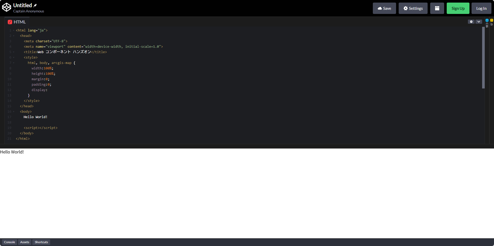
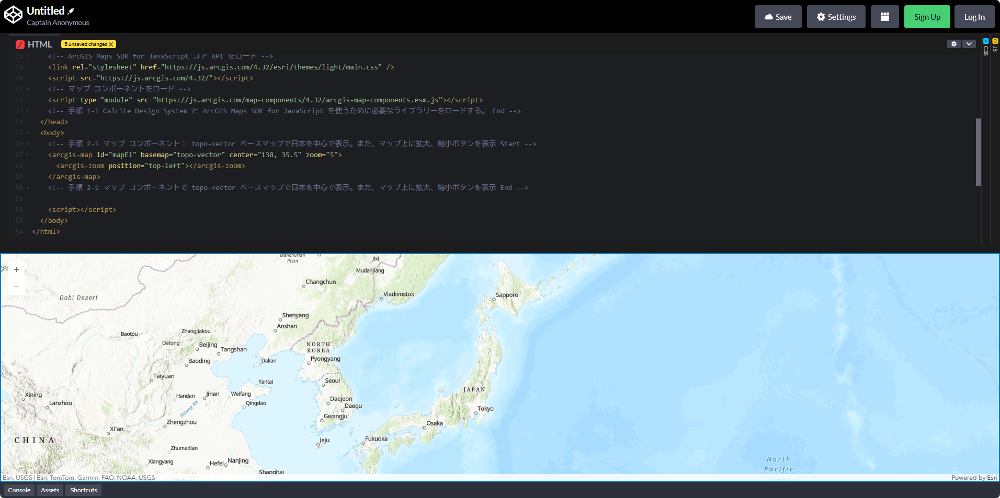
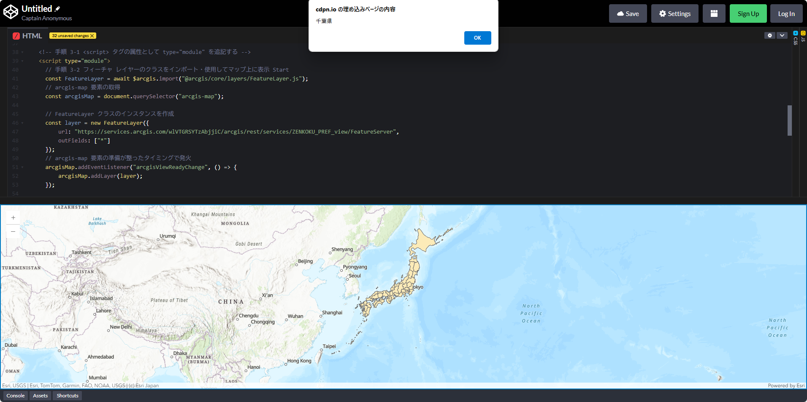
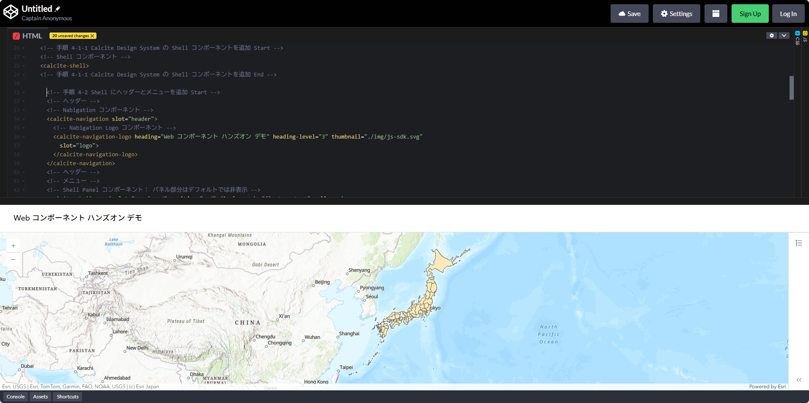
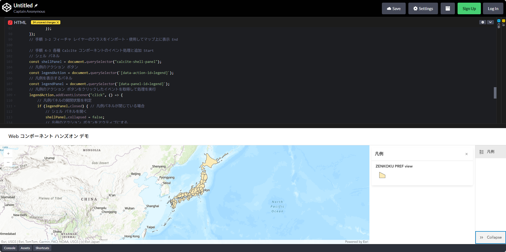
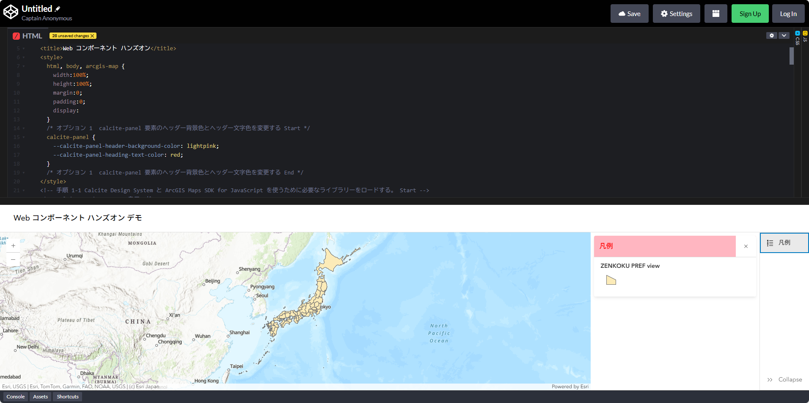

# ArcGIS における Web コンポーネント勉強会：Web コンポーネント ハンズオン

# 概要
このガイドは ArcGIS で使用できる Web コンポーネント（[ArcGIS Maps SDK for JavaScript](https://developers.arcgis.com/javascript/latest/)、[Calcite Design System](https://developers.arcgis.com/calcite-design-system/)）を使用して、Web アプリケーションを作成する流れを紹介します。このハンズオンではコピー & ペーストで Web アプリケーションを作成できます。コメントアウトの「手順 x-x ～ Start 」から「手順 x-x ～ End 」までをコピーし、該当箇所にペーストしてください。（※一部 Start から End による追記ではなくコードの書き換え箇所があります。）

# 準備
## プロジェクトの準備
1. [CodePen](https://codepen.io/pen/?editors=1000) を任意の Web ブラウザーで開きます。

2. `CodePen` の HTML エディターに以下のコードを記述します。

```html
<html lang="ja">
  <head>
    <meta charset="UTF-8">
    <meta name="viewport" content="width=device-width, initial-scale=1.0">
    <title>Web コンポーネント ハンズオン</title>
    <style>
      html, body, arcgis-map {
        width:100%;
        height:100%;
        margin:0;
        padding:0;
        display:
      }
    </style>
  </head>
  <body>
    Hello World!

    <script></script>
  </body>
</html>
```



## 手順 1 ： 必要なライブラリーの追加

ArcGIS で使用できる Web コンポーネントの `ArcGIS Maps SDK for JavaScript` と `Calcite Design System` のライブラリーを追加します。

1. `<head>` タグ内の `</style>` の下に以下のコードを追記します。
```html
    </style>

    <!-- 手順 1-1 Calcite Design System と ArcGIS Maps SDK for JavaScript を使うために必要なライブラリーをロードする。 Start -->
    <!-- Calcite Design System をロード -->
    <script type="module" src="https://js.arcgis.com/calcite-components/3.0.3/calcite.esm.js"></script>
    <!-- ArcGIS Maps SDK for JavaScript コア API をロード -->
    <link rel="stylesheet" href="https://js.arcgis.com/4.32/esri/themes/light/main.css" />
    <script src="https://js.arcgis.com/4.32/"></script>
    <!-- マップ コンポーネントをロード -->
    <script type="module" src="https://js.arcgis.com/map-components/4.32/arcgis-map-components.esm.js"></script>
    <!-- 手順 1-1 Calcite Design System と ArcGIS Maps SDK for JavaScript を使うために必要なライブラリーをロードする。 End -->

  </head>
```

これで Web ページ内で `ArcGIS Maps SDK for JavaScript` と `Calcite Design System` を使用する準備ができました。  
準備ができたらはじめに `ArcGIS Maps SDK for JavaScript` の Web コンポーネントであるマップ コンポーネントを使用してマップを表示していきます。

# ArcGIS Maps SDK for JavaScript のマップ コンポーネントを使用してマップを表示する。
## 手順 2  : 画面上にマップを表示する。

`ArcGIS Maps SDK for JavaScript` のマップ コンポーネントを使用して画面上に地図を表示します。

1. `<body>` タグ内の `Hello World!` という文字列を削除し、以下のコードを記入し保存します。

```html
  <body>
    <!-- 手順 2-1 マップ コンポーネントで topo-vector ベースマップで日本を中心で表示。また、マップ上に拡大、縮小ボタンを表示 Start -->
    <arcgis-map id="mapEl" basemap="topo-vector" center="138, 35.5" zoom="5">
      <arcgis-zoom position="top-left"></arcgis-zoom>
    </arcgis-map>
    <!-- 手順 2-1 マップ コンポーネントで topo-vector ベースマップで日本を中心で表示。また、マップ上に拡大、縮小ボタンを表示 End -->
    <script></script>
  </body>
```

ここでは、[マップ コンポーネント](https://developers.arcgis.com/javascript/latest/references/map-components/)とマップ上に[拡大・縮小ボタン](https://developers.arcgis.com/javascript/latest/references/map-components/arcgis-zoom/)を設定しています。
ブラウザーを更新すると以下のように日本列島を中心とするマップの画面が表示されます。



## 手順 3 : マップ上にフィーチャ レイヤーを重ねる

表示したマップ上に[フィーチャ レイヤー](https://developers.arcgis.com/javascript/latest/api-reference/esri-layers-FeatureLayer.html)を重ね、任意のフィーチャをクリックした際にアラートでクリックしたフィーチャ情報を表示する処理を追加します。

1. `<body>` タグ内にある `<script>` タグの属性として以下のように `type="module"` を追記します。
```html

    <!-- Befor -->
    <!-- 
    <script></script>
    -->
    <!-- After -->
    <!-- 手順 3-1 <script> タグの属性として type="module" を追記する -->
    <script type="module"></script>
  </body>
```
`<script>` タグに `type="module"` を指定すると、そのスクリプトは `ES モジュール`として実行されます。これにより、通常のスクリプトでは使えないトップレベルでの `await` が使えるようになります。

2. `<script>` タグ内に以下のコードを記述します。

```html
    <script type="module">
      // 手順 3-2 フィーチャ レイヤーのクラスをインポート・使用してマップ上に表示 Start
      const FeatureLayer = await $arcgis.import("@arcgis/core/layers/FeatureLayer.js");
      // arcgis-map 要素の取得
      const arcgisMap = document.querySelector("arcgis-map");

      // FeatureLayer クラスのインスタンスを作成
      const layer = new FeatureLayer({
          url: "https://services.arcgis.com/wlVTGRSYTzAbjjiC/arcgis/rest/services/ZENKOKU_PREF_view/FeatureServer",
          outFields: ["*"]
      });
      // arcgis-map 要素の準備が整ったタイミングで発火
      arcgisMap.addEventListener("arcgisViewReadyChange", () => {
          arcgisMap.addLayer(layer);
      });

      // arcgis-map 要素をクリックしたタイミングで発火
      arcgisMap.addEventListener("arcgisViewClick", (evt) => {
          // 追加した FeatureLayer のレイヤー ビューを取得
          const layerView = arcgisMap.allLayerViews.items[2];
          // クリックした地点のフィーチャを空間検索するための条件を設定
          const query = layer.createQuery();
          query.geometry = evt.detail.mapPoint;
          query.returnGeometry = false;

          // 取得したレイヤー ビューに対して対象の条件で検索
          layerView.queryFeatures(query)
              .then(result => {
                  // 検索結果をアラートとして表示
                  alert(result.features[0].attributes.KEN);
              });
      });
      // 手順 3-2 フィーチャ レイヤーのクラスをインポート・使用してマップ上に表示 End
    </script>
```

ブラウザーを更新すると以下のように都道府県レイヤーが表示され、任意の都道府県フィーチャをクリックすると画面上部にクリックしたフィーチャの情報が表示されます。

> [!WARNING]  
> CDN にて ArcGIS Maps SDK for JavaScript のモジュールを利用する方法として、バージョン 4.32 までは AMD による require 関数を用いていましたが、バージョン 4.33 より ES モジュールのように利用する arcgis.import 関数による利用する方法が追加されました。



ここまでで `ArcGIS Maps SDK for JavaScript` の Web コンポーネントであるマップ コンポーネントを使用して地図を使用したアプリケーションを作成する手順を見てきました。  
ここからは `Calcite Design System` を使用して Web アプリケーションの UI を追加していきます。

# Calcite Design System を使用して Web アプリケーションの UI を構築
## 手順 4 : Calcite コンポーネントで UI 構築およびイベント処理の追加
1. `<body>` タグ内で `<arcgis-map>` タグを囲うように以下のコードを追記します。

```html
  <body>
    <!-- 手順 4-1-1 Calcite Design System の Shell コンポーネントを追加 Start -->
    <!-- Shell コンポーネント -->
    <calcite-shell>
    <!-- 手順 4-1-1 Calcite Design System の Shell コンポーネントを追加 End -->

      <!-- 手順 2-1 マップ コンポーネント： topo-vector ベースマップで日本を中心で表示。また、マップ上に拡大、縮小ボタンを表示 Start -->
      <arcgis-map id="mapEl" basemap="topo-vector" center="138, 35.5" zoom="5">
        <arcgis-zoom position="top-left"></arcgis-zoom>
      </arcgis-map>
      <!-- 手順 2-1 マップ コンポーネントで topo-vector ベースマップで日本を中心で表示。また、マップ上に拡大、縮小ボタンを表示 End -->
    <!-- 手順 4-1-2 Calcite Design System の Shell コンポーネントを追加 Start -->
    </calcite-shell>
    <!-- 手順 4-1-2 Calcite Design System の Shell コンポーネントを追加 End --> 

    <!-- 手順 3-1 <script> タグの属性として type="module" を追記する -->
    <script type="module">
  </body>
```

ここでは、[シェル コンポーネント](https://developers.arcgis.com/calcite-design-system/components/shell/)を追加しています。シェル コンポーネント内にマップ コンポーネント以外の要素が無いため変化はありません。

2. `<calcite-shell>` タグ内で `<arcgis-map>` タグの上に以下のコードを追記します。

```html
  <!-- 手順 4-1-1 Calcite Design System の Shell コンポーネントを追加 Start -->
  <!-- Shell コンポーネント -->
  <calcite-shell>
  <!-- 手順 4-1-1 Calcite Design System の Shell コンポーネントを追加 End -->

    <!-- 手順 4-2 Shell にヘッダーとメニューを追加 Start -->
    <!-- ヘッダー -->
    <!-- Nabigation コンポーネント -->
    <calcite-navigation slot="header">
      <!-- Nabigation Logo コンポーネント -->
      <calcite-navigation-logo heading="Web コンポーネント ハンズオン デモ" heading-level="3" thumbnail="./img/js-sdk.svg"
        slot="logo">
      </calcite-navigation-logo>
    </calcite-navigation>
    <!-- ヘッダー -->
    <!-- メニュー -->
    <!-- Shell Panel コンポーネント： パネル部分はデフォルトでは非表示 -->
    <calcite-shell-panel slot="panel-end" position="end" display-mode="float-content" collapsed>
      <calcite-action-bar slot="action-bar">
        <!-- Action コンポーネント： 押下することで凡例の表示・非表示を行う（処理は後ほど JavaScript にて記述） -->
        <calcite-action data-action-id="legend" icon="legend" text="凡例"></calcite-action>
      </calcite-action-bar>
      <!-- Panel コンポーネント： デフォルトでは非表示 -->
      <calcite-panel heading="凡例" height-scale="l" data-panel-id="legend" closed closable>
        <!-- 凡例コンポーネント： マップに設定されいているレイヤーの凡例を表示する -->
        <arcgis-legend legend-style="classic" reference-element="mapEl"></arcgis-legend>
      </calcite-panel>
    </calcite-shell-panel>
    <!-- メニュー -->
    <!-- 手順 4-2 Shell にヘッダーとメニューを追加 End -->

    <!-- 手順 2-1 マップ コンポーネント： topo-vector ベースマップで日本を中心で表示。また、マップ上に拡大、縮小ボタンを表示 Start -->
    <arcgis-map id="mapEl" basemap="topo-vector" center="138, 35.5" zoom="5">
      <arcgis-zoom position="top-left"></arcgis-zoom>
    </arcgis-map>
    <!-- 手順 2-1 マップ コンポーネントで topo-vector ベースマップで日本を中心で表示。また、マップ上に拡大、縮小ボタンを表示 End -->
```

ここでは、ヘッダーの要素と右側に[シェル パネル](https://developers.arcgis.com/calcite-design-system/components/shell-panel/)と凡例の表示・非表示をするための[アクション ボタン](https://developers.arcgis.com/calcite-design-system/components/action/)、シェル パネル上に表示する[パネル](https://developers.arcgis.com/calcite-design-system/components/panel/)、パネル上に表示する[凡例](https://developers.arcgis.com/javascript/latest/references/map-components/arcgis-legend/)が定義されています。

ブラウザーを更新すると以下のように先ほどのマップだけのデザインに加えて、ヘッダーと右側にシェル パネルの要素が追加されるのが分かります。ヘッダーとシェル パネルにはそれぞれ [slot](https://developers.arcgis.com/calcite-design-system/components/shell/#slots) プロパティが設定されており、その値によって表示位置が決まります。また、凡例のアクション ボタンには [icon](https://developers.arcgis.com/calcite-design-system/components/action/#api-reference-properties-icon) プロパティが設定されており Calcite Design System で用意されている[凡例のアイコン](https://developers.arcgis.com/calcite-design-system/icons/?query=legend)を表示しています。



この画面で右側のシェル パネルの凡例アクション ボタンをクリックしてください。その際に何も変化がないことが確認できます。これは Calcite コンポーネントに対して処理が設定されていないためです。次の手順で Calcite コンポーネントにイベント処理を追加して凡例を表示・非表示を動的に変更するようにしていきます。

3. `<script>` タグ内で`手順 3-2` に記述したコードの下に
```html
    <script type="module">
      // ～～ 中略 ～～
      });
      // 手順 3-2 フィーチャ レイヤーのクラスをインポート・使用してマップ上に表示 End

      // 手順 4-3 各種 Calcite コンポーネントのイベント処理と追加 Start
      // シェル パネル
      const shellPanel = document.querySelector("calcite-shell-panel");
      // 凡例のアクション ボタン
      const legendAction = document.querySelector(`[data-action-id=legend]`);
      // 凡例を表示するパネル
      const legendPanel = document.querySelector(`[data-panel-id=legend]`);
      // 凡例のアクション ボタンをクリックしたイベントを取得して処理を実行
      legendAction.addEventListener("click", () => {
          // 凡例パネルの開閉状態を判定
          if (legendPanel.closed) { // 凡例パネルが閉じている場合
              // シェル パネルを開く
              shellPanel.collapsed = false;
              // 凡例のアクション ボタンをアクティブにする
              legendAction.active = true;
              // 凡例パネルを開く
              legendPanel.closed = false;
          } else { // 凡例パネルが開いている場合
              // シェル パネルを閉じる
              shellPanel.collapsed = true;
              // 凡例のアクション ボタンを非アクティブにする
              legendAction.active = false;
              // 凡例パネルを閉じる
              legendPanel.closed = true;
          }
      });

      // 凡例パネルの閉じるボタンをクリックしたイベントを取得して処理を実行
      legendPanel.addEventListener("calcitePanelClose", () => {
          // 凡例パネルを表示しているシェル パネルを閉じる
          shellPanel.collapsed = true;
          // 凡例のアクション ボタンを非アクティブにする
          legendAction.active = false;
      });
      // 手順 4-3 各種 Calcite コンポーネントのイベント処理と追加 End
    </script>
```

ブラウザーを更新し凡例アクション ボタンをクリックすると以下のように凡例が表示されます。



Calcite コンポーネントにイベント処理を追加することで凡例アクション ボタンをクリックすることで凡例が表示・非表示になります。また、凡例の上部にある閉じる（×）ボタンをクリックした際に非表示になります。

凡例アクション ボタンの[クリック イベント](https://developer.mozilla.org/ja/docs/Web/API/Element/click_event)は一般的な HTML のイベントを取得していますが、凡例を表示している凡例パネルの閉じる（×）ボタンのクリック イベントは Calcite コンポーネント（[パネル コンポーネント](https://developers.arcgis.com/calcite-design-system/components/panel/#events)）独自のイベントを取得して処理をしています。

# Calcite コンポーネントのデザインを変更する。

## オプション：凡例パネルの背景色を変更する。
1. `<style>` タグ内に新しいスタイル ルールを追記します。

```html
    <style>
      /** ～～ 中略 ～～ */
      }
      /* オプション 1  calcite-panel 要素のヘッダー背景色とヘッダー文字色を変更する Start */
      calcite-panel {
        --calcite-panel-header-background-color: lightpink;
        --calcite-panel-heading-text-color: red;
      }
      /* オプション 1  calcite-panel 要素のヘッダー背景色とヘッダー文字色を変更する End */
    </style>
```
ブラウザーを更新すると以下のように右側の凡例パネルのヘッダー部分の背景色と文字色が変更されているのが確認できます。



パネル コンポーネントの要素に設定されている [CSS 変数](https://developers.arcgis.com/calcite-design-system/components/panel/#styles)を用いることでコンポーネントのデザインを変更することができます。このように Calcite コンポーネントのデザインを CSS 変数を用いることで変更することができます。

以上で、今回ご用意した手順は以上になります。今回の手順をなぞると以下のようなソースコードになります。手順に沿って進めてうまくいかなかったなどありましたら、以下のソースコードをご確認ください。
```html
<html lang="ja">
  <head>
    <meta charset="UTF-8">
    <meta name="viewport" content="width=device-width, initial-scale=1.0">
    <title>Web コンポーネント ハンズオン</title>
    <style>
      html, body, arcgis-map {
        width:100%;
        height:100%;
        margin:0;
        padding:0;
        display:
      }
      /* オプション 1  calcite-panel 要素のヘッダー背景色とヘッダー文字色を変更する Start */
      calcite-panel {
        --calcite-panel-header-background-color: lightpink;
        --calcite-panel-heading-text-color: red;
      }
      /* オプション 1  calcite-panel 要素のヘッダー背景色とヘッダー文字色を変更する End */
    </style>
    <!-- 手順 1-1 Calcite Design System と ArcGIS Maps SDK for JavaScript を使うために必要なライブラリーをロードする。 Start -->
    <!-- Calcite Design System をロード -->
    <script type="module" src="https://js.arcgis.com/calcite-components/3.0.3/calcite.esm.js"></script>
    <!-- ArcGIS Maps SDK for JavaScript コア API をロード -->
    <link rel="stylesheet" href="https://js.arcgis.com/4.32/esri/themes/light/main.css" />
    <script src="https://js.arcgis.com/4.32/"></script>
    <!-- マップ コンポーネントをロード -->
    <script type="module" src="https://js.arcgis.com/map-components/4.32/arcgis-map-components.esm.js"></script>
    <!-- 手順 1-1 Calcite Design System と ArcGIS Maps SDK for JavaScript を使うために必要なライブラリーをロードする。 End -->
  </head>
  <body>
    <!-- 手順 4-1-1 Calcite Design System の Shell コンポーネントを追加 Start -->
    <!-- Shell コンポーネント -->
    <calcite-shell>
    <!-- 手順 4-1-1 Calcite Design System の Shell コンポーネントを追加 End -->

      <!-- 手順 4-2 Shell にヘッダーとメニューを追加 Start -->
      <!-- ヘッダー -->
      <!-- Nabigation コンポーネント -->
      <calcite-navigation slot="header">
        <!-- Nabigation Logo コンポーネント -->
        <calcite-navigation-logo heading="Web コンポーネント ハンズオン デモ" heading-level="3" thumbnail="./img/js-sdk.svg"
          slot="logo">
        </calcite-navigation-logo>
      </calcite-navigation>
      <!-- ヘッダー -->
      <!-- メニュー -->
      <!-- Shell Panel コンポーネント： パネル部分はデフォルトでは非表示 -->
      <calcite-shell-panel slot="panel-end" position="end" display-mode="float-content" collapsed>
        <calcite-action-bar slot="action-bar">
          <!-- Action コンポーネント： 押下することで凡例の表示・非表示を行う（処理は後ほど JavaScript にて記述） -->
          <calcite-action data-action-id="legend" icon="legend" text="凡例"></calcite-action>
        </calcite-action-bar>
        <!-- Panel コンポーネント： デフォルトでは非表示 -->
        <calcite-panel heading="凡例" height-scale="l" data-panel-id="legend" closed closable>
          <!-- 凡例コンポーネント： マップに設定されいているレイヤーの凡例を表示する -->
          <arcgis-legend legend-style="classic" reference-element="mapEl"></arcgis-legend>
        </calcite-panel>
      </calcite-shell-panel>
      <!-- メニュー -->
      <!-- 手順 4-2 Shell にヘッダーとメニューを追加 End -->
      
      <!-- 手順 2-1 マップ コンポーネント： topo-vector ベースマップで日本を中心で表示。また、マップ上に拡大、縮小ボタンを表示 Start -->
      <arcgis-map id="mapEl" basemap="topo-vector" center="138, 35.5" zoom="5">
        <arcgis-zoom position="top-left"></arcgis-zoom>
      </arcgis-map>
      <!-- 手順 2-1 マップ コンポーネントで topo-vector ベースマップで日本を中心で表示。また、マップ上に拡大、縮小ボタンを表示 End -->
    <!-- 手順 4-1-2 Calcite Design System の Shell コンポーネントを追加 Start -->
    </calcite-shell>
    <!-- 手順 4-1-2 Calcite Design System の Shell コンポーネントを追加 End --> 

    <!-- 手順 3-1 <script> タグの属性として type="module" を追記する -->
    <script type="module">
      // 手順 3-2 フィーチャ レイヤーのクラスをインポート・使用してマップ上に表示 Start
      const FeatureLayer = await $arcgis.import("@arcgis/core/layers/FeatureLayer.js");
      // arcgis-map 要素の取得
      const arcgisMap = document.querySelector("arcgis-map");

      // FeatureLayer クラスのインスタンスを作成
      const layer = new FeatureLayer({
          url: "https://services.arcgis.com/wlVTGRSYTzAbjjiC/arcgis/rest/services/ZENKOKU_PREF_view/FeatureServer",
          outFields: ["*"]
      });
      // arcgis-map 要素の準備が整ったタイミングで発火
      arcgisMap.addEventListener("arcgisViewReadyChange", () => {
          arcgisMap.addLayer(layer);
      });

      // arcgis-map 要素をクリックしたタイミングで発火
      arcgisMap.addEventListener("arcgisViewClick", (evt) => {
          // 追加した FeatureLayer のレイヤー ビューを取得
          const layerView = arcgisMap.allLayerViews.items[2];
          // クリックした地点のフィーチャを空間検索するための条件を設定
          const query = layer.createQuery();
          query.geometry = evt.detail.mapPoint;
          query.returnGeometry = false;

          // 取得したレイヤー ビューに対して対象の条件で検索
          layerView.queryFeatures(query)
              .then(result => {
                  // 検索結果をアラートとして表示
                  alert(result.features[0].attributes.KEN);
              });
      });
      // 手順 3-2 フィーチャ レイヤーのクラスをインポート・使用してマップ上に表示 End
      
      // 手順 4-3 各種 Calcite コンポーネントのイベント処理と追加 Start
      // シェル パネル
      const shellPanel = document.querySelector("calcite-shell-panel");
      // 凡例のアクション ボタン
      const legendAction = document.querySelector(`[data-action-id=legend]`);
      // 凡例を表示するパネル
      const legendPanel = document.querySelector(`[data-panel-id=legend]`);
      // 凡例のアクション ボタンをクリックしたイベントを取得して処理を実行
      legendAction.addEventListener("click", () => {
          // 凡例パネルの開閉状態を判定
          if (legendPanel.closed) { // 凡例パネルが閉じている場合
              // シェル パネルを開く
              shellPanel.collapsed = false;
              // 凡例のアクション ボタンをアクティブにする
              legendAction.active = true;
              // 凡例パネルを開く
              legendPanel.closed = false;
          } else { // 凡例パネルが開いている場合
              // シェル パネルを閉じる
              shellPanel.collapsed = true;
              // 凡例のアクション ボタンを非アクティブにする
              legendAction.active = false;
              // 凡例パネルを閉じる
              legendPanel.closed = true;
          }
      });

      // 凡例パネルの閉じるボタンをクリックしたイベントを取得して処理を実行
      legendPanel.addEventListener("calcitePanelClose", () => {
          // 凡例パネルを表示しているシェル パネルを閉じる
          shellPanel.collapsed = true;
          // 凡例のアクション ボタンを非アクティブにする
          legendAction.active = false;
      });
      // 手順 4-3 各種 Calcite コンポーネントのイベント処理と追加 End
    </script>
  </body>
</html>
```

# さいごに
お疲れ様です。  
以上で、ハンズオンは終わりです。  
このように ArcGIS では GIS 要素の Web コンポーネントとデザイン要素の Web コンポーネントが用意されています。これらを使うことで比較的容易に独自の Web アプリケーションを作成できますので、独自の Web アプリケーション開発に興味のある方は是非 ArcGIS で使用できる Web コンポーネントを活用して開発をしてみてください！
