# BP 最新情報セミナー 2026　Python で Web GIS の業務を効率化！ArcGIS Notebooks ハンズオン

## 概要
このハンズオンでは ArcGIS API for Python を使用した、ArcGIS Notebooks の基本的な操作を体験していただきます。  
お手元に本日配布している ArcGIS Online のユーザー名とパスワードをご用意の上、本ハンズオンを進めてください。 

> [!CAUTION]
> ノートブックは約 20 分間操作がない状態が続くとセッションが自動的に切断されますのでご注意ください。
> また、このハンズオンでは一部の手順に ArcGIS Online のクレジットを使用します。

## ステップ 1 : ノートブックの作成と基本操作 
最初のステップでは、ノートブックの使い始め方や基本操作についてご紹介します。

1. 任意の Web ブラウザーを立ち上げ、[ArcGIS Online](https://www.arcgis.com/index.html) にアクセスします。
2. 表示されたサイトで [サイン イン] をクリックします。
3. ユーザー名とパスワードを入力し、[サイン イン] をクリックします。

ArcGIS Online にサイン インができたらノートブックを作成してみましょう。

4. 組織のバナーの上部の [ノートブック] をクリックし、ArcGIS Notebooks を開きます。


5. [新しいノートブック] をクリックし、ドロップダウン リストからノートブック ランタイムの [Standard] を選択します。

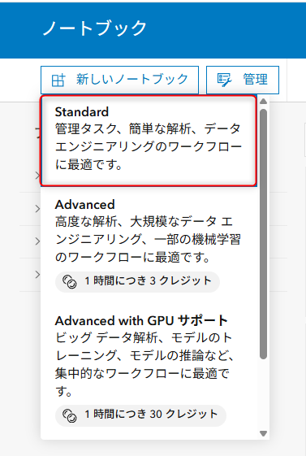

> [!NOTE]
> ノートブック ランタイムには Standard、Advanced、Advanced with GPU サポート の 3 つのオプションがあります。本ハンズオンでは、Standard ランタイムを使⽤します。詳細は「[ノートブックのランタイムを指定](https://doc.arcgis.com/ja/arcgis-online/create-maps/specify-the-runtime-of-a-notebook.htm)」をご参照ください。
> また ノートブック ランタイムのほかにテンプレート ノートブックも選択できます。あらかじめコードが記載されたテンプレートから始めることもできます。

新しいノートブック には、いくつかのマークダウン セルと、ArcGIS API for Python を呼び出して ArcGIS Online に接続する 1 つのコード セルがすでに入力されている状態から始まります。その後、コードとマークダウン セルを追加して、ワークフローを作成することができます。

6. **Welcome to your notebook** セルをダブル クリックして編集可能な状態にします。

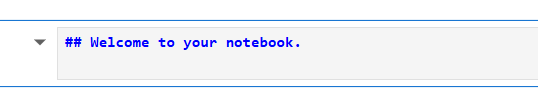

これは マークダウン セルです。マークダウンは、インターネット上で広く使われている、軽量なプレーン テキスト形式の構文です。セルをダブル クリックすると、テキストが<span style="color:blue">**青色**</span>で表示され、その前に 2 つのシャープ記号 ( <span style="color:blue">**##**</span> ) が表示されます。

7. [Run] (▶) をクリックしてセルを実行します ( [Run] タブではありません) 。<br>

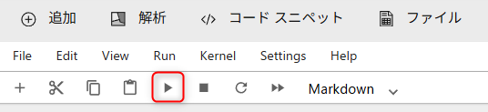

セルが実行され、ヘッダー⾏に変わります。

> [!NOTE]
> キーボードで *Shift + Enter* でセルを実行することも可能です。*Shift + Enter* はノートブックのセルを実行するキーボード ショートカットです。すべてのキーボード ショートカットのリストを表⽰するには、ノートブックの上部にある Help メニューの [Show Keyboard Shortcuts...] をクリックします。キーボード ショートカットのリストが表⽰されます。

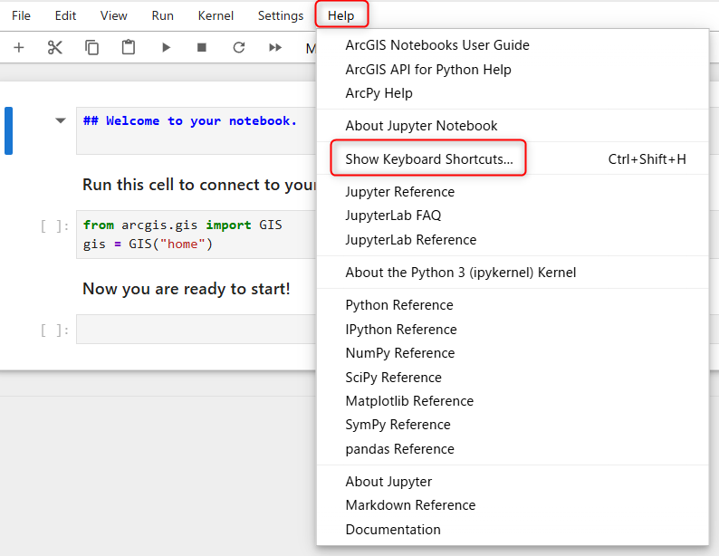

8. 同じセルをダブル クリックして編集します。セル内の **Welcome to your notebook.** の前にシャープ記号 ( # ) を 2 つ挿⼊し、[Run] (▶) をクリックして実行します。
これでシャープ記号 (#) が 4 つになりました。シャープ記号 (#) を追加すると、ヘッダーのサイズが変わります。
実行するとヘッダーが⼩さくなっていることが確認できます。

9.	再度同じセルをダブル クリックし、ヘッダーから 2 つのシャープ記号 (#) を削除し、*Enter* キーを押し、2 ⾏⽬に任意の文字列を⼊⼒し、[Run] (▶) をクリックして実行ます。

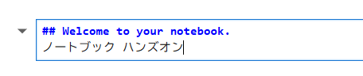

2 つ⽬のマークダウン セルは、最初のコード セルを説明しています (Run this cell to connect to your GIS and get started: の⽂⾔)。最初のコード セルは、Python API から GIS モジュールを呼び出し、ArcGIS Online の組織に接続します。

10. 以下のコードが記述されたコード セルをクリックし、[Run] (▶) をクリックして実行します。 

```Python
from arcgis.gis import GIS
gis = GIS("home")
```
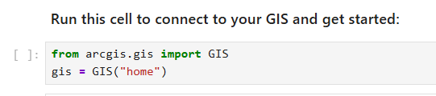

セルの実行中は、入力エリアの括弧の中にアスタリスクがあるため、<span style="color:blue">[*]</span> と表示されます。セルの実行が完了すると、括弧内のアスタリスクの代わりに数字の 1 が表示され、<span style="color:blue">[1]</span> と表示されます。コード セルが実行されるたびに、括弧内の数字が 1 ずつ増えていきます。

> [!NOTE]
> このセルは必ず実行する必要があります。このセルを実行しないと、他のコード セルは実行されません。


## ステップ 2 : ノートブックでマップを作成

このステップではノートブックでマップを作成します。
そのためには、マップを表す変数を定義し、ArcGIS API for Python を使⽤して、特定の場所を中⼼としたマップに変数を設定します。

1. 新しいコード セルに以下のコードを入力し、実行します。`my_map` という名前の変数を作成し、[map() メソッド](https://developers.arcgis.com/python/latest/api-reference/arcgis.gis.toc.html#arcgis.gis.GIS.map)を使用して山口県を中⼼としたマップを作成します。

> [!NOTE]
> セルを実行すると、実行したセルの下に新しいセルが追加されます。リボンの [＋] ボタンをクリックして、ノートブック内の任意の場所にセルを追加することもできます。

```Python
my_map = gis.map("山口県")
```

定義した変数を呼び出して、ノートブック上にマップを表示します。

2. コード セルに定義した変数を呼び出すコードを書いて、そのセルを実⾏します。

```Python
my_map
```

実⾏するとノートブックに、マップが表⽰されます。

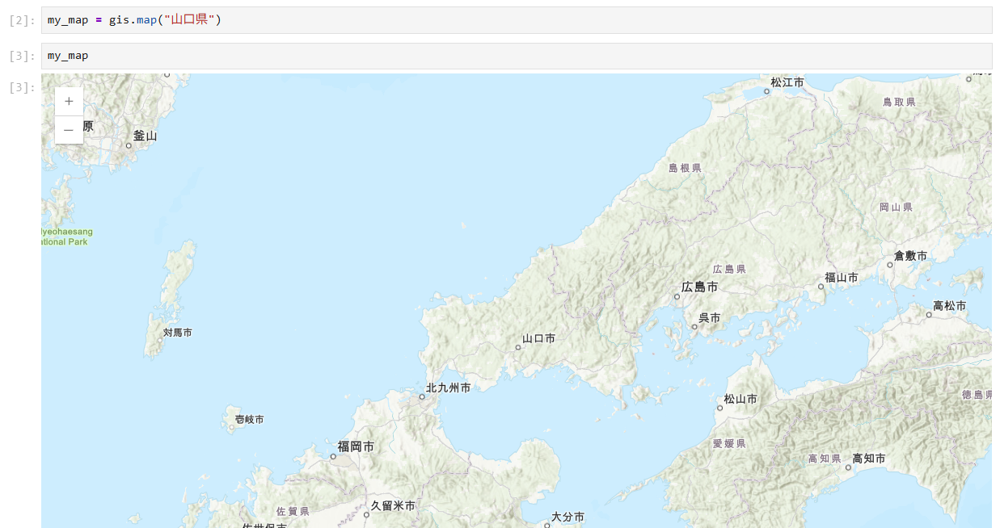

> [!NOTE]
> 前のセルに戻って、"山口県" を別の場所に変更し (例えば、”Yokohama”、”横浜市”、”Tokushima”、"徳島市" など) 、再度、セルを実⾏することで、地図の中⼼の位置を変更することができます。

次に ArcGIS Notebooks でレイヤーを検索し、マップに追加します。

3. リボンで [追加] をクリックします。

[コンテンツの追加] ウィンドウにコンテンツが表⽰されます。ArcGIS Online または ArcGIS Notebooks にコンテンツを保存している場合は、そのコンテンツをノートブックで使⽤できます。また、組織に共有されているコンテンツ、ArcGIS Online に共有されているコンテンツ、または ArcGIS Living Atlas からアクセスすることもできます。今回は、ArcGIS Online を使⽤します。

4. [マイ コンテンツ] と表示されている箇所をクリックし、[ArcGIS Online] を選択します。検索ボックスに「山口県市区町村界」と⼊⼒して、*Enter* キーで検索します。 

5. 検索結果に表示される [山口県市区町村界](https://www.arcgis.com/home/item.html?id=4c0102ac0d094550b49cc9a2d796a8b5) レイヤーを [ + 追加] をクリックして、ノートブックに追加します。

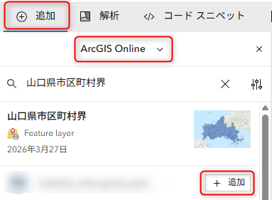

ノートブックに追加するとコード スニペットを含む新しいコード セルが、マップの下のセルに追加されます。このセルは、変数 `item` として市区町村界のレイヤーを呼び出し、そのメタデータをロードします。コード セルは次のようになります。

```Python
# Item Added From Toolbar
# Title: 山口県市区町村界 | Type: Feature Service | Owner: makoto_maruyama_esrij
item = gis.content.get("4c0102ac0d094550b49cc9a2d796a8b5")
item
```

6. 変数 `item` を `yamaguchi` に変更してコード セルを実⾏します。

```Python
# Item Added From Toolbar
# Title: 山口県市区町村界 | Type: Feature Service | Owner: makoto_maruyama_esrij
yamaguchi = gis.content.get("4c0102ac0d094550b49cc9a2d796a8b5")
yamaguchi
```

アイテムのメタデータがオブジェクトとしてセルの下のノートブックに表示されますが、マップにはまだ追加されていません。

7. 新しいコード セルに [add() メソッド](https://developers.arcgis.com/python/latest/api-reference/arcgis.map.toc.html#arcgis.map.map_widget.MapContent.add)を使用して、マップにアイテムを追加する以下のコードを入力します。

```Python
my_map.content.add(yamaguchi)
```

> [!NOTE]
> `my_map.content.add?` のようにメソッドや関数の後ろに `?` を入力して実行すると、そのヘルプ ドキュメントを呼び出すことができます。

8. コード セルを実行します。

実行が完了すると、山口県付近に市区町村界のレイヤーが、表⽰したマップに追加されていることが確認できます。

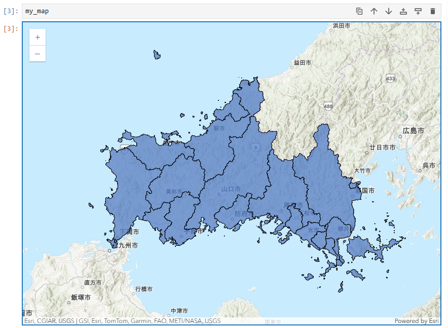

9. 再度リボンで [追加] をクリックし、[ArcGIS Online] が選択された状態で検索ボックスに「山口県クマ目撃情報」と⼊⼒して、*Enter* キーで検索します。

10. 検索結果に表示される [山口県クマ目撃情報](https://www.arcgis.com/home/item.html?id=0a44602ed3fc4795ac8f2628c76f9ba5) レイヤーを [ + 追加] をクリックして、ノートブックに追加します。

本レイヤーは[山口県オープンデータカタログサイト](https://yamaguchi-opendata.jp/)より[熊の目撃情報2024（山口県警察認知のもの）](https://yamaguchi-opendata.jp/ckan/dataset/2024)を加工・編集したデータです。

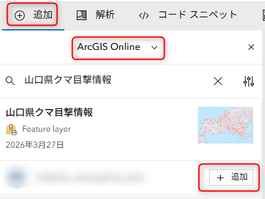

ノートブックに追加すると先ほどと同様にコード スニペットを含む新しいコード セルが追加されます。

11. 変数 `item` を `bear` に変更してコードセルを実行します。

```Python
# Item Added From Toolbar
# Title: 山口県クマ目撃情報 | Type: Feature Service | Owner: makoto_maruyama_esrij
bear = gis.content.get("0a44602ed3fc4795ac8f2628c76f9ba5")
bear
```

12. 新しいコード セルにマップにアイテムを追加するコードを入力し、実行します。

```Python
my_map.content.add(bear)
```
実行が完了すると、山口県付近に市区町村界のレイヤーに重なってクマ目撃情報のレイヤーが追加されていることが確認できます。

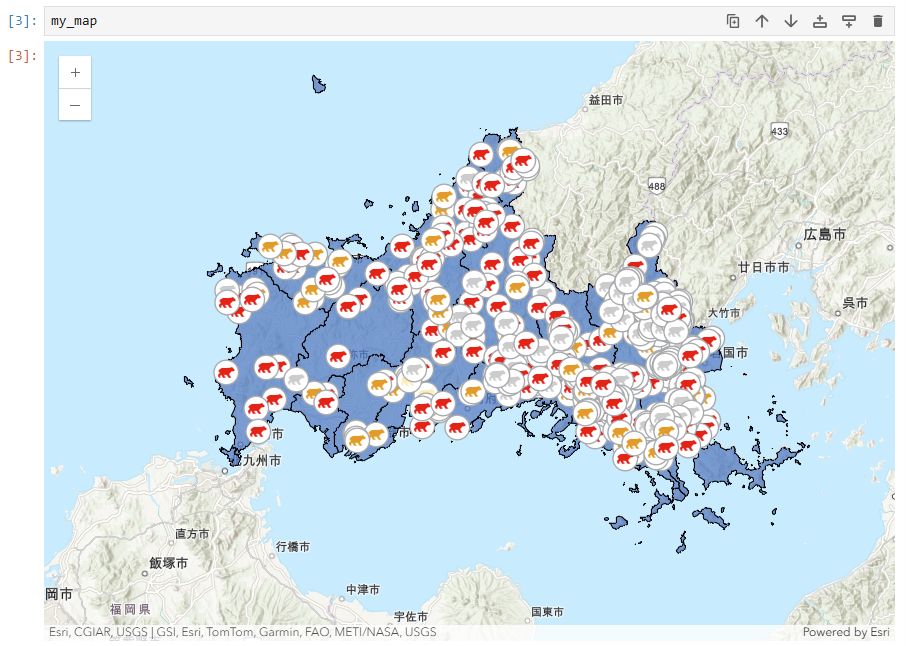

## ステップ 3 : ノートブックで解析の実行

このステップではステップ 2 で追加したクマ目撃情報のポイントデータを山口県の市区町村界ごとに集約する解析を Python で実行します。

1. リボンで、 [解析] をクリックします。

2. 解析ツール ウィンドウで、[データの集計] を展開し、[ポイントの集約] ツールの [＋ 追加] ボタンをクリックし、ノートブックにコード スニペットを挿入します。

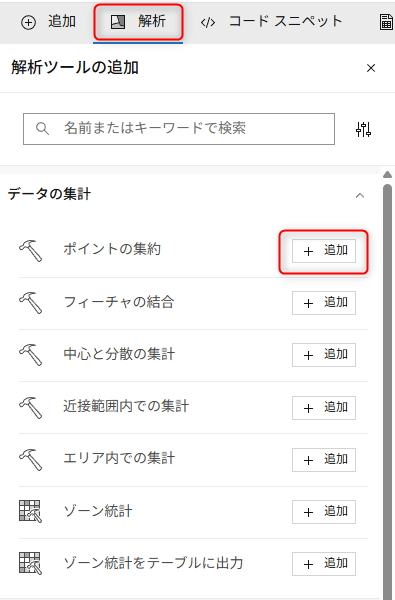

ArcGIS API for Python から features モジュールをインポートし、 [aggregate_points()](https://developers.arcgis.com/python/latest/api-reference/arcgis.features.summarize_data.html#aggregate-points) 関数を呼び出す新しいコード ブロックがノートブックに追加されます。

> [!NOTE]
> コードを実⾏する前に、関数シグネチャーを確認して、 `aggregate_points()` 関数に必要なパラメーターを確認することができます。各パラメーターは、関数が期待する通りに正確に⼊⼒する必要があり、正しく入力されていない場合はエラーが発⽣します。
> 関数シグネチャーを呼び出すには、() を ? に置き換えてセルを実⾏します。

> 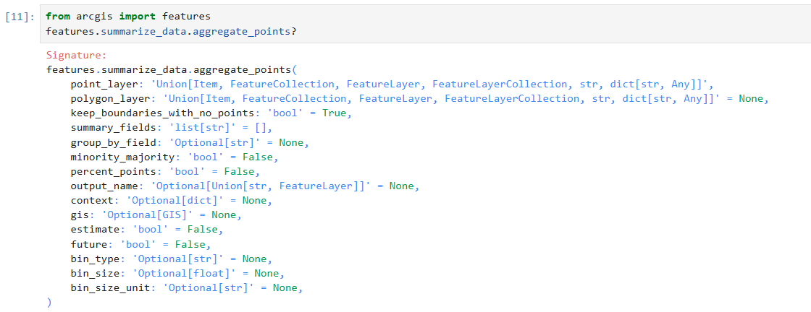


point_layer と polygon_layer を定義する必要があることがわかります。
また、今回はオプションの output_name も設定し、さらに、クマが出没していない市区町村もフィーチャが残るように、`keep_boundaries_with_no_points = True` を設定します。

5. 実行する関数を `bears_by_block_group` という名前の変数に追加し、以下のように必要なパラメーターを追加します。point_layer には、クマ目撃情報のレイヤーの `bear`、polygon_layer には、市区町村界レイヤーの `yamaguchi`、output_name には、レイヤー名が組織内で⼀意になるように、任意の文字列 (ご自身のイニシャル等) を後ろに追加して実行します。

> [!CAUTION]
> 解析の実行には 0.528 クレジットを使用します。繰り返し実行しないようご注意ください。

```Python
from arcgis import features
bears_by_block_group = features.summarize_data.aggregate_points(point_layer = bear,
                                                                polygon_layer = yamaguchi,
                                                                output_name = "ポイントの集約_市区町村_名前",
                                                                keep_boundaries_with_no_points = True)
```

6. 実行が完了したら新しいセルに、`bears_by_block_group` と⼊⼒してセルを実⾏します。これにより、結果として作成されたアイテムのプレビューが⽣成されます。

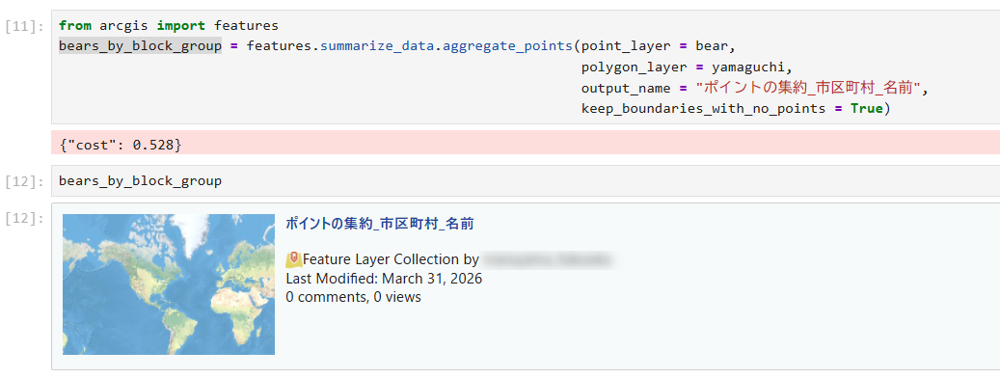

次に解析結果のレイヤーをマップに追加します。

7. `bear_map` という名前の別のマップを作成し、次のように map() メソッドを呼び出して新しいマップを描画します。

```Python
bear_map = gis.map("山口県")
bear_map
```

8. 次のように add() メソッドを使用してマップに `bears_by_block_group` を追加し、セルを実行します。

```Python
bear_map.content.add(bears_by_block_group)
```

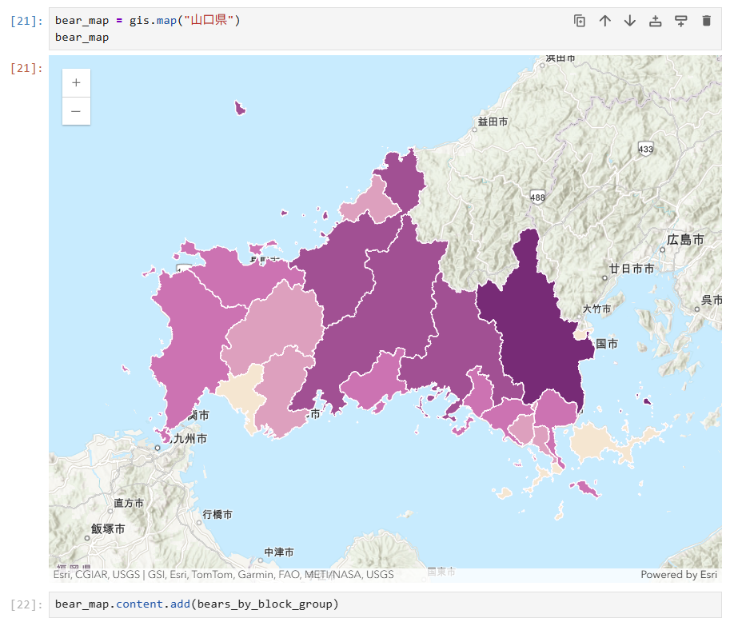

山口県の市区町村ごとのクマ出没情報を集約したマップを作成することができました。  
早く終わった方はオプション 1、オプション 2 を進めてみてください。

## オプション 1 : Web マップとして保存
ノートブック上で作成したマップは Web マップとして保存することができます。  
オプション 1 では Web マップとして保存する方法をご紹介します。

Web マップは、title (タイトル) 、snippet (サマリー) 、tags (タグ) など、特定のプロパティによって定義されます。Web マップ の定義方法については、[web map specification](https://developers.arcgis.com/web-map-specification/) を参照してください。Python のコードでプロパティを含む辞書型を作成することで、プロパティを定義することができます。

1.  新しいコード セルで、以下の Web マップ プロパティを定義します。title (タイトル) 、snippet (サマリー) 、または tags (タグ) を定義しセルを実行します。タイトルにはアイテム名が組織内で⼀意になるように、任意の文字列（ご自身のイニシャル等）を後ろに追加してください。[save() メソッド](https://developers.arcgis.com/python/latest/api-reference/arcgis.map.toc.html#arcgis.map.Map.save)に定義したプロパティを指定することで、ノートブック上のマップを保存することができます。

```Python
webmap_properties = {'title':'山口県クマ目撃情報マップ_名前',
                     'snippet':'山口県のクマ目撃情報を市区町村ごとに集約したマップです',
                     'tags':['ArcGISNotebooks','クマ']}
bear_map.save(webmap_properties)
```

2. セルを実行します。

実行が環境すると、ArcGIS Online の Web マップ アイテムのメタ データとアイテム詳細ページのリンクが作成されます。リンクをクリックし、ArcGIS Online で Web マップ が作成されたことを確認します。

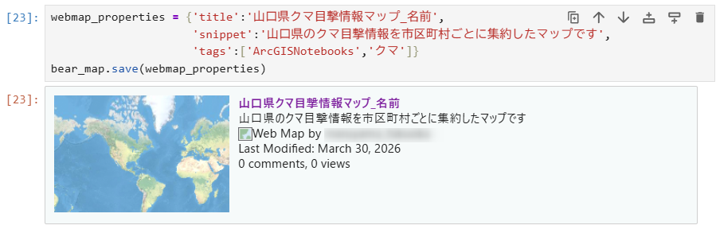

## オプション 2 : ArcGIS Notebooks アシスタントの利用

2026 年 2 月のアップデートで ArcGIS Notebooks アシスタントがベータ版で追加されました。
オプション 2 では、ArcGIS Notebooks アシスタントの利用方法をご紹介します。

1. リボンで [コード スニペット] をクリックし、[アシスタント] を選択します。同意確認画面が表示されますので、確認のうえ、[続行] をクリックします。

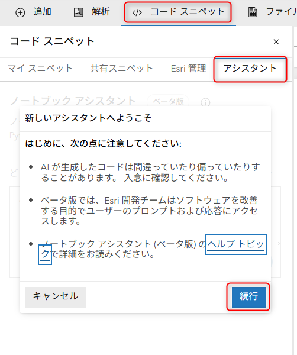

2. 任意のプロンプトを入力して [生成] をクリックすると ArcGIS Notebooks アシスタントが Python のコードを生成してくれます。

たとえば、プロンプトに「クマ目撃情報のポイントを市区町村界のポリゴン毎に集約したいです。」と入力すると、本日のハンズオンで行った内容と同様のコードを提案してくれます。

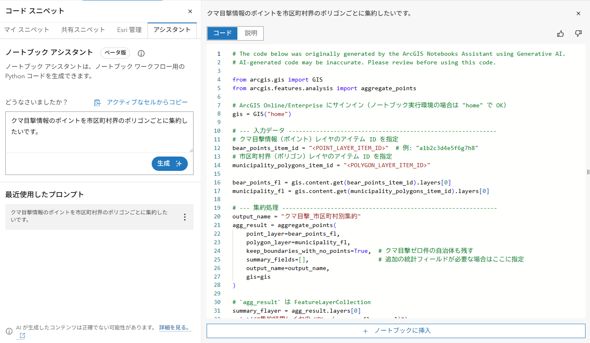

その他にも、プロンプトにコードとエラーメッセージを入力することで、間違っていた部分についての説明や修正されたコードを提案してくれます。

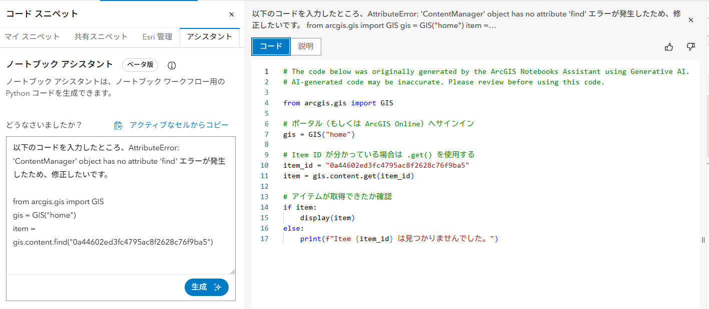

ArcGIS Notebooks アシスタントの詳細については、ブログ記事「[ArcGIS Notebooks アシスタント (ベータ版) のご紹介](https://community.esri.com/t5/arcgis/arcgis-notebooks/ta-p/1690948)」もあわせてご参照ください。

## おわりに
以上で、ハンズオンは終了です。お疲れさまでした。  
ArcGIS では Python の実行環境である ArcGIS Notebooks が提供されています。ArcGIS Notebooks を使うことで Web GIS 上での処理を Python スクリプト化し作業を効率化することができます。
今回体験していただいたように、メニューから Python コードをノートブックに挿入できたりなど、初めての方でも使いやすい機能も提供されていますので、Web GIS での作業効率化にぜひご活用ください！